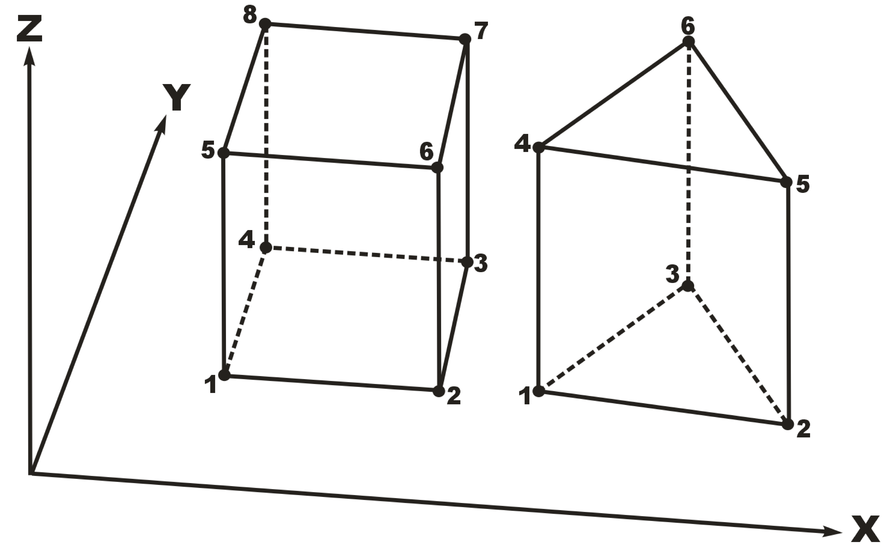
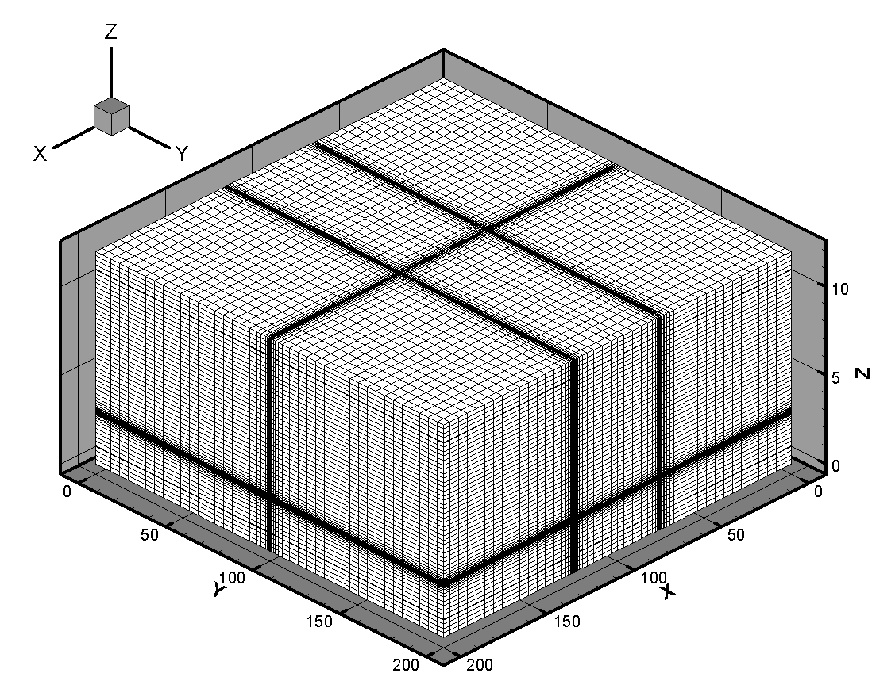
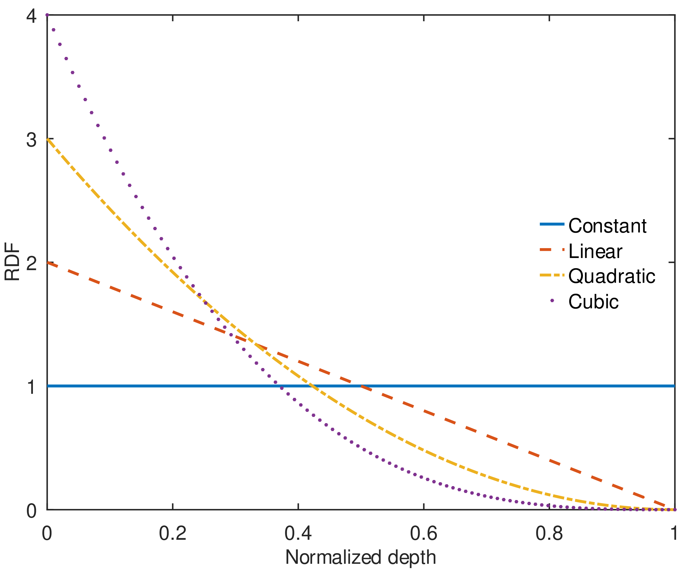

.. role:: raw-latex(raw)
   :format: latex
..

| HGS Simulations is a product of Aquanty Inc.
| 564 Weber Street North, Unit 2
| Waterloo, Ontario N2L 5C6
| This manual documents HydroGeoSphere (HGS) version 2321.
| Copyright ©2015, Aquanty Inc. All rights reserved.
| This publication is a product of Aquanty Inc. and may not be
  reproduced either commercially or non-commercially by any means
  including but not limited to electronic replication, photocopy, or
  mechanical replication without direct written permission from Aquanty
  Inc.
| Permissions may be sought directly from Aquanty Inc:
| Phone: 1-855-aquanty
| Fax: (519) 279-1081
| Email: info@aquanty.com

|image|

.. _chap:quick_start:

Quick Start Guide
=================

The goal of this guide is to get you up to speed quickly on the basic
operation of **HydroGeoSphere** (HGS). The topics covered include:

-  HGS installation.

-  A brief overview of the key executable files.

-  Running a model.

HGS Installation
----------------

**HydroGeoSphere** consists of a suite of 64-bit applications that
target either the Windows (Windows 7 and newer) or Linux operating
systems. In order to run HGS, a valid HGS license file ``hgs.lic`` must
be present in the installation directory. To obtain a valid HGS license
file, please email the ``hostid.txt`` file located in the installation
directory to ``info@aquanty.com``.

Windows
~~~~~~~

By default, HGS is installed in the directory:

`C:\Program_Files\HydroGeoSphere <C:\Program_Files\HydroGeoSphere>`__

The installation folder contains the key executable files (``grok.exe``,
``phgs.exe``, ``hsplot.exe``, ``hsbatch.exe``) required for simulation
and results post-processing, the ``hostid.txt`` file, and a number of
DLL files. Folders within the installation directory include:

-  *docs*: This folder contains the theory, reference, and verification
   manuals which are important references for model setup.

-  *illustration* and *verification*: These folders contain example
   problems, many of which are discussed in the verification manual.

Note that the installer will attempt to add the installation directory
to your system path. Should it fail to do so, for example, if it does
not have write access, then you will need to update your system path
manually. We recommend that you always run the installer with
administrator privileges if possible.

Linux
~~~~~

In Linux, HGS is installed under the current folder in the directory:

`HydroGeoSphere-RevNum-Linux <HydroGeoSphere-RevNum-Linux>`__

where “RevNum” is the revision number of the installation. The
installation folder contains the key binary files (``grok``, ``hgs``,
``hsplot``, ``hsbatch``), the ``hostid.txt`` file, and the EULA. Folders
within the installation directory include:

-  *docs*: This folder contains the theory, reference, and verification
   manuals which are important references for model setup.

-  *lib*: This folder contains the external dependency library files.

-  *verification*: This folder contains example problems, many of which
   are discussed in the verification manual.

The installer modifies the ``~/.bashrc`` file by adding the new
environment variable ``HGSDIR`` that points to the HGS installation
directory, the HGS installation directory to ``PATH``, and the ``lib``
directory to ``LD_LIBRARY_PATH``. Users are required to either start a
new shell or run ``source ~/.bashrc`` for these changes to be added to
their environment.

Some notes to keep in mind:

-  Users are encouraged to check the contents of their ``~/.bashrc``
   file to ensure their bash environment is set up appropriately for
   their own computing purposes and for running **HydroGeoSphere**.

-  Users on other Linux terminal shells (e.g., zsh, csh, ksh, etc.)
   should maintain their own shell profiles to appropriately set their
   ``HGSDIR``, ``PATH``, and ``LD_LIBRARY_PATH`` environment variables,
   if necessary. Please consult with your local system administrator if
   you are unsure about how to do this for your HPC computing
   environment.

Key Executable Overview
-----------------------

There are three steps required to setup, simulate, and view the results
of a simulation.

#. A data file is prepared for the pre-processor (called **grok**) which
   is then run to generate the input data files for HGS.

#. HGS is run to solve the problem and generate output data files.

#. Depending on the problem, post-processing of the data is completed
   using **HSPLOT**, to convert the data into a Tecplot compatible
   format for visualization and analysis.

Grok (``grok.exe``)
~~~~~~~~~~~~~~~~~~~

The **grok** input file contains all of the information and instructions
required for the HGS simulation. This file name consists of a meaningful
prefix (up to 40 characters) to which the extension ``.grok`` is
appended. For example, if the problem prefix created by the user is
*test*, then the general input file created by the user will be
``test.grok``. **Grok** will attempt to read the problem prefix from the
``batch.pfx`` file, which contains a single line with the prefix name.
If **grok** is unable to find this file, then the user will be prompted
to enter the prefix name at the console. Information contained within
the **grok** file includes mesh definition, model parameterization,
initial conditions, boundary conditions, convergence criteria, and
simulation output criteria. The pre-processor, **grok**, performs its
task in the following order:

#. Read and allocated default array sizes.

#. Read the problem identification information.

#. Read instructions for generating the grid.

#. Perform grid modifications if necessary.

#. Generate default properties for all parameters.

#. Read optional instructions for modifying the default parameters.

#. Write the HGS-compatible data types.

Once the *prefix*\ ``.grok`` file has been built by the user it is
compiled by running ``grok.exe``. A more detailed description of
**grok** and its associated commands are contained in Chapter
`2 <#chap:io_instructions>`__ of this document. We note that ``.grok``
files in the *illustration* and *verification* folders are an excellent
resource for reviewing **grok** structure and the use of
**grok** commands.

HGS (``phgs.exe``)
~~~~~~~~~~~~~~~~~~

After the execution of ``grok.exe``, which writes all the HGS-compatible
data files, ``phgs.exe`` is executed to perform the model simulation.
There is little user involvement at this stage other than the
configuration of the parallel execution details in the file
``parallelindx.dat``.

The file ``parallelindx.dat`` does not exist, ``phgs.exe`` will create
it when it is launched. This file tells ``phgs.exe`` how many processors
to use the simulation. By default ``parallelindx.dat`` is created
assuming the simulation is being performed in serial mode, i.e., one
processor.

::

   __Number_of_CPU
              1
   __Num_Domain_Partitiong
              1
   __Solver_Type
              1
   __Coloring_Input
    F
   __Wrting_Output_Time
     -1.00000000000000
   __Simulation_Restart
              1

To increase the level of parallelization, change the values of
“\__Number_of_CPU” and “\__Num_Domain_Partitiong” (these values should
be the same). When setting these values it is important to make sure you
don’t exceed the number of processors available on your machine. In
general we recommend that at most you use up to two fewer than the total
number available. For example, if your machine has eight processors, we
recommend that you use up to six if you plan on using the machine for
other tasks. Note that when the number of CPUs requested is greater than
one, the solver type must be changed to 2.

The following example shows how the ``parallelindx.dat`` file would be
set up to use 6 processors for a simulation.

::

   __Number_of_CPU
              6
   __Num_Domain_Partitiong
              6
   __Solver_Type
              2
   __Coloring_Input
    F
   __Wrting_Output_Time
     -1.00000000000000
   __Simulation_Restart
              1

You do not have to wait for ``phgs.exe`` to generate the
``parallelindx.dat`` file each time you run a simulation. You can copy
the file from a previous simulation to your current model folder.
Changing ``parallelindx.dat`` while the simulation is running will not
affect the number of processors being used. To change the level of
parallelization it is necessary to stop and restart the simulation.

HSPLOT (``hsplot.exe``)
~~~~~~~~~~~~~~~~~~~~~~~

The executable ``hsplot.exe`` is used the post-process the simulation
results for viewing in Tecplot. **HSPLOT** can be executed during an HGS
run or following its completion. The resulting output files
(*prefix*\ ``o.``\ *domain*\ ``.dat``) can be opened in Tecplot to view
the simulation results in three dimensions.

Running a Model
---------------

We conclude this chapter by describing the steps to run the Abdul model
problem, the model files for which can be found in

`C:\Program_Files\HydroGeoSphere\verification\abdul <C:\Program_Files\HydroGeoSphere\verification\abdul>`__

For additional details on this problem the user is referred to the
verification manual ``hydrosphere_verif.pdf``. The steps to run this
model problem are as follows.

#. Copy ``grok.exe``, ``phgs.exe``, and ``hsplot.exe`` to
   `C:\Program_Files\HydroGeoSphere\verification\abdul <C:\Program_Files\HydroGeoSphere\verification\abdul>`__.

#. Run ``grok.exe``.

#. Run ``phgs.exe``.

#. Run ``hsplot.exe``.

#. Open ``abdulo.olf.dat`` and ``abdulo.pm.dat`` with Tecplot to view
   the simulation results.

Note that Windows users who receive a DLL error when running one of the
executable files should copy the DLL files from the installation folder
to the current simulation folder. Alternatively, Windows users can add
the directory
`C:\Program_Files\HydroGeoSphere <C:\Program_Files\HydroGeoSphere>`__ to
their system path. Updating the system path makes it possible to run a
model from any folder without copying any HGS executable files or DLL
files to that folder and is the preferred method of operation.

.. _chap:io_instructions:

Input/Output Instructions
=========================

General
-------

[sec:io_approach] Before presenting in detail the input data needed for
the numerical simulations, some general information about the format and
nature of the input data is first given.

There are two steps involved in solving a given problem. First, a data
file is prepared for the pre-processor (called **grok**\  [1]_) which is
then run to generate the input data files for **HydroGeoSphere**.
Second, **HydroGeoSphere** is run to solve the problem and generate
output data files.

The **grok** input file name consists of a meaningful prefix of up to 40
characters to which the extension ``.grok`` is appended. This prefix
will determine the input and output filenames. The **grok** listing file
name will be the problem prefix to which the letter ``o`` and the file
extension ``.eco`` are appended. For example, if the problem prefix
specified by the user is ``test``, the general input file to be created
by the user will be ``test``\ ``.grok`` and the output listing, or echo,
file generated by the pre-processor will be ``testo.eco``. Some
simulations will require more than one input file (e.g. initial heads
read from file) and will result in the generation of more than one
output file. As a rule, all input files needed during a specific
simulation will have the problem prefix plus a given extension as
filename while all generated output files will have the problem prefix,
the letter ``o``, plus a given extension as filename.

Throughout the manual, we will adopt the convention of using *italics*
to indicate problem-dependent, user-defined portions of filenames
(e.g. prefix, species name etc.) and ``typewriter font`` to indicate
invariant portions generated by **HydroGeoSphere**. For example, in the
filename *prefix*\ ``o.conc.``\ *species*\ ``.0001`` the *prefix* and
*species* portions would be the user-defined prefix and name of a
solute, or species, while the ``o.conc.`` and ``.0001`` portions would
be generated by **HydroGeoSphere** automatically.

After the pre-processor starts executing, it prompts the user to enter
the prefix for the problem interactively from the keyboard. For cases in
which the same input file is being used repeatedly, you can create a
file called ``batch.pfx`` Batch file processing which consists of a
single line which contains the problem prefix. If the file is present,
the prefix will automatically be read from the file and you will not be
prompted to enter it from the keyboard. This file should be placed in
the same directory as the *prefix*\ ``.grok`` file.

Briefly, the pre-processor performs its tasks in the following order:

#. Read and allocate default array sizes [task:def_array]

#. Read problem identification information

#. Read instructions for generating grid [task:ggrid]

#. Perform grid modifications if necessary

#. Generate default properties for all parameters [task:defdata]

#. Read optional instructions for modifying the default parameters
   [task:moddef]

#. Write the **HydroGeoSphere**-compatible data files

Tasks \ `[task:ggrid] <#task:ggrid>`__ and
`[task:moddef] <#task:moddef>`__ are guided by instructions issued by
the user in the *prefix*\ ``.grok`` file. The generation of a complete
set of default data by Task \ `[task:defdata] <#task:defdata>`__ tends
to minimize the amount of data which must be supplied by the user.

Pre-processor instructions !11–Usage@ Usage Here is an example
instruction and some input data which illustrates some common
conventions that will be used throughout the manual:

--------------

| Example instruction text

Example instruction text

#. **xlen, nbx** Domain length [L] and number of blocks in the
   :math:`x`-direction.

#. **xi(i), i=1,nx** Nodal :math:`x`-coordinates [L].

#. **inode(i)...end** Node numbers.

--------------

| 

:math:`\bullet \bullet \bullet`

Input instructions ! Example instruction text

The pre-processor instruction is separated from the preceding text by a
horizontal line, and is written using the sans serif font. It must be
typed in the *prefix*\ ``.grok`` file exactly as shown, with the
exception that it is not case-sensitive, and blanks before and after the
instruction are optional. Note that only one blank is allowed between
any two words in an instruction.

If the instruction requires input data, there will follow a series of
numbered lines, each containing boldfaced **variable names** and a
description of what is to be read. Each numbered line will correspond to
one or more Fortran read statements.

Usually, the number of items required in the data file are indicated by
how many boldfaced variable names are present on the line. The default
Fortran variable naming conventions are in effect. This means variables
starting with the letters IN inclusive require integer values, while all
the rest require real values, unless stated otherwise in the case of
string or logical variables. Numerical values are read in free-format so
integers and reals do not need to be lined up in columns and they can be
separated by blanks or commas. A descriptive comment can be included
inline Comments ! inlineafter the last data value has been read from the
line, but should be avoided when reading character strings (e.g.,
filenames).

In this example, three items of input are required. The first item **xl,
nbx** requires that the user enter a real value (i.e. domain length)
followed by an integer value (i.e. number of blocks) on the first
non-blank or uncommented line following the instruction.

The second item **xi(i), i=1,nx** reads **nx** real values into the
array **xi**. The size of **nx** is problem dependent (e.g., number of
nodes in :math:`x`, number of species, etc.) and it is up to the user to
supply enough values to satisfy the read statement. The values may be
entered on one line or spread out over multiple lines as desired. If
they are entered on one line, they should be separated by spaces or
commas.

Finally, the third item **inode(i)...end** indicates a list, in this
case of node numbers, that is to be read until an end instruction is
encountered. The list values must be entered one per line.

The end of the documentation that pertains to a specific instruction is
designated by three dots: :math:`\bullet \bullet \bullet`.

So for this example instruction, assuming that **nx** is equal to 5, the
following statements in the *prefix*\ ``.grok`` file would satisfy the
input requirements:

::

       Example instruction text
       10.0    100
       0.0   2.0   4.0   6.0   8.0   10.0
       1
       2
       3
       5
       6
       end

In some cases (there are not too many) an instruction will have a more
complex input structure of the form **val(i,j), i=1,m, j=1,n**. The
indices are always listed from fastest to slowest varying reading from
left to right. Hence, this input would be written in a file as:

::

       val11 val21 ... valm1
       val12 val22 ... valm2
         :     :         :
       val1n val2n ... valmn

Naturally, if index :math:`j` was listed first followed by index
:math:`i`, then the input in the file would be transposed. In all cases
the instruction will contain a helpful example to show how the input
should be formatted in the file.

Some instructions are controlled by input routines that have their own
subset of input instructions, some or all of which may be optional. For
example, the instruction Solute is used to define a new solute and in
its simplest form appears as:

::

       Solute
       end

In this case, the End instruction immediately follows the Solute
instruction, and no optional instructions have been issued. The End
statement is required so that **grok** knows when to exit the solute
definition routine. Such instructions will be indicated using the
following convention:

--------------

| Example instruction text...End

Example instruction text

--------------

| 

:math:`\bullet \bullet \bullet`

Input instructions ! Example instruction text...End

where the text ...End indicates that the instruction (e.g. Solute) will
be followed by optional instructions or input and terminated by an End
instruction.

Before **grok** processes instructions contained in a
*prefix*\ ``.grok`` or a material properties file (see
Section \ `[sec:modify_named_material] <#sec:modify_named_material>`__)
it first makes a working copy of the file in which any line which is
completely blank or which begins with an Comments ! in input files
exclamation point (!) is removed and in which the contents of any
included file are copied. This allows you to include blank lines and
comments when and where required to improve the readability and clarity
of the input.

Included files can be used to avoid having to cut and paste or comment
and uncomment large sections of input instructions. Long lists (e.g. of
node numbers or boundary condition data) and cases where various
different grid generation approaches are being tried are good candidates
for application of the include feature. For example, if we wanted to use
include to supply data to the example given above, we could use the
following instruction in *prefix*\ ``.grok``:

::

       Example instruction text
       10.0    100
       0.0   2.0   4.0   6.0   8.0   10.0
       include my.node_list

and where the file ``my.node_list`` could contain, for example:

::

       1
       2
       3
       5
       6
       end

If you now wanted to substitute another node list you could, for
example, supply different node numbers in the file
``my_other.node_list`` and then just change the file name given in the
include instruction.

Included files can contain groups of instructions and input, or just
bits of input for a single instruction. Only one level of include
instruction is allowed, and so included files can not themselves contain
include instructions.

As **grok** reads and processes the copy of the *prefix*\ ``.grok`` file
it also creates the *prefix*\ ``o.eco`` file. Results of the
**HydroGeoSphere** data generation procedures are written to this file
so if there are any problems reported by the pre-processor you should
check this file first to determine their nature and how you might fix
them. If an error occurs while reading the input data, then
**grok** will halt execution and issue an error message (to the screen
and the *prefix*\ ``o.eco`` file) of the form:

::

       INSTRUCTION: 500

       **************************************
       *** INPUT ERROR, HALTING EXECUTION ***
       **************************************

       GRID GENERATION: Unrecognized instruction

       Press any key to continue

In this case the last instruction (i.e. ``500``) has, for some reason,
caused an error. You should now check the input files to further
investigate the cause of the problem, starting with the
*prefix*\ ``.grok`` and material properties files.

File Process Control Options
~~~~~~~~~~~~~~~~~~~~~~~~~~~~

The following instructions control how the pre-processor treats
instructions in the *prefix*\ ``.grok`` file and can be inserted at any
point in the file and as often as required, except of course when input
for a specific instruction is expected.

--------------

| Echo off

By default, as instructions are read by **grok** they are echoed to the
screen. This command turns off this feature.

--------------

| 

:math:`\bullet \bullet \bullet`

Input instructions ! Echo off

--------------

| Echo on

This commands turns on the echoing of instructions to the screen.

--------------

| 

:math:`\bullet \bullet \bullet`

Input instructions ! Echo on

--------------

| Skip on

With skip mode turned on, **grok** will read but not act on any
subsequent instructions.

--------------

| 

:math:`\bullet \bullet \bullet`

Input instructions ! Skip on

--------------

| Skip off

Turns skip mode off, so **grok** will resume acting on instructions.

--------------

| 

:math:`\bullet \bullet \bullet`

Input instructions ! Skip off

--------------

| Skip rest

**grok** exits the loop for reading instructions from the
*prefix*\ ``.grok`` file and proceeds to generate the
**HydroGeoSphere** data files.

--------------

| 

:math:`\bullet \bullet \bullet`

Input instructions ! Skip rest

--------------

| Pause

This instruction causes **grok** to pause at the current location in the
*prefix*\ ``.grok`` file until the user presses a key.

--------------

| 

:math:`\bullet \bullet \bullet`

Input instructions ! Pause

User Defined Variables
^^^^^^^^^^^^^^^^^^^^^^

Pre-processor instructions ! Variables|( This section describes
pre-processor commands that can be used to define/undefine variables in
your **grok** file and material properties files (see
Section \ `2.8 <#sec:mat_props>`__), similar to how variables are used
in a batch script or shell script, albeit, on a much simpler level. The
syntax of these commands is different from other **grok** commands you
will encounter in this manual for two reasons:

#. To mimic the syntax for defining variables used by batch or shell
   scripts.

#. Because these commands are parsed by **grok** during scratch file
   generation and are not actually present in the final **grok** or
   material properties files.

We begin by describing how to define a new variable or overwrite the
value of an existing one: Pre-processor instructions ! set variable

::

       set variable $<varname>=<value>

The variable name (``$<varname>``) may consist of up to 256 characters,
is case insensitive, and must adhere to the following rules:

#. Contain at least two characters.

#. The first character must be the dollar sign ($), which is a special
   character reserved for identifying pre-processor variables.

#. The second character is a letter or underscore.

#. All remaining characters are letters, numbers, or an underscore.

The variable’s value (``<value>``), which is always treated as a string,
may consist of up to 4096 characters and must not contain a dollar sign
($) character. The ``set variable`` command ignores any leading/trailing
whitespace around the variable name and its value. Inline comments are
also ignored. For example, the following commands are equivalent:

::

       set variable $path=C:\my_file_path    ! inline comment
       set variable   $path =C:\my_file_path
       set variable $path=   C:\my_file_path
       set variable   $path  =  C:\my_file_path

Each command defines the variable ``$path`` to have the value
``C:‘ my_file_path``. If you wish to retain leading whitespace in the
variable value, then you can do so by enclosing it in double quotes ().
For example, the command

::

       set variable $path="   C:\my_file_path"

assigns to the variable ``$path`` the value ``   C:\my_file_path``. Note
that the enclosing double quotes are automatically stripped from the
variable value by the ``set variable`` command. If you would like to
assign an empty value to a variable, then you can do so as follows using
either of the equivalent commands:

::

       set variable $<varname>=
       set variable $<varname>=""

If you use the ``set variable`` command without any parameters, then a
list of all currently defined variables and their values will be written
to the console. To undefine a variable that is currently defined you may
use the following command: Pre-processor instructions ! unset variable

::

       unset variable $<varname>

Similar to the ``set variable`` command, all leading/trailing whitespace
around the variable name is ignored. Note that calling
``unset variable`` on a variable that is undefined has no effect. In
addition, you may use the following command to undefine all currently
defined variables: Pre-processor instructions ! unset all variables

::

       unset all variables

Once a variable is defined, you can obtain its value via variable
substitution simply by writing the variable’s name followed directly by
a dollar sign ($). For example, the **grok** file commands

::

       set variable $path1=D:\projects\my_project\include_files
       set variable $path2=D:\projects\my_project\init_files

       include $path1$\file1.include

       initial head from file
       $path2$\head0.txt

are equivalent to

::

       include D:\projects\my_project\include_files\file1.include

       initial head from file
       D:\projects\my_project\init_files\head0.txt

Note that using the value of an undefined variable will result in a
warning message being written to the console.

As discussed above, pre-processor variables are supported by the
**grok** file, material properties files, and by all files included via
an Include command. It is important to keep in mind that pre-processor
variables have global scope among these files. For example, if your
**grok** file defines a variable and then includes a file, that variable
will be visible within the included file. If the included file then
defines a variable with the same name, its value will be overwritten and
will persist after the include statement has been processed. The same is
true for the material properties files. Therefore, as a best practice,
we recommend defining all pre-processor variables at the top of your
**grok** file. Pre-processor instructions ! Variables|)

We now describe in detail the various actions of the pre-processor,
giving instructions for setting up the *prefix*\ ``.grok`` file where
necessary.

Units and Physical Constants
~~~~~~~~~~~~~~~~~~~~~~~~~~~~

[sec:io_units] The unitsUnit conventions used in the program are not
preset, although a default of kilogram-metre-second units is assumed and
used to define the values of certain physical constants as discussed
below. The user should decide which units will be used for mass (M),
length (L), and time (T) for the various input variables, issue the
appropriate units instruction (or assign appropriate values for the
physical constants) and then consistently use those chosen units for all
other input data. The units of temperature :math:`(\Theta)`, for example
in the case of thermal transport, are expected to be in degrees Celsius
unless stated otherwise. For example, if you want to specify the
dimensions of your domain in metres and the time at which you want a
solution is in seconds, then all measures of length and time will have
to be in metres and seconds, respectively. The hydraulic conductivity
should therefore be specified in m s\ :math:`^{-1}`, a pumping rate in
m\ :math:`^3` s\ :math:`^{-1}`, etc. The program does not perform any
checks to ensure unit consistency.

Physical constants ! defaults Default values are assigned for the
gravitational acceleration and fluid properties which correspond to
standard values in the kilogram-metre-second system. These parameters
are used when defining the properties of fractures, open wells and tile
drains.

The following default values will be used for the physical constants and
correspond to typical values in the kilogram-metre-second system:

-  Gravitational acceleration :math:`g = 9.80665` m s\ :math:`^{-2}`,
   Equation \ `[eq:1a] <#eq:1a>`__.

-  Fluid density :math:`\rho = 1000.0` kg m\ :math:`^{-3}`,
   Equation \ `[eq:3] <#eq:3>`__.

-  Fluid viscosity :math:`\mu = 1.124 \times 10^{-3}` kg
   m\ :math:`^{-1}` s\ :math:`^{-1}`, Equation \ `[eq:3] <#eq:3>`__.

-  Fluid compressibility :math:`\alpha_w = 4.4 \times 10^{-10}`
   kg\ :math:`^{-1}` m s\ :math:`^2`, Equation \ `[eq:7b] <#eq:7b>`__.

-  Fluid surface tension :math:`\chi = 0.07183` kg s\ :math:`^{-2}`,
   Equation \ `[V-eq:a5] <#V-eq:a5>`__.

If you are using different units or you want to change the default
values you can do so using the following instructions.

--------------

| Units: kilogram-metre-minute

Physical constants ! unit conversions Converts the default values given
above into the kilogram-metre-minute system. This instruction also
converts the porous media, dual continuum, fractured media, and surface
flow default properties that are defined in the code. Note, however,
that it does not convert properties specified in any
*prefix*\ ``.grok``, ``.mprops``, etc. files. Similar instructions exist
for converting to the following systems:

-  Kilogram-metre-hour.

-  Kilogram-metre-day.

-  Kilogram-metre-year.

-  Kilogram-centimetre-second.

-  Kilogram-centimetre-minute.

-  Kilogram-centimetre-hour.

-  Kilogram-centimetre-day.

-  Kilogram-centimetre-year.

Physical constants ! user specified You can change the default values of
the physical constants using the following instructions. If you change
the default units from the kilogram-metre-second system make sure the
values given here are in the new system.

--------------

| 

:math:`\bullet \bullet \bullet`

Input instructions ! Units: kilogram-metre-minute

--------------

| Gravitational acceleration

#. **grav** Gravitational acceleration constant [L T:math:`^{-2}`],
   :math:`g` in Equation \ `[eq:1a] <#eq:1a>`__.

--------------

| 

:math:`\bullet \bullet \bullet`

Input instructions ! Gravitational acceleration

--------------

| Reference fluid density

#. **rho** Fluid density [M L:math:`^{-3}`], :math:`\rho` in
   Equation \ `[eq:3] <#eq:3>`__.

--------------

| 

:math:`\bullet \bullet \bullet`

Input instructions ! Reference fluid density

--------------

| Reference fluid viscosity

#. **visc** Fluid viscosity [M L:math:`^{-1}` T:math:`^{-1}`],
   :math:`\mu` in Equation \ `[eq:3] <#eq:3>`__.

--------------

| 

:math:`\bullet \bullet \bullet`

Input instructions ! Reference fluid viscosity

--------------

| Fluid compressibility

#. **wcomp** Fluid compressibility [M:math:`^{-1}` L T\ :math:`^2`],
   :math:`\alpha_w` in Equation \ `[eq:7b] <#eq:7b>`__.

--------------

| 

:math:`\bullet \bullet \bullet`

Input instructions ! Fluid compressibility

--------------

| Zero fluid compressibility

Incompressible fluid Assigns a value of zero for fluid compressibility
(i.e., incompressible).

--------------

| 

:math:`\bullet \bullet \bullet`

Input instructions ! Zero fluid compressibility

--------------

| Fluid surface tension

#. **tensn** Fluid surface tension [M T:math:`^{-2}`], :math:`\chi` in
   Equation \ `[V-eq:a5] <#V-eq:a5>`__.

--------------

| 

:math:`\bullet \bullet \bullet`

Input instructions ! Fluid surface tension

Pre-Processor Considerations
~~~~~~~~~~~~~~~~~~~~~~~~~~~~

Array Dimensioning
^^^^^^^^^^^^^^^^^^

[sec:array_defaults] When performing
Task \ `[task:def_array] <#task:def_array>`__, **grok** first checks for
the existence of a file ``array_sizes.default`` in the directory where
the *prefix*\ ``.grok`` file is located. If it is not found, the file is
automatically created and default array sizes are written which are then
used by the pre-processor. Associated with each default are a descriptor
and a default value. A portion of the file is shown here:

::

       dual: material zones
               20
       dual flow bc: flux nodes
            10000

       ...etc...

       tiles: flux function panels
               20
       wells: injection concentration function panels
              100
       end

So, for example, the default maximum number of dual continuum material
zones is 20. If the problem is defined such that an array exceeds the
default maximum (e.g. the number of node sheets in the
:math:`z`-direction for layered grids exceeds 50) then **grok** will
halt execution and issue an error message (to the screen and the
*prefix*\ ``o.eco`` file) of the form:

::

       *********************************************
       *** DIMENSIONING ERROR, HALTING EXECUTION ***
       *********************************************

        Pre-processor request exceeds default array size

        mesh: node sheets in z for layered grids
        Default value: 50
        Requested value: 100

        Increase the default value in file ARRAY_SIZES.DEFAULT

Given the descriptor in the error message, you can now edit the
``array_sizes.default`` file and increase the appropriate value. Note
that the file is sorted alphabetically by descriptor. When you run
**grok** again, it will read the new default value from the file.
Re-compilation of the code is not necessary, since it uses Fortran
ALLOCATE statements to define array sizes at run-time.

**HydroGeoSphere** does not utilize the file ``array_sizes.default``,
but instead uses exact array sizes determined and passed by **grok**.

Remember, this process is problem dependent, and each time you run
**grok** in a different directory, a fresh ``array_sizes.default`` file
will be generated with default values.

Problem Identification
----------------------

The first section of the *prefix*\ ``.grok`` file should consist of a
description of the problem being defined. As for the rest of the file,
blank lines and lines beginning with an Comments ! in input files
exclamation point (!) are ignored.

The description can contain from zero up to as many lines as the user
requires to describe the problem. Each line can contain up to 60
characters. The description is printed at the beginning of the listing
files for **grok** (*prefix*\ ``o.eco``) and
**HydroGeoSphere** (*prefix*\ ``o.lst``).

The user must signal the end of the description using the End
instruction.

--------------

| End

This instruction signals the end of the description at which point
control is passed back to the pre-processor.

--------------

| 

:math:`\bullet \bullet \bullet`

Input instructions ! End

Grid Generation
---------------

[chap:grid] Grid generation|( The next section of the
*prefix*\ ``.grok`` file should consist of instructions for grid
generation followed by an End instruction.

Currently, **grok** is capable of generating grids which are composed of
either hexahedral blocks or triangular prisms.
Figure \ `[fig:element_types] <#fig:element_types>`__ shows the local
node numbering conventions for each of these elements and also the
positive directions of the :math:`x`-, :math:`y`-, and :math:`z`-axes.

   Element types and local node numbering conventions.

[fig:element_types]

We will first discuss options for generating simple grids, followed by
irregular grids.

Simple Grids
~~~~~~~~~~~~

[sec:simple_blocks] Simple grids can be generated for rectangular
domains which are adequate for many problems. They can have uniform or
variable element sizes and can be made of hexahedral block or triangular
prismatic elements. Each element in the grid is given a default zone
number of 1.

--------------

| Generate uniform blocks

Grid generation ! blocks ! uniform

#. **xlen, nbx, (x0)** Domain length [L] and number of blocks in the
   :math:`x`-direction, the optional origin in the :math:`x`-direction
   [L] (zero by default).

#. **ylen, nby, (y0)** Domain length [L] and number of blocks in the
   :math:`y`-direction, the optional origin in the :math:`y`-direction
   [L] (zero by default).

#. **zlen, nbz, (z0)** Domain length [L] and number of blocks in the
   :math:`z`-direction, the optional origin in the :math:`z`-direction
   [L] (zero by default).

Generates a grid for a rectangular domain made up of uniform blocks. In
this case, the grid is formed by subdividing the domain in the
:math:`x`-direction into **nbx** blocks, each of length **xlen/nbx**.
The domain is subdivided in a similar fashion in the :math:`y`- and
:math:`z`-directions, using the other input parameters.

--------------

| 

:math:`\bullet \bullet \bullet`

Input instructions ! Generate uniform blocks

--------------

| Generate uniform prisms

Grid generation ! prisms ! uniform Generates a grid for a rectangular
domain made up of uniform prisms. Requires identical input to the
routine Generate uniform blocks described above. In this case though,
instead of generating block elements, this instruction generates prism
elements by subdividing each block into two prism elements.

--------------

| 

:math:`\bullet \bullet \bullet`

Input instructions ! Generate uniform prisms

--------------

| Generate variable blocks

Grid generation ! blocks ! variable

#. **nx** Number of nodes in the :math:`x`-direction.

#. **x(i), i=1,nx** Nodal :math:`x`-coordinates [L].

#. **ny** Number of nodes in the :math:`y`-direction.

#. **y(i), i=1,ny** Nodal :math:`y`-coordinates [L].

#. **nz** Number of nodes in the :math:`z`-direction.

#. **z(i), i=1,nz** Nodal :math:`z`-coordinates [L].

Generates a grid for a rectangular domain made up of variably-sized
blocks. It is almost identical to the Generate uniform blocks
instruction except that instead of entering a domain length in each
direction we enter a list of coordinates, which are each used to define
the position of a plane of nodes along that axis. The structure **x(i),
i=1,nx** is called an implied do and means that you must supply **nx**
values for the array **xi**. One or more values can be entered per line
until the read statement is satisfied, then a new line should be started
for the next read statement. Note that the line length is limited by
3000 characters in any input instructions and thus, use additional lines
for **x(i), y(i), z(i)** should your input exceed this limit.

--------------

| 

:math:`\bullet \bullet \bullet`

Input instructions ! Generate variable blocks

--------------

| Generate variable prisms

Grid generation ! prisms ! variable Generates a grid for a rectangular
domain made up of variably-sized prisms. Requires identical input to the
routine Generate variable blocks described above. In this case though,
instead of generating block elements, this instruction generates prism
elements by subdividing each block into two prism elements.

--------------

| 

:math:`\bullet \bullet \bullet`

Input instructions ! Generate variable prisms

.. _sec:gen_blocks_interactive:

Interactive Block Grids
~~~~~~~~~~~~~~~~~~~~~~~

Grid generation ! blocks ! interactive Interactive block instructions
can be used to generate a grid made up of variably-sized blocks. The
user can grade the mesh as desired in each of the three principal
directions. This is particularly useful for regions in which fine meshes
are required, for example, near a discrete fracture or well.

Note that these instructions cannot be used in conjunction with the
other grid generation instructions such as Generate uniform block,
Generate uniform prisms, Generate variable blocks, or Generate variable
prisms.

--------------

| Generate blocks interactive...End

Causes **grok** to begin reading a group of interactive block
instructions until it encounters an End instruction. The group should
contain of at least one instruction for each of the principal
directions.

--------------

| 

:math:`\bullet \bullet \bullet`

Input instructions ! Generate blocks interactive...End

The available instructions are:

--------------

| Grade x

#. **x1, x2, dxstart, xfac, dxmax** Starting :math:`x`-coordinate [L],
   ending :math:`x`-coordinate [L], starting element size, element size
   multiplication factor, and maximum element size.

Grid lines (i.e. elements) are generated along the :math:`x`-axis from
**x1** to **x2** which grade up in size from **dxstart** to **dxmax**.
Element sizes are increased steadily by a factor of **xfac**.

--------------

| 

:math:`\bullet \bullet \bullet`

Input instructions ! Grade x

--------------

| Grade y

As above but for the :math:`y`-axis.

--------------

| 

:math:`\bullet \bullet \bullet`

Input instructions ! Grade y

--------------

| Grade z

As above but for the :math:`z`-axis.

--------------

| 

:math:`\bullet \bullet \bullet`

Input instructions ! Grade z

The instructions used to generate the mesh shown in
Figure \ `[fig:gen_blocks_mesh] <#fig:gen_blocks_mesh>`__ are:

::

       generate blocks interactive
       grade x
        75.0     0.0   0.01   1.5  5.0
       grade x
        75.0   100.0   0.01   1.5  5.0
       grade x
       125.0   100.0   0.01   1.5  5.0
       grade x
       125.0   200.0   0.01   1.5  5.0
       grade y
       100.0     0.0   0.01   1.5  5.0
       grade y
       100.0   200.0   0.01   1.5  5.0
       grade z
         1.0     0.0   0.25   1.0  0.25
       grade z
         3.0     1.0   0.01   1.3  0.25
       grade z
         3.0    11.0   0.01   1.3  0.25
       grade z
        11.0    12.0   0.25   1.0  0.25
       end generate blocks interactive

   instructions.
   :width: 80.0%

   Example grid that was created using Generate blocks interactive
   instructions.

[fig:gen_blocks_mesh]

.. _sec:rfgen:

3-D Random Fracture Generator for Block Grids
~~~~~~~~~~~~~~~~~~~~~~~~~~~~~~~~~~~~~~~~~~~~~

Grid generation ! 3-D random fractures 3-D random fracture generator
Random fracture generation\| The following command can be used to
generate a 3-D random fracture network in an orthogonal domain (i.e.,
composed of 8-node block elements). Fractures with random locations,
lengths, and apertures can be generated.

--------------

| Rfgen driver

#. **rfgfile** Name of the file that contains the random fracture grid
   and fracture generation information.

The structure of the input file is described below.

--------------

| 

:math:`\bullet \bullet \bullet`

Input instructions ! Rfgen driver

--------------

| Grid information

#. **x1, x2** :math:`x`-range [L] of the domain.

#. **y1, y2** :math:`y`-range [L] of the domain.

#. **z1, z2** :math:`z`-range [L] of the domain.

#. **botfracbnd** Elevation [L] of lowest extent of a fracture. No
   fractures will be generated below this elevation.

#. **nwell** Number of wells.

#. **xwell(i), ywell(i), i=1,nwell** :math:`xy`-coordinates [L] of the
   well. Generates :math:`x`- and :math:`y`-grid lines through each
   point.

#. **xsource1, xsource2** :math:`x`-coordinates [L] of the source.
   Generates :math:`x`-grid lines at these points.

#. **ysource1, ysource2** :math:`y`-coordinates [L] of the source.
   Generates :math:`y`-grid lines at these points.

#. **zsource1, zsource2** :math:`z`-coordinates [L] of the source.
   Generates :math:`z`-grid lines at these points.

#. **mingrspacx, mingrspacy, mingrspacz** Minimum grid spacing [L] in
   the :math:`x`-, :math:`y`-, and :math:`z`-directions, respectively.
   For example, a **mingrspacx** value of 1 would ensure that no
   gridlines are less than 1 length unit apart along the :math:`x`-axis.

#. **fixed_grid** Logical value (T/F) that controls whether grid lines
   are generated randomly (F) or according to fixed spacing input
   parameters (T). If true, then read the following:

   #. **fixed_space** Logical value (T/F) that controls whether uniform
      (T) or variable (F) grid line spacing is applied. If true, then
      read the following:

      #. **fixgrspacx, fixgrspacy, fixgrspacz** Fixed spacing [L] in the
         :math:`x`-, :math:`y`-, and :math:`z`-directions, respectively.

      Otherwise, read the following:

      #. **nx** Number of nodes in the :math:`x`-direction.

      #. **x(i), i=1,nx** Nodal :math:`x`-coordinates [L].

      #. **ny** Number of nodes in the :math:`y`-direction.

      #. **y(i), i=1,ny** Nodal :math:`y`-coordinates [L].

      #. **nz** Number of nodes in the :math:`z`-direction.

      #. **z(i), i=1,nz** Nodal :math:`z`-coordinates [L].

This instruction should be placed at the top of the file and should not
appear more than once.

--------------

| 

:math:`\bullet \bullet \bullet`

Input instructions ! Grid information

--------------

| Fracture information

#. **seed** Seed for the random number generator. If this number is
   changed, a new random number sequence is produced, which in turn
   causes new realizations of fracture location, length and aperture to
   be generated.

#. **xmeanfreq** Mean fracture frequency [L:math:`^{-1}`] in the
   :math:`x`-direction.

#. **ymeanfreq** Mean fracture frequency [L:math:`^{-1}`] in the
   :math:`y`-direction.

#. **zmeanfreq** Mean fracture frequency [L:math:`^{-1}`] in the
   :math:`z`-direction.

#. **decay** Aperture decay constant [L:math:`^{-1}`]. Aperture size can
   be made to decrease with increasing depth. Set to zero for no decay.

#. **lnsbetween** Minimum number of grid lines between fractures.

#. **cap** Maximum number of times to attempt generating a fracture.

This instruction should follow the Grid information instruction and
should not appear more than once.

--------------

| 

:math:`\bullet \bullet \bullet`

Input instructions ! Fracture information

--------------

| Fracture location distribution x-axis

#. **type** An integer value indicating the probability distribution
   used to generate the variable fracture locations in the
   :math:`x`-direction. Acceptable values are:

   | A ĀA ̄ 1 Uniform.
   | 2 Normal.
   | 3 Exponential.

#. **var1, var2** Distribution parameters [L].

For the uniform distribution **var1** is the minimum and **var2** is the
maximum. For the normal distribution **var1** is the mean and **var2**
is the variance. For the exponential distribution **var1** is the mean
and **var2** is the standard deviation.

--------------

| 

:math:`\bullet \bullet \bullet`

Input instructions ! Fracture location distribution x-axis

The following instructions use the same input data structure as Fracture
location distribution x-axis except they are applied to the :math:`y`-
and :math:`z`-directions:

| Fracture location distribution y-axis Input instructions !
  Fracture location distribution y-axis
| Fracture location distribution z-axis Input instructions !
  Fracture location distribution z-axis

The following instructions use the same input data structure as Fracture
location distribution x-axis to generate fracture lengths in the three
principal directions:

| Fracture length distribution x-axis Input instructions ! Fracture
  length distribution x-axis
| Fracture length distribution y-axis Input instructions ! Fracture
  length distribution y-axis
| Fracture length distribution z-axis Input instructions ! Fracture
  length distribution z-axis

The following instructions use the same input data structure as Fracture
location distribution x-axis to generate fracture apertures in the three
principal orientations:

| XY fracture aperture distribution Input instructions ! XY fracture
  aperture distribution
| XZ fracture aperture distribution Input instructions ! XZ fracture
  aperture distribution
| YZ fracture aperture distribution Input instructions ! YZ fracture
  aperture distribution

Note that when generating fracture apertures from the normal
distribution, random samples are truncated to the interval
:math:`(0,\infty)`. A negative fracture aperture generated from either
the truncated normal or uniform distribution will result in an error.

The remaining commands are optional but should not be used more than
once:

--------------

| Vertical fracture from top

#. **vertical_frac_top** Logical value (T/F), which if true, ensures
   that all vertical fractures start from the top of the domain.

--------------

| 

:math:`\bullet \bullet \bullet`

Input instructions ! Vertical fracture from top

--------------

| Zone fractures how

#. **zone_rfgen_fracs** Controls how fracture zone numbers are assigned.
   Acceptable values are:

   | A ĀA ̄ 1 Assign zone numbers by fracture.
   | 2 Assign zone numbers by orientation.

If zoned by orientation, horizontal fractures are in zone 1, vertical
fractures parallel to the :math:`xy`-axis are in zone 2, and vertical
fractures parallel to the :math:`xz`-axis are in zone 3.

--------------

| 

:math:`\bullet \bullet \bullet`

Input instructions ! Zone fractures how

--------------

| End

This instruction signals the end of the 3-D random fracture generator
input at which point control is passed back to the pre-processor.

--------------

| 

:math:`\bullet \bullet \bullet`

Input instructions ! End

Once the 3-D grid is generated, it is possible to change the random
fracture apertures to zoned fracture apertures by following the
procedures outlined in
Section \ `[sec:modify_named_material] <#sec:modify_named_material>`__.

Interactive 3-D Mesh Generator
~~~~~~~~~~~~~~~~~~~~~~~~~~~~~~

[sec:ean] Irregular grids can be generated by supplying nodal
coordinates, element incidences and element zones for a 2-D slice which
is composed of triangular or quadrilateral elements. Currently,
triangles and quadrilaterals can not be mixed in the same slice. These
slices can then be replicated to form a 3-D mesh composed of 6-node
prisms (from triangles) or 8-node hexahedra (from quadrilaterals).

Defining a 2-D Mesh
^^^^^^^^^^^^^^^^^^^

The following instructions can be used to obtain 2-D slice data.

--------------

| Generate uniform rectangles

Grid generation ! rectangles ! uniform

#. **xlen, nbx, (x0)** Domain length [L] and number of rectangles in the
   :math:`x`-direction, the optional origin in the :math:`x`-direction
   [L] (zero by default).

#. **ylen, nby, (y0)** Domain length [L] and number of rectangles in the
   :math:`y`-direction, the optional origin in the :math:`y`-direction
   [L] (zero by default).

Generates a 2-D grid for a rectangular domain made up of uniform
rectangles. Each rectangular element will be assigned a default zone
number of 1. It is identical to the Generate uniform blocks instruction
except that we drop the :math:`z`-axis parameters.

--------------

| 

:math:`\bullet \bullet \bullet`

Input instructions ! Generate uniform rectangles

Input instructions ! Input instructions ! Generate variable
rectangles ! 

--------------

| 

#. **nx** Number of nodes in the :math:`x`-direction.

#. **x(i), i=1,nx** Nodal :math:`x`-coordinates [L].

#. **ny** Number of nodes in the :math:`y`-direction.

#. **y(i), i=1,ny** Nodal :math:`y`-coordinates [L].

Generates a 2-D grid for a rectangular domain made up of variably-sized
rectangles. Each rectangular element will be assigned a zone number of
1. It is almost identical to the Generate variable blocks instruction
except that we drop the :math:`z`-axis parameters. Note that the line
length is limited by 3000 characters in any input instructions and thus,
use additional lines for **x(i), y(i)** should your input exceed this
limit.

--------------

| 

:math:`\bullet \bullet \bullet`

Grid generation ! rectangles ! variable

Input instructions ! TInput instructions ! Generate rectangles
interactive ! T

--------------

| T
| his instruction works in exactly the same way as the Generate blocks
  interactive instruction described in
  Section \ `2.3.2 <#sec:gen_blocks_interactive>`__, except that input
  is limited to the :math:`x`- and :math:`y`-directions and a 2-D mesh
  of 4-node rectangular elements is generated.

--------------

| 

:math:`\bullet \bullet \bullet`

Grid generation ! rectangles ! interactive

Input instructions ! GInput instructions ! Generate uniform triangles !
G

--------------

| G
| rid generation ! triangles ! uniform

#. **xlen, nbx, (x0)** Domain length [L] and number of rectangles in the
   :math:`x`-direction, the optional origin in the :math:`x`-direction
   [L] (zero by default).

#. **ylen, nby, (y0)** Domain length [L] and number of rectangles in the
   :math:`y`-direction, the optional origin in the :math:`y`-direction
   [L] (zero by default).

Generates a 2-D grid for a rectangular domain made up of uniform
triangles. Each triangular element is assigned a default zone number of
one. This command is identical to the command Generate uniform prisms
except that we drop the :math:`z`-dependence.

--------------

| 

:math:`\bullet \bullet \bullet`

Input instructions ! Input instructions ! Read gms 2d grid ! 

--------------

| 

#. **gmsfile** Filename of the 2-D GMS formatted mesh.

Generates a 2-D grid from the mesh defined in the input file. The format
of this file is described in detail in
Appendix \ `[app:2dmesh] <#app:2dmesh>`__ and is compatible with that
produced by the Groundwater Modeling System (GMS) software.

--------------

| 

:math:`\bullet \bullet \bullet`

Grid generation ! importing ! GMS 2-D meshes

Input instructions ! Input instructions ! Read algomesh 2d grid !

--------------

| 

#. **ah2_mesh** Filename of the 2-D ``.ah2`` mesh exported from
   AlgoMesh.

Generates a 2-D grid from the mesh defined in the input file.

--------------

| 

:math:`\bullet \bullet \bullet`

Grid generation ! importing ! Algomesh 2-D meshes

--------------

| Refine 2d grid

Causes **grok** to refine 2-D irregular triangular grid (one triangle to
four triangles). This command can be repeated multiple times after the
2-D grid has been imported. Note that the number of nodes increases by
about four times with this command.

--------------

| 

:math:`\bullet \bullet \bullet`

Input instructions ! Refine 2d grid

--------------

| Reduce 2d grid, boundary file

#. **polygon_file** Filename of a text file that defines a polygon by
   the :math:`x`- and :math:`y`-coordinates of its vertices, one vertex
   per line of the file. Note that the number of lines in this file must
   be the same as the number of vertices in the polygon and the first
   and last vertices must be identical.

This command clips an existing 2-D grid to those elements/nodes that
belong to the input polygon, renumbering nodes and elements in the
process. A 2-D element is defined to belong to a polygon when all its
vertices belong to that polygon. Combined with the command Refine 2d
grid, this command provides a basis for telescopic mesh refinement.

--------------

| 

:math:`\bullet \bullet \bullet`

Input instructions ! Reduce 2d grid, boundary file

--------------

| Read fractran 2d grid

Grid generation ! importing ! FRACTRAN 2-D meshes
[sec:fractran_slice]

#. **prefix** Prefix of the FRACTRAN files which contain the node
   coordinates, element incidences and element zone numbers for the 2-D
   rectangular element mesh. This is a string variable.

Reads the files which contain data defining a 2-D slice composed of
4-node rectangular elements. These files are compatible with output
generated by the FRACTRAN program.

--------------

| 

:math:`\bullet \bullet \bullet`

Input instructions ! Read fractran 2d grid

For a 2-D slice made of 4-node rectangular elements, the following
instructions can be used to remove elements:

--------------

| Remove rectangles with shapefile

#. **arcview_prefix** Prefix of the ArcView shapefile.

#. **unproject_file** Logical value (T/F), which if true, causes
   **grok** to read grid unprojection data as described in
   Section \ `[sec:grid_projection] <#sec:grid_projection>`__ and to
   apply it to the data read from the ArcView shapefile.

#. **project_file** Logical value (T/F), which if true, causes
   **grok** to read grid projection data as described in
   Section \ `[sec:grid_projection] <#sec:grid_projection>`__ and to
   apply it to the data read from the ArcView shapefile.

#. **outside** Logical value (T/F), which if true, causes elements
   located outside the area defined in the ArcView shapefile to be
   removed. Otherwise, elements located inside the area are removed.

This command updates an existing 2-D grid by removing elements based
whether they are either inside or outside a polygon defined by the
shapefile. Inclusion/exclusion of an element is based on its centroid.
Currently, this command applies only to rectangular elements.

--------------

| 

:math:`\bullet \bullet \bullet`

Input instructions ! Remove rectangles with shapefile

--------------

| Remove rectangles with blanking file

As above except a blanking file in surfer format is used instead of an
ArcView shapefile.

--------------

| 

:math:`\bullet \bullet \bullet`

Input instructions ! Remove rectangles with blanking file

--------------

| Raster to scl

#. **arcview_filename** Name of the ArcView ASCII file.

#. **bandwidth** Cell bandwidth used for averaging.

Reads an ArcView ASCII file and interpolates a value for each 2-D mesh
node. The results are written to a GMS formatted scalar file named
``output.scl``.

--------------

| 

:math:`\bullet \bullet \bullet`

Input instructions ! Raster to scl

--------------

| Raster to nprop

#. **arcview_filename** Name of the ArcView ASCII file.

#. **bandwidth** Cell bandwidth used for averaging.

Reads an ArcView ASCII file and interpolates a value for each 2-D mesh
node. The results are written to a binary file named
``raster2nprop.output.nprop``.

--------------

| 

:math:`\bullet \bullet \bullet`

Input instructions ! Raster to nprop

--------------

| Raster to element

#. **arcview_filename** Name of the ArcView ASCII file.

#. **statistic** Statistic to be used to interpolate values. Acceptable
   values for the variable **statistic** are:

   | A ̄ max count
   | nearest

   If variable **statistic** is set to “max count” read the following:

   #. **bandwidth** Cell bandwidth used for averaging.

Reads an ArcView ASCII file and interpolates a value for each 2-D mesh
element. The results are written as a two-column list of element numbers
and values to the file named ``output.el``.

--------------

| 

:math:`\bullet \bullet \bullet`

Input instructions ! Raster to element

3-D Mesh Generation
^^^^^^^^^^^^^^^^^^^

Once you have a 2-D slice, you have the option of exiting the grid
definition procedure, which will cause **grok** to automatically
generate a unit thickness 3-D grid. It does this by duplicating the 2-D
slice and constructing the appropriate 6-node prism or 8-node hexahedral
element incidences and assigning a unit element length perpendicular to
the slice. The element zone numbers for the slice are used to assign
default zone numbers for each element. Such a grid could be used to
simulate 2-D cross-sectional problems.

More often, you will want to generate a 3-D layered grid, perhaps with
topography defined by a DEM (Digital Elevation Model) and/or uneven
layer contacts based on the observed hydrostratigraphy.

To do so you should start by issuing the following instruction:

Input instructions ! CInput instructions ! Generate layers
interactive...End ! C

--------------

| C
| auses **grok** to begin reading a group of 3-D grid generation
  instructions until it encounters an End instruction.

--------------

| 

:math:`\bullet \bullet \bullet`

Grid generation ! 3-D layered, interactive

The basic procedure is to build up the 3-D mesh by defining the base,
then adding layers one at a time from the base to ground surface.

By default, the domain will contain a single layer, one element high
with a base elevation of zero and a top elevation of 1, and the element
zone numbering scheme from the 2-D slice will be used to assign the 3-D
mesh element zone numbers. Instructions that change the default
behaviour are described below:

These commands are optional and should not be used more than once:

Input instructions ! CInput instructions ! Zone by layer ! C

--------------

| C
| auses **grok** to assign the 3-D mesh layer number to the element zone
  number. By default, the element zone numbering scheme from the 2-D
  slice is used to assign the 3-D mesh element zone number.

--------------

| 

:math:`\bullet \bullet \bullet`

Grid generation ! 3-D layered, interactive! Zone numbering

Input instructions ! Input instructions ! Minimum layer thickness
with fixed top elevation ! 

--------------

| 

#. **min_thick** Minimum thickness [L].

This instruction causes **grok** to enforce a minimum thickness
constraint for all layers. At nodes where the computed layer top
elevation is less than or equal to the current base elevation,
**min_thick** is subtracted from the top elevation to get the base
elevation.

In contrast to the command Minimum layer thickness, this command applies
to all layers and adjusts layers from the top down, maintaining the
original surface layer elevations.

If this constraint is not enforced, then **grok** will stop and issue a
warning message if the computed top elevation is less than or equal to
the current base elevation.

Note that this command should be issued before any New layer commands.

--------------

| 

:math:`\bullet \bullet \bullet`

Input instructions ! CInput instructions ! Base elevation...End ! C

--------------

| C
| auses **grok** to begin reading a group of base elevation instructions
  until it encounters an End instruction. Available instructions are
  described in
  Section \ `[sec:irregular_elev_instructions] <#sec:irregular_elev_instructions>`__.
  By default, the base elevation of the domain will be set to zero.

--------------

| 

:math:`\bullet \bullet \bullet`

Grid generation ! 3-D layered, interactive! Base elevation

Elevation Instructions
^^^^^^^^^^^^^^^^^^^^^^

[sec:irregular_elev_instructions] These instructions are used to define
3-D mesh base elevations and new layer top elevations.

--------------

| Elevation constant

#. **elev** Elevation value [L].

--------------

| 

:math:`\bullet \bullet \bullet`

Input instructions ! Elevation constant

--------------

| Elevation from raster file

#. **rasterfile** Name of the raster file containing the base elevation
   values. This is a string variable. The file should be formatted as
   outlined in Appendix \ `9 <#app:raster_files>`__.

--------------

| 

:math:`\bullet \bullet \bullet`

Input instructions ! Elevation from raster file

Input instructions !Input instructions ! Elevation from tsurf file !

--------------

| 
| .grok 

#. **filename** Filename of GoCAD tsurf file, up to 120 characters. Note
   that the length units in this file must match the model’s length
   units.

This command assigns elevations by interpolating to a surface consisting
of triangular elements. The surface is stored as a GoCAD tsurf file.
Note that this command applies only to triangular prism or hexahedral
block meshes.

--------------

| 

:math:`\bullet \bullet \bullet`

--------------

| Elevation from bilinear function in xy

#. **xfrom, xto, yfrom, yto** :math:`x`-range [L] and :math:`y`-range
   [L].

#. **a1, a2, a3, a4, a5** Bilinear function coefficients.

For nodes falling within the given :math:`x`- and :math:`y`-range, the
:math:`z`-coordinate is computed according to the following function:

.. math::

   z = \textbf{a1} + \textbf{a2}(x-\textbf{xfrom}) + \textbf{a3}(x-\textbf{xfrom})^2
               + \textbf{a4}(y-\textbf{yfrom}) + \textbf{a5}(y-\textbf{yfrom})^2

--------------

| 

:math:`\bullet \bullet \bullet`

Input instructions ! Elevation from bilinear function in xy

--------------

| Elevation from sine function in xy

#. **xfrom, xto, yfrom, yto** :math:`x`-range [L] and :math:`y`-range
   [L].

#. **zz0** Elevation [L] at point (**xfrom, yfrom**).

#. **num_sw_x, amplitude_x, slope_x** Number of sine wave cycles, sine
   wave amplitude [L], and surface slope in the :math:`x`-direction.

#. **num_sw_y, amplitude_y, slope_y** Number of sine wave cycles, sine
   wave amplitude [L], and surface slope in the :math:`y`-direction.

For nodes falling within the given :math:`x`- and :math:`y`-range, the
:math:`z`-coordinate is computed according to the following function:

.. math::

   \begin{aligned}
           z & = & \textbf{zz0} + \textbf{amplitude\_x} (1 + \sin(f(x)))+ \textbf{slope\_x}  (x-\textbf{xfrom})  \\
                 & &          + \textbf{amplitude\_y} (1 + \sin(f(y)))+ \textbf{slope\_y}  (y-\textbf{yfrom})
       \end{aligned}

where:

.. math:: f(x) = 2\pi\cdot\textbf{num\_sw\_x}\cdot(x-\textbf{xfrom})/(\textbf{xto}-\textbf{xfrom})

.. math:: f(y) = 2\pi\cdot\textbf{num\_sw\_y}\cdot(y-\textbf{yfrom})/(\textbf{yto}-\textbf{yfrom})

--------------

| 

:math:`\bullet \bullet \bullet`

Input instructions ! Elevation from sine function in xy

The number of cycles of the sine wave can be a fraction and the sine
function rises from a value of **zz0** at (**xfrom, yfrom**) as
:math:`x`- and :math:`y`-values increase. Where the peaks coincide, the
maximum elevation is given by
:math:`\textbf{zz0} + \textbf{amplitude\_x} + \textbf{amplitude\_y}`.

--------------

| Elevation from cosine function in xy

As above but uses the cosine function instead of the sine function.

--------------

| 

:math:`\bullet \bullet \bullet`

Input instructions ! Elevation from cosine function in xy

--------------

| Elevation from xz pairs

#. **xval(i), zval(i)...end** List of :math:`xz`-pairs [L].

Listed :math:`xz`-coordinate pairs are read until an End instruction is
encountered. They should be given in order from the smallest to largest
:math:`x`-value. For each node in the 2-D grid, the :math:`x`-coordinate
of the node is used to determine its position in the list, and a
:math:`z`-coordinate is then interpolated from the neighbouring
:math:`xz`-pairs.

--------------

| 

:math:`\bullet \bullet \bullet`

Input instructions ! Elevation from xz pairs

--------------

| Elevation from file

#. **ascii_elevation_filename** Name of the ASCII text file containing
   the elevation [L] values. The file should contain one elevation value
   per line for each node in the surface mesh.

--------------

| 

:math:`\bullet \bullet \bullet`

Input instructions ! Elevation from file

Axisymmetric Flow
~~~~~~~~~~~~~~~~~

Input instructions ! TInput instructions ! Axisymmetric coordinates ! T

--------------

| T
| his instruction is used for simulating radial flow to a well. It
  should only be applied to a vertical cross-section, of unit thickness
  in the :math:`y`-direction. The :math:`x`-coordinate is taken as the
  radial distance.

One should define a vertical cross-section of unit thickness in the
:math:`y`-direction (with two nodes in that direction), and locate a
pumping/injection well at the origin :math:`(x = 0)`.

--------------

| 

:math:`\bullet \bullet \bullet`

Axisymmetric coordinates

Manipulating the 3-D Grid
~~~~~~~~~~~~~~~~~~~~~~~~~

[sec:manipulate]

Input instructions ! Input instructions ! Tilt grid x ! 

--------------

| 

#. **angle** Angle [deg] to rotate grid.

Rotates a grid by **angle** degrees about the :math:`x`-axis. Note that
a positive angle produces a counterclockwise rotation.

--------------

| 

:math:`\bullet \bullet \bullet`

Grid generation ! flip grid around :math:`x` or :math:`y`

Input instructions ! Input instructions ! Tilt grid y ! 

--------------

| 

#. **angle** Angle [deg] to rotate grid.

Rotates a grid by **angle** degrees about the :math:`y`-axis. Note that
a positive angle produces a counterclockwise rotation.

--------------

| 

:math:`\bullet \bullet \bullet`

--------------

| Adapt grid to fractures

Grid generation ! adapt grid to fractures

#. **adapt_g2f_mode** An integer value indicating how the grid is
   adapted to inclined fractures.

If block elements are used, two inclined fractures may intersect in the
middle of an element instead of on a grid node, so the fractures will
not be connected unless additional nodes are specified.

Acceptable values for the variable **adapt_g2f_mode** and the actions
taken in each case are:

| A ĀA ̄ 0 No action is taken.
| 1 New grid lines are added.
| 2 The block element is substituted by four prisms.
| 3 Inclined faces are not selected in the block element where the
  problem occurs.

The default value is 1.

--------------

| 

:math:`\bullet \bullet \bullet`

Input instructions ! Adapt grid to fractures

Ending Grid Generation
~~~~~~~~~~~~~~~~~~~~~~

Input instructions ! SInput instructions ! End ! S

--------------

| S
| ignals the end of the user-controlled portion of the grid definition
  section of the input data file. At this stage, the pre-processor will
  automatically perform grid modifications if appropriate. For example,
  if you read in 2-D slice data but did not specify layer information
  using for example, the Generate layers interactive instruction, the
  pre-processor would generate a default 3-D system by duplicating the
  2-D slice to form a single layer of unit-thickness elements.

--------------

| 

:math:`\bullet \bullet \bullet`

Grid generation ! signalling end of inputGrid generation|)

.. _sec:selecting_components:

Selecting Mesh Components
-------------------------

Choosing grid components|( In order to assign boundary conditions,
material properties etc. we need to be able to choose subsets of the
grid. The method of choice must be flexible and easy to use as well as
being able to handle complex input requirements.

The following is a list of grid components, ranked in order of
increasing complexity:

#. Nodes: used to assign initial heads and first-type boundary
   conditions.

#. Segments: used to represent wells, tile drains, or observation wells.

#. Faces (triangles or rectangles): used to represent fractures or
   high-conductivity planes (as 2-D triangular or rectangular elements)
   and to assign second- and third-type boundary conditions to these as
   well as 3-D prism or block elements.

#. Elements (blocks or prisms): sometimes used to assign hydraulic
   conductivities or distribution coefficients.

#. Zones: generally used to assign material properties such as hydraulic
   conductivity. Elements are grouped into zones by assigning them the
   same ID number.

We will assign to all members of a grid component an attribute called
‘chosen’ that can be toggled on or off by the user. If an attribute is
chosen for certain members of a component, then subsequent instructions
issued by the user will affect those members only. For example, the
following section of a hypothetical *prefix*\ ``.grok`` file would
initially turn off all chosen nodes (i.e. instruction Clear chosen nodes
which requires no further input), then turn on only those nodes
satisfying the requirement that they are within :math:`10^{-5}` distance
units of the plane defined by the equation :math:`x=0` (i.e. instruction
Choose nodes x plane followed by two lines of input).

::

     clear chosen nodes
     choose nodes x plane
     0.0                   ! x-coordinate of plane
     1.e-5                 ! distance criteria

Once these nodes were chosen, we could set the property of interest by
issuing another set of instructions, for example:

::

     create node set
     my_node_set
   	
     boundary condition
       type
       head
       
       node set
       my_node_set
       
       time value table
       0.0 10.0
       end
     end

In this case we are assigning a constant head of 10.0 to all chosen
nodes at time zero, which will apply for the duration of the simulation.
We note that the head boundary condition instruction is acting on nodes
via the Node set instruction. In general, it is up to the user to be
aware of which components each group of instructions acts upon.

The effect of issuing two such instructions in succession is cumulative.
For example, the following input would choose nodes that are within
:math:`10^{-5}` distance units of the planes :math:`x = 0` and
:math:`x = 10`.

::

     clear chosen nodes
     
     choose nodes x plane
     0.0                   ! x-coordinate of plane
     1.e-5                 ! distance criteria
     
     choose nodes x plane
     10.0                  ! x-coordinate of plane
     1.e-5                 ! distance criteria

The following sections introduce all instructions that are available for
choosing subsets of the various grid components.

Selecting Segments
~~~~~~~~~~~~~~~~~~

Choosing grid components ! segments We can use the following
instructions to alter the set of chosen segments.

--------------

| Clear chosen segments

All segments in the domain are flagged asnot chosen. This is recommended
if you are unsure of which segments are chosen due to previously issued
instructions.

--------------

| 

:math:`\bullet \bullet \bullet`

Input instructions ! Clear chosen segments

--------------

| Choose segments all

All segments in the domain will be chosen. This is useful if you wish to
assign a property to all segments in the grid.

--------------

| 

:math:`\bullet \bullet \bullet`

Input instructions ! Choose segments all

--------------

| Choose segments line

#. **x1, y1, z1** :math:`xyz`-coordinates [L] of the first end point of
   the line.

#. **x2, y2, z2** :math:`xyz`-coordinates [L] of the second end point of
   the line.

Segments which fall on or close to the line are chosen. The routine
finds the two nodes closest to the end points of the line and then finds
the group of connected line segments which form the shortest path
between the two nodes.

--------------

| 

:math:`\bullet \bullet \bullet`

Input instructions ! Choose segments line

--------------

| Choose segments polyline

#. **npts** The number of points defining the polyline, which should be
   entered in order from one end of the polyline to the other.

#. **x(i), y(i), z(i), i=1,npts** List of polyline point
   :math:`xyz`-coordinates [L].

Segments that fall on or close to the polyline are chosen. The routine
proceeds along the polyline, considering two points at a time. For each
set of points it finds the two nearest nodes and then finds the group of
connected line segments that form the shortest path between the two
nodes.

--------------

| 

:math:`\bullet \bullet \bullet`

Input instructions ! Choose segments polyline

Input instructions ! Input instructions ! Choose segments polyline
by sheet ! 

--------------

| 

#. **nsheet** The sheet number.

#. **npts** The number of points defining the polyline, which should be
   entered in order from one end of the polyline to the other.

#. **x(i), y(i), z(i), i=1,npts** List of polyline point
   :math:`xyz`-coordinates [L].

Segments that fall on or close to the polyline are chosen. The routine
proceeds along the polyline, considering two points at a time. For each
set of points it finds the two nearest nodes in the specified sheet and
then finds the group of connected line segments that form the shortest
path between the two nodes.

--------------

| 

:math:`\bullet \bullet \bullet`

--------------

| Choose segments am node list

#. **npts** The number of points defining the polyline, which should be
   entered in order from one end of the polyline to the other.

#. **node(i), sheet(i), i=1,npts** List of polyline point node and sheet
   numbers.

Segments which fall on or close to the polyline are chosen. This
instruction is intended to help to build horizontal wells/drains.

--------------

| 

:math:`\bullet \bullet \bullet`

Input instructions ! Choose segments am node list

--------------

| Choose segments xy between sheets

#. **x1, y1** :math:`xy`-coordinates [L] to define a vertical segment.

#. **isheet1, isheet2** Bottom and top sheet numbers to define the
   segment.

This instruction is intended to help to build vertical wells/drains.

--------------

| 

:math:`\bullet \bullet \bullet`

Input instructions ! Choose segments xy between sheets

Selecting Faces
~~~~~~~~~~~~~~~

Choosing grid components ! faces [sec:cfc]

--------------

| Allow internal faces

Causes **grok** to define internal faces, which cut through elements.

By default, only the external faces (six orthogonal faces for 8-node
blocks and five faces for 6-node prisms) are defined for the mesh.

--------------

| 

:math:`\bullet \bullet \bullet`

Input instructions ! Allow internal faces

The following instructions are used to alter the set of chosen faces:

--------------

| Clear chosen faces

All faces in the domain are flagged as *not* chosen. This is recommended
if you are unsure of which faces are chosen due to previously issued
instructions.

--------------

| 

:math:`\bullet \bullet \bullet`

Input instructions ! Clear chosen faces

--------------

| Choose faces all

All faces in the domain will be chosen. This is useful if you wish to
assign a property to all faces in the grid. Rarely used.

--------------

| 

:math:`\bullet \bullet \bullet`

Input instructions ! Choose faces all

--------------

| Choose faces x plane

#. **x1** :math:`x`-coordinate [L] of the plane.

#. **ptol** Distance [L] from the plane.

Faces within distance **ptol** of the plane defined by the equation
:math:`x` = **x1** will be chosen. This command is particularly useful
when assigning boundary conditions to a specific face of a rectangular
domain.

--------------

| 

:math:`\bullet \bullet \bullet`

Input instructions ! Choose faces x plane

--------------

| Choose faces y plane

As above but for the :math:`y`-plane.

--------------

| 

:math:`\bullet \bullet \bullet`

Input instructions ! Choose faces y plane

--------------

| Choose faces z plane

As above but for the :math:`z`-plane.

--------------

| 

:math:`\bullet \bullet \bullet`

Input instructions ! Choose faces z plane

Input instructions !Input instructions ! Choose faces 3pt disk !

--------------

| 
| .grok 

#. **x1, y1, z1** :math:`xyz`-coordinates [L] of a point on the disk.

#. **x2, y2, z2** :math:`xyz`-coordinates [L] of a point on the disk.

#. **x3, y3, z3** :math:`xyz`-coordinates [L] of disk center.

#. **radius** Radius [L] of the disk :math:`(> 0)`.

#. **tol** Distance [L] above and below the disk :math:`(> 0)`.

Faces whose centroids are within the cylindrical region bisected by the
disk with height **tol** above and below the disk are chosen. Note that
all three points on the disk must be distinct.

--------------

| 

:math:`\bullet \bullet \bullet`

--------------

| Choose faces 3pt plane

#. **x1, y1, z1** :math:`xyz`-coordinates [L] of the first point.

#. **x2, y2, z2** :math:`xyz`-coordinates [L] of the second point.

#. **x3, y3, z3** :math:`xyz`-coordinates [L] of the third point.

#. **ptol** Distance [L] from the plane.

Faces within distance **ptol** of the plane defined by the three points
will be chosen. This allows you to choose planes of faces with an
arbitrary orientation, and is particularly useful for setting up a set
of sloping fractures.

--------------

| 

:math:`\bullet \bullet \bullet`

Input instructions ! Choose faces 3pt plane

--------------

| Choose faces 3pt plane bounded

#. **x1, y1, z1** :math:`xyz`-coordinates [L] of the first point.

#. **x2, y2, z2** :math:`xyz`-coordinates [L] of the second point.

#. **x3, y3, z3** :math:`xyz`-coordinates [L] of the third point.

#. **ptol** Distance [L] from the plane.

#. **x4, x5** :math:`x`-range [L] of the block.

#. **y4, y5** :math:`y`-range [L] of the block.

#. **z4, z5** :math:`z`-range [L] of the block.

Faces within distance **ptol** of the plane defined by the three points
and within the rectangular block defined by the three ranges will be
chosen.

--------------

| 

:math:`\bullet \bullet \bullet`

Input instructions ! Choose faces 3pt plane bounded

--------------

| Choose faces block

#. **x1, x2** :math:`x`-range [L] of the block.

#. **y1, y2** :math:`y`-range [L] of the block.

#. **z1, z2** :math:`z`-range [L] of the block.

Faces whose centroids are within the rectangular block defined by the 3
ranges are chosen. Note that the values given for one, two or all of the
ranges can be identical and in that case, the block will collapse to a
plane, line or point respectively.

--------------

| 

:math:`\bullet \bullet \bullet`

Input instructions ! Choose faces block

--------------

| Choose faces block by layer

#. **x1, x2** :math:`x`-range [L] of the block.

#. **y1, y2** :math:`y`-range [L] of the block.

#. **z1, z2** :math:`z`-range [L] of the block.

#. **nlaybot, nlaytop** Bottom and top element layer numbers.

Faces whose centroids are within the rectangular block which is defined
by the three coordinate ranges, and which lie within the element layers
defined by **nlaybot** and **nlaytop** are chosen. These layer numbers
do not correspond to those given during grid generation but are simply
defined by numbering each sheet of elements from 1 (bottom) to
:math:`n-1` (top) where :math:`n` is the number of node sheets (2-D
meshes) making up the grid.

This instruction is intended for grids that are regular in the
:math:`x`- and :math:`y`-directions, but which have variable
:math:`z`-values for a given element layer. It can be used if the top
and bottom elevations of a 3-D element layer vary spatially.

Note that the values given for one, two or all of the ranges can be
identical and in that case, the block will collapse to a plane, line or
point respectively.

--------------

| 

:math:`\bullet \bullet \bullet`

Input instructions ! Choose faces block by layer

--------------

| Choose faces sheet

#. **nsheet_bot,nsheet_top** Bottom and top sheet numbers.

Faces which are between the two specified sheets (inclusive) and are not
oriented perpendicular to the sheet will be chosen.

--------------

| 

:math:`\bullet \bullet \bullet`

Input instructions ! Choose faces sheet

--------------

| Choose faces top

All faces in the top sheet of the domain will be chosen.

--------------

| 

:math:`\bullet \bullet \bullet`

Input instructions ! Choose faces top

--------------

| Choose faces top block

#. **x1, x2** :math:`x`-range [L] of the block.

#. **y1, y2** :math:`y`-range [L] of the block.

#. **z1, z2** :math:`z`-range [L] of the block.

Faces in the top layer whose centroids are within the rectangular block
defined by the three ranges are chosen. Note that the values given for
one, two or all of the ranges can be identical and in that case, the
block will collapse to a plane, line or point respectively.

--------------

| 

:math:`\bullet \bullet \bullet`

Input instructions ! Choose faces top block

--------------

| Choose faces top from raster

#. **filename** File path to raster file.

#. **n1, n2** Range of raster values.

Faces in the top layer whose centroids lie within the given raster class
range are chosen. Selects all raster values that lie between **n1** and
**n2** (inclusive).

--------------

| 

:math:`\bullet \bullet \bullet`

Input instructions ! Choose faces top from raster

--------------

| Choose faces bottom

All faces in the bottom sheet of the domain will be chosen.

--------------

| 

:math:`\bullet \bullet \bullet`

Input instructions ! Choose faces bottom

--------------

| Choose faces front

Faces on the front of the domain will be chosen. This instruction can
only be applied to meshes composed of block elements. Front faces are
parallel to the :math:`xz`-coordinate plane and have small
:math:`y`-coordinates.

--------------

| 

:math:`\bullet \bullet \bullet`

Input instructions ! Choose faces front

--------------

| Choose faces back

Faces on the back of the domain will be chosen. This instruction can
only be applied to meshes composed of block elements. Back faces are
parallel to the :math:`xz`-coordinate plane and have large
:math:`y`-coordinates.

--------------

| 

:math:`\bullet \bullet \bullet`

Input instructions ! Choose faces back

--------------

| Choose faces left

Faces on the left side of the domain will be chosen. This instruction
can only be applied to meshes composed of block elements. Left side
faces are parallel to the :math:`yz`-coordinate plane and have small
:math:`x`-coordinates.

--------------

| 

:math:`\bullet \bullet \bullet`

Input instructions ! Choose faces left

--------------

| Choose faces right

Faces on the right side of the domain will be chosen. This instruction
can only be applied to meshes composed of block elements. Right side
faces are parallel to the :math:`yz`-coordinate plane and have large
:math:`x`-coordinates.

--------------

| 

:math:`\bullet \bullet \bullet`

Input instructions ! Choose faces right

--------------

| Choose faces top am

#. **filename** Name of the AlgoMesh chosen elements file
   *am_prefix*\ ``.echos.``\ *description*.

Faces flagged as true in the file, that are in the top sheet, and are
not oriented perpendicular to the sheet are chosen.

--------------

| 

:math:`\bullet \bullet \bullet`

Input instructions ! Choose faces top am

--------------

| Choose faces top am common

#. **filename1** Name of the AlgoMesh chosen elements file
   *am_prefix*\ ``.echos.``\ *description1*.

#. **filename2** Name of the AlgoMesh chosen elements file
   *am_prefix*\ ``.echos.``\ *description2*.

Faces flagged as true in the both files, that are in the top sheet, and
are not oriented perpendicular to the sheet are chosen.

--------------

| 

:math:`\bullet \bullet \bullet`

Input instructions ! Choose faces top am common

--------------

| Choose faces top am exclude

#. **filename1** Name of the AlgoMesh chosen elements file
   *am_prefix*\ ``.echos.``\ *description1*.

#. **filename2** Name of the AlgoMesh chosen elements file
   *am_prefix*\ ``.echos.``\ *description2*.

Faces flagged as true in the first file and flagged as false in the
second file, that are in the top sheet, and are not oriented
perpendicular to the sheet are chosen.

--------------

| 

:math:`\bullet \bullet \bullet`

Input instructions ! Choose faces top am exclude

--------------

| Choose faces top for chosen elements

Faces are chosen if they are in the top sheet and the 3-D element they
belong to is chosen.

--------------

| 

:math:`\bullet \bullet \bullet`

Input instructions ! Choose faces top for chosen elements

--------------

| Choose faces am

#. **filename** Name of the AlgoMesh chosen elements file
   *am_prefix*\ ``.echos.``\ *description*.

#. **nsheet_bot,nsheet_top** Bottom and top sheet numbers.

Faces flagged as true in the file, that are between the top and bottom
sheets (inclusive), and that are not oriented perpendicular to the sheet
are chosen.

--------------

| 

:math:`\bullet \bullet \bullet`

Input instructions ! Choose faces am

--------------

| Choose faces vertical from am nodes

#. **filename** Name of the AlgoMesh chosen nodes file
   *am_prefix*\ ``.nchos.``\ *description*.

#. **nsheet_bot,nsheet_top** Bottom and top sheet numbers.

This instruction is intended for use with meshes that are generated from
AlgoMesh 2-D meshes, and is used to choose faces that are oriented
perpendicular to the mesh.

If a node is chosen in the 2-D mesh, then the nodes in the 3-D mesh that
have the same :math:`xy`-coordinates (i.e., that fall in the same column
of nodes as the 2-D node) and between the top and bottom sheets
(inclusive) will be chosen. A face is then chosen if all of its four
nodes are chosen.

--------------

| 

:math:`\bullet \bullet \bullet`

Input instructions ! Choose faces vertical from am nodes

Input instructions ! Input instructions ! Choose faces vertical
from polyline ! 

--------------

| 

#. **isheet1, isheet2** Bottom and top sheet numbers (inclusive),
   respectively.

#. **npts** Number of points defining the polyline.

#. **x(i), y(i), i=1,npts** The :math:`xy`-coordinates [L] of points on
   the polyline within a single sheet. The points should be ordered from
   one end of the polyline to the other.

Vertical faces that fall on or close to the polyline for the specified
node sheet interval are chosen. The routine proceeds along the polyline,
considering two points at a time. For each set of points it finds the
two nearest nodes and then finds the group of connected line segments
that form the shortest path between the two nodes.

--------------

| 

:math:`\bullet \bullet \bullet`

--------------

| Choose horizontal faces on layer

#. **nlayer** Element layer number.

#. **x1, x2** The :math:`x`-range [L] of the block.

#. **y1, y2** The :math:`y`-range [L] of the block.

Horizontal faces which are in the layer of elements numbered **nlayer**
and within the rectangular block which is defined by the :math:`x`- and
:math:`y`-range are chosen. This instruction can be used to select
horizontal faces (e.g. to make fractures) when the elevation of a given
layer of nodes is irregular.

--------------

| 

:math:`\bullet \bullet \bullet`

Input instructions ! Choose horizontal faces on layer

--------------

| Choose faces stairway

#. **x1, y1, z1** :math:`xyz`-coordinates [L] of the first point.

#. **x2, y2, z2** :math:`xyz`-coordinates [L] of the second point.

#. **x3, y3, z3** :math:`xyz`-coordinates [L] of the third point.

Horizontal and vertical faces of an inclined plane that is defined by
three points are chosen. This instruction is mainly designed for
verification purpose of modelling results using inclined fractures. Note
that if using this instruction, fracture velocities are multiplied by a
correction factor that accounts for the longer path that contaminants
have to travel from node to node.

--------------

| 

:math:`\bullet \bullet \bullet`

Input instructions ! Choose faces stairway

--------------

| Choose fracture faces block

#. **x1, x2** :math:`x`-range [L] of the block.

#. **y1, y2** :math:`y`-range [L] of the block.

#. **z1, z2** :math:`z`-range [L] of the block.

Faces which are fracture elements and whose centroids are within the
rectangular block defined by the 3 ranges are chosen. Note that the
values given for one, two or all of the ranges can be identical and in
that case, the block will collapse to a plane, line or point
respectively.

--------------

| 

:math:`\bullet \bullet \bullet`

Input instructions ! Choose fracture faces block

Input instructions ! Input instructions ! Choose face by nodes !

--------------

| 

#. **n1, n2, n3, n4** Node numbers of the face to be chosen.

The face whose vertices correspond to the given nodes will be chosen.
Note that in order to select a triangular face simply set
:math:`\textbf{n4} = 0`.

--------------

| 

:math:`\bullet \bullet \bullet`

Input instructions ! Input instructions ! Choose faces by nodes
list ! 

--------------

| 

#. **n1(i), n2(i), n3(i), n4(i)...end** Node numbers for each face to be
   chosen.

For each set of node numbers, the face whose vertices correspond to the
given nodes will be chosen. Note that in order to select a triangular
face simply set :math:`\textbf{n4(i)} = 0`.

--------------

| 

:math:`\bullet \bullet \bullet`

--------------

| Clear chosen faces by nodes

As above except the face will be cleared (i.e., not chosen).

--------------

| 

:math:`\bullet \bullet \bullet`

Input instructions ! Clear chosen faces by nodes

--------------

| Choose faces horizontal circle

#. **x_mid, y_mid, z_mid** :math:`xy`-coordinates [L] of the centre of
   the circle and elevation of the circle.

#. **radius** Radius [L] of the circle.

#. **ptol** Vertical tolerance [L].

Faces within a vertical distance **ptol** of elevation **z_mid**, and
within the circle with centre **x_mid, y_mid** and radius **radius** are
chosen. This allows you to choose faces in a domain that has a circular
ground-plan.

--------------

| 

:math:`\bullet \bullet \bullet`

Input instructions ! Choose faces horizontal circle

--------------

| Write chosen faces

#. **filename** Name of the file to which the chosen face information
   will be written.

Setting up complex fracture networks with combinations of Choose face
instructions can be very time consuming in **grok** and this step does
not need to be repeated as long as the grid structure remains the same.
This instruction is intended to be used in conjunction with the
following instruction.

--------------

| 

:math:`\bullet \bullet \bullet`

Input instructions ! Write chosen faces

--------------

| Write chosen faces and host element numbers

#. **filename** Name of the file to which the chosen face and host
   element information will be written.

For each currently chosen face, this instruction writes the face number
and associated 3-D element numbers. If the second element number is
zero, the face is on the outside of the 3-D domain.

--------------

| 

:math:`\bullet \bullet \bullet`

Input instructions ! Write chosen faces and host element numbers

--------------

| Read chosen faces

#. **filename** Name of the file from which the chosen face information
   will be read.

If you want only those faces read from the file to be chosen then make
sure to issue the instruction Clear chosen faces before you use Read
chosen faces. If not, the results will be merged with the currently
chosen set of faces. This could be useful if you want to apply a certain
set of fracture material properties to more than one group of faces at a
time.

--------------

| 

:math:`\bullet \bullet \bullet`

Input instructions ! Read chosen faces

Input instructions ! ‘Input instructions ! Echo chosen faces ! ‘

--------------

| ‘
| ’ Causes the current set of chosen face numbers to be written to the
  *prefix*\ ``o.eco`` file.

--------------

| 

:math:`\bullet \bullet \bullet`

Output ! chosen faces

Selecting Inclined Faces
~~~~~~~~~~~~~~~~~~~~~~~~

These instructions only work for rectangular meshes with the standard
element numbering scheme.

For each block element, there are 6 potential inclined faces which may
be selected. These are given ID numbers according to the following
convention:

::

       PLANE ID   LOCAL NODES
           1       1-2-7-8
           2       4-3-6-5
           3       2-3-8-5
           4       1-4-7-6
           5       1-3-7-5
           6       2-4-8-6

--------------

| Clear chosen inclined faces

All faces in the domain are flagged asnot chosen. This is recommended if
you are unsure of which inclined faces are chosen due to previously
issued instructions.

Note that this instruction also clears chosen regular (horizontal and
vertical) faces. This is necessary because a previously defined inclined
plane may also consist of horizontal or vertical faces which have to be
unselected as well.

--------------

| 

:math:`\bullet \bullet \bullet`

Input instructions ! Clear chosen inclined faces

--------------

| Choose faces 3pt inclined plane

#. **nplane** Plane ID number, as defined above.

#. **x1, y1, z1** :math:`xyz`-coordinates [L] of the first point on the
   plane.

#. **x2, y2, z2** :math:`xyz`-coordinates [L] of the second point on the
   plane.

#. **x3, y3, z3** :math:`xyz`-coordinates [L] of the third point on the
   plane.

#. **ptol** Distance [L] from the plane.

#. **xmin, xmax** :math:`x`-range [L] of the block.

#. **ymin, ymax** :math:`y`-range [L] of the block.

#. **zmin, zmax** :math:`z`-range [L] of the block.

Faces which have the appropriate plane ID, whose centroids lie within
the distance **ptol** of the plane which is defined by the three points,
and whose centroids are within the rectangular block defined by the
three ranges are chosen.

Note that if the plane defined by the three points is parallel to one
coordinate axis, the pre-processor will automatically use the ID of the
plane parallel to that axis, and the user-defined plane ID will be
ignored.

--------------

| 

:math:`\bullet \bullet \bullet`

Input instructions ! Choose faces 3pt inclined plane

Simulation Control Options
--------------------------

.. _general-1:

General
~~~~~~~

Once the grid generation step is completed, the pre-processor generates
a set of data for a default problem by assuming saturated, steady-state
flow in a non-fractured, homogeneous porous medium. The porous medium
properties for the default problem, which are hardwired in the code, are
listed in
Table \ `[tab:saturated_porous_media_defaults] <#tab:saturated_porous_media_defaults>`__.
By default, the finite-element approach is used and a transport
simulation is not done. If the default problem setup and material
properties are acceptable, it is likely that the only additional data
required to complete the definition of the problem are some flow
boundary conditions, which can be assigned as described in
Section \ `[sec:bndy_cond] <#sec:bndy_cond>`__.

--------------

| Transient flow

Transient flow ! activating Causes **HydroGeoSphere** to perform a
time-stepping, transient flow solution.

--------------

| 

:math:`\bullet \bullet \bullet`

Input instructions ! Transient flow

--------------

| Unsaturated

Variably-saturated flow ! activating Causes **HydroGeoSphere** to
perform a variably-saturated flow solution.

--------------

| 

:math:`\bullet \bullet \bullet`

Input instructions ! Unsaturated

--------------

| Do transport

Transport ! activating Causes **HydroGeoSphere** to perform a transport
solution.

--------------

| 

:math:`\bullet \bullet \bullet`

Input instructions ! Do transport

If surface loading with hydromechanical coupling is required, you must
issue the following instruction:

--------------

| Surface loading

Hydromechanics ! activating Causes **HydroGeoSphere** to consider
surface loading with hydromechanical coupling.

--------------

| 

:math:`\bullet \bullet \bullet`

Input instructions ! Surface loading

The following instructions are used to define the behaviour of the
Travel Time Probability Package described in
Section \ `[sec:travel_time_theory] <#sec:travel_time_theory>`__.

Input instructions ! CInput instructions ! Travel time PDF ! C

--------------

| C
| auses **HydroGeoSphere** to compute a travel time probability density
  function. Note that this command is only valid under steady-state flow
  conditions.

--------------

| 

:math:`\bullet \bullet \bullet`

Input instructions ! CInput instructions ! Travel time CDF ! C

--------------

| C
| auses **HydroGeoSphere** to compute a travel time cumulative density
  function. Note that this command is only valid under steady-state flow
  conditions.

--------------

| 

:math:`\bullet \bullet \bullet`

Input instructions ! CInput instructions ! Travel time PDF from CDF ! C

--------------

| C
| auses **HydroGeoSphere** to deduce the travel time probability density
  function from the cumulative density function at observation points.
  Note that this command is only valid under steady-state flow
  conditions.

--------------

| 

:math:`\bullet \bullet \bullet`

Input instructions ! CInput instructions ! Mean age ! C

--------------

| C
| auses **HydroGeoSphere** to compute the mean age/mean life expectancy.
  Note that this command is only valid under steady-state flow
  conditions.

--------------

| 

:math:`\bullet \bullet \bullet`

Input instructions ! CInput instructions ! Snapshot mean age ! C

--------------

| C
| auses **HydroGeoSphere** to compute the mean age under transient flow
  conditions at each simulation output time. Note that each simulation
  output is assumed to be a steady-state flow condition.

--------------

| 

:math:`\bullet \bullet \bullet`

Input instructions ! CInput instructions ! Snapshot mean life expectancy
! C

--------------

| C
| auses **HydroGeoSphere** to compute the mean life expectancy under
  transient flow conditions at each simulation output time. Note that
  each simulation output is assumed to be a steady-state flow condition.

--------------

| 

:math:`\bullet \bullet \bullet`

--------------

| Backward-in-time

Defines if flow is to be reversed (backward transport solution). This
command only works for a single conservative species.

--------------

| 

:math:`\bullet \bullet \bullet`

Input instructions ! Backward-in-time

--------------

| Evaluate capture zone

Defines if an outlet capture zone is to be evaluated. This command only
works for a single conservative species.

--------------

| 

:math:`\bullet \bullet \bullet`

Input instructions ! Evaluate capture zone

--------------

| Species attribution

Defines the species number (absolutely necessary in the case of
multi-species transport).

--------------

| 

:math:`\bullet \bullet \bullet`

Input instructions ! Species attribution

These instructions are of general interest:

--------------

| Y vertical

:math:`y`-axis verticalvertical :math:`y`-axis Causes
**HydroGeoSphere** to assume that the :math:`y`-coordinate points in the
vertical direction (i.e., instead of the :math:`z`-coordinate).

This instructiondoes not switch coordinates, but merely cause
**HydroGeoSphere** to use the :math:`y`-coordinate of a node to
calculate the total hydraulic head (pressure + elevation) for
variably-saturated simulations. It is intended to be used for
variably-saturated flow problems when using triangular prism elements,
when one wants to have the triangular mesh (which is defined in the
:math:`xy`-plane) to be oriented along the vertical direction.

--------------

| 

:math:`\bullet \bullet \bullet`

Input instructions ! Y vertical

--------------

| Data check only

Causes **HydroGeoSphere** to halt execution after reading all data
files, initializing arrays, etc., but prior to the start of the solution
procedure

This command can be useful for very large problems, where it is
desirable to make sure that all the input is correct before actually
doing the simulation.

--------------

| 

:math:`\bullet \bullet \bullet`

Input instructions ! Data check only

Input instructions ! TInput instructions ! Defined flow ! T

--------------

| T
| his command defines the flow conditions for the simulation based on
  the initial conditions and boundary conditions defined in the
  *prefix*\ ``.grok`` file and applies the predefined flow conditions
  for the entire solute transport simulation.

--------------

| 

:math:`\bullet \bullet \bullet`

Defined transient flow 

#. **filename** File path to a porous media domain head input file, for
   example, *prefix*\ ``o.head_pm.``\ ``0001``, at most 256 characters.

This command defines the flow conditions for a transient simulation
based on head output files generated by a previous simulation. For
example, suppose you run a simulation which generates the head output
files *prefix*\ ``o.head_pm.0001``, …, *prefix*\ ``o.head_pm.0009`` and
*prefix*\ ``o.head_olf.0001``, …, *prefix*\ ``o.head_olf.0009`` that you
would like to run again to produce some additional output. Instead of
having to rerun the full simulation, which may be costly, you can copy
the head output files to a folder under your simulation folder, e.g.,
`heads\  <heads\ >`__, and then rerun your simulation by defining the
flow field from the head files in `heads\  <heads\ >`__ at each output
time. Note that initial head values are supplied by your initial
conditions.

There are a number of things to keep in mind when using this command:

-  The names of all head input files must match the following format:

   *prefix*\ ``o.head_``\ *domain*\ ``.####``

   where *prefix* can be different from your current model prefix,
   *domain* may be any of *pm, dual, olf, frac, chan, well, tile*, and
   ``####`` is the output time number.

-  Head input files must be available for all domains within your model.
   For example, if your model defines discrete fracture and overland
   flow domains in addition to the porous media domain, then you must
   provide ``head_frac`` and ``head_olf`` input files in addition to
   ``head_pm`` input files.

-  The output times at which your head input files were generated must
   match the output times in your model. However, head input files may
   be provided at different temporal resolutions. For example, suppose
   your simulation duration is two months with daily output times. Then
   you could provide porous media head input on a monthly basis (0001,
   0030, 0060) and overland flow head input on a daily basis (0001, …,
   0060).

-  The head input units must agree with the units in your model.

-  Your model setup, in particular, your mesh and domain setup, must
   match exactly the mesh and domain setup of the simulation that
   generated the head input files. Your numerical convergence criteria
   should also be the same.

-  Adaptive timestepping is disabled and cannot be used.

-  Not all output that is possible with a full simulation may be
   available.

Finite-Difference Options
^^^^^^^^^^^^^^^^^^^^^^^^^

Finite difference solution ! input

--------------

| Finite difference mode

Causes **HydroGeoSphere** to use the finite difference approach instead
of the default finite element method.

--------------

| 

:math:`\bullet \bullet \bullet`

Input instructions ! Finite difference mode The following instructions
affect the transport simulation in a general way when finite difference
method is being used.

--------------

| Compute fd cross terms

Causes **HydroGeoSphere** to compute cross terms explicitly when a
finite difference representation is chosen, which, by default, are
ignored.

--------------

| 

:math:`\bullet \bullet \bullet`

Input instructions ! Compute fd cross terms

Input instructions ! CInput instructions ! Control volume ! C

--------------

| C
| auses the control-volume finite difference approach to be used instead
  of the default standard finite difference approach. This instruction
  has no effect when the finite element approach is being used because
  the control volume approach is always used in that case.

--------------

| 

:math:`\bullet \bullet \bullet`

Control volume finite-element method ! in finite-difference approach

Matrix Solver
^^^^^^^^^^^^^

Matrix solver ! input The matrix solution procedure consists of three
phases: initialization, preconditioning and solution. The instructions
presented here can be used to control the preconditioning and solution
phases in order to increase the efficiency of the model.

The default preconditioning scheme is level-based factorization without
red/black system reduction. Improving model performance requires a good
understanding of these options, and so if you are unsure you should just
use the default settings. However, if you decide to experiment with the
solver preconditioning parameters, here are a few suggestions for doing
so:

#. For transient, simple (i.e., small number of nodes) problems,
   level-based preconditioning works better, because the static data
   structure analysis does not need to be done for each time step.

#. For steady state or complex problems, drop tolerance preconditioning
   works better, because WATSIT spends most of its time in the solution
   phase, not the preconditioning phase.

#. For a very smoothly varying solution (e.g., a weakly stressed,
   homogeneous property field) red/black reduction will speed
   convergence.

--------------

| Level of fill

#. **level** Level of fill.

Assigns the level of fill to be preserved in level-based factorization,
which defaults to 0. If drop tolerance preconditioning is used, this
value is not used.

--------------

| 

:math:`\bullet \bullet \bullet`

Input instructions ! Level of fill

--------------

| Red black reduction

Tells the solver to use red black reduction. This can be used either
using level-based or drop tolerance preconditioning.

--------------

| 

:math:`\bullet \bullet \bullet`

Input instructions ! Red black reduction

--------------

| Drop tolerance preconditioning

Tells the solver to use drop tolerance preconditioning. This will remove
elements based on how small they are. The default threshold is 0.1.

--------------

| 

:math:`\bullet \bullet \bullet`

Input instructions ! Drop tolerance preconditioning

--------------

| Drop tolerance threshold

#. **thres** Drop tolerance threshold.

Assign a new drop tolerance threshold.

--------------

| 

:math:`\bullet \bullet \bullet`

Input instructions ! Drop tolerance threshold

Once the preconditioning phase is complete, the matrix can be solved
using several acceleration techniques. The following command can be used
to change the solver procedure:

--------------

| Solver acceleration technique

#. **iaccel** Type of acceleration to use.

Assigns a new value for the acceleration technique for the linear
solver, which defaults to 3 (CGSTAB-P). Appropriate values are 0 (CG,
for symmetric matrices only), 1 (OrthoMin), 2 (CGS), 3 (CGSTAB-P) or 4
(GMRES). If unsure, don’t use this command.

--------------

| 

:math:`\bullet \bullet \bullet`

Input instructions ! Solver acceleration technique

--------------

| No matrix scaling

Tells the solver not to use matrix scaling preconditioning.

--------------

| 

:math:`\bullet \bullet \bullet`

Input instructions ! No matrix scaling

Timestep Control
~~~~~~~~~~~~~~~~

Time stepping ! general input [sec:tstep] Before discussing the
available instructions for controlling the behaviour of a transient
solution, some background information is required. The pre-processor
**grok** generates an array of target times that are derived from the
following sources:

-  Times specified by the user to meet timestep constraints.

-  Times specified by the user to meet output requirements.

-  Times at which transient boundary condition values change.

This target time array is passed to **HydroGeoSphere**, which uses it to
produce timestep values. As discussed in
Section \ `[sec:adaptive_timestep] <#sec:adaptive_timestep>`__, adaptive
timestepping can be used to adjust the timestep values based on changes
in head, saturation, and/or concentration as the solution progresses.

The following instructions can be used to modify the timestepping
behaviour of a transient solution within the adaptive timestepping
framework (they do not apply if adaptive timestepping is disabled):

--------------

| Initial time

#. **tinit** Initial time [T].

Assigns a new value for the initial time, which defaults to zero. This
is useful if you are restarting the simulation and want to index the
times used to an earlier run.

--------------

| 

:math:`\bullet \bullet \bullet`

Input instructions ! Initial time

--------------

| Initial timestep

#. **val** Initial timestep size [T].

Assigns a new value for the initial timestep, which defaults to 0.01
time units.

--------------

| 

:math:`\bullet \bullet \bullet`

Input instructions ! Initial timestep

--------------

| Maximum timestep

#. **val** Maximum timestep size [T].

Assigns a new value for the maximum timestep size, which defaults to
:math:`10^{25}` time units.

--------------

| 

:math:`\bullet \bullet \bullet`

Input instructions ! Maximum timestep

Input instructions ! Input instructions ! Time varying maximum
timestep ! 

--------------

| 

#. **time(i), max_timestep(i)...end** Simulation time [T] and maximum
   timestep size [T] list.

This command assigns a time varying value for the maximum timestep size.
For each simulation time :math:`t`, the maximum timestep size,
:math:`\Delta t_{\textrm{max}}`, is defined as

.. math::

   \Delta t_{\textrm{max}} = \left\{
   		\begin{array}{ll}
   			\Delta t_{\textrm{max},i}, & t \in [t_i, t_{i+1}),~ 1 \leq i \leq n - 1 \\[1mm]
   			\Delta t_{\textrm{max},n}, & t \geq t_n
   		\end{array}\right.

where :math:`n` is the size of the input list. Note that
:math:`\Delta t_{\textrm{max}}` is unchanged for all :math:`t < t_1`.

--------------

| 

:math:`\bullet \bullet \bullet`

--------------

| Minimum timestep

#. **val** Minimum timestep size [T].

Assigns a new value for the minimum timestep size, which defaults to
:math:`10^{-10}` time units. If the timestep becomes smaller than this
value as a result of the adaptive timestepping procedure,
**HydroGeoSphere** will stop and issue a diagnostic message.

--------------

| 

:math:`\bullet \bullet \bullet`

Input instructions ! Minimum timestep

--------------

| Target times

#. **target_time(i)...end** Target times [T] list.

Listed times are added to the current set of target times.

--------------

| 

:math:`\bullet \bullet \bullet`

Input instructions ! Target times

--------------

| Generate target times

#. **tstart** Start time [T].

#. **delta** Initial time step size [T].

#. **tinc** Time step multiplier [-].

#. **dtmax** Maximum time step size allowed [T].

#. **tend** End time [T].

New target times are generated from the start time **tstart** to end
time **tend** by repeatedly adding the time step **delta**, which is
increased each time by the multiplier **tinc** until it reaches a
maximum size of **dtmax**.

--------------

| 

:math:`\bullet \bullet \bullet`

Input instructions ! Generate target times

--------------

| Output times

 Output ! at specified times

#. **output_time(i)...end** Output time [T] list.

Listed times are added to the current set of output times (i.e. times
for which you want detailed output). Note that these values will
automatically become part of the target time list.

--------------

| 

:math:`\bullet \bullet \bullet`

Input instructions ! Output times

--------------

| Auto save on

 Output ! auto save restart files

#. **asv_interval** Time interval in seconds for auto-saving restart
   files.

This command reads a wall clock time interval in seconds with which
restart files for head and concentration will be automatically
recorded/updated in *prefix*\ ``o.head.asv`` and
*prefix*\ ``o.conc.asv``. The last time saved can be found in the
*prefix*\ ``o.lst`` file by searching for the text “auto save”.

--------------

| 

:math:`\bullet \bullet \bullet`

Input instructions ! Auto save on

Adaptive Timesteps
^^^^^^^^^^^^^^^^^^

Time stepping ! adaptive ! input Adaptive timestepping\|
[sec:adaptive_timestep] If required, **HydroGeoSphere** can modify
timestep values as the solution proceeds, based on the transient
behaviour of the system (see Equation \ `[eq:33h] <#eq:33h>`__). The
following instructions can be used to activate this feature and to set
targets for specific variables (e.g., pressure head, saturation, etc.).
These targets are used to modify timestep size as the solution proceeds.

--------------

| Head control

#. **dhead_allowed** Maximum allowed absolute change in nodal head [L]
   during any time step.

--------------

| 

:math:`\bullet \bullet \bullet`

Input instructions ! Head control

--------------

| Water depth control

#. **ddepth_allowed** Maximum allowed absolute change in nodal surface
   water depth [L] during any time step.

--------------

| 

:math:`\bullet \bullet \bullet`

Input instructions ! Water depth control

--------------

| Saturation control

#. **dsat_allowed** Maximum allowed absolute change in nodal saturation
   [-] during any time step.

--------------

| 

:math:`\bullet \bullet \bullet`

Input instructions ! Saturation control

--------------

| Newton iteration control

#. **nnri_allowed** Maximum allowed number of NewtonRaphson iterations
   during any time step.

--------------

| 

:math:`\bullet \bullet \bullet`

Input instructions ! Newton iteration control

--------------

| DDF Picard iteration control

#. **npicard_allowed** Maximum allowed number of density-flow Picard
   iterations during any time step.

--------------

| 

:math:`\bullet \bullet \bullet`

Input instructions ! DDF Picard iteration control

--------------

| Concentration control

#. **dconc_allowed** Maximum allowed absolute change in nodal
   concentration [M L:math:`^{-3}`] during any time step.

--------------

| 

:math:`\bullet \bullet \bullet`

Input instructions ! Concentration control

--------------

| Concentration control, multi-species

#. **dconc_allowed(i)** Maximum allowed absolute change in nodal
   concentration [M L:math:`^{-3}`] for the :math:`i`\ th species during
   any time step. This command needs to be repeated, once per species,
   each on a separate line.

--------------

| 

:math:`\bullet \bullet \bullet`

Input instructions ! Concentration control, multi-species

--------------

| Mass change control

#. **dmass_change_allowed** Maximum allowed absolute change in mass [M]
   during any time step.

--------------

| 

:math:`\bullet \bullet \bullet`

Input instructions ! Mass change control

--------------

| Mass error control

#. **dmass_error_allowed** Maximum allowed absolute mass error [M]
   during any time step.

--------------

| 

:math:`\bullet \bullet \bullet`

Input instructions ! Mass error control

The following instructions are used to generate a timestep multiplier
according to Equation \ `[eq:33h] <#eq:33h>`__. The multiplier is
constrained to lie between a lower and upper bound (inclusive), which by
default is the interval :math:`[0.5,2]`. If you would like to modify
these limits, you may do so via the following instructions:

--------------

| Maximum timestep multiplier

#. **val** Maximum timestep multiplier [-].

Assigns a new value for the maximum timestep multiplier, which defaults
to :math:`2`.

--------------

| 

:math:`\bullet \bullet \bullet`

Input instructions ! Maximum timestep multiplier

--------------

| Minimum timestep multiplier

#. **val** Minimum timestep multiplier [-].

Assigns a new value for the minimum timestep multiplier, which defaults
to :math:`0.5`.

--------------

| 

:math:`\bullet \bullet \bullet`

Input instructions ! Minimum timestep multiplier

Variably-Saturated Flow
~~~~~~~~~~~~~~~~~~~~~~~

[sec:variably_saturated_flow]

By default, **HydroGeoSphere** uses the upstream weighting scheme
(weighted harmonic mean) for relative permeability, with an upstream
weighting factor value of 1.0. The default behaviour can be changed with
the following commands:

--------------

| Upstream weighting factor

#. **upwfactor** Upstream weighting factor [-].

Assigns a new value for the upstream weighting factor, which defaults to
1.0. This value should be in the range of 0.5 (central weighting) to 1.0
(upstream weighting).

--------------

| 

:math:`\bullet \bullet \bullet`

Input instructions ! Upstream weighting factor

--------------

| Central weighting

Causes **HydroGeoSphere** to use central weighting (weighted arithmetic
mean) instead of upstream weighting.

--------------

| 

:math:`\bullet \bullet \bullet`

Input instructions ! Central weighting

Input instructions ! CInput instructions ! Primary variable switching !
C

--------------

| C
| auses **HydroGeoSphere** to use the primary variable substitution
  technique outlined in
  Section \ `[sec:primary_variable_switching] <#sec:primary_variable_switching>`__.

--------------

| 

:math:`\bullet \bullet \bullet`

Primary variable substitution ! input

If desired, the default values of :math:`tol_f` and :math:`tol_b`, the
upper and lower limits for variable substitution (see
Equation \ `[eq:pvar] <#eq:pvar>`__) can be changed with the following
commands:

--------------

| Upper limit

#. **switch_t** Upper limit [-] of the variable substitution approach,
   :math:`tol_f` in Equation \ `[eq:pvar] <#eq:pvar>`__. The default
   value is :math:`0.99`.

--------------

| 

:math:`\bullet \bullet \bullet`

Input instructions ! Upper limit

--------------

| Lower limit

#. **switch_f** Lower limit [-] of the variable substitution approach,
   :math:`tol_b` in Equation \ `[eq:pvar] <#eq:pvar>`__. The default
   value is :math:`0.89`.

--------------

| 

:math:`\bullet \bullet \bullet`

Input instructions ! Lower limit

Newton Iteration Parameters
^^^^^^^^^^^^^^^^^^^^^^^^^^^

Newton-Raphson method ! input The following parameters can be used to
control the NewtonRaphson iteration scheme for solution of the
variably-saturated flow problem as described in
Section \ `[sec:newton_raphson_method] <#sec:newton_raphson_method>`__.

--------------

| Newton maximum iterations

#. **maxnewt** Maximum number of Newton iterations.

Assigns a new value for the maximum number of Newton iterations, which
defaults to 15. If this number is exceeded during a timestep, then the
current timestep length is reduced by half and a new solution is
attempted.

--------------

| 

:math:`\bullet \bullet \bullet`

Input instructions ! Newton maximum iterations

--------------

| Newton minimum iterations

#. **minnewt** Minimum number of Newton iterations.

Assigns a new value for the minimum number of Newton iterations, which
defaults to 0. Convergence of the Newton iteration can be achieved only
after it has performed the minimum number of iterations.

--------------

| 

:math:`\bullet \bullet \bullet`

Input instructions ! Newton minimum iterations

--------------

| Jacobian epsilon

#. **epsilon** Jacobian epsilon [L].

Assigns a new value for the Jacobian epsilon, which defaults to
:math:`10^{-4}`. The Jacobian epsilon is the shift in pressure head used
to numerically compute the derivatives in the Jacobian matrix. As a rule
of thumb, a value equal to :math:`10^{-5}` times the average pressure
head in the domain is recommended.

--------------

| 

:math:`\bullet \bullet \bullet`

Input instructions ! Jacobian epsilon

--------------

| Newton absolute convergence criteria

#. **delnewt** Newton absolute convergence tolerance [L].

Assigns a new value for the Newton absolute convergence tolerance, which
defaults to :math:`10^{-5}`. Convergence of the Newton iteration is
achieved when the maximum absolute nodal change in pressure head over
the domain for one Newton iteration is less than this value.

--------------

| 

:math:`\bullet \bullet \bullet`

Input instructions ! Newton absolute convergence criteria

--------------

| Newton residual convergence criteria

#. **resnewt** Newton residual convergence tolerance
   [L:math:`^3` T:math:`^{-1}`].

Assigns a new value for the Newton residual convergence tolerance, which
defaults to :math:`10^{-8}`. Convergence of the Newton iteration is
achieved when the maximum absolute nodal residual over the domain for
one Newton iteration is less than this value.

--------------

| 

:math:`\bullet \bullet \bullet`

Input instructions ! Newton residual convergence criteria

--------------

| Minimum relaxation factor for convergence

#. **minrelfac_convergence** Minimum relaxation factor [-] to declare
   convergence.

Assigns a new minimum relaxation factor to declare convergence of the
Newton iteration, which defaults to 0.95. Convergence of the Newton
iteration can only be achieved when the computed relaxation factor is
larger than this minimum value.

--------------

| 

:math:`\bullet \bullet \bullet`

Input instructions ! Minimum relaxation factor for convergence

--------------

| Newton maximum update for head

#. **NR_dhtol** Newton maximum update for head [L].

Assigns a new value for the Newton maximum update for head, which
defaults to :math:`1.0`. This value is used to calculate the
underrelaxation factor :math:`\omega_r` according to

.. math::

   \begin{aligned}
           \omega_r &= \frac{\textbf{NR\_dhtol}}{\max(dh_r)} \\[1mm]
           h_r      &= h_{r-1}+\omega_r\cdot dh_r
       \end{aligned}

where :math:`\max(dh_r)` is the computed maximum update for head in
:math:`r`\ th Newton iteration and :math:`h_r` is the head flow solution
after :math:`r` iterations. As **NR_dhtol** becomes smaller, the Newton
solution becomes more stable but with possibly more iterations. For
highly nonlinear problems for which Newton linearization easily fails to
converge, it is recommended to set this value smaller.

--------------

| 

:math:`\bullet \bullet \bullet`

Input instructions ! Newton maximum update for head

--------------

| Newton maximum update for depth

#. **NR_ddtol** Newton maximum update for depth [L].

Assigns a new value for the Newton maximum update for water depth, which
defaults to :math:`10^{-2}`. The update equations are the same as those
for command Newton maximum update for head, but are applied to water
depth.

--------------

| 

:math:`\bullet \bullet \bullet`

Input instructions ! Newton maximum update for depth

Input instructions ! Input instructions ! Newton absolute maximum
residual ! 

--------------

| 

#. **NR_max_resnorm** Newton absolute maximum residual value
   [L:math:`^3` T:math:`^{-1}`].

If after any iteration the Euclidean norm of the Newton residual exceeds
**NR_max_resnorm**, then the Newton iteration is restarted with a
smaller timestep. By default this tolerance is set to zero, which is
treated the same as :math:`\infty`.

--------------

| 

:math:`\bullet \bullet \bullet`

--------------

| Newton maximum residual increase

#. **NR_resnorm_fac** Newton maximum residual increase [-].

Assigns a new value for the Newton maximum residual increase, which
defaults to :math:`10^{30}`. If after any iteration the Newton residual
increases by more than **NR_resnorm_fac**, then the Newton iteration is
restarted with a smaller timestep.

--------------

| 

:math:`\bullet \bullet \bullet`

Input instructions ! Newton maximum residual increase

--------------

| Remove negative coefficients

Forces negative inter-nodal conductances to zero. Negative inter-nodal
conductances result in inter-nodal flow from lower to higher heads and
can cause oscillatory behavior during Newton iterations
:raw-latex:`\citep{letniowski}`.

--------------

| 

:math:`\bullet \bullet \bullet`

Input instructions ! Remove negative coefficients

Input instructions ! TInput instructions ! No nodal flow check ! T

--------------

| T
| urns off the nodal flow check, which is on by default. The nodal flow
  check ensures that the transport simulation, which uses the flow
  solution for advective transport, will not result in solutions that
  contain spurious local maxima and minima :raw-latex:`\citep{mclaren}`.
  In cases where only a flow solution is being computed (i.e., no
  transport), the nodal flow check is unnecessary and should be turned
  off.

--------------

| 

:math:`\bullet \bullet \bullet`

Input instructions ! Input instructions ! Nodal flow check
tolerance ! 

--------------

| 

#. **n_flow_check_tol** Nodal flow check tolerance [-].

Assigns a new nodal flow check tolerance, which defaults to
:math:`10^{-2}`. The tolerance is used to constrain a particular measure
of nodal flow error, :math:`\textrm{flow}_i^{\textrm{error}}`, such that

.. math:: \max_i\textrm{flow}_i^{\textrm{error}} \leq \textbf{n\_flow\_check\_tol}

where the index :math:`i` ranges over all nodes in the porous media and
dual continuum domains. The definition of the error term and its
derivation are given by :raw-latex:`\citet{mclaren}`.

--------------

| 

:math:`\bullet \bullet \bullet`

--------------

| Underrelaxation factor

#. **under_rel** Underrelaxation factor [-].

Assigns a new value for the underrelaxation factor for the Newton
iteration, which defaults to 1. This value can range from 0 (full
underrelaxation) to 1 (no underrelaxation).

--------------

| 

:math:`\bullet \bullet \bullet`

Input instructions ! Underrelaxation factor

--------------

| Compute underrelaxation factor

Causes the underrelaxation factor :math:`\omega` [-] to be computed
according to the following method described by
:raw-latex:`\citet{cooley83}`:

.. math::

   \omega_{r+1} = \left\{
   			\begin{array}{ll}
   			\frac{3 + s}{3 + \mid s \mid } & \textrm{if}~ s \geq -1\\[2mm]
         \frac{1}{2 \mid s \mid } & \textrm{if}~ s < -1
   			\end{array}\right.

where

.. math::

   s = \left\{
   			\begin{array}{ll}
   			\frac{e_{r+1}}{e_r \omega_r} & \textrm{if}~ r > 1 \\[2mm]
         1 & \textrm{if}~  r = 1
   			\end{array}\right.

In the equations above, :math:`r` and :math:`r+1` represent the previous
and current iteration level, :math:`\omega_{r}` and :math:`\omega_{r+1}`
represent the underrelaxation factor for the previous and current
iteration levels, and :math:`e` represents the maximum value of the
largest difference between head values for two successive iterations,
:math:`e_r = \max_i | \psi_i^r - \psi_i^{r-1} |`.

--------------

| 

:math:`\bullet \bullet \bullet`

Input instructions ! Compute underrelaxation factor

--------------

| Compute underrelaxation factor limit

#. **dellim** Maximum computed underrelaxation factor [-].

Assigns a new upper limit on the computed underrelaxation factor, which
defaults to 1000. A value of 10 times the system domain thickness is
recommended.

--------------

| 

:math:`\bullet \bullet \bullet`

Input instructions ! Compute underrelaxation factor limit

--------------

| Minimum relaxation factor allowed

#. **min_relfac_allowed** Minimum omputed underrelaxation factor [-].

Assigns a new lower limit on the computed underrelaxation factor, which
defaults to :math:`10^{-3}`. If not at the first timestep and the
computed underrelaxation factor is less than this value, then the
current timestep is cut in half and the NewtonRaphson iteration loop is
restarted.

--------------

| 

:math:`\bullet \bullet \bullet`

Input instructions ! Minimum relaxation factor allowed

--------------

| Newton information

Causes **HydroGeoSphere** to write more detailed information to the
listing file about the performance of the Newton iteration process.

--------------

| 

:math:`\bullet \bullet \bullet`

Input instructions ! Newton information

Discrete Fracture Flow
~~~~~~~~~~~~~~~~~~~~~~

By default, **HydroGeoSphere** does not simulate discrete fracture flow
unless a discrete fracture flow zone is created using the methods and
instructions outlined in Section \ `2.8.2 <#sec:zoned_props>`__.

Also by default, **HydroGeoSphere** uses the common node approach to
define the discrete fracture flow domain. If the dual-node approach is
required, you must issue the following instruction:

Dual nodes for fracture flow Input instructions ! Dual nodes for
fracture flow

Surface Flow
~~~~~~~~~~~~

By default, **HydroGeoSphere** does not simulate surface flow unless a
surface flow zone is created using the methods and instructions outlined
in Section \ `2.8.2 <#sec:zoned_props>`__.

--------------

| Dual nodes for surface flow

Causes **HydroGeoSphere** to use the dual-node approach to define the
discrete surface flow domain. By default, the common node approach is
used.

--------------

| 

:math:`\bullet \bullet \bullet`

Input instructions ! Dual nodes for surface flow

Transport
~~~~~~~~~

--------------

| Transport time weighting

#. **twc** Time-weighting factor [-] for the transport solution.

Assigns a new value for the time-weighting factor for the transport
solution, which defaults to 0.5. Values can range from 0.0 (explicit) to
0.5 (central or CrankNicholson) or 1.0 (fully implicit). Fully implicit
time-weighting is less prone to exhibit oscillations but more prone to
numerical smearing than central time-weighting.

--------------

| 

:math:`\bullet \bullet \bullet`

Input instructions ! Transport time weighting

--------------

| Peclet number

#. **pectol** Peclet number [-].

Assigns a new value for the Peclet number, which defaults to
:math:`10^{20}`. The Peclet number does not influence the solution in
any way, but is merely used to generate warning messages. The Peclet
number can be computed as

.. math:: P_e=\mathbf{v}  \frac{\Delta x}{\mathbf{D}}

where :math:`\mathbf{v}` is a flow velocity, :math:`\Delta x` is an
element length, in this case in the :math:`x`-direction, and
:math:`\mathbf{D}` is a dispersion coefficient. It is a measure of the
adequacy of mesh fineness, with large numbers indicating poor spatial
discretization. The large default value serves to suppress the
generation of warning messages.

--------------

| 

:math:`\bullet \bullet \bullet`

Input instructions ! Peclet number

Input instructions ! TInput instructions ! Output peclet number ! T

--------------

| T
| his instruction causes **HydroGeoSphere** to write the Peclet number
  for each element to the file *prefix*\ ``o.Peclet_pm.0001`` and the
  diffusion Peclet number for each element to the file
  *prefix*\ ``o.DiffPeclet_pm.0001``, at the first timestep only.

--------------

| 

:math:`\bullet \bullet \bullet`

--------------

| Courant number

#. **courtol** Courant number [-].

Assigns a new value for the Courant number, which defaults to
:math:`10^{20}`. The Courant number does not influence the solution in
any way, but is merely used to generate warning messages. The Courant
number can be computed as:

.. math:: C_e=\mathbf{v}  \frac{\Delta t}{\Delta x}

where :math:`\mathbf{v}` is a flow velocity, :math:`\Delta x` is an
element length, in this case in the :math:`x`-direction, and
:math:`\Delta t` is the timestep length. It is a measure of the adequacy
of timestep size, with large numbers indicating poor temporal
discretization. The large default value serves to suppress the
generation of warning messages.

--------------

| 

:math:`\bullet \bullet \bullet`

Input instructions ! Courant number

Input instructions ! Input instructions ! Transport solver
convergence criteria ! 

--------------

| 

#. **restolc** Transport solver convergence tolerance
   [M L:math:`^{-3}` T:math:`^{-1}`].

Assigns a new value for the transport solver convergence tolerance,
which defaults to :math:`10^{-10}`. Convergence is obtained when
absolute maximum value of the residual of the latest transport solution
is less than this tolerance. For the matrix equation :math:`Ax = b`,
where :math:`A` is the coefficient matrix, :math:`x` the vector of
unknowns, and :math:`b` is a vector of known values, the residual vector
:math:`r` for a given vector :math:`x` is defined by

.. math:: r = b - Ax

The convergence test then takes the form
:math:`\|r\|_\infty \leq \textbf{restolc}`.

--------------

| 

:math:`\bullet \bullet \bullet`

Solver parameters ! transport

--------------

| Transport solver detail

#. **isolv_infoc** Transport solver detail level.

Assigns a new value for the transport solver detail level, which
defaults to 0. This value controls the level of detail of solver
performance information printed to the screen and listing file, and can
have values of 0 (no information) or 1 (full information).

--------------

| 

:math:`\bullet \bullet \bullet`

Input instructions ! Transport solver detail

--------------

| Transport solver maximum iterations

#. **maxtit** Maximum number of transport solver iterations.

Assigns a new value for the maximum number of transport solver
iterations, which defaults to 2000.

--------------

| 

:math:`\bullet \bullet \bullet`

Input instructions ! Transport solver maximum iterations

--------------

| Upstream weighting of velocities

#. **almax, btmax, gammax** Upstream weighting factors [-] in the
   :math:`x`-, :math:`y`-, and :math:`z`-directions, respectively.

Causes upstream-weighting of velocities, which by default is disabled.
Values can range from :math:`0` (no upstream-weighting) to :math:`1`
(full upstream weighting). Note that these variables do not apply for
the control volume case, where full upstream weighting is always
applied.

--------------

| 

:math:`\bullet \bullet \bullet`

Input instructions ! Upstream weighting of velocities

--------------

| Flux limiter for transport

This instruction causes **HydroGeoSphere** to use the van Leer flux
limiter as described in
Section \ `[sec:subsurface_trans_disc_equations_pm] <#sec:subsurface_trans_disc_equations_pm>`__.

--------------

| 

:math:`\bullet \bullet \bullet`

Input instructions ! Flux limiter for transport

Iteration parameters flux limiter 

#. **maxiter_flim, resmax_flim, delmax_flim** Maximum number of
   iterations, absolute maximum residual convergence tolerance
   [M L:math:`^{-3}` T:math:`^{-1}`], and absolute concentration change
   convergence tolerance [M L:math:`^{-3}`], respectively, for the
   non-linear flux limiter iteration procedure.

Assigns new values to the parameters that affect the behaviour of the
Van Leer flux limiter, and which default to 15, :math:`10^{-5}`, and
:math:`10^{-8}`, respectively.

Input instructions ! TInput instructions ! Advective solute exchange
only ! T

--------------

| T
| his instruction affects transport in either coupled surface/subsurface
  or fracture/subsurface systems and causes **HydroGeoSphere** to
  neglect dispersive/diffusive exchange between the two domains. It is
  intended to be used to gauge the relative importance of advective
  versus dispersive exchange or when comparing **HydroGeoSphere** to
  codes that neglect dispersive exchange.

--------------

| 

:math:`\bullet \bullet \bullet`

The following three instructions can be used to define a threshold
concentration for flagging output and optionally stopping a run.

--------------

| Detection threshold concentration

#. **detection_threshold_conc** Detection threshold concentration
   [M L:math:`^{-3}`]. This instruction sets the value that is used to
   control the behaviour of the next two instructions.

--------------

| 

:math:`\bullet \bullet \bullet`

Input instructions ! Detection threshold concentration

--------------

| Flag observation nodes if exceed detection threshold concentration

Causes **HydroGeoSphere** to tag observation well output with the string
``> detection threshold`` if the concentration at the node exceeds
**detection_threshold_conc**, defined above.

--------------

| 

:math:`\bullet \bullet \bullet`

Input instructions ! Flag observation nodes if exceed detection
threshold concentration

--------------

| Stop run if flux output nodes exceed detection threshold concentration

Causes **HydroGeoSphere** to halt execution if the concentration at any
observation well node exceeds **detection_threshold_conc**, defined
above.

--------------

| 

:math:`\bullet \bullet \bullet`

Input instructions ! Stop run if flux output nodes exceed detection
threshold concentration

Density-Dependent Flow Solution
~~~~~~~~~~~~~~~~~~~~~~~~~~~~~~~

Picard iteration ! input The following command can be used to control
the Picard iteration for the solution of the weakly nonlinear
density-dependent flow problem.

Input instructions ! Input instructions ! Picard convergence
criteria ! 

--------------

| 

#. **head_tol** Convergence tolerance [L] for the maximum absolute
   difference in head for the Picard iteration. Default value of
   :math:`10^{-5}`.

#. **conc_tol** Convergence tolerance [M L:math:`^{-3}`] for the maximum
   absolute difference in concentration for the Picard iteration.
   Default value of :math:`10^{-5}`.

#. **maxits** Maximum number of iterations for the Picard iteration. If
   the maximum number of iterations is reached without satisfying the
   stopping criteria, then the timestep is cut in half and the iteration
   is started over. Default value of 100.

Assigns new values to the Picard convergence criteria. Note that both
the head and concentration stopping criteria must be satisfied in order
to stop the Picard iteration.

--------------

| 

:math:`\bullet \bullet \bullet`

Input instructions ! CInput instructions ! Steady state density
dependent flow ! C

--------------

| C
| auses **HydroGeoSphere** to perform a steady-state density dependent
  flow solution. The solution is computed via pseudo-transient
  continuation and parameter continuation methods. The numerical scheme
  uses the parameters: density, timestep size, and relaxation factor to
  constrain changes in the state variables (i.e., head and
  concentration) to achieve a solution. This command requires that the
  input files ``denmarch.in`` and ``multiplication_factor``\ ``.dat`` be
  present in the simulation folder.

The file ``denmarch.in`` contains the input parameters required by the
numerical scheme. An example file is provided below.

::

       __MaxDensity_TimeStep_PiccardIterWeighting
       0.025 ! Maximum density (gamma = rho_max/rho_0 - 1)
       1e4   ! Minimum timestep size for convergence
       1.0   ! Minimum relaxation factor for Picard iteration convergence

       __Tolerances:_HeadChange_ConcentrationChange
       1e-6 	! Convergence tolerance for head change
       1e-6 	! Convergence tolerance for concentration change

       __Initial_MultiplicationFactors:_m1_m2_m3
       1.0   ! Multiplication factor 1 (m1) for density increase
       1.0   ! Multiplication factor 2 (m2) for timestep increase
       1.0   ! Multiplication factor 3 (m3) for relaxation factor

       __PenaltyFactors:_TimeStep_Relaxation
       1.0   ! Penalty factor for timestep size
       1.0   ! Penalty factor for relaxation factor

       __Initial_DensityIncrease_MaxDensityIncrease
       1e-3 	! Initial density increase (gamma)
       1e-3 	! Maximum density increase (gamma)

We note that a steady-state density dependent flow solution is accepted
when the maximum absolute change in both the head and concentration are
less than their respective tolerances. In practice, we recommend using
convergence tolerances no smaller than :math:`10^{-10}`.

The file ``multiplication_factor``\ ``.dat`` contains three tables for
determining the multiplication factors: :math:`m_1`, :math:`m_2`, and
:math:`m_3`. In this file, the first table is for :math:`m_1`, the
second table is for :math:`m_2`, and the third table is for :math:`m_3`.
Each table consists of two columns, the first being the number of Picard
iterations and the second being a multiplication factor. The
multiplication factors are computed from their respective tables via
linear interpolation. An example file is provided below.

::

        6 	     ! Number of points for m1 table
        0  1.5
       10  1.2
       20  1.0
       30  0.5
       40  0.25
       50  0.1
        0.25 	 ! Penalty for timestep size
        6	     ! Number of points for m2 table
        0  1.5
       10  1.2
       20  1.0
       30  0.5
       40  0.25
       50  0.1
        0.25 	 ! Penalty for relaxation factor
        6	     ! Number of points for m3 table
        0  1.5
       10  1.2
       20  1.0
       30  0.5
       40  0.25
       50  0.1

--------------

| 

:math:`\bullet \bullet \bullet`

Heat Transfer
~~~~~~~~~~~~~

Heat transfer To enable heat transfer, you must define the temperature
species in the solute definition block as described in Chapter
`[sec:solute-definition] <#sec:solute-definition>`__. The thermal
properties of the solids are specified in the material property file.
The following instructions can be used to control the heat transfer
solution:

--------------

| Do heat transfer...End

Causes **grok** to begin reading a group of heat transfer instructions
until it encounters an End instruction.

--------------

| 

:math:`\bullet \bullet \bullet`

Input instructions ! Do heat transfer...End

The available instructions are:

--------------

| Thermal conductivity of air

#. **k\_air** Thermal conductivity [W m:math:`^{-1}` K:math:`^{-1}`] of
   the air phase.

Assigns a uniform value to the thermal conductivity of air.

--------------

| 

:math:`\bullet \bullet \bullet`

Input instructions ! Thermal conductivity of air

--------------

| Specific heat capacity of air

#. **c\_air** Specific heat capacity [J kg:math:`^{-1}` K:math:`^{-1}`]
   of the air phase.

Assigns a uniform value to the specific heat capacity of air.

--------------

| 

:math:`\bullet \bullet \bullet`

Input instructions ! Specific heat capacity of air

--------------

| Density of air

#. **rho\_air** Density [kg m:math:`^{-3}`] of the air phase.

Assigns a uniform value to the density of air.

--------------

| 

:math:`\bullet \bullet \bullet`

Input instructions ! Density of air

--------------

| Thermal conductivity of water

#. **k_l** Thermal conductivity [W m:math:`^{-1}` K:math:`^{-1}`] of the
   liquid phase.

Assigns a uniform value to the thermal conductivity of water. If this
instructions is used, the thermal conductivity of water is assumed
constant and equal to :math:`k_l`. It is therefore not calculated from
the water temperature, which is the default setting.

--------------

| 

:math:`\bullet \bullet \bullet`

Input instructions ! Thermal conductivity of water

--------------

| Specific heat capacity of water

#. **c_l** Specific heat capacity [J kg:math:`^{-1}` K:math:`^{-1}`] of
   the liquid phase.

Assigns a uniform value to the specific heat capacity of water. If this
instructions is used, the specific heat capacity of water is assumed
constant and equal to :math:`c_l`. It is therefore not calculated from
the water temperature, which is the default setting.

--------------

| 

:math:`\bullet \bullet \bullet`

Input instructions ! Specific heat capacity of water

--------------

| Mechanical heat dispersion

Causes mechanical heat dispersion to be simulated. The default is no
mechanical heat dispersion.

--------------

| 

:math:`\bullet \bullet \bullet`

Input instructions ! Mechanical heat dispersion

The following instruction can be used to define initial temperatures for
the problem:

--------------

| Initial temperature profile

#. **temp_top** Temperature [ °C] at the top of the domain.

#. **temp_grad** Prevailing geothermal gradient [L:math:`^{-1}` K].

Calculates a depth profile of temperature and assigns the values to the
initial temperature.

--------------

| 

:math:`\bullet \bullet \bullet`

Input instructions ! Initial temperature profile

The following instructions can be used to define the heat source
boundary condition:

Input instructions ! Input instructions ! Zero order source ! 

--------------

| 

#. **npanel** Number of panels in the time-variable, zero-order source
   function.

#. **ton(i), toff(i), (prate(i,j), j=1,nspeciesmob), i=1,npanel** Time
   on [T], time off [T], heat production rate
   [M L:math:`^{-1}` T:math:`^{-3}`].

Nodes that belong to the chosen zones are assigned zero-order source
boundary conditions.

A panel is a point in time at which the source term is set to a new
value. The first panel would normally start at time zero. The source
term specified for the last panel will be maintained until the end of
the simulation. You can assign a static source term for the duration of
the simulation by setting **npanel** to one, **ton** to zero, and
**toff** to a large number.

Note that if **nspeciesmob** is greater than 1, additional values of
**prate** should be included. For example, with three panels and two
species the input format is

::

           3 ! npanel
           ton1 toff1 prate11 prate12
           ton2 toff2 prate21 prate22
           ton3 toff3 prate31 prate32

--------------

| 

:math:`\bullet \bullet \bullet`

--------------

| Exponential zero order source

#. **heat_q_zero** Heat production [M L:math:`^{-1}` T:math:`^{-3}`] at
   time :math:`t = 0`.

#. **heat_constant** Exponential function growth constant
   [T:math:`^{-1}`].

Nodes in the chosen zones area assigned an exponentially decreasing
zero-order heat source boundary conditions.

--------------

| 

:math:`\bullet \bullet \bullet`

Input instructions ! Exponential zero order source

Inactive Elements
~~~~~~~~~~~~~~~~~

Inactive elements These instructions can be used to discretize irregular
boundaries with block elements by deactivating portions of the grid,
where all elements become inactive for both the flow and transport
simulation. Elemental assembly is skipped and all nodes that only belong
to the inactive element, and are not at all connected to active
elements, are assigned default values of head and concentration equal to
:math:`-9999`. This option is similar to what is done in MODFLOW to
specify inactive cells.

--------------

| Make element inactive

All chosen elements will become inactive.

--------------

| 

:math:`\bullet \bullet \bullet`

Input instructions ! Make element inactive

--------------

| Make zone inactive

All elements in the current set of chosen zones will become inactive.

--------------

| 

:math:`\bullet \bullet \bullet`

Input instructions ! Make zone inactive

For a 2-D slice made of 4-node rectangular elements, the following
instruction can be used to make elements inactive:

--------------

| Make element inactive using shapefile

#. **arcview_prefix** Prefix of the ArcView shapefile.

#. **unproject_file** Logical value (T/F), which if true, causes
   **grok** to read grid unprojection data as described in
   Section \ `[sec:grid_projection] <#sec:grid_projection>`__ and to
   apply it to the data read from the ArcView shapefile.

#. **project_file** Logical value (T/F), which if true, causes
   **grok** to read grid projection data as described in
   Section \ `[sec:grid_projection] <#sec:grid_projection>`__ and to
   apply it to the data read from the ArcView shapefile.

#. **outside** Logical value (T/F), which if true, causes elements
   located outside the area defined in the ArcView shapefile to become
   inactive. Otherwise, elements located inside the area will become
   inactive.

--------------

| 

:math:`\bullet \bullet \bullet`

Input instructions ! Make element inactive using shapefile

--------------

| Write inactive elements to file

#. **inactive_file** Name of the file to which the inactive element
   information will be written.

Setting up inactive elements with the Make element inactive using
shapefile instruction can be time consuming in **grok** and this step
does not need to be repeated as long as the grid structure remains the
same. This instruction is intended to be used in conjunction with the
following instruction.

--------------

| 

:math:`\bullet \bullet \bullet`

Input instructions ! Write inactive elements to file

--------------

| Read inactive elements from file

#. **inactive_file** Name of the file from which the inactive element
   information will be read.

The results of successive calls to this instruction are cumulative, if
different sets of inactive elements are read.

--------------

| 

:math:`\bullet \bullet \bullet`

Input instructions ! Read inactive elements from file

Restarting a Simulation
~~~~~~~~~~~~~~~~~~~~~~~

Restarting a simulation|( In the event that a
**HydroGeoSphere** simulation fails or is terminated by the user, it can
be restarted at a point near to where it stopped. Restarting is possible
for either transient flow or transient flow with transport simulations,
but is not applicable to steady state or defined flow simulations. To
restart a simulation, simply open the ``parallelindx.dat`` file and set
the *restart index*, i.e., the number under the heading

``__Simulation_Restart``

to any integer greater then one. Then start your simulation again,
without running **grok**, and it will continue from a point near to
where it stopped. When restarting, head and optionally concentration
(when running transport) are read from the binary file
*prefix*\ ``o.restart`` and used as initial conditions for the restarted
simulation. The initial time and timestep of the restarted simulation as
well as some other timestepping details are read in from the ASCII file
``restart_file_info.dat``. These files (*prefix*\ ``o.restart`` and
``restart_file_info.dat``) are generated and updated automatically by
**HydroGeoSphere** during a simulation.

By default, restarting a simulation causes output to be appended to
existing output files. You can instead cause new output files to be
generated with the restart index appended to their name by editing the
file ``restart_file_info.dat``. For example, if the restart index was
set to 2, then mass balance information for the flow solution of the
restarted simulation would be written to the file
*prefix*\ ``o.water_balance.0002.dat``. Simply set the value under the
heading

``__append_to_output_files(F=false,T=true)``

to ``F`` for false.

You can control the frequency at which restart data is generated via the
following **grok** command.

Restart file save interval 

#. **restart_interval** Time interval in seconds for saving restart
   information.

This command causes restart information to be saved every
**restart_interval** seconds as measured by the simulation wall clock
time. Note that setting **restart_interval** to any value less than or
equal to zero will cause restart information to be saved after every
timestep, which is the default setting.

In certain situations you may want to disable updating of the restart
files *prefix*\ ``o.restart`` and ``restart_file_info.dat`` during a
simulation. You can do so via the command Restart write off (restart
files are always updated at the end of a successful simulation
regardless of this command). Use this command with caution, however,
since if your simulation does not complete successfully you will be
unable to restart it via the restart feature.

Input instructions ! DInput instructions ! Restart write off ! D

--------------

| D
| isables updating of the restart files *prefix*\ ``o.restart`` and
  ``restart_file_info.dat``. By default these files are updated
  automatically during a simulation.

--------------

| 

:math:`\bullet \bullet \bullet`

Note that when restarting a simulation it is very important that you do
not change your model setup, i.e., your *prefix*\ ``.grok`` file
followed by running **grok**. If you do need to change your model setup,
then it is recommended that you start a new simulation. Restarting a
simulation|)

Initial Conditions
------------------

Subsurface Flow
~~~~~~~~~~~~~~~

.. _surface-flow-1:

Surface Flow
~~~~~~~~~~~~

Surface domain ! input ! flow initial conditions Initial conditions !
surface flow [sec:init_cond_surface_flow]

Input instructions ! Input instructions ! Initial water depth !

--------------

| 

#. **depth** Initial water depth [L].

Chosen nodes in the surface flow domain are assigned an initial depth
value.

--------------

| 

:math:`\bullet \bullet \bullet`

Input instructions ! Input instructions ! Initial water depth from
file ! 

--------------

| 

#. **filename** Name of the ASCII-formatted nodal properties file
   *prefix*\ ``.ascii_nprop.``\ *description* that contains the initial
   water depth [L] data.

This command assumes that the surface flow domain covers the entire top
of the 3-D domain and contains :math:`N` nodes, where :math:`N` is the
number of nodes in the 2-D slice. All surface flow domain nodes (see
Section \ `[sec:modify_material] <#sec:modify_material>`__) are assigned
an initial water depth value that is read from a free-format ASCII file.
The depth values must be listed in the file in order from node 1 to node
:math:`N`.

--------------

| 

:math:`\bullet \bullet \bullet`

.. _transport-1:

Transport
~~~~~~~~~

Transport ! input ! initial conditions Initial conditions ! transport It
should be noted that the instructions given here affect the behaviour of
one or more solutes, which should already have been defined according to
the instructions given in
Section \ `[sec:solute-definition] <#sec:solute-definition>`__.

Currently the initial condition (for both mobile and immobile zones if
dual porosity) defaults to zero unless one of the following instructions
are included.

Input instructions ! Input instructions ! Initial concentration !

--------------

| 

#. **conc(i), i=1,nspeciesmob** Initial concentration [M L:math:`^{-3}`]
   for each solute.

For each solute, chosen nodes in the currently active domain (porous
media, dual continua, surface flow, or fracture; see
Section \ `[sec:modify_material] <#sec:modify_material>`__) are assigned
the specified initial concentration value.

--------------

| 

:math:`\bullet \bullet \bullet`

Input instructions ! Input instructions ! Initial concentration
from file ! 

--------------

| 

#. **filename** Name of the file that contains the initial concentration
   [M L:math:`^{-3}`] data.

For each solute, all nodes in the currently active domain (porous media
or dual continua; see
Section \ `[sec:modify_material] <#sec:modify_material>`__) are assigned
an initial concentration, which is read from a free-format ASCII file.
For each solute, the concentrations must be listed in the file in order
from node 1 to node :math:`N`, where :math:`N` is the number of nodes in
the active domain. Each line may contain one or more values. For
example, if there are two solutes and three nodes in the domain, then a
valid file format would be

::

       c_11
       c_21
       c_31
       c_12
       c_22
       c_32

--------------

| 

:math:`\bullet \bullet \bullet`

Input instructions ! Input instructions ! Initial concentration
from output file ! 

--------------

| 

#. **filename(i), i=1,nspeciesmob** Name of the file that contains the
   initial concentration [M L:math:`^{-3}`] data for each solute.

For each solute, all nodes in the currently active domain (porous media,
dual continua, surface flow, or fracture; see
Section \ `[sec:modify_material] <#sec:modify_material>`__) are assigned
initial concentration values from a previously generated output file
named
*prefix*\ ``o.conc_``\ *domain*\ ``.``\ *species*\ ``.``\ *suffix*.
Here, *domain* specifies the active domain (*pm*, *dual*, *olf*, or
*frac*), *species* is the name of the solute, and *suffix* is a
zero-padded integer identifying the output file.

--------------

| 

:math:`\bullet \bullet \bullet`

Input instructions ! Input instructions ! Initial concentration
from xyc file ! 

--------------

| 

#. **max_dist** Maximum search distance [L].

#. **filename** Name of the file that contains the initial concentration
   data.

Chosen nodes in the currently active domain (porous media, dual
continua, or surface flow; see
Section \ `[sec:modify_material] <#sec:modify_material>`__) are assigned
an initial concentration, for the first solute only, which is read from
a free-format ASCII file. The first line of the ASCII text file contains
the number of data points. Each subsequent line contains three floating
point values separated by spaces for the :math:`xy`-coordinates [L] and
concentration [M L:math:`^{-3}`] value, i.e., :math:`x~y~C(x,y)`. For
each chosen node, the concentration of the nearest point in the file is
assigned if the distance between the node and that point is less than
**max_dist**.

--------------

| 

:math:`\bullet \bullet \bullet`

Input instructions ! Input instructions ! Z function initial
concentration ! 

--------------

| 

#. **z1, conc1(i), i=1,nspeciesmob** First elevation [L] and
   concentration [M L:math:`^{-3}`] for each solute.

#. **z2, conc2(i), i=1,nspeciesmob** Second elevation [L] and
   concentration [M L:math:`^{-3}`] for each solute.

For each solute, chosen nodes in the currently active domain (porous
media, dual continua, or surface flow; see
Section \ `[sec:modify_material] <#sec:modify_material>`__) are assigned
an initial concentration as a linear function of elevation.

--------------

| 

:math:`\bullet \bullet \bullet`

Input instructions ! FInput instructions ! Specified concentration from
initial concentration ! F

--------------

| F
| or each solute, a specified concentration boundary condition is
  applied to all chosen nodes in the currently active domain (porous
  media, dual continua, surface flow, or fracture; see
  Section \ `[sec:modify_material] <#sec:modify_material>`__). The
  specified concentration values are set equal to the initial
  concentration values.

--------------

| 

:math:`\bullet \bullet \bullet`

Input instructions ! Input instructions ! Initial concentration for
zones ! 

--------------

| 

#. **izone(i), czone(i)...end** Zone number and initial concentration
   [M L:math:`^{-3}`].

Porous media nodes that belong to elements whose zone number is in the
input list are assigned the corresponding initial concentration value,
for the first solute only. All other nodes are assigned an initial
concentration of zero, for the first solute only. If a node straddles
the boundary between one or more zones, then the average initial
concentration value is assigned.

--------------

| 

:math:`\bullet \bullet \bullet`

Input instructions ! Input instructions ! Initial immobile
concentration from output file ! 

--------------

| 

#. **filename** Name of the file that contains the initial immobile zone
   concentration [M L:math:`^{-3}`] data.

Porous media nodes are assigned an immobile zone initial concentration,
for the first solute only, from a previously generated output file named
*prefix*\ ``o.iconc_pm``\ ``.``\ *species*\ ``.``\ *suffix*. Here,
*species* is the name of the solute and *suffix* is a zero-padded
integer identifying the output file. This command ensures that the
mobile and immobile zones will be in equilibrium at the start of a
simulation if the same concentration output file is used to define the
initial conditions.

--------------

| 

:math:`\bullet \bullet \bullet`

Input instructions ! Input instructions ! Initial immobile zone
concentration ! 

--------------

| 

#. **conc** Initial concentration [M L:math:`^{-3}`].

Porous media nodes are assigned the immobile zone initial concentration
**conc** for the first solute only.

--------------

| 

:math:`\bullet \bullet \bullet`

Input instructions ! Input instructions ! Initial immobile zone
concentration from file ! 

--------------

| 

#. **filename** Name of the file that contains the initial immobile zone
   concentration [M L:math:`^{-3}`] data.

Porous media nodes are assigned an immobile zone initial concentration,
for the first solute only, which is read from a free-format ASCII file.
The concentrations must be listed in the file in order from node 1 to
node :math:`N`, where :math:`N` is the total number of nodes in the
active domain. Each line may contain one or more values.

--------------

| 

:math:`\bullet \bullet \bullet`

Input instructions ! Input instructions ! Restart file for
concentrations ! 

--------------

| 

#. **filename** Name of the file that contains the concentration
   [M L:math:`^{-3}`] results computed in a previous transport solution.

All nodes are assigned an initial concentration value which is read from
the file. This allows concentrations from a previous run to be used as
initial conditions for a subsequent simulation, for example, if one
wants to carry on the simulation further in time without restarting from
time zero.

Since, by default, concentration values for the last time step are
output in BINARY format to a file named *prefix*\ ``o.cen``, this data
is always available for restarting a transport simulation. It is
recommended that this file be renamed in order to avoid accidentally
overwriting it and changing the restart conditions for a later run.

--------------

| 

:math:`\bullet \bullet \bullet`

Initial conditions ! from a previous transport solution

Input instructions ! WInput instructions ! Use Pitzer model ! W

--------------

| W
| ith this instructions, fluid density is calculated from species
  concentrations using Pitzer’s ion interaction model. Note that this
  method can be very time-consuming because fluid density is calculated
  by iterating between density and molality. The default is a faster and
  non-iterative empirical approach.

--------------

| 

:math:`\bullet \bullet \bullet`

The following commands define time and depth dependent 1-D temperature
profiles for the bulk porous medium and bulk dual continuum domains
(Equation
`[eq:1d_temperature_solution] <#eq:1d_temperature_solution>`__). They
are intended to be used in conjunction with the commands Nonlinear decay
with temperature, Zoned nonlinear decay with temperature, Dual nonlinear
decay with temperature, and Zoned dual nonlinear decay with temperature
that form part of the solute definition.

Input instructions ! DInput instructions ! Solute 1d temperature profile
! D

--------------

| D
| efines a depth-dependent 1-D temperature profile for the bulk porous
  medium. Commands are read until an End command is encountered. Note
  that all temperatures must be specified in degrees Celsius. For
  example:

::

   	solute 1d temperature profile
       surface temperature
           0	         -7.0
           2592000	   -6.1
           5184000	   -0.9
           7776000	    6.2
           10368000   12.9
           12960000   18.0
           15552000   20.2
           18144000   19.3
           20736000   14.8
           23328000    8.6
           25920000    2.4
           28512000   -4.0
           31104000   -7.0
       end
       
       thermal diffusivity
       2.0e-7
       
       background temperature
       6.0
       
       maximum depth
       2.0
       
       integration convergence tolerance
       0.01
   		
       integration maximum iterations
       20
   		
       number of points
       500
       
       integration memory length
       15552000.0
     end
   	

--------------

| 

:math:`\bullet \bullet \bullet`

Input instructions ! DInput instructions ! Solute dual 1d temperature
profile ! D

--------------

| D
| efines a depth-dependent 1-D temperature profile for the bulk dual
  continuum. Commands are read until an End command is encountered. Note
  that all temperatures must be specified in degrees Celsius. See the
  description of the command Solute 1d temperature profile for an
  example of its usage.

--------------

| 

:math:`\bullet \bullet \bullet`

The commands Solute 1d temperature profile and Solute dual 1d
temperature profile are composed of the following subcommands:

Input instructions ! Input instructions ! Surface temperature !

--------------

| 

#. **time(i), temp(i)...end** Time [T] and surface temperature [ °C]
   value list.

At time **time(i)** the value **temp(i)** is applied and maintained
until time **time(i + 1)**. The last value entered in the list will be
applied until the end of the simulation.

--------------

| 

:math:`\bullet \bullet \bullet`

Input instructions ! Input instructions ! Thermal diffusivity !

--------------

| 

#. **thermal_diff** Thermal diffusivity [L:math:`^2` T:math:`^{-1}`].
   Default value of :math:`2\times 10^{-7}` [m:math:`^2`
   s\ :math:`^{-1}`].

--------------

| 

:math:`\bullet \bullet \bullet`

Input instructions ! Input instructions ! Background temperature !

--------------

| 

#. **background_temp** Background temperature [ °C].

--------------

| 

:math:`\bullet \bullet \bullet`

Input instructions ! Input instructions ! Maximum depth ! 

--------------

| 

#. **max_depth** Maximum depth [L] for which the temperature profile is
   defined.

Note that the temperature beyond the maximum depth is constant and is
equal to the temperature at the maximum depth.

--------------

| 

:math:`\bullet \bullet \bullet`

Input instructions ! Input instructions ! Integration convergence
tolerance ! 

--------------

| 

#. **tol** Convergence tolerance [T:math:`^{-1/2}`  °C]. Default value
   of 0.01 [s:math:`^{-1/2}`  °C].

Controls the approximation quality of the integral that defines the
porous medium temperature. If :math:`I_n` is the approximation of the
integral on :math:`n` points and :math:`I_{2n}` is the approximation of
the integral on :math:`2n` points, then convergence of this
approximation is defined by

.. math:: |I_{2n} - I_n| \leq \textbf{tol},

where :math:`n = 2^k n_0` for :math:`k = 0,1,2,\ldots`.

--------------

| 

:math:`\bullet \bullet \bullet`

Input instructions ! Input instructions ! Integration maximum
iterations ! 

--------------

| 

#. **maxits** Maximum number of iterations for integration convergence.
   Default value of 20.

Terminates the approximation of the integral that defines the porous
medium temperature after **maxits** iterations and issues a warning
message to the screen and the *prefix*\ ``o.lst`` file.

--------------

| 

:math:`\bullet \bullet \bullet`

Input instructions ! Input instructions ! Integration memory length
! 

--------------

| 

#. | **memory_length** Memory length for convolution integral [T].
     Default value of
   | 15,552,000.0 [s] (6 months).

The memory length of the convolution integral can be set to control the
amount of thermal memory in the system. After a certain amount of time
relative to the past, there should be no influence on the present value
of the porous medium temperature. In practice, the memory length of the
convolution integral should be set to half the surface temperature cycle
length. For example, if seasonally varying ground surface temperature is
cyclic over a period of a year, then an appropriate memory length is 6
months (in consistent time units). If a diurnal temperature cycle was
being simulated, then an appropriate memory length would be 12 hours.

--------------

| 

:math:`\bullet \bullet \bullet`

Input instructions ! Input instructions ! Number of points ! 

--------------

| 

#. **num** Number of values in depth-dependent temperature profile.
   Default value of 500.

At a given time :math:`t`, a depth-dependent temperature profile is
defined as a lookup table over a range of **num** uniformly spaced depth
values between zero and the maximum depth defined by the command Maximum
depth. For a given depth value :math:`z` in this range, the temperature
is interpolated, via linear interpolation, from the endpoints of the bin
that contains :math:`z`. For any value of :math:`z` that falls outside
this range, the temperature is treated as constant and equal to the
temperature of the endpoint nearest to :math:`z`.

--------------

| 

:math:`\bullet \bullet \bullet`

Solute Definition
^^^^^^^^^^^^^^^^^

Transport ! input ! solute definition Solute definition
[sec:solute-definition] These instructions can be used to add a new
solute (i.e., species) to the system. **HydroGeoSphere** is able to
handle more than one solute per simulation, and straight and branching
decay chains Radioactive decay ! inputare also supported. An example of
a straight decay chain is the following system:

.. math::

   {\rm Uranium}^{234} \rightarrow {\rm Thorium}^{230}
     \rightarrow {\rm Radium}^{226}

which indicates that the decay of the radioactive isotope
Uranium\ :math:`^{234}` produces the daughter product
Thorium\ :math:`^{230}`, which in turn decays to form
Radium\ :math:`^{226}`. For an example of a straight decay chain see
Section \ `[V-sec:verif_pm_cd] <#V-sec:verif_pm_cd>`__. Branching decay
chains can have a single isotope which decays into one or more daughter
products, or daughter products which have one or more parents.

Note that a solute can have different values for the decay constant and
distribution coefficient (retardation factor for fractured media) in
porous, dual or fractured media or from zone to zone in a single medium.

Input instructions ! CInput instructions ! Solute ! C

--------------

| C
| auses **grok** to begin reading a group of solute definition
  instructions until it encounters an End instruction.

--------------

| 

:math:`\bullet \bullet \bullet`

Input instructions ! Solute Definition ! Solute

The available instructions are:

Input instructions ! Input instructions ! Name ! 

--------------

| 

#. **spname** Solute name.

Changes the solute name, which defaults to **Species n**, where n is the
current solute number.

--------------

| 

:math:`\bullet \bullet \bullet`

Input instructions ! Solute Definition ! Name

--------------

| Free-solution diffusion coefficient

#. **diffrac** Free-solution diffusion coefficient
   [L:math:`^2` T:math:`^{-1}`].

Assigns a new value for the free-solution diffusion coefficient,
:math:`D_{free}`
(Equation `[eq:pm_dispersion_tensor] <#eq:pm_dispersion_tensor>`__). The
default value is :math:`1.0 \times 10^{-9}` m\ :math:`^2`
s\ :math:`^{-1}`.

--------------

| 

:math:`\bullet \bullet \bullet`

Input instructions ! Free-solution diffusion coefficientInput
instructions ! Solute Definition ! Free-solution diffusion coefficient

--------------

| Parents

#. **npa** Number of parent species for the current species.

#. **kparen(i), aparen(i), i=1,npa** Parent species number and the mass
   fraction.

Assigns a value for the number of parent species, which defaults to 0.
The mass fraction is a number between 0 and 1 which defines how much of
the parent species transforms into the daughter species (i.e. the
current species).

--------------

| 

:math:`\bullet \bullet \bullet`

Input instructions ! ParentsInput instructions ! Solute Definition !
Parents

The following parameters affect porous media solute properties:

--------------

| Decay constant

#. **clambda** First-order decay constant [T:math:`^{-1}`].

Assigns a uniform value for the solute first-order decay constant,
:math:`\lambda` (Equation `[eq:6] <#eq:6>`__), for all porous media
zones in the domain. The default value is 0.0 (no decay).

--------------

| 

:math:`\bullet \bullet \bullet`

Input instructions ! Decay constantInput instructions ! Solute
Definition ! Decay constant

--------------

| Zoned decay constant

#. **clambda(j), j=1,nzones** First-order decay constant
   [T:math:`^{-1}`] for each porous media zone **j**.

Assigns a unique value for the solute first-order decay constant,
:math:`\lambda` (Equation `[eq:6] <#eq:6>`__), to each porous media zone
in the domain. The default value is 0.0 (no decay).

--------------

| 

:math:`\bullet \bullet \bullet`

Input instructions ! Zoned decay constantInput instructions ! Solute
Definition ! Zoned decay constant

Input instructions ! Input instructions ! Nonlinear decay with
saturation ! 

--------------

| 

#. **coeff** Nonlinear decay coefficient :math:`\alpha`
   [T:math:`^{-1}`].

#. **rsat** Nonlinear decay reference saturation :math:`S_r` [-].

#. **shape** Nonlinear decay shape parameter :math:`\beta` [-].

Causes the first-order decay constant, :math:`\lambda`
(Equation `[eq:6] <#eq:6>`__), across all porous medium zones in the
domain to be computed according to the nonlinear decay equation

.. math:: \lambda = \alpha\cdot\min\left[1,\, \left(\frac{S_w}{S_r}\right)^\beta\right],

where :math:`S_w` is the water saturation. This command can be combined
with the commands Nonlinear decay with temperature or Zoned nonlinear
decay with temperature, for the same species, in which case the decay
coefficients have a multiplicative effect. Note that this command
overrides the commands Decay constant and Zoned decay constant for the
same species.

--------------

| 

:math:`\bullet \bullet \bullet`

Input instructions ! Solute Definition ! Nonlinear decay with saturation

Input instructions ! Input instructions ! Zoned nonlinear decay
with saturation ! 

--------------

| 

#. **coeff(j), rsat(j), shape(j), j=1,nzones** Nonlinear decay
   coefficient :math:`\alpha_j` [T:math:`^{-1}`], reference saturation
   :math:`S_{r,j}` [-], and shape parameter :math:`\beta_j` [-],
   respectively, for each porous medium zone **j**.

Causes the first-order decay constant, :math:`\lambda`
(Equation `[eq:6] <#eq:6>`__), for each porous medium zone in the domain
to be computed according to the nonlinear decay equation

.. math:: \lambda = \alpha_j\cdot\min\left[1,\, \left(\frac{S_w}{S_{r,j}}\right)^{\beta_j}\right],

where :math:`S_w` is the water saturation and :math:`j` indexes the
:math:`j`\ th porous medium zone. This command can be combined with the
commands Nonlinear decay with temperature or Zoned nonlinear decay with
temperature, for the same species, in which case the decay coefficients
have a multiplicative effect. Note that this command overrides the
commands Decay constant and Zoned decay constant for the same species.

--------------

| 

:math:`\bullet \bullet \bullet`

Input instructions ! Solute Definition ! Zoned nonlinear decay with
saturation

Input instructions ! Input instructions ! Nonlinear decay with
temperature ! 

--------------

| 

#. **ref_coeff** Decay coefficient at reference temperature
   :math:`\alpha` [T:math:`^{-1}`].

#. **ref_temp** Reference temperature :math:`T_r` [ °C].

#. **act_energy** Activation energy of the reaction :math:`E_a` [J
   mol\ :math:`^{-1}`].

Computes a temperature dependent first-order decay coefficient,
:math:`\lambda` (Equation `[eq:6] <#eq:6>`__), according to the modified
Arrhenius equation

.. math:: \lambda = \alpha\cdot\exp\left[\frac{E_a(T_b - (T_r + 273.15))}{R \cdot T_b (T_r + 273.15)}\right],

where :math:`T_b` is the temperature in Kelvin of the bulk porous medium
and :math:`R` is the universal gas constant [J K\ :math:`^{-1}`
mol\ :math:`^{-1}`]. In order to use this command, the user must issue
the command Solute 1d temperature profile once outside of the solute
definition to define a depth-dependent 1-D temperature profile of the
bulk porous medium. This command can be combined with the commands
Nonlinear decay with saturation or Zoned nonlinear decay with
saturation, for the same species, in which case the decay coefficients
have a multiplicative effect. Note, however, that this command overrides
the commands Decay constant and Zoned decay constant for the same
species.

--------------

| 

:math:`\bullet \bullet \bullet`

Input instructions ! Solute Definition ! Nonlinear decay with
temperature

Input instructions ! Input instructions ! Zoned nonlinear decay
with temperature ! 

--------------

| 

#. **ref_coeff(j), j=1,nzones** Decay coefficient at reference
   temperature :math:`\alpha_j` [T:math:`^{-1}`] for each porous medium
   zone **j**.

#. **ref_temp** Reference temperature :math:`T_r` [ °C].

#. **act_energy** Activation energy of the reaction :math:`E_a` [J
   mol\ :math:`^{-1}`].

Computes a temperature dependent first-order decay coefficient,
:math:`\lambda` (Equation `[eq:6] <#eq:6>`__), according to the modified
Arrhenius equation

.. math:: \lambda = \alpha_j\cdot\exp\left[\frac{E_a(T_b - (T_r + 273.15))}{R \cdot T_b (T_r + 273.15)}\right],

where :math:`T_b` is the temperature in Kelving of the bulk porous
medium and :math:`R` is the universal gas constant [J K\ :math:`^{-1}`
mol\ :math:`^{-1}`]. In order to use this command, the user must issue
the command Solute 1d temperature profile once outside of the solute
definition to define a depth-dependent 1-D temperature profile of the
bulk porous medium. This command can be combined with the commands
Nonlinear decay with saturation or Zoned nonlinear decay with
saturation, for the same species, in which case the decay coefficients
have a multiplicative effect. Note, however, that this command overrides
the commands Decay constant and Zoned decay constant for the same
species.

--------------

| 

:math:`\bullet \bullet \bullet`

Input instructions ! Solute Definition ! Zoned nonlinear decay with
temperature

--------------

| Distribution coefficient

#. **dkd** Distribution coefficient [M:math:`^{-1}` L:math:`^3`].

Assigns a uniform value for the solute distribution coefficient,
:math:`K'` (Equation `[eq:7] <#eq:7>`__), for all porous media zones in
the domain. The default value is 0.0 (no attenuation).

--------------

| 

:math:`\bullet \bullet \bullet`

Input instructions ! Distribution coefficientInput instructions ! Solute
Definition ! Distribution coefficient

--------------

| Zoned distribution coefficient

#. **dkd(j), j=1,nzones** Distribution coefficient
   [M:math:`^{-1}` L:math:`^3`] for each porous media zone **j**.

Assigns a unique value for the distribution coefficient, :math:`K'`
(Equation `[eq:7] <#eq:7>`__), to each porous media zone in the domain.
The default value is 0.0 (no attenuation).

--------------

| 

:math:`\bullet \bullet \bullet`

Input instructions ! Zoned distribution coefficientInput instructions !
Solute Definition ! Zoned distribution coefficient

Input instructions ! Input instructions ! Freundlich isotherm !

--------------

| 

#. **coeff** Freundlich adsorption capacity :math:`K_F`
   [M:math:`^{-1}` L:math:`^3`].

#. **rconc** Freundlich reference concentration :math:`C_0`
   [M L:math:`^{-3}`].

#. **expon** Freundlich exponent of non-linearity :math:`n` [-].

The nonlinear Freundlich isotherm relates the amount of adsorbate in
equilibrium, :math:`X`, to solute concentration, :math:`C`, via the
empirical relationship

.. math:: X = K_F\cdot C_0\left(\frac{C}{C_0}\right)^n

Note that for :math:`n = 1`, we recover the linear Freundlich isotherm.
The solution distribution coefficient, :math:`K'`
(Equation `[eq:7] <#eq:7>`__), across all porous medium zones in the
domain is defined as the slope of the nonlinear Freundlich isotherm

.. math:: K' = \frac{dX}{dC} = n\cdot K_F\left(\frac{C}{C_0}\right)^{n - 1}

Note that this command overrides the commands Distribution coefficient
and Zoned distribution coefficient for the same species.

--------------

| 

:math:`\bullet \bullet \bullet`

Input instructions ! Solute Definition ! Freundlich isotherm

Input instructions ! Input instructions ! Zoned freundlich isotherm
! 

--------------

| 

#. **coeff(j), rconc(j), expon(j), j=1,nzones** Freundlich adsorption
   capacity :math:`K_{F\!,j}` [M:math:`^{-1}` L:math:`^3`], reference
   concentration :math:`C_{0,j}` [M L:math:`^{-3}`], and exponent of
   non-linearity :math:`n_j` [-], respectively, for each porous medium
   zone **j**.

The nonlinear Freundlich isotherm relates the amount of adsorbate in
equilibrium, :math:`X`, to solute concentration, :math:`C`, via the
empirical relationship

.. math:: X = K_{F\!,j}\cdot C_{0,j}\left(\frac{C}{C_{0,j}}\right)^{n_j}

Note that for :math:`n_j = 1`, we recover the linear Freundlich
isotherm. The solution distribution coefficient, :math:`K'`
(Equation `[eq:7] <#eq:7>`__), for each porous medium zone in the domain
is defined as the slope of the nonlinear Freundlich isotherm

.. math:: K' = \frac{dX}{dC} = n_j\cdot K_{F\!,j}\left(\frac{C}{C_{0,j}}\right)^{n_j - 1}

where :math:`j` indexes the :math:`j`\ th porous medium zone. Note that
this command overrides the commands Distribution coefficient and Zoned
distribution coefficient for the same species.

--------------

| 

:math:`\bullet \bullet \bullet`

Input instructions ! Solute Definition ! Zoned freundlich isotherm

Input instructions ! Input instructions ! Solute uptake by plant
roots ! 

--------------

| 

#. **partition_constant** The fraction of solute in the transpiration
   stream relative to the full stream (value between 0 and 1) in the
   porous medium domain [-]. Note that a value of 1 means full
   transpiration-stream solute uptake across the plant root depth.

Causes the uptake of solute by plant roots. By default there is no
solute uptake.

--------------

| 

:math:`\bullet \bullet \bullet`

Input instructions ! Solute Definition ! Solute uptake by plant roots

The following parameters affect the dual media solute properties:

--------------

| Dual decay constant

#. **clambda** First-order decay constant [T:math:`^{-1}`].

Assigns a uniform value for the solute first-order decay constant,
:math:`\lambda_d` (Equation `[eq:dual6] <#eq:dual6>`__), for all dual
continua zones in the domain. The default value is 0.0 (no decay).

--------------

| 

:math:`\bullet \bullet \bullet`

Input instructions ! Dual decay constantInput instructions ! Solute
Definition ! Dual decay constant

--------------

| Zoned dual decay constant

#. **clambda(j), j=1,nzones** First-order decay constant
   [T:math:`^{-1}`] for each dual continua zone **j**.

Assigns a unique value for the solute first-order decay constant,
:math:`\lambda_d` (Equation `[eq:dual6] <#eq:dual6>`__), to each zone in
the domain. The default value is 0.0 (no decay).

--------------

| 

:math:`\bullet \bullet \bullet`

Input instructions ! Zoned dual decay constantInput instructions !
Solute Definition ! Zoned dual decay constant

Input instructions ! Input instructions ! Dual nonlinear decay with
saturation ! 

--------------

| 

#. **coeff** Nonlinear decay coefficient :math:`\alpha`
   [T:math:`^{-1}`].

#. **rsat** Nonlinear decay reference saturation :math:`S_r` [-].

#. **shape** Nonlinear decay shape parameter :math:`\beta` [-].

Causes the first-order decay constant, :math:`\lambda_d`
(Equation `[eq:dual6] <#eq:dual6>`__), across all dual continua zones in
the domain to be computed according to the nonlinear decay equation

.. math:: \lambda_d = \alpha\cdot\min\left[1,\, \left(\frac{S_w}{S_r}\right)^\beta\right],

where :math:`S_w` is the water saturation. This command can be combined
with the commands Dual nonlinear decay with temperature or Zoned dual
nonlinear decay with temperature, for the same species, in which case
the decay coefficients have a multiplicative effect. Note that this
command overrides the commands Dual decay constant and Zoned dual decay
constant for the same species.

--------------

| 

:math:`\bullet \bullet \bullet`

Input instructions ! Solute Definition ! Dual decay with saturation

Input instructions ! Input instructions ! Zoned dual nonlinear
decay with saturation ! 

--------------

| 

#. **coeff(j), shape(j), j=1,nzones** Nonlinear decay coefficient
   :math:`\alpha_j` [T:math:`^{-1}`], reference saturation
   :math:`S_{r,j}` [-], and shape parameter :math:`\beta_j` [-],
   respectively, for each dual continua zone **j**.

Causes the first-order decay constant, :math:`\lambda_d`
(Equation `[eq:dual6] <#eq:dual6>`__), for each dual continua zone in
the domain to be computed according to the nonlinear decay equation

.. math:: \lambda_d = \alpha_j\cdot\min\left[1,\, \left(\frac{S_w}{S_{r,j}}\right)^{\beta_j}\right],

where :math:`S_w` is the water saturation and :math:`j` indexes the
:math:`j`\ th dual continua zone. This command can be combined with the
commands Dual nonlinear decay with temperature or Zoned dual nonlinear
decay with temperature, for the same species, in which case the decay
coefficients have a multiplicative effect. Note that this command
overrides the commands Dual decay constant and Zoned dual decay constant
for the same species.

--------------

| 

:math:`\bullet \bullet \bullet`

Input instructions ! Solute Definition ! Zoned dual decay with
saturation

Input instructions ! Input instructions ! Dual nonlinear decay with
temperature ! 

--------------

| 

#. **ref_coeff** Decay coefficient at reference temperature
   :math:`\alpha` [T:math:`^{-1}`].

#. **ref_temp** Reference temperature :math:`T_r` [ °C].

#. **act_energy** Activation energy of the reaction :math:`E_a` [J
   mol\ :math:`^{-1}`].

Computes a temperature dependent first-order decay coefficient,
:math:`\lambda_d` (Equation `[eq:dual6] <#eq:dual6>`__), according to
the modified Arrhenius equation

.. math:: \lambda_d = \alpha\cdot\exp\left[\frac{E_a(T_b - (T_r + 273.15))}{R \cdot T_b (T_r + 273.15)}\right],

where :math:`T_b` is the temperature in Kelvin of the bulk dual
continuum and :math:`R` is the universal gas constant [J
K\ :math:`^{-1}` mol\ :math:`^{-1}`]. In order to use this command, the
user must issue the command Solute dual 1d temperature profile once
outside of the solute definition to define a depth-dependent 1-D
temperature profile of the bulk dual continuum. This command can be
combined with the commands Dual nonlinear decay with saturation or Zoned
dual nonlinear decay with saturation, for the same species, in which
case the decay coefficients have a multiplicative effect. Note, however,
that this command overrides the commands Dual decay constant and Zoned
dual decay constant for the same species.

--------------

| 

:math:`\bullet \bullet \bullet`

Input instructions ! Solute Definition ! Dual nonlinear decay with
temperature

Input instructions ! Input instructions ! Zoned dual nonlinear
decay with temperature ! 

--------------

| 

#. **ref_coeff(j), j=1,nzones** Decay coefficient at reference
   temperature :math:`\alpha_j` [T:math:`^{-1}`] for each dual continua
   zone **j**.

#. **ref_temp** Reference temperature :math:`T_r` [ °C].

#. **act_energy** Activation energy of the reaction :math:`E_a` [J
   mol\ :math:`^{-1}`].

Computes a temperature dependent first-order decay coefficient,
:math:`\lambda_d` (Equation `[eq:dual6] <#eq:dual6>`__), according to
the modified Arrhenius equation

.. math:: \lambda_d = \alpha_j\cdot\exp\left[\frac{E_a(T_b - (T_r + 273.15))}{R \cdot T_b (T_r + 273.15)}\right],

where :math:`T_b` is the temperature in Kelvin of the bulk dual
continuum and :math:`R` is the universal gas constant [J
K\ :math:`^{-1}` mol\ :math:`^{-1}`]. In order to use this command, the
user must issue the command Solute dual 1d temperature profile once
outside of the solute definition to define a depth-dependent 1-D
temperature profile of the bulk dual continuum. This command can be
combined with the commands Dual nonlinear decay with saturation or Zoned
dual nonlinear decay with saturation, for the same species, in which
case the decay coefficients have a multiplicative effect. Note, however,
that this command overrides the commands Dual decay constant and Zoned
dual decay constant for the same species.

--------------

| 

:math:`\bullet \bullet \bullet`

Input instructions ! Solute Definition ! Zoned dual nonlinear decay with
temperature

--------------

| Dual distribution coefficient

#. **dkd** Distribution coefficient [M:math:`^{-1}` L:math:`^3`].

Assigns a uniform value for the solute distribution coefficient,
:math:`K_d'` (Equation `[eq:dual7] <#eq:dual7>`__), for all dual
continua zones in the domain. The default value is 0.0 (no attenuation).

--------------

| 

:math:`\bullet \bullet \bullet`

Input instructions ! Dual distribution coefficientInput instructions !
Solute Definition ! Dual distribution coefficient

--------------

| Zoned dual distribution coefficient

#. **dkd(j), j=1,nzones** Distribution coefficient
   [M:math:`^{-1}` L:math:`^3`] for each dual continua zone **j**.

Assigns a unique value for the distribution coefficient, :math:`K_d'`
(Equation `[eq:dual7] <#eq:dual7>`__), to each dual continua zone in the
domain. The default value is 0.0 (no attenuation).

--------------

| 

:math:`\bullet \bullet \bullet`

Input instructions ! Zoned dual distribution coefficientInput
instructions ! Solute Definition ! Zoned dual distribution coefficient

Input instructions ! Input instructions ! Dual freundlich isotherm
! 

--------------

| 

#. **coeff** Freundlich adsorption capacity :math:`K_F`
   [M:math:`^{-1}` L:math:`^3`].

#. **rconc** Freundlich reference concentration :math:`C_0`
   [M L:math:`^{-3}`].

#. **expon** Freundlich exponent of non-linearity :math:`n` [-].

The nonlinear Freundlich isotherm relates the amount of adsorbate in
equilibrium, :math:`X`, to solute concentration, :math:`C`, via the
empirical relationship

.. math:: X = K_F\cdot C_0\left(\frac{C}{C_0}\right)^n

Note that for :math:`n = 1`, we recover the linear Freundlich isotherm.
The solution distribution coefficient, :math:`K_d'`
(Equation `[eq:dual7] <#eq:dual7>`__), across all dual continua zones in
the domain is defined as the slope of the nonlinear Freundlich isotherm

.. math:: K_d' = \frac{dX}{dC} = n\cdot K_F\left(\frac{C}{C_0}\right)^{n - 1}

Note that this command overrides the commands Dual distribution
coefficient and Zoned dual distribution coefficient for the same
species.

--------------

| 

:math:`\bullet \bullet \bullet`

Input instructions ! Solute Definition ! Dual freundlich isotherm

Input instructions ! Input instructions ! Zoned dual freundlich
isotherm ! 

--------------

| 

#. **coeff(j), rconc(j), expon(j), j=1,nzones** Freundlich adsorption
   capacity :math:`K_{F\!,j}` [M:math:`^{-1}` L:math:`^3`], reference
   concentration :math:`C_{0,j}` [M L:math:`^{-3}`], and exponent of
   non-linearity :math:`n_j` [-], respectively, for each dual continua
   zone **j**.

The nonlinear Freundlich isotherm relates the amount of adsorbate in
equilibrium, :math:`X`, to solute concentration, :math:`C`, via the
empirical relationship

.. math:: X = K_{F\!,j}\cdot C_{0,j}\left(\frac{C}{C_{0,j}}\right)^{n_j}

Note that for :math:`n_j = 1`, we recover the linear Freundlich
isotherm. The solution distribution coefficient, :math:`K_d'`
(Equation `[eq:dual7] <#eq:dual7>`__), for each dual continua zone in
the domain is defined as the slope of the nonlinear Freundlich isotherm

.. math:: K_d' = \frac{dX}{dC} = n_j\cdot K_{F\!,j}\left(\frac{C}{C_{0,j}}\right)^{n_j - 1}

where :math:`j` indexes the :math:`j`\ th dual continua zone. Note that
this command overrides the commands Dual distribution coefficient and
Zoned dual distribution coefficient for the same species.

--------------

| 

:math:`\bullet \bullet \bullet`

Input instructions ! Solute Definition ! Zoned dual freundlich isotherm

The following parameters affect the fracture domain solute properties:

--------------

| Fracture decay constant

#. **clambda_f** First-order decay constant [T:math:`^{-1}`].

Assigns a uniform value for the solute first-order decay constant,
:math:`\lambda_f` (Equation `[eq:9] <#eq:9>`__), for all discrete
fracture zones in the domain. The default value is 0.0 (no decay).

--------------

| 

:math:`\bullet \bullet \bullet`

Input instructions ! Fracture decay constantInput instructions ! Solute
Definition ! Fracture decay constant

--------------

| Zoned fracture decay constant

#. **clambda_f(j), j=1,nzones** First-order decay constant
   [T:math:`^{-1}`] for each discrete fracture zone **j**.

Assigns a unique value for the solute first-order decay constant,
:math:`\lambda_f` (Equation `[eq:9] <#eq:9>`__), to each discrete
fracture zone in the domain. The default value is 0.0 (no decay).

--------------

| 

:math:`\bullet \bullet \bullet`

Input instructions ! Zoned fracture decay constant

--------------

| Fracture retardation factor

#. **rfrac** Fracture retardation factor [-].

Assigns a uniform value for the fracture retardation factor, :math:`R_f`
(Equation `[eq:fracture_retardation] <#eq:fracture_retardation>`__), for
all discrete fracture zones in the domain. The default value is 1.0 (no
attenuation).

--------------

| 

:math:`\bullet \bullet \bullet`

Input instructions ! Fracture retardation factorInput instructions !
Solute Definition ! Fracture retardation factor

--------------

| Zoned fracture retardation factor

#. **rfrac(j), j=1,nzones** Retardation factor [-] for each discrete
   fracture zone **j**.

Assigns a unique value for the fracture retardation factor, :math:`R_f`
(Equation `[eq:fracture_retardation] <#eq:fracture_retardation>`__), to
each discrete fracture zone in the domain. The default value is 1.0 (no
attenuation).

--------------

| 

:math:`\bullet \bullet \bullet`

Input instructions ! Zoned fracture retardation factorInput instructions
! Solute Definition ! Zoned fracture decay constant

The following parameters affect the overland domain solute properties:

--------------

| Overland decay constant

#. **clambda_o** First-order decay constant [T:math:`^{-1}`].

Assigns a uniform value for the solute first-order decay constant,
:math:`\lambda`
(Equation `[eq:overland_transport_1] <#eq:overland_transport_1>`__), for
all overland flow zones in the domain. The default value is 0.0 (no
decay).

--------------

| 

:math:`\bullet \bullet \bullet`

Input instructions ! Overland decay constantInput instructions ! Solute
Definition ! Overland decay constant

--------------

| Zoned overland decay constant

#. **clambda_o(j), j=1,nzones** First-order decay constant
   [T:math:`^{-1}`] for each overland flow zone **j**.

Assigns a unique value for the solute first-order decay constant,
:math:`\lambda`
(Equation `[eq:overland_transport_1] <#eq:overland_transport_1>`__), to
each overland flow zone in the domain. The default value is 0.0 (no
decay).

--------------

| 

:math:`\bullet \bullet \bullet`

Input instructions ! Zoned overland decay constantInput instructions !
Solute Definition ! Zoned overland decay constant

--------------

| Overland retardation factor

#. **rolf** Overland flow retardation factor [-].

Assigns a uniform value for the overland retardation factor, :math:`R_o`
(Equation `[eq:fracture_retardation] <#eq:fracture_retardation>`__), for
all overland zones in the domain. The default value is 1.0 (no
attenuation).

--------------

| 

:math:`\bullet \bullet \bullet`

Input instructions ! Overland retardation factorInput instructions !
Solute Definition ! Overland retardation factor

--------------

| Zoned overland retardation factor

#. **rfrac(j), j=1,nzones** Retardation factor [-] for each overland
   flow zone **j**.

Assigns a unique value for the overland flow retardation factor,
:math:`R_o`
(Equation `[eq:fracture_retardation] <#eq:fracture_retardation>`__), to
each overland zone in the domain. The default value is 1.0 (no
attenuation).

--------------

| 

:math:`\bullet \bullet \bullet`

Input instructions ! Zoned overland retardation factorInput instructions
! Solute Definition ! Zoned overland retardation factor

The following instructions can be used to identify certain species. This
is especially important to calculate fluid density and viscosity (for
variable-density transport) from individual species concentrations and
temperature. Note that fluid temperature is treated as a mobile species.

Input instructions ! TInput instructions ! Sodium species ! T

--------------

| T
| he presently defined species is identified as sodium,
  Na\ :math:`^{+}`.

--------------

| 

:math:`\bullet \bullet \bullet`

Input instructions ! Solute Definition ! Sodium species

The following instructions can be used likewise to identify other
species:

| Potassium species Input instructions ! Potassium species
| Calcium species Input instructions ! Calcium species
| Magnesium species Input instructions ! Magnesium species
| Chloride species Input instructions ! Chloride species
| Sulphate species Input instructions ! Sulphate species
| Hydrogencarbonate species Input instructions ! Hydrogencarbonate
  species
| Carbonate species Input instructions ! Carbonate species
| Salt mass fraction Input instructions ! Salt mass fraction
| Temperature species Input instructions ! Temperature species

By default, no species impacts fluid density or viscosity. This default
can be changed with the following instruction:

Input instructions ! WInput instructions ! Affects fluid properties ! W

--------------

| W
| ith this instruction, the presently defined solute has an impact on
  both fluid density and viscosity.

--------------

| 

:math:`\bullet \bullet \bullet`

Input instructions ! Solute Definition ! Affects fluid properties

Input instructions ! Input instructions ! Relative concentration !

--------------

| 

#. **cmax** The maximum relative concentration, corresponding to the
   fluid with maximum density. This instruction proved to be especially
   useful to simulate the lab experiments by
   :raw-latex:`\citet{oswald04}`, where the concentration of the fluid
   with maximum density is not one.

#. **rhomax** The maximum fluid density (which corresponds to the
   maximum solute concentration).

Assigns the maximum relative concentration (defaults to 1) and the
maximum fluid density (defaults to 0), respectively.

--------------

| 

:math:`\bullet \bullet \bullet`

Input instructions ! Solute Definition ! Relative concentration

Note that instructions like Decay constant and Zoned decay constant are
mutually exclusive for a given solute, and should not appear in the same
Solute\ :math:`\ldots`\ End block. This also applies to distribution
coefficient definitions for all types of media. You can however, define
a solute with decay or attenuation properties which are uniform
throughout the domain while a second solute has a zoned behaviour.

Since a new species is created each time the instruction Solute is used,
any instructions (e.g. Make fractures, Specified concentration,
Specified third-type concentration etc. which depend on it should be
placed after it in the *prefix*\ ``.grok`` file.

The following simple example shows how to define a single, conservative,
non-decaying solute called ‘Species 1’ with a free-solution diffusion
coefficient of (0.0) zero:

::

       Solute
       End solute

An example of a more complex system with two solutes and seven material
zones is shown in Figure \ `[fig:solute1] <#fig:solute1>`__ for the
first solute, called DCB, which only decays in zone 1, and has
distribution coefficients which vary from zone to zone.

::

       solute
           name
           DCB

           free-solution diffusion coefficient
           3.689e-5            ! free solution diffusion coefficient (m2/d)

           zoned decay constant
           0.693           ! 1  first-order decay constant (1/d)
           0.0             ! 2
           0.0             ! 3
           0.0             ! 4
           0.0             ! 5
           0.0             ! 6
           0.0             ! 7

           zoned distribution coefficient
           0.0005              ! 1   distribution coefficient (kg/m3)
           0.0005              ! 2
           0.0005              ! 3
           0.0013              ! 4
           0.005               ! 5
           0.014               ! 6
           0.020               ! 7
       end solute

Figure \ `[fig:solute2] <#fig:solute2>`__ shows how to define the second
solute, called BAM, which is a daughter product of DCB, and does not
decay. This solute has the same zoned distribution coefficients as the
first solute.

::

       solute
           name
           BAM

           free-solution diffusion coefficient
           3.7295e-5           ! free solution diffusion coefficient (m2/d)

           parents
           1               ! i.e. DCB
           ! parent #          ! mass ratio
           !==========      =============
               1                 1.0

           decay constant
           0.0             ! first-order decay constant (1/d)

           zoned distribution coefficient
           0.0005              ! 1   distribution coefficient (kg/m3)
           0.0005              ! 2
           0.0005              ! 3
           0.0013              ! 4
           0.005               ! 5
           0.014               ! 6
           0.020               ! 7
       end solute

Travel Time Probability
^^^^^^^^^^^^^^^^^^^^^^^

Transport ! input ! travel-time probability

--------------

| Find zero age zones

**HydroGeoSphere** will automatically find the inlet (or outlet for the
backward problem) nodes and assign the proper initial condition (or
boundary condition for the moment equations). This option is valid for
the case of age/life expectancy computations at aquifer scale, in which
case each node belonging to the inlet/outlet zone is to be assigned a
zero age/life expectancy condition.

--------------

| 

:math:`\bullet \bullet \bullet`

Input instructions ! Find zero age zones

--------------

| Zero travel time

Assigns a zero travel time condition for the chosen nodes.

--------------

| 

:math:`\bullet \bullet \bullet`

Input instructions ! Zero travel time

.. _heat-transfer-1:

Heat Transfer
^^^^^^^^^^^^^

Transport ! input ! heat transfer Heat transfer To enable heat transfer,
you must define the temperature species in the solute definition block
as described in Chapter
`[sec:solute-definition] <#sec:solute-definition>`__. The thermal
properties of the solids are specified in the material property file.
The following instructions can be used to control the heat transfer
solution:

--------------

| Do heat transfer...End

Causes **grok** to begin reading a group of heat transfer instructions
until it encounters an End instruction.

--------------

| 

:math:`\bullet \bullet \bullet`

Input instructions ! Do heat transfer...End

The available instructions are:

--------------

| Thermal conductivity of air

#. **k\_air** Thermal conductivity [W m:math:`^{-1}` K:math:`^{-1}`] of
   the air phase.

Assigns a uniform value to the thermal conductivity of air.

--------------

| 

:math:`\bullet \bullet \bullet`

Input instructions ! Thermal conductivity of air

--------------

| Specific heat capacity of air

#. **c\_air** Specific heat capacity [J kg:math:`^{-1}` K:math:`^{-1}`]
   of the air phase.

Assigns a uniform value to the specific heat capacity of air.

--------------

| 

:math:`\bullet \bullet \bullet`

Input instructions ! Specific heat capacity of air

--------------

| Density of air

#. **rho\_air** Density [kg m:math:`^{-3}`] of the air phase.

Assigns a uniform value to the density of air.

--------------

| 

:math:`\bullet \bullet \bullet`

Input instructions ! Density of air

--------------

| Thermal conductivity of water

#. **k_l** Thermal conductivity [W m:math:`^{-1}` K:math:`^{-1}`] of the
   liquid phase.

Assigns a uniform value to the thermal conductivity of water. If this
instructions is used, the thermal conductivity of water is assumed
constant and equal to :math:`k_l`. It is therefore not calculated from
the water temperature, which is the default setting.

--------------

| 

:math:`\bullet \bullet \bullet`

Input instructions ! Thermal conductivity of water

--------------

| Specific heat capacity of water

#. **c_l** Specific heat capacity [J kg:math:`^{-1}` K:math:`^{-1}`] of
   the liquid phase.

Assigns a uniform value to the specific heat capacity of water. If this
instructions is used, the specific heat capacity of water is assumed
constant and equal to :math:`c_l`. It is therefore not calculated from
the water temperature, which is the default setting.

--------------

| 

:math:`\bullet \bullet \bullet`

Input instructions ! Specific heat capacity of water

--------------

| Mechanical heat dispersion

Causes mechanical heat dispersion to be simulated. The default is no
mechanical heat dispersion.

--------------

| 

:math:`\bullet \bullet \bullet`

Input instructions ! Mechanical heat dispersion

The following instruction can be used to define initial temperatures for
the problem:

--------------

| Initial temperature profile

#. **temp_top** Temperature [ °C] at the top of the domain.

#. **temp_grad** Prevailing geothermal gradient [L:math:`^{-1}` K].

Calculates a depth profile of temperature and assigns the values to the
initial temperature.

--------------

| 

:math:`\bullet \bullet \bullet`

Input instructions ! Initial temperature profile

The following instructions can be used to define the heat source
boundary condition:

Input instructions ! Input instructions ! Zero order source ! 

--------------

| 

#. **npanel** Number of panels in the time-variable, zero-order source
   function.

#. **ton(i), toff(i), (prate(i,j), j=1,nspeciesmob), i=1,npanel** Time
   on [T], time off [T], heat production rate
   [M L:math:`^{-1}` T:math:`^{-3}`].

Nodes that belong to the chosen zones are assigned zero-order source
boundary conditions.

A panel is a point in time at which the source term is set to a new
value. The first panel would normally start at time zero. The source
term specified for the last panel will be maintained until the end of
the simulation. You can assign a static source term for the duration of
the simulation by setting **npanel** to one, **ton** to zero, and
**toff** to a large number.

Note that if **nspeciesmob** is greater than 1, additional values of
**prate** should be included. For example, with three panels and two
species the input format is

::

           3 ! npanel
           ton1 toff1 prate11 prate12
           ton2 toff2 prate21 prate22
           ton3 toff3 prate31 prate32

--------------

| 

:math:`\bullet \bullet \bullet`

--------------

| Exponential zero order source

#. **heat_q_zero** Heat production [M L:math:`^{-1}` T:math:`^{-3}`] at
   time :math:`t = 0`.

#. **heat_constant** Exponential function growth constant
   [T:math:`^{-1}`].

Nodes in the chosen zones area assigned an exponentially decreasing
zero-order heat source boundary conditions.

--------------

| 

:math:`\bullet \bullet \bullet`

Input instructions ! Exponential zero order source

Auxiliary Features
^^^^^^^^^^^^^^^^^^

Transport ! input ! auxiliary features [sec:aux_features] This section
contains auxiliary transport related commands that do not belong to any
of the previous sections.

Input instructions !Input instructions ! Effective diffusion coefficient
by species !

--------------

| 
| .grok 

#. **nzones, nspecies** Number of zones and species, respectively.

This command assigns an effective diffusion coefficient,
:math:`\tau D_{free}` in
Equation \ `[eq:pm_dispersion_tensor] <#eq:pm_dispersion_tensor>`__ and
:math:`D^*` in
Equation \ `[eq:thermal_dispersion] <#eq:thermal_dispersion>`__, for
each species within a given geological unit. The effective diffusion
coefficient values by zones and species should be assigned in a material
property file (e.g., ``.mprop``) and thus, the command Effective
diffusion coefficient list is required to assign the values.

--------------

| 

:math:`\bullet \bullet \bullet`

Input instructions !Input instructions ! Effective diffusion coefficient
list !

--------------

| 
| .grok[.mprops] 

#. **diff_coeff(i), i=1,nspecies** Effective diffusion coefficient
   [L:math:`^2` T:math:`^{-1}`] for each species.

Within a material property file (e.g., ``.mprop``), assigns the
effective diffusion coefficient, :math:`\tau D_{free}` in
Equation \ `[eq:pm_dispersion_tensor] <#eq:pm_dispersion_tensor>`__ and
:math:`D^*` in
Equation \ `[eq:thermal_dispersion] <#eq:thermal_dispersion>`__, for
each species.

--------------

| 

:math:`\bullet \bullet \bullet`

Boundary Conditions
-------------------

Boundary conditions ! flow|( Boundary conditions ! subsurface flow
[sec:bndy_cond]

.. _general-2:

General
~~~~~~~

The boundary condition input routines have been completely rewritten in
this version of **HydroGeoSphere**. The old routines were developed over
the years by many different developers and for a host of reasons. There
was a lack of continuity between the routines that has made it
increasingly difficult to update and maintain **HydroGeoSphere**. With
this in mind, a more well defined data structure has been developed for
defining boundary conditions and, where possible, the functionality of
the old routines has been incorporated. For the end user, this means
having to learn a new approach to defining boundary conditions, but one
that we hope will be more logical and therefore easier to understand and
apply.

In its simplest form, a boundary condition is defined by a value that is
associated with a node, for example, a specified head. In some cases,
such as a well that has a variable pumping rate, the value may change
temporally. If the well were turned off abruptly then started up again
at a later time, the value would not be applied continuously. Some
inputs are not defined by a single value, but rather by a two- or
three-dimensional field. For example, rainfall may be given in the form
of 2-D raster data defined in a certain region. Other inputs might be in
the form of tables of values at defined locations, which is often the
case when we incorporate information from another model. As you can see,
we need a combination of data structure and input format that are
general, yet flexible.

All flow boundary conditions require inputs for the boundary condition
type, node and face set, and the time-varying inputs described in
Sections \ `2.7.3 <#sec:io_type>`__, \ `2.7.4 <#sec:io_node_and_face_sets>`__,
and \ `2.7.5 <#sec:io_time-varying_inputs>`__. The constraints and
Tecplot options are optional values. A general boundary condition layout
is shown as the following instruction:

::

       boundary condition
           type
               {bc_type}

           node set/face set/segment set
               {bc_set_name}

           time value table/time raster table/time file table
               {bc_time(i), bc_file(i)...end}
                   or
               {bc_time(i), bc_raster(i)...end}
                   or
               {bc_time(i), bc_file(i)...end}

           constraints/tecplot options   !optional not required
       end

Input instructions ! DInput instructions ! Boundary condition...End ! D

--------------

| D
| efines a new boundary condition until it encounters an End
  instruction.

--------------

| 

:math:`\bullet \bullet \bullet`

Boundary conditions ! Boundary condition...End

A boundary condition may be assigned a user specified name via the
following instruction.

Input instructions ! Input instructions ! Name ! 

--------------

| 

#. **bc_name** Name of boundary condition, at most 40 characters.

Assigns the name **bc_name** to a boundary condition. By default, if no
name is given a unique one is generated.

--------------

| 

:math:`\bullet \bullet \bullet`

Boundary conditions ! Name

.. _sec:bc_setcreation:

Set Creation
~~~~~~~~~~~~

The generic boundary condition format requires that either a node set,
face set, or segment set be created. Once you have selected nodes you
can create the appropriate sets by issuing the following commands:

--------------

| Create node set

Boundary conditions ! set creation ! create node set Creates a node set
from the selected nodes.

--------------

| 

:math:`\bullet \bullet \bullet`

Input instructions ! Create node set

--------------

| Create face set

Boundary conditions ! set creation ! create face set Creates a face set
from the selected nodes.

--------------

| 

:math:`\bullet \bullet \bullet`

Input instructions ! Create face set

--------------

| Create segment set

Boundary conditions ! set creation ! create segment set Creates a
segment set from the selected nodes.

--------------

| 

:math:`\bullet \bullet \bullet`

Input instructions ! Create segment set

Additionally if you already have selected faces you can use:

--------------

| Create face set from chosen faces

Boundary conditions ! set creation ! create face set from chosen faces
The selected faces become a face set that can be used with boundary
condition assignments.

--------------

| 

:math:`\bullet \bullet \bullet`

Input instructions ! Create face set from chosen faces

.. _sec:io_type:

Type
~~~~

To define what type of boundary condition (e.g. head, flux etc.) is to
be applied use:

--------------

| Type

Boundary conditions ! type

#. **bc_type** The type of boundary condition to be applied.

The allowable flow boundary condition types are described below in
detail.

--------------

| 

:math:`\bullet \bullet \bullet`

Input instructions ! Type

Subsurface domain ! input ! boundary conditions

Specified Head
^^^^^^^^^^^^^^

Boundary conditions ! flow ! specified head This is also known as a
first-type, Dirichlet, or constant head boundary condition. It is a
nodal property so you should first define the subset of nodes for which
you want to apply the condition and write them to a nodal data set.

The following instructions can be used as input to the Type instruction
inside the Boundary condition...End instruction group to assign various
specified head boundary conditions:

--------------

| Head

Sets the input type to be a general specified head boundary condition.
Note that when applying a specified head boundary condition to the
overland flow domain it is treated as “water depth”. If the value of the
head boundary condition at an overland flow node is exactly equal to the
elevation at that node, then this node will behave a like a sink and
will not add water to the system, even if the water table is below
ground surface.

--------------

| 

:math:`\bullet \bullet \bullet`

Input instructions ! Head

For example:

::

       boundary condition
           type
           head

           node set
           inflow

           time value table
           0.0    100.0
           end
       end

would define a specified head of 100.0 from time zero for the duration
of the simulation for all of the nodes contained in the node set
``inflow``.

These heads can be interpolated or turned on and off as discussed in
Section \ `[sec:bndy_cond] <#sec:bndy_cond>`__.

--------------

| Head equals elevation

Sets the input type to be a special form of the specified head boundary
condition where head is set equal to the elevation of the node. This is
normally the :math:`z`-coordinate, unless the instruction Y vertical has
been issued, in which case the :math:`y`-coordinate is used instead.

--------------

| 

:math:`\bullet \bullet \bullet`

Input instructions ! Head equals elevation

For example:

::

       boundary condition
           type
           head equals elevation

           node set
           inflow
       end

This example shows that a time-value table is not required, since heads
are derived from the nodal elevation. However, if you wish to turn the
boundary condition on or off, then this can be accomplished by including
a Time value table instruction:

::

       boundary condition
           type
           head equals elevation

           node set
           inflow

           time value table
           0.0    1.0
           10.0   -99999.
           end
       end

The value 1.0 at time zero is ignored, but the N\ ODATA value
:math:`-99999` at time 10.0 causes the boundary condition to be turned
off and the nodes become unconstrained.

--------------

| Head equals initial

Sets the input type to be a special form of the specified head boundary
condition where head is set equal to the initial head at the node.

--------------

| 

:math:`\bullet \bullet \bullet`

Input instructions ! Head equals initial

For example:

::

       boundary condition
           type
           head equals initial

           node set
           inflow
       end

This condition can be turned on and off as discussed above for Head
equals elevation.

Each time you issue a Boundary condition...End instruction, a new
boundary condition is formed with a unique ID number.
**HydroGeoSphere** processes the boundary conditions in order and later
ones may take precedence over later ones. The position in the
**grok** file determines the order.

If the node was assigned a specified head or fluid flux value by a
previous instruction then it might be overwritten by later head boundary
conditions, depending on whether or not both nodes are active at a given
time.

Specified Flux
^^^^^^^^^^^^^^

Boundary conditions ! flow ! specified flux This is also known as a
second-type, Neumann, specified or constant flux boundary condition. It
is an areal property and so you should first choose the subset of faces
for which you want to apply the condition. These faces should normally
be part of the outer boundary of the grid.

The following instructions can be used as input to the Type instruction
inside the Boundary condition...End instruction group to assign various
specified flux boundary conditions:

Input instructions ! SInput instructions ! Flux ! S

--------------

| S
| ets the input type to be a general specified flux boundary condition
  and converts fluxes to nodal volumetric fluxes
  [L:math:`^3` T:math:`^{-1}`] by multiplying by the contributing area
  of the chosen face.

For example, the following boundary condition declaration would define a
specified flux that is mapped from the raster file ``recharge.asc`` and
is applied from time zero for the duration of the simulation for all of
the nodes contained in the face set ``top``.

::

       boundary condition
           type
           flux

           face set
           top

           time raster table
           0.0    recharge.asc
           end
       end

--------------

| 

:math:`\bullet \bullet \bullet`

--------------

| Rain

Sets the input type to be a general specified flux boundary condition
and converts fluxes to nodal volumetric fluxes
[L:math:`^3` T:math:`^{-1}`] by multiplying by the contributing area of
the chosen face when projected onto the :math:`xy`-plane.

--------------

| 

:math:`\bullet \bullet \bullet`

Input instructions ! Rain

Input instructions ! SInput instructions ! Flux nodal ! S

--------------

| S
| ets the input type to be a general specified flux boundary condition
  and treats the fluxes as nodal volumetric fluxes
  [L:math:`^3` T:math:`^{-1}`] that are applied directly to nodes in the
  given node set.

For example, the following boundary condition declaration would assign a
specified nodal flux that is read from the input file ``nflux.txt`` and
is applied from time zero for the duration of the simulation for all of
the nodes contained in the node set ``top``. Note that the number of
entries in the file must be the same as the number of nodes in the set.

::

       boundary condition
           type
           flux nodal

           node set
           top

           time file table
           0.0    nflux.txt
           end
   				
           nodal flux reduction by pressure head
           0.01
           0.1
       end

--------------

| 

:math:`\bullet \bullet \bullet`

These fluxes can be interpolated (see Interpolate) or turned on and off
(see Nodata value). In cases where flux boundary inputs overlap, fluid
fluxes will be accumulated. Note that the definition of wells or tile
drains (see Section \ `[sec:wells] <#sec:wells>`__) in the problem may
create a non-zero specified flux boundary condition.

The following two instructions can be used to constrain the Flux nodal
boundary condition.

--------------

| Nodal flux reduction by pressure head

#. **min_pressure_head** Minimum pressure head threshold :math:`h_{min}`
   [L].

#. **max_pressure_head** Maximum pressure head threshold :math:`h_{max}`
   [L].

The specified nodal flux can be optionally reduced as a function of the
nodal pressure head to avoid pumping from the dry materials. Let
:math:`Q_0` denote the specified nodal flux value and :math:`h` the
pressure head. Then, for :math:`Q_0 < 0` the updated nodal flux value
:math:`Q` is defined as

.. math::

   Q = \left\{
   \begin{array}{ll}
   0, & h \leq h_{min}\\
   \alpha^{2(1 - \alpha)} Q_0, & h_{min} < h < h_{max}\\
   Q_0, & h \geq h_{max}
   \end{array}\right.,

where :math:`\alpha = (h - h_{min})/(h_{max} - h_{min})`.

--------------

| 

:math:`\bullet \bullet \bullet`

Input instructions ! Nodal flux reduction by pressure head

The old instructions Specified volumetric flowrate and Specified
volumetric flowrate, head constrained are no longer used, as they are
covered by the boundary condition type Flux nodal. If you want to force
the nodal flux to operate within a specified hydraulic head range, you
can do so with the following instruction.

Input instructions ! Input instructions ! Nodal flux head
constraints ! 

--------------

| 

#. **inflow_min, inflow_max** Minimum and maximum constraining head
   values [L] for positive nodal flux.

#. **outflow_min, outflow_max** Minimum and maximum constraining head
   values [L] for negative nodal flux.

If the nodal flux is positive, and the head at the node is less than
**inflow_min**, then the flux will be applied until such time as the
head at the node exceeds **inflow_max**. Once the head at the node
exceeds **inflow_max**, then the flowrate will be set to zero until such
time as the head at the node drops below **inflow_min**.

If the flowrate is negative, and the head at the node is greater than
**outflow_min**, then the flowrate will be applied until such time as
the head at the node drops below **outflow_max**. Once the head at the
node drops below **outflow_max**, then the flowrate will be set to zero
until such time as the head at the node exceeds **outflow_min**.

--------------

| 

:math:`\bullet \bullet \bullet`

Boundary conditions ! nodal flux head constraints

Input instructions ! SInput instructions ! Flux nodal by pressure ! S

--------------

| S
| ets the input type to be a general specified flux boundary condition
  and treats the fluxes as nodal volumetric fluxes
  [L:math:`^3` T:math:`^{-1}`] which are applied directly to nodes in
  the given node set. The nodal fluxes are computed from the nodal
  pressure head in one of two ways. Either through an empirically
  determined functional stage-discharge relationship (see
  Pressure-discharge power rating) or through linear interpolation of a
  stage-discharge table (see Pressure-discharge table).

For example, the following boundary condition declaration would assign a
specified nodal flux that is computed from a pressure-discharge table
via linear interpolation and is applied to all nodes in the node set
``StageDischargeOutflow``.

::

       boundary condition
           type
           flux nodal by pressure

           name
           StageDischargeOutflow
   				
           node set
           StageDischargeOutflow
   				
           pressure-discharge table
           0.01   0.0
           0.05  -0.01  
           0.1   -0.1
           0.5   -1.0
           end
       end

--------------

| 

:math:`\bullet \bullet \bullet`

Input instructions ! Input instructions ! Pressure-discharge power
rating ! 

--------------

| 

#. **coeff** Power rating curve coefficient
   [L:math:`^{3-\alpha}` T:math:`^{-1}`] :math:`C`, where :math:`\alpha`
   is the power rating curve exponent defined below.

#. **min_depth** Minimum depth [L] for water flow :math:`\psi_0`.

#. **expon** Power rating curve exponent [-] :math:`\alpha`.

This command defines a functional stage-discharge relationship that is
used by the boundary condition Flux nodal by pressure. The specified
volumetric flux :math:`Q` [L:math:`^3` T:math:`^{-1}`] is computed via
the equation

.. math::

   Q = \left\{
   		\begin{array}{ll}
   		C\cdot(\psi - \psi_0)^\alpha, & \psi > \psi_0\\[1mm]
   		0, & \textrm{otherwise}
   		\end{array}\right.

where :math:`\psi` is the pressure head.

--------------

| 

:math:`\bullet \bullet \bullet`

Boundary conditions ! pressure-discharge power rating

Input instructions ! Input instructions ! Pressure-discharge table
! 

--------------

| 

#. **depth(i), flux(i),...end** Depth [L] and specified volumetric flux
   [L:math:`^3` T:math:`^{-1}`] table.

This command defines a tabular stage-discharge relationship that is used
by the boundary condition Flux nodal by pressure. The specified
volumetric flux is computed from the table via linear interpolation of
pressure head. Note that for any pressure head value that falls outside
the table, the flux at the endpoint nearest to that pressure head value
will be used.

--------------

| 

:math:`\bullet \bullet \bullet`

Boundary conditions ! pressure-discharge table

Input instructions ! Input instructions ! Elevation-discharge table
! 

--------------

| 

#. **elevation(i), flux(i),...end** Elevation [L] and specified
   volumetric flux [L:math:`^3` T:math:`^{-1}`] table.

This command defines a tabular stage-discharge relationship that is used
by the boundary condition Flux nodal by pressure. The specified
volumetric flux is computed from the table via linear interpolation of
total head. Note that for any total head value that falls outside the
table, the flux at the endpoint nearest to that total head value will be
used.

--------------

| 

:math:`\bullet \bullet \bullet`

Boundary conditions ! elevation-discharge table

Input instructions ! SInput instructions ! Flux nodal from outlet ! S

--------------

| S
| ets the input type to be a general specified flux boundary condition
  that takes water removed by an existing boundary condition (outlet)
  and injects it at a set of user prescribed nodes (inlet). If :math:`Q`
  [L:math:`^3` T:math:`^{-1}`] is the net flux of water removed from the
  outlet :math:`(Q < 0)`, then a flux of :math:`-Q/n` is applied at each
  inlet node, where :math:`n` is the number of inlet nodes. The
  following boundary condition types may be applied at the outlet: Flux
  nodal, Flux nodal by pressure, and Simple drain.

For example, the following boundary condition declaration would assign a
Simple drain boundary condition at the outlet and would then link that
boundary condition to a set of surface nodes.

::

         ! Setup outlet boundary condition
         use domain type
         surface

         clear chosen nodes

         choose node
         25 0 8

         create node set
         nsimpledrain

         boundary condition
             type
             simple drain

             name
             nsimpledrain

             node set
             nsimpledrain

             time value table
             0 0.1 1e8
             end
         end

         ! Re-injection boundary condition
         clear chosen nodes
         choose node
         10 0 10

         create node set
         surface_dump

         boundary condition
             type
             flux nodal from outlet
   					
             name
             surface_dump
   					
             node set
             surface_dump
   					
             outlet bc name
             nsimpledrain
         end
   	

--------------

| 

:math:`\bullet \bullet \bullet`

Flux nodal outlet rate threshold 

#. **threshold** Injection rate threshold [L:math:`^3` T:math:`^{-1}`]
   that limits the water flux at the inlet nodes.

If prescribed, this command limits the total water flux at the inlet
nodes to be at most **threshold**. If the water flux at the inlet
exceeds this value, the excess water is stored in an offline numerical
reservoir and is added back into the system whenever the injection rate
drops below the threshold and the reservoir is not empty. By default the
injection rate is unlimited. Note that this command may only be applied
to the Flux nodal from outlet boundary condition. Boundary conditions !
flux nodal outlet rate threshold

Input instructions ! SInput instructions ! Irrigation on demand ! S

--------------

| S
| ets the input type to be a general specified flux boundary condition
  that adds a prescribed volume of water to the surface of the model
  over a given time duration. An irrigation event is triggered if the
  pressure head at a user specified observation point in the porous
  media domain drops below a user specified threshold. The volume of
  water added is computed by multiplying the contributing area of a
  chosen face when projected onto the :math:`xy`-plane with a user
  specified water height applied uniformly over the set of chosen faces.
  An irrigation event can occur only during the current growing season,
  which is defined by a time on/off table. Moreover, within a growing
  season, irrigation events are restricted to occur at fixed time
  intervals defined by the irrigation recurrence interval. For example:

::

         boundary condition
             type
             irrigation on demand

             face set
             top

             irrigation parameters
             observation_pt     ! name of observation point
             -10                ! pressure head threshold
             0.015              ! total height of water applied
             86400              ! duration of irrigation event
             604800             ! recurrence interval of irrigation
             12960000	23328000  ! time on and time off in year 1
             44496000	54864000  ! time on and time off in year 2
             end
   					
             pressure irrigation table
              -1	0.015
              -2	0.035
              -3	0.045
              -4	0.05
             -10	0.075
             end
         end
   	

In this example, irrigation events of duration one day (86400 s) can
occur once per week (604800 s) within each growing season. The first
potential irrigation event is at the start of the first growing season
(12960000 s). The input parameters are specified by the command
Irrigation parameters and optionally by the command Pressure irrigation
table described below.

--------------

| 

:math:`\bullet \bullet \bullet`

Input instructions ! Input instructions ! Irrigation parameters !

--------------

| 

#. **obs_pt_name** Name of the observation point at which pressure head
   is evaluated to trigger an irrigation event.

#. **thresh** Pressure head [L] threshold to trigger an irrigation
   event.

#. **height** Height [L] of water applied during an irrigation event.

#. **duration** Time duration [T] of an irrigation event.

#. **interval** Irrigation recurrence interval [T]. It is required that
   :math:`\textbf{duration} < \textbf{interval}`.

#. **ton(i), toff(i),...end** Time on [T] and time off [T] table. The
   time values should satisfy the following set of inequalities:

   .. math:: t_{\text{on}}(1) < t_{\text{off}}(1) < t_{\text{on}}(2) < t_{\text{off}}(2) < \dots < t_{\text{on}}(n) < t_{\text{off}}(n),

   where :math:`n` is the number of panels. An irrigation event can
   occur at time :math:`t` if and only if
   :math:`t_{\text{on}}(i) \leq t < t_{\text{off}}(i)` for some
   :math:`i \in \{1,\ldots,n\}`.

This command specifies the input parameters for the boundary condition
type Irrigation on demand.

--------------

| 

:math:`\bullet \bullet \bullet`

Boundary conditions ! irrigation parameters

Input instructions ! Input instructions ! Pressure irrigation table
! 

--------------

| 

#. **pressure(i), height(i),...end** Pressure head [L] and irrigation
   water height [L] table.

This command specifies that the height of water applied for the duration
of an irrigation event be dependent on the pressure head at the
observation point. It is an optional command, which if used, causes the
water height to be defined via linear interpolation from the given
table. In the absence of this command, the height of water applied
during an irrigation event is given by the value specified in the
command Irrigation parameters.

--------------

| 

:math:`\bullet \bullet \bullet`

Boundary conditions ! pressure irrigation table

Fluid Transfer
^^^^^^^^^^^^^^

Fluid transfer Boundary conditions ! flow ! fluid transfer
[sec:fluid_trans] This is also known as a third-type, or Cauchy boundary
condition and consists of a head value at a distance and a hydraulic
conductivity representing the intermediate material. The direction of
fluid flow, either in, or out, of the boundary condition, is determined
hydraulic head and the reference head at some distance. The flux rate is
determined by the gradient and hydraulic conductivity. This boundary
condition may be assigned to the faces at the edge (side) of a model to
represent the regional influence on the model domain. For example:

::

       boundary condition
           type
           fluid transfer
   				
           face set
           outflow

           time value table
           0 100
           end
   				
           fluid transfer coefficients
           1e-5 ! hydraulic conductivity
           1e3 ! distance
       end

would assign a fluid transfer with a head value of 100 m at a distance
of 1000 m and a hydraulic conductivity of :math:`10^{-5}` m/s for the
material external to the boundary condition.

Free Drainage
^^^^^^^^^^^^^

Free drainage Boundary conditions ! flow ! free drainage
[sec:io_free_drain]

Assigns a free drainage boundary condition, as described in
Section \ `[sec:bc_subsurface_flow_nf] <#sec:bc_subsurface_flow_nf>`__
to nodes on all faces in the specified set. These faces should be on the
surface of the domain.

The following instructions can be used as input to the Type instruction
inside the Boundary condition...End instruction group to assign free
drainage boundary conditions:

--------------

| Free drainage

Sets the input type to be a free drainage boundary condition.

--------------

| 

:math:`\bullet \bullet \bullet`

Input instructions ! Free drainage

For example:

::

       boundary condition
           type
           free drainage

           face set
           outflow
       end

This example shows that a time-value table is not mandatory. However, if
you wish to turn the free drainage boundary condition on or off, then
this can be accomplished by including a Time value table instruction:

::

       boundary condition
           type
           free drainage

           face set
           outflow

           time value table
           0.0         1.0
           10.0   -99999.0
           end
       end

The value 1.0 at time zero is ignored, but the N\ ODATA value
:math:`-99999` at time 10.0 causes the boundary condition to be turned
off and the nodes become unconstrained.

Potential Evapotranspiration
^^^^^^^^^^^^^^^^^^^^^^^^^^^^

Boundary conditions ! flow ! specified evaporation Potential
evapotranspiration is a specified flux [L  T:math:`^{-1}`] applied as a
second-type boundary condition and is used in conjunction with
evapotranspiration properties, which can be defined as described in
Section \ `[sec:et_materials] <#sec:et_materials>`__. It is an areal
property and so you should first choose the subset of faces for which
you want to apply the condition. These faces should be part of the top
boundary of the grid and, in this case, the top boundary must be
coincident with the 2-D slice that was used to define the 3-D mesh. The
boundary condition therefore cannot be used if the Y vertical
instruction has been used. This restriction arises because of grid
numbering assumptions that are made when applying evapotranspiration as
a function of depth. Note also that if ET domains are not defined and
this boundary condition is applied, then **grok** will stop and issue a
warning message.

The following instructions can be used as input to the Type instruction
inside the Boundary condition...End instruction group to assign
potential evapotranspiration:

--------------

| Potential evapotranspiration

Sets the input type to be a potential evapotranspiration flux [L
 T:math:`^{-1}`]. The input flux is converted internally to a nodal
volumetric flux [L:math:`^3` T:math:`^{-1}`] by multiplying it by the
area of the chosen face contributing to each node belonging to the face.
This boundary condition requires a surface flow domain using the
dual-node approach (see Dual nodes for surface flow). It can be applied
to either the surface flow or porous media domains. Actual
evapotranspiration is calculated from potential evapotranspiration by
accounting for surface evaporation in the surface flow domain and
subsurface evaporation and transpiration in the porous media domain.

--------------

| 

:math:`\bullet \bullet \bullet`

Input instructions ! Potential evapotranspiration

For example:

::

       boundary condition
           type
           potential evapotranspiration

           face set
           top

           time value table
           0.0    0.001
           end
       end

would define a potential evapotranspiration flux of 0.001 (with units [L
 T:math:`^{-1}`]) from time zero for the duration of the simulation for
all nodes contained in the face set ``top``.

River Flux
^^^^^^^^^^

River flux Boundary conditions ! flow ! river flux

[sec:io_simple_river]

Assigns a river flux boundary condition, as described in
Section \ `[sec:bc_subsurface_flow_nf] <#sec:bc_subsurface_flow_nf>`__
to nodes in the specified set. These nodes are normally located on the
surface of the domain. For river flux nodes, water may flow in or out of
the domain depending on the difference in head between the river node
and the specified river head value.

The following instructions can be used as input to the Type instruction
inside the Boundary condition...End instruction group to assign a river
flux boundary condition:

--------------

| Simple river

Sets the input type to be a river flux drainage boundary condition.

--------------

| 

:math:`\bullet \bullet \bullet`

Input instructions ! Simple river

For example:

::

       boundary condition
           type
           simple river

           node set
           my_river

           time value table
           0.0      25.     1.e-5      
           end
       end

This example shows the use of a Time value table instruction to define
the river head (25) and river conductance :math:`(10^{-5})` values. This
would not be very useful in most cases, since conductance and head vary
from node to node along a river. In such cases, the inputs would be
defined by a Time file table, with unique values given for each node:

::

       boundary condition
           type
           simple river

           node set
           my_river

           time file table
              0.0    my_river.lst
           1000.     none
           end
       end

Here, the river flux boundary condition would become inactive after time
1000 and the nodes would become unconstrained. In this case, the file
``my_river.lst`` would contain two values per line, the river
conductance and head value, and one line for each node in the set.

Drain Flux
^^^^^^^^^^

Drain flux Boundary conditions ! flow ! drain flux [sec:io_simple_drain]

Assigns a drain flux boundary condition, as described in
Section \ `[sec:bc_subsurface_flow_nf] <#sec:bc_subsurface_flow_nf>`__
to nodes in the specified set. These nodes are normally located on the
surface of the domain. The fundamental difference between river and
drain flux nodes is that drain nodes only allow water to flow out of the
system, depending on the difference in head between the drain node and
the specified pressure head value.

The following instruction can be used as input to the Type instruction
inside the Boundary condition...End instruction group to assign a drain
flux boundary condition:

--------------

| Simple drain

Sets the input type to be a drain flux drainage boundary condition.

--------------

| 

:math:`\bullet \bullet \bullet`

Input instructions ! Simple drain

For example:

::

       boundary condition
           type
           simple drain

           node set
           my_drain

           time value table
           0.0      25.      1.e-5
           end
       end

This example shows the use of a Time value table instruction to define
the pressure head :math:`(25)` and drain conductance :math:`10^{-5}`
values. This would not be very useful in most cases, since conductance
and head would vary from drain node to drain node. In such cases, the
inputs would be defined by a Time file table, with unique values given
for each node:

::

       boundary condition
           type
           simple drain

           node set
           my_drain

           time file table
              0.0    my_drain.lst
           1000.     none
           end
       end

Here, the drain flux boundary condition would become inactive after time
1000 and the nodes would become unconstrained. In this case, the file
``my_drain.lst`` would contain two values per line, the drain
conductance and head value, and one line for each node in the set.

Makeup Water
^^^^^^^^^^^^

Makeup water Boundary conditions ! flow ! makeup water
[sec:io_makeup_water] The boundary condition Makeup water is similar to
Simple drain in that its behavior is controlled by the difference
between the pressure head at a specified set of nodes and the specified
head value. These nodes typically belong the surface domain. The
fundamental difference between them is that Makeup water only allows
water to flow into the system, whereas Simple drain only allows water to
flow out of the system. The following instruction can be used as input
to the Type instruction inside the Boundary condition...End instruction
group to assign a Makeup water boundary condition:

Input instructions ! AInput instructions ! Makeup water ! A

--------------

| A
| ssigns a makeup water boundary condition to nodes in the specified
  set. These nodes can be located in either the surface or porous media
  domains. The makeup water boundary condition adds water to the system
  if the pressure head falls below the specified value and becomes
  unconstrained if head is greater than the specified value. Note that
  water is only allowed to enter the system and cannot exit the system.
  For example:

::

         clear chosen nodes
         choose node
         100 100 100
         
         create node set
         nmakeup
   			
         boundary condition
             type
             makeup water
   					
             node set
             nmakeup
   					
             time value table
             0.0 1.25 1e8
             end
         end
   	

This example shows the use of a Time value table instruction to define
the pressure head (1.25) and conductance :math:`(10^8)` values. In this
case, the boundary condition will prevent pressure head from dropping
below 1.25 m. The high conductance value ensures that there is no
resistance to the addition of water.

--------------

| 

:math:`\bullet \bullet \bullet`

Surface Loading
^^^^^^^^^^^^^^^

Surface loading Boundary conditions ! flow ! surface loading It is a
nodal property, but because surface loading is applied to all nodes of a
vertical column of nodes, only one node of the column needs to be
chosen.

--------------

| Specified stress variation

#. **npanel** Number of panels in the time-variable specified stress
   function.

#. **ton_val(i), stress_var(i), i=1,npanel** Time on [T] and specified
   stress variation [L T:math:`^{-1}`] list.

Chosen nodes in the currently active domain (see
Section \ `[sec:modify_material] <#sec:modify_material>`__) are assigned
a time-variable specified stress variation value. The specified stress
variation value is given by the term

.. math:: \frac{\partial \left(  \sigma_{zz}/ \rho g \right) }{\partial t}

and corresponds to an equivalent freshwater head change per unit time.

--------------

| 

:math:`\bullet \bullet \bullet`

Input instructions ! Specified stress variation

Input instructions ! Input instructions ! Specified stress
variation from file ! 

--------------

| 

#. **filename** Name of the file that contains the list of nodes to
   which specified stress variation will be assigned.

The input file must contain the following data for each node: the node
number and number of panels on one line, followed by a two column list
with entries of time [T] and stress variation [L T:math:`^{-1}`]. The
length of the list must match the number of specified panels. For
example:

::

   		  n1 3
   		  t1 sv1
   		  t2 sv2
   		  t3 sv3
   		  n2 2
   		  t1 sv1
   		  t2 sv2
   		  n3 2
   		  t1 sv1
   		  t2 sv2
   		   :  :
   		

Nodes listed in the file and in the currently active domain (see
Section \ `[sec:modify_material] <#sec:modify_material>`__) are assigned
a unique stress variation value. The specified stress variation value is
described in the command Specified stress variation.

--------------

| 

:math:`\bullet \bullet \bullet`

Input instructions ! CInput instructions ! Echo 1d loading conditions !
C

--------------

| C
| auses **grok** to write a listing of the loading conditions to the
  *prefix*\ ``o.eco`` file.

--------------

| 

:math:`\bullet \bullet \bullet`

Hydromechanical Stress
^^^^^^^^^^^^^^^^^^^^^^

Hydromechanical stress Boundary conditions ! flow ! hydromechanical
stress Hydromechanical stresses can be computed externally and used as
input to **grok** using the following instruction:

--------------

| Elemental stress field from files

#. **npanel** Number of panels defining the time-variable external
   stress field.

#. **ton_val(i), esvfile(i), i=1,npanel** Time on [T] and name of file
   containing elemental stress values [L] list.

At each timestep, the simulation time is compared to the set of time-on
values to determine whether or not to apply the current set of elemental
stress values by reading the next file in the list. Input files are
free-format ASCII files that contain a list of elemental stress values,
one for each element in the 3-D domain, expressed as equivalent
freshwater head.

--------------

| 

:math:`\bullet \bullet \bullet`

Input instructions ! Elemental stress field from files

.. _sec:io_surface_flow:

Surface Flow 
^^^^^^^^^^^^^

Surface domain ! input ! boundary conditions Boundary conditions !
surface flow Boundary conditions ! flow|)

Snowmelt
^^^^^^^^

[sec:io_snowmelt]

You can assign a snowmelt boundary condition to faces in the specified
set. These faces should be part of the overland flow domain and are
typically located on the outer boundary.

The following instructions can be used as input to the Type instruction
inside the Boundary condition...End instruction group to assign snowmelt
boundary conditions:

--------------

| Snowmelt

Sets the input type to be a snowmelt boundary condition.

--------------

| 

:math:`\bullet \bullet \bullet`

Input instructions ! Snowmelt

For example:

::

       boundary condition
          type
          snowmelt

          face set
          top

          time value table
          !  time             snowfall                air temperature
              0               2.5848E-07              -7
              2592000         2.0447E-07              -6.1
              5184000         2.5463E-07              -0.9
              7776000         0                        6.2
              10368000        0                        12.9
              12960000        0                        18
              15552000        0                        20.2
              18144000        0                        19.3
              20736000        0                        14.8
              23328000        0                        8.6
              25920000        0                        2.4
              28512000        2.7006E-07              -4
              31104000        2.7006E-07              -4
          end
       
          interpolate
       
          snowmelt constants
          100.0            ! snow density
          5.78704E-06      ! melting constant 
          0.0           		! sublimation constant
          0.0           		! threshold temperature
          0.1           		! initial snow depth
       
          tecplot output
      end

This example shows the use of a Time value table instruction to define
the snowfall and air temperature values with the density of snow,
melting constant, the rate of sublimation, threshold temperature, and
the initial snow depth being assigned with Snowmelt constants
instruction.

--------------

| Snowmelt constants

#. **snow_rho** Snow density [M L:math:`^{-3}`].

#. **snow_melt** Snow melting constant
   [M L:math:`^{-2}` T:math:`^{-1}`  °C:math:`^{-1}`].

#. **snow_sublimation** Snow sublimation constant
   [M L:math:`^{-2}` T:math:`^{-1}`].

#. **snow_threshold_temp** Snow threshold temperature [ °C].

#. **snow_initial_depth** Initial snow depth [L].

Defines values for the snow density, snow melting constant, snow
sublimation constant, snow threshold temperature, and the initial snow
depth.

--------------

| 

:math:`\bullet \bullet \bullet`

Input instructions ! Snowmelt constants

.. _sec:io_node_and_face_sets:

Node and Face Sets
~~~~~~~~~~~~~~~~~~

Some boundary condition types are applied to nodes (e.g. head) while
others are applied to faces (e.g. flux). To define the group of nodes
use:

--------------

| Node set

Boundary conditions ! node set

#. **bc_set_name** Name of the node set to apply the boundary condition
   to.

--------------

| 

:math:`\bullet \bullet \bullet`

Input instructions ! Node set

To define the group of faces use:

--------------

| Face set

Boundary conditions ! face set

#. **bc_set_name** Name of the face set to apply the boundary condition
   to.

--------------

| 

:math:`\bullet \bullet \bullet`

Input instructions ! Face set

.. _sec:io_time-varying_inputs:

Time-Varying Inputs
~~~~~~~~~~~~~~~~~~~

To define more complex spatial and temporal properties for a boundary
condition use:

--------------

| Time value table

Boundary conditions ! time value table

#. **bc_time(i), bc_val(i)...end** Time [T] and boundary condition value
   list.

At time **bc_time(i)** the value **bc_val(i)** is applied and maintained
until time **bc_time(i+1)**. The last value entered in the list will be
applied until the end of the simulation.

--------------

| 

:math:`\bullet \bullet \bullet`

Input instructions ! Time value table

--------------

| Time raster table

Boundary conditions ! time raster table

#. **bc_time(i), bc_raster(i)...end** Time [T] and raster filename list.

At time **bc_time(i)** the raster file **bc_raster(i)** is applied and
maintained until time **bc_time(i+1)**. The last raster file entered in
the list will be applied until the end of the simulation.
**HydroGeoSphere** uses the node (or face centroid)
:math:`xy`-coordinate for each member of the set to interpolate a value
for the boundary condition at that point.

--------------

| 

:math:`\bullet \bullet \bullet`

Input instructions ! Time raster table

The following instructions use the same input data structure except they
are applied to :math:`xz`- or :math:`yz`-coordinates:

| Time raster xz table Input instructions ! Time raster xz table
| Time raster yz table Input instructions ! Time raster yz table

--------------

| Time file table

Boundary conditions ! time file table

#. **bc_time(i), bc_file(i)...end** Time [T] and filename list.

At time **bc_time(i)** the values read from file **bc_file(i)** are
applied and maintained until time **bc_time(i+1)**. The data from the
last file entered in the list will be applied until the end of the
simulation. **HydroGeoSphere** reads a list of values from the file and
assigns them in order to the current set of nodes or faces, depending on
what type of boundary condition is being applied. The number of values
in the file must match the number of nodes or faces in the set or
**grok** will stop with an error message. Note that first value in the
file must be the number of data values in the file.

--------------

| 

:math:`\bullet \bullet \bullet`

Input instructions ! Time file table

This instruction can be used in conjunction with other instructions to
create files of nodal values and then read them in to define boundary
conditions. For example, these instructions:

::

           clear chosen nodes
           choose nodes x plane
           0.0
           1.e-5

           nodal function z to file
               inflow.txt
               ! Z   value
                0.0   0.
                3.   10.
               10.    4.
           end

           create node set
           inflow

create a file ``inflow.txt`` which contains a value for each currently
chosen node. It uses the nodal :math:`z`-coordinate to interpolate the
value from the tabulated function of :math:`z`-coordinate versus value.
We can now use the file like this:

::

           boundary condition
               type
               head

               node set
               inflow

               time file table
               0.0   inflow.txt
               11.   none
               end
           end

Note that we use the node set inflow in conjunction with the file
``inflow.txt``. Any mismatch in the number of nodes between the node set
file and the data file will cause **grok** to stop with an error
message.

Input instructions ! BInput instructions ! Time-field data table from
regional ! B

--------------

| B
| oundary conditions ! time-field data table from regional 

#. **filename** Name of the local to regional sheet mapping file.

#. **bc_time(i), bc_file(i)...end** Time [T] and filename list.

This command reads a time-value table for head values from a regional
model and maps them by sheet to the local model for a set of chosen
nodes. The local to regional sheet mapping specifies for each sheet in
the local model, the corresponding sheet in the regional model to which
it maps. This mapping is helpful when the local model does not have as
many layers as the regional model and thus the number of node sheets are
different between the two models. For example, in a local model with
five sheets, the mapping file could look like:

::

       1  1
       2  1
       3  2
       4  3
       5  3

The regional model head files give the head values for each node in the
regional model. At time **bc_time(i)** the values read from file
**bc_file(i)** are applied and maintained until time **bc_time(i+1)**.
Values read from the last file are applied until the end of the
simulation.

--------------

| 

:math:`\bullet \bullet \bullet`

Interpolation
^^^^^^^^^^^^^

Time-varying boundary conditions change abruptly from value
**bc_val(i)** to value **bc_val(i+1)** at time **bc_time(i+1)**. To have
**HydroGeoSphere** use linear interpolation to smooth the values used
between time panel endpoints use:

--------------

| Interpolate

Boundary conditions ! interpolation

This command causes time-varying values to be interpolated between panel
values for the boundary condition currently being defined. This results
in a smoother application of the time-varying function.

--------------

| 

:math:`\bullet \bullet \bullet`

Input instructions ! Interpolate

Scaling Factor
^^^^^^^^^^^^^^

Sometimes it is desirable to scale the values being used in a boundary
condition time series without changing the actual values entered. This
can be done by using the Scaling factor command which scales the entire
time series. The scaling factor can be used with any of the Time value
table, Time file table, and Time raster table inputs.

Input instructions ! Input instructions ! Scaling factor ! 

--------------

| 

#. **factor** Scaling factor [-].

This command scales the values in a boundary condition time series
without changing the actual values entered. For example, the following
code block would cause the Flux boundary condition to be scaled by a
factor of two. Meaning, that from time :math:`t = 0` to :math:`t = 3000`
a flux of :math:`10^{-5}` would be applied to the boundary condition.

::

         clear chosen nodes
         choose nodes top

         create face set
         top

         boundary condition
             type
             flux

             face set
             top

             time value table
                0.0   5e-6
             3000.0   0.0
             end

             scaling factor
             2.0
         end
   	

--------------

| 

:math:`\bullet \bullet \bullet`

Boundary conditions ! scaling factor

Intermittent Conditions
^^^^^^^^^^^^^^^^^^^^^^^

Boundary conditions can be turned on and off by assigning special NODATA
values instead of normal input in the time-value, time-raster and
time-file tables. For example, the default NODATA value is
:math:`-99999` and the following table:

::

       boundary condition
           type
           head

           ... etc

           time value table
              0.0       100.0
           1000.0    -99999.0
           2000.0       100.0
           end
       end

would apply the specified head of 100 from time 0.0 to time 1000.0 and
then allow the node to revert to an unconstrained condition until time
2000.0, when a specified head of 100.0 would again be applied for the
duration of the simulation.

For rasters and files the default NODATA value is the string “none”.

If for some reason you need to change the default NODATA value you can
the command Nodata value.

--------------

| Nodata value

Boundary conditions ! NODATA value

#. **nodata_value** The value that indicates there is no data.

--------------

| 

:math:`\bullet \bullet \bullet`

Input instructions ! Nodata value

The following instructions may be used to change the NODATA values for
rasters and files:

| Nodata raster Input instructions ! Nodata raster
| Nodata file Input instructions ! Nodata file

Tecplot Output
~~~~~~~~~~~~~~

Tecplot formatted output files can be created for a specific boundary
condition using this instruction:

Input instructions ! TInput instructions ! Tecplot output ! T

--------------

| T
| his command causes node specific information about the boundary
  condition to be written at each output time. The results are written
  to a file called *prefix*\ ``o.bc.``\ *bcname*\ ``.dat``

--------------

| 

:math:`\bullet \bullet \bullet`

Boundary conditions ! tecplot output

.. _sec:io_transport:

Transport
~~~~~~~~~

[sec:bndy_cond_transport] There are three basic options available for
assigning boundary conditions to the transport solution. These are to
specify either first-type (concentration), second-type (mass flux,
concentration gradient), or third-type (Cauchy) at a node. Although
these are typically applied to nodes located on the surface of the
domain, first- and second-type boundary conditions can can also be
applied to internal nodes.

Once they are defined, you can check the transport boundary conditions
using the following instruction, which causes the current configuration
to be written to the *prefix*\ ``o.eco`` file:

Input instructions ! CInput instructions ! Echo transport boundary
conditions ! C

--------------

| C
| auses the current boundary conditions to be written to the
  *prefix*\ ``o.eco`` file.

--------------

| 

:math:`\bullet \bullet \bullet`

Output ! transport boundary conditions Boundary conditions ! transport|(

Specified Concentration
^^^^^^^^^^^^^^^^^^^^^^^

Transport ! input ! specified concentration Boundary conditions !
transport ! specified concentration This is also known as a first-type,
Dirichlet, or constant concentration boundary condition. It is a nodal
property so you should first choose the subset of nodes for which you
want to apply the condition and then issue one of the following
instructions.

If the node was assigned a specified concentration, mass flux or
third-type value by a previous instruction then it will not be modified
by subsequent specified concentration instructions.

Input instructions ! Input instructions ! Specified concentration !

--------------

| 

#. **npanel** Number of panels in the time-variable concentration
   function.

#. **ton_val(i), toff_val(i), (bc_val(i,j), j=1,nspeciesmob),
   i=1,npanel** Time on [T], time off [T], and specified concentration
   [M L:math:`^{-3}`] of each species.

Chosen nodes in the currently active domain (see
Section \ `[sec:modify_material] <#sec:modify_material>`__) are assigned
a time-variable concentration value. If a node was previously assigned a
specified concentration, it will remain in effect.

A panel is a point in time at which the specified concentration is set
to a new value. The first panel would normally start at time zero. The
concentration given for the last panel will be maintained until the end
of the simulation. You can assign a static concentration for the
duration of the simulation by setting **npanel** to 1, **ton_val** to
0.0 and **toff_val** to a large number.

Note that if **nspeciesmob** is greater than 1, additional values of
**bc_val** should be included. For example, with three panels and two
species the input format is

::

   		  3 ! npanel
   		  ton1 toff1 bcval11 bcval12
   		  ton2 toff2 bcval21 bcval22
   		  ton3 toff3 bcval31 bcval32
   		

--------------

| 

:math:`\bullet \bullet \bullet`

Input instructions ! Input instructions ! Specified concentration
from file ! 

--------------

| 

#. **filename** Name of the file that contains the time-varying
   concentration information.

This file should contain the following input data:

#. **nnde** Number of nodes to be assigned concentration data.

#. **npanel** Number of panels in the time-variable concentration
   function.

#. **ton_val(i), toff_val(i), i=1,npanel** Time on [T] and time off [T]
   list.

#. For each node **k=1,nnde**:

   #. **node(k)** Node number.

   #. **bc_val(i,j,k), i=1,npanel, j=1,nspeciesmob** Specified
      concentration [M L:math:`^{-3}`] history for each species.

For example, with two nodes, three panels, and two species the file
format is

::

   		  2 ! nnde
   		  3 ! npanel
   		  ton1 toff1
   		  ton2 toff2
   		  ton3 toff3
   		  n1
   		  bcval111 bcval211 bcval311 ! concentrations for species 1
   		  bcval121 bcval221 bcval321 ! concentrations for species 2
   		  n2
   		  bcval112 bcval212 bcval312 ! concentrations for species 1
   		  bcval122 bcval222 bcval222 ! concentrations for species 2
   		

Listed nodes are assigned the time-variable concentration values
contained in the file. If a node was previously assigned a specified
concentration it will remain in effect.

Although all nodes in the file share the same time on/time off panel
information the concentration values in each panel can vary from node to
node.

--------------

| 

:math:`\bullet \bullet \bullet`

Specified Mass Flux
^^^^^^^^^^^^^^^^^^^

Transport ! input ! specified mass flux Boundary conditions ! transport
! specified mass flux This is also known as a second-type, Neumann, or
constant mass flux boundary condition, that is applied to a subset of
nodes. You should therefore first choose the subset of faces for which
you want to apply the condition.

If a selected node was assigned a specified concentration or third-type
concentration by a previous instruction then it will not be modified by
further specified mass flux instructions.

If a selected node was assigned a specified mass flux value by a
previous instruction then mass fluxes assigned in by subsequent
instructions will be cumulative. This is because mass fluxes are applied
to faces, and any node common to two such faces requires a contribution
from each face

Input instructions ! Input instructions ! Specified mass flux !

--------------

| 

#. **npanel** Number of panels in the time-variable mass flux function.

#. **ton_val(i), toff_val(i), (bc_val(i,j), j=1,nspeciesmob),
   i=1,npanel** Time on [T], time off [T], and specified mass flux [M
   T\ :math:`^{-1}`] of each species.

Chosen nodes in the currently active domain (see
Section \ `[sec:modify_material] <#sec:modify_material>`__) are assigned
a time-variable mass flux value. This is a passive injection of solute
mass which has no effect on the flow solution. If a node was previously
assigned a first or third-type concentration, it will remain in effect.

A panel is a point in time at which the specified mass flux is set to a
new value. The first panel would normally start at time zero. The mass
flux given for the last panel will be maintained until the end of the
simulation. You can assign a static mass flux for the duration of the
simulation by setting **npanel** to 1, **ton_val** to 0.0 and
**toff_val** to a large number.

Note that the mass flux values are per unit time and the total mass
which will be injected for a given timestep can be calculated by
multiplying the value given here by the timestep length and the number
of chosen nodes.

Note that if **nspeciesmob** is greater than 1, additional values of
**bc_val** should be included. For example, with three panels and two
species the input format is

::

   		  3 ! npanel
   		  ton1 toff1 bcval11 bcval12
   		  ton2 toff2 bcval21 bcval22
   		  ton3 toff3 bcval31 bcval32
   		

--------------

| 

:math:`\bullet \bullet \bullet`

--------------

| Interpolate mass flux

This command causes time-varying mass fluxes to be interpolated between
panel values. This results in a smoother application of the mass flux
function.

--------------

| 

:math:`\bullet \bullet \bullet`

Input instructions ! Interpolate mass flux

Specified Third-Type Concentration
^^^^^^^^^^^^^^^^^^^^^^^^^^^^^^^^^^

Transport ! input ! specified third-type concentration Boundary
conditions ! transport ! specified third-type concentration This is also
known as a third-type or Cauchy boundary condition. It is a distributed
property so you should first choose the subset of faces for which you
want to apply the condition and then issue one of the following
instructions.

If the node was assigned a specified concentration by a previous
instruction then it will not be modified by further specified mass flux
instructions.

If the node was assigned a third-type concentration value by a previous
instruction then third-type concentration fluxes assigned in subsequent
instructions will be cumulative. This is because third-type
concentrations are applied to faces, and any node common to two such
faces requires a contribution from each face.

Input instructions ! Input instructions ! Specified third-type
concentration ! 

--------------

| 

#. **calcflux** Logical value (T/F) that determines how fluid fluxes are
   handled for this third-type boundary condition. If false, then read
   the following:

   #. **userflux** Fluid flux value [L T:math:`^{-1}`].

#. **npanel** Number of panels in the time-variable concentration
   function.

#. **ton_val(i), toff_val(i), (bc_val(i,j), j=1,nspeciesmob),
   i=1,npanel** Time on [T], time off [T], and specified concentration
   [M L:math:`^{-3}`] of each species.

Chosen nodes in the currently active domain (see
Section \ `[sec:modify_material] <#sec:modify_material>`__) are assigned
a time-variable third-type concentration value unless they were
previously assigned a first-type concentration.

If the variable **calcflux** is true, nodal fluxes are calculated by
**HydroGeoSphere** from the flow solution and used to calculate the
third-type boundary condition. Only positive fluxes (i.e., flowing into
domain) are used. Otherwise, **HydroGeoSphere** reads a flux value,
**userflux**, which is used instead.

A panel is a point in time at which the specified third-type
concentration is set to a new value. The first panel would normally
start at time zero. The concentration given for the last panel will be
maintained until the end of the simulation. You can assign a static
concentration for the duration of the simulation by setting **npanel**
to 1, **ton_val** to 0.0, and **toff_val** to a large number.

Note that if **nspeciesmob** is greater than 1, additional values of
**bc_val** should be included. For example, if **calcflux** is false,
the number of panels is three, and the number of species is two, then
the input format is

::

   		  F
   		  userflux
   		  3 ! npanel
   		  ton1 toff1 bcval11 bcval12
   		  ton2 toff2 bcval21 bcval22
   		  ton3 toff3 bcval31 bcval32
   		

--------------

| 

:math:`\bullet \bullet \bullet`

Input instructions ! Input instructions ! Specified third-type
concentration from file ! 

--------------

| 

#. **filename** Name of the file that contains the time-varying
   third-type concentration information.

This file should contain the following input data:

#. **nelem** Number of elements.

#. **npanel** Number of panels in the time-variable concentration
   function.

#. **calcflux** Logical value (T/F) that determines how fluid fluxes are
   handled for this third-type boundary condition. If false, then read
   the following:

   #. **userflux** Fluid flux value [L T:math:`^{-1}`].

#. **ton_val(i), toff_val(i), i=1,npanel** Time on [T] and time off [T]
   list.

#. For each element **k=1,nelem**:

   #. **nel(k), n1(k), n2(k), n3(k), n4(k)** Element number and four
      node numbers defining a face.

   #. **bc_val(i,j,k), i=1,npanel, j=1,nspeciesmob** Third-type
      concentration [M L:math:`^{-3}`] history for each species.

For example, if the number of elements is two, the number of panels is
three, the number of species is two, and **calcflux** is false, then the
input format is

::

   		2 ! nelem
   		3 ! npanel
   		F
   		userflux
   		ton1 toff1
   		ton2 toff2
   		ton3 toff3
   		nel1 n1(1) n2(1) n3(1) n4(1)
   		bcval111 bcval211 bcval311 ! concentrations for species 1
   		bcval121 bcval221 bcval321 ! concentrations for species 2
   		nel2 n1(2) n2(2) n3(2) n4(2)
   		bcval112 bcval212 bcval312 ! concentrations for species 1
   		bcval122 bcval222 bcval322 ! concentrations for species 2
   	

Faces defined by the four nodes in the listed elements in the currently
active domain (see
Section \ `[sec:modify_material] <#sec:modify_material>`__) are assigned
a time-variable third-type concentration value unless they were
previously assigned a first-type concentration. It is the responsibility
of the user to ensure that the nodes define a face that is on the
exterior of the domain.

For 3-node faces, enter a value of zero for node **n4**.

If the variable **calcflux** is true, nodal fluxes are calculated by
**HydroGeoSphere** from the flow solution and used to calculate the
third-type boundary condition. Only positive fluxes (i.e., flowing into
domain) are used. Otherwise, **HydroGeoSphere** reads a flux value,
**userflux**, which is used instead.

If **nspeciesmob** is greater than 1, additional values of **bc_val**
should be included.

Although all elements in the file share the same time on/time off panel
information the concentration values in each panel can vary from element
to element.

--------------

| 

:math:`\bullet \bullet \bullet`

Input instructions ! Input instructions ! Specified third-type
concentration from face file ! 

--------------

| 

#. **filename** Name of the file that contains the time-varying
   third-type concentration information.

This file should contain the following input data:

#. **nface** Number of faces.

#. **npanel** Number of panels in the time-variable concentration
   function.

#. **calcflux** Logical value (T/F) that determines how fluid fluxes are
   handled for this third-type boundary condition. If false, then read
   the following:

   #. **userflux** Fluid flux value [L T:math:`^{-1}`].

#. **ton_val(i), toff_val(i), i=1,npanel** Time on [T] and time off [T]
   list.

#. For each face **k=1,nface**:

   #. **nfce(k)** Face number.

   #. **bc_val(i,j,k), i=1,npanel, j=1,nspeciesmob** Third-type
      concentration [M L:math:`^{-3}`] history for each species.

For example, if the number of faces is two, the number of panels is
three, the number of species is two, and **calcflux** is false, then the
input format is

::

   		2 ! nface
   		3 ! npanel
   		F
   		userflux
   		ton1 toff1
   		ton2 toff2
   		ton3 toff3
   		nfce1
   		bcval111 bcval211 bcval311 ! concentrations for species 1
   		bcval121 bcval221 bcval321 ! concentrations for species 2
   		nfce2
   		bcval112 bcval212 bcval312 ! concentrations for species 1
   		bcval122 bcval222 bcval322 ! concentrations for species 2
   	

Listed faces in the currently active domain (see
Section \ `[sec:modify_material] <#sec:modify_material>`__) are assigned
a time-variable third-type concentration value unless they were
previously assigned a first-type concentration. It is the responsibility
of the user to ensure that the faces belong to the exterior of the
domain.

If the variable **calcflux** is true, nodal fluxes are calculated by
**HydroGeoSphere** from the flow solution and used to calculate the
third-type boundary condition. Only positive fluxes (i.e., flowing into
domain) are used. Otherwise, **HydroGeoSphere** reads a flux value,
**userflux**, which is used instead.

If **nspeciesmob** is greater than 1, additional values of **bc_val**
should be included.

Although all faces in the file share the same time on/time off panel
information the concentration values in each panel can vary from face to
face.

--------------

| 

:math:`\bullet \bullet \bullet`

Input instructions ! Input instructions ! Specified third-type
flushing ! 

--------------

| 

#. **npanel** Number of panels in the time-variable fluid flux function.

#. **ton_val(i), toff_val(i), q_val(i), i=1,npanel** Time on [T], time
   off [T], and flux per unit area [L T:math:`^{-1}`] list.

A flushing boundary condition :math:`q(t)C` is applied using the time
series of :math:`q` for chosen faces.

--------------

| 

:math:`\bullet \bullet \bullet`

Thermal Energy
^^^^^^^^^^^^^^

Transport ! input ! thermal energy Boundary conditions ! transport !
thermal energy

--------------

| Specified temperature flux

#. **npanel** Number of panels in the time-variable, specified
   temperature flux function.

#. **ton_val(i), toff_val(i), bc_val(i), bc_temp(i), i=1,npanel** Time
   on [T], time off [T], specified volume flux (of liquid)
   [L:math:`^3` T:math:`^{-1}`] multiplied by the heat capacity
   [J kg:math:`^{-1}` K:math:`^{-1}`] and density [M L:math:`^{-3}`] of
   the boundary medium, and temperature of water entering [K] list.

Nodes in both the chosen faces and the currently active domain (see
Section \ `[sec:modify_material] <#sec:modify_material>`__) are assigned
a time-variable temperature flux value.

Although a fluid volume flux **bc_val** is specified, this does not
influence the flow solution in any way. It is merely intended to give
the user a straightforward way to input a known amount of energy to the
system, as a function of fluid volume and temperature.

--------------

| 

:math:`\bullet \bullet \bullet`

Input instructions ! Specified temperature flux

To define the atmospheric inputs discussed in
Section \ `[sec:atmospheric_inputs] <#sec:atmospheric_inputs>`__, and
summarized in
Equation \ `[eq:atmoshpheric_inputs] <#eq:atmoshpheric_inputs>`__,
**HydroGeoSphere** requires the following set of instructions:

--------------

| Atmosphere...End

**grok** reads instructions that define atmospheric input parameters
until it encounters an End instruction.

--------------

| 

:math:`\bullet \bullet \bullet`

Input instructions ! Atmosphere...End

--------------

| Incoming shortwave radiation

#. **npanel** Number of panels in the time-variable, incoming shortwave
   radiation function.

#. **ton_val(i), value(i), i=1,npanel** Time on [T] and incoming
   shortwave radiation [M T:math:`^{-3}`] (:math:`K^\downarrow` in
   Equation \ `[eq:shortwave_radiation] <#eq:shortwave_radiation>`__).
   Default value is :math:`1.10 \times 10^2` J m\ :math:`^{-2}`
   s\ :math:`^{-1}`.

--------------

| 

:math:`\bullet \bullet \bullet`

Input instructions ! Incoming shortwave radiation

--------------

| Sinusoidal incoming shortwave radiation

#. **npanel** Number of panels in the time-variable, sinusoidal incoming
   shortwave radiation function.

#. **ton_val(i), value(i), amp(i), phase(i), period(i), i=1,npanel**
   Time on [T], vertical shift [M T:math:`^{-3}`] (mid-point incoming
   shortwave radiation, :math:`K^\downarrow` in
   Equation \ `[eq:shortwave_radiation] <#eq:shortwave_radiation>`__),
   amplitude [M T:math:`^{-3}`], phase, and period [T].

--------------

| 

:math:`\bullet \bullet \bullet`

Input instructions ! Sinusoidal incoming shortwave radiation

--------------

| Cloud cover

#. **npanel** Number of panels in the time-variable, cloud cover
   function.

#. **ton_val(i), value(i), i=1,npanel** Time on [T] and cloud cover [-]
   (:math:`C_c` in
   Equation \ `[eq:thermal_cloud_cover] <#eq:thermal_cloud_cover>`__).
   Default value is 0.5.

--------------

| 

:math:`\bullet \bullet \bullet`

Input instructions ! Cloud cover

--------------

| Incoming longwave radiation

#. **npanel** Number of panels in the time-variable, incoming longwave
   radiation function.

#. **ton_val(i), value(i), i=1,npanel** Time on [T] and incoming
   longwave radiation [M T:math:`^{-3}`] (:math:`L^\downarrow` in
   Equation \ `[eq:longwave_radiation] <#eq:longwave_radiation>`__).
   Default value is :math:`3.0 \times 10^2` J m\ :math:`^{-2}`
   s\ :math:`^{-1}`.

--------------

| 

:math:`\bullet \bullet \bullet`

Input instructions ! Incoming longwave radiation

--------------

| Temperature of air

#. **npanel** Number of panels in the time-variable, air temperature
   function.

#. **ton_val(i), value(i), i=1,npanel** Time on [T] and air temperature
   [ °C] (:math:`T_a` in
   Equation \ `[eq:longwave_radiation2] <#eq:longwave_radiation2>`__).
   Default value is 15  °C.

--------------

| 

:math:`\bullet \bullet \bullet`

Input instructions ! Temperature of air

--------------

| Sinusoidal temperature of air

#. **npanel** Number of panels in the time-variable, sinusoidal air
   temperature function.

#. **ton_val(i), value(i), amp(i), phase(i), period(i), i=1,npanel**
   Time on [T], vertical shift [ °C] (mid-point temperature, :math:`T_a`
   in
   Equation \ `[eq:longwave_radiation2] <#eq:longwave_radiation2>`__),
   amplitude [ °C], phase [-], and period [T].

--------------

| 

:math:`\bullet \bullet \bullet`

Input instructions ! Sinusoidal temperature of air

These instructions are used to define the sensible heat flux :math:`Q_h`
in Equation \ `[eq:sensible_heat_flux] <#eq:sensible_heat_flux>`__ and
latent heat flux :math:`Q_E` in
Equation \ `[eq:latent_heat_flux] <#eq:latent_heat_flux>`__.

--------------

| Density of air

#. **npanel** Number of panels in the time-variable, air density
   function.

#. **ton_val(i), value(i), i=1,npanel** Time on [T] and density of air
   [M L:math:`^{-3}`] (:math:`\rho_a` in
   Equation \ `[eq:sensible_heat_flux] <#eq:sensible_heat_flux>`__).
   Default value is 1.225 kg m\ :math:`^{-3}`.

--------------

| 

:math:`\bullet \bullet \bullet`

Input instructions ! Density of air

--------------

| Specific heat of air

#. **npanel** Number of panels in the time-variable, air specific heat
   function.

#. **ton_val(i), value(i), i=1,npanel** Time on [T] and specific heat of
   air [L:math:`^2` T:math:`^{-2}` K:math:`^{-1}`] (:math:`c_a` in
   Equation \ `[eq:sensible_heat_flux] <#eq:sensible_heat_flux>`__).
   Default value is :math:`7.17 \times 10^2` J kg\ :math:`^{-1}`
   K\ :math:`^{-1}`.

--------------

| 

:math:`\bullet \bullet \bullet`

Input instructions ! Specific heat of air

--------------

| Wind speed

#. **npanel** Number of panels in the time-variable, wind speed
   function.

#. **ton_val(i), value(i), i=1,npanel** Time on [T] and wind speed
   [L T:math:`^{-1}`] (:math:`V_a` in
   Equation \ `[eq:sensible_heat_flux] <#eq:sensible_heat_flux>`__).
   Default value is 1.0 m s\ :math:`^{-1}`.

--------------

| 

:math:`\bullet \bullet \bullet`

Input instructions ! Wind speed

--------------

| Sinusoidal wind speed

#. **npanel** Number of panels in the time-variable, sinusoidal wind
   speed function.

#. **ton_val(i), value(i), amp(i), phase(i), period(i), i=1,npanel**
   Time on [T], vertical shift [L T:math:`^{-1}`] (mid-point wind speed,
   :math:`V_a` in
   Equation \ `[eq:sensible_heat_flux] <#eq:sensible_heat_flux>`__),
   amplitude [L T:math:`^{-1}`], phase, and period [T].

--------------

| 

:math:`\bullet \bullet \bullet`

Input instructions ! Sinusoidal wind speed

--------------

| Drag coefficient

#. **npanel** Number of panels in the time-variable, drag coefficient
   function.

#. **ton_val(i), value(i), i=1,npanel** Time on [T] and drag coefficient
   [-] (:math:`c_D` in
   Equation \ `[eq:sensible_heat_flux] <#eq:sensible_heat_flux>`__).
   Default value is :math:`2.0 \times 10^{-3}`.

--------------

| 

:math:`\bullet \bullet \bullet`

Input instructions ! Drag coefficient

--------------

| Latent heat of vapourization

#. **npanel** Number of panels in the time-variable, latent heat of
   vapourization function.

#. **ton_val(i), value(i), i=1,npanel** Time on [T] and latent heat of
   vapourization [L:math:`^2` T:math:`^{-2}`] (:math:`L_V` in
   Equation \ `[eq:latent_heat_flux] <#eq:latent_heat_flux>`__). Default
   value is :math:`2.258 \times 10^6` J kg\ :math:`^{-1}`.

--------------

| 

:math:`\bullet \bullet \bullet`

Input instructions ! Latent heat of vapourization

--------------

| Specific humidity of air

#. **npanel** Number of panels in the time-variable, air specific
   humidity function.

#. **ton_val(i), value(i), i=1,npanel** Time on [T] and specific
   humidity of air [M M:math:`^{-1}`] (:math:`SH_a` in
   Equation \ `[eq:latent_heat_flux] <#eq:latent_heat_flux>`__). Default
   value is 0.01062.

--------------

| 

:math:`\bullet \bullet \bullet`

Input instructions ! Specific humidity of air

--------------

| Soil-Water suction at surface

#. **npanel** Number of panels in the time-variable, soil-water suction
   at surface function.

#. **ton_val(i), value(i), i=1,npanel** Time on [T] and soil-water
   suction at surface [L] (:math:`\psi_g` in
   Equation \ `[eq:thermal_21] <#eq:thermal_21>`__). Default value is
   0.138 m.

--------------

| 

:math:`\bullet \bullet \bullet`

Input instructions ! Soil-Water suction at surface

--------------

| Saturation vapour pressure

#. **npanel** Number of panels in the time-variable, saturation vapour
   pressure function.

#. **ton_val(i), value(i), i=1,npanel** Time on [T] and saturation
   vapour pressure [M L:math:`^{-1}` T:math:`^{-2}`]
   (:math:`e_{sat}[T_g]` in
   Equation \ `[eq:thermal_22] <#eq:thermal_22>`__). Default value is
   :math:`1.704 \times 10^3` Pa.

--------------

| 

:math:`\bullet \bullet \bullet`

Input instructions ! Saturation vapour pressure

--------------

| Relative humidity

#. **npanel** Number of panels in the time-variable, relative humidity
   function.

#. **ton_val(i), value(i), i=1,npanel** Time on [T] and relative
   humidity [-]. Default value is 0.75.

--------------

| 

:math:`\bullet \bullet \bullet`

Input instructions ! Relative humidity

--------------

| Pressure of air

#. **npanel** Number of panels in the time-variable, air pressure
   function.

#. **ton_val(i), value(i), i=1,npanel** Time on [T] and air pressure
   [M L:math:`^{-1}` T:math:`^{-2}`] (:math:`p_a` in
   Equation \ `[eq:thermal_22] <#eq:thermal_22>`__). Default value is
   :math:`1.013 \times 10^5` Pa.

--------------

| 

:math:`\bullet \bullet \bullet`

Input instructions ! Pressure of air

Immiscible Phase Dissolution Source
^^^^^^^^^^^^^^^^^^^^^^^^^^^^^^^^^^^

Transport ! input ! immiscible phase dissolution source Immiscible
source Dissolving source Boundary conditions ! transport ! dissolving
source An immiscible phase dissolution source is one in which it is
assumed that there is dissolution of an immobile liquid or solid phase
into the subsurface water until all dissolvable material is exhausted.
The following instruction can be used to define the source:

Input instructions ! Input instructions ! Immiscible phase
dissolution data ! 

--------------

| 

#. **diss_mass(i), i=1,nspeciesmob** Mass of dissolvable immiscible
   phase per unit volume of porous medium [M L:math:`^{-3}`] for each
   solute.

#. **diss_conc(i), i=1,nspeciesmob** Aqueous solubility for the
   immiscible phase expressed as the mass of solute per unit volume of
   aqueous solution [M L:math:`^{-3}`] for each solute.

#. **diss_decay(i), i=1,nspeciesmob** First-order decay constant
   [T:math:`^{-1}`] for dissolvable immiscible phase.

This instruction can be used to simulate an immiscible phase that
releases a species into solution by dissolution.

Chosen nodes are assigned first-type concentration values equal to
**diss_conc**. It is assumed that the total mass of the immiscible phase
is located in the matrix only. For each time step, the remaining mass of
the immiscible phase is updated by subtracting the mass released in
solution for the time step, which is calculated by multiplying the
contributing total volume (from all shared elements) by the porosity and
the variable **diss_mass**. The decay constant is applied to the
immiscible phase and is used to update its remaining mass.

When the immiscible phase associated with a node is entirely dissolved
and the remaining immiscible phase mass reaches zero, the node reverts
back to an unconstrained condition for transport. Care has to be taken
to avoid locating dissolution nodes on inflow boundaries of the model
because, once nodes are unconstrained, there will be an artificial
advective flux entering the domain if the nodal concentration is greater
than zero.

--------------

| 

:math:`\bullet \bullet \bullet`

Zero-Order Source
^^^^^^^^^^^^^^^^^

Transport ! input ! zero-order source Zero-order source Boundary
conditions ! transport ! zero-order source A zero-order source is one in
which the medium itself produces a solute. For example, some soils
produce radon gas as a result of radioactive decay.

Input instructions ! Input instructions ! Zero order source ! 

--------------

| 

#. **npanel** Number of panels in the time-variable, zero-order source
   function.

#. **ton(i), toff(i), (prate(i,j), j=1,nspeciesmob), i=1,npanel** Time
   on [T], time off [T], solute mass production rate
   [M L:math:`^{-3}` T:math:`^{-1}`].

Nodes that belong to the chosen zones are assigned zero-order source
boundary conditions.

A panel is a point in time at which the source term is set to a new
value. The first panel would normally start at time zero. The source
term specified for the last panel will be maintained until the end of
the simulation. You can assign a static source term for the duration of
the simulation by setting **npanel** to one, **ton** to zero, and
**toff** to a large number.

Note that if **nspeciesmob** is greater than 1, additional values of
**prate** should be included. For example, with three panels and two
species the input format is

::

       3 ! npanel
       ton1 toff1 prate11 prate12
       ton2 toff2 prate21 prate22
       ton3 toff3 prate31 prate32

--------------

| 

:math:`\bullet \bullet \bullet`

Input instructions ! Input instructions ! Zero order source with
partitioning ! 

--------------

| 

#. **npanel** Number of time panels.

#. **ton(i), toff(i), (prate(i,j), j=1,nspeciesmob), (pcoeff(i,j),
   j=1,nspeciesmob)
   i=1,npanel** Time on [T], time off [T], solute mass production rate
   at fully saturated conditions :math:`(P_s)`
   [M L:math:`^{-3}` T:math:`^{-1}`], aqueous/gas phase partitioning
   coefficient :math:`(H_{cc})` [-].

Nodes that belong to the chosen zones are assigned zero-order source
boundary conditions. The effective production rate :math:`P` is defined
by the following equation that was derived via a simple
instant-equilibration mass-balance model

.. math:: P = S_w\frac{H_{cc}\cdot P_s}{1 + (H_{cc} - 1) S_w},

where :math:`S_w` is the water saturation [-] and the partitioning
coefficient, :math:`H_{cc}`, is defined as the ratio of solute
concentration in the aqueous phase to solute concentration in the gas
phase. This command is equivalent to the command Zero order source in
the limit as :math:`H_{cc} \to \infty` (i.e., no partitioning) and for
:math:`S_w = 1` regardless of :math:`H_{cc}`. The unpartitioned
formulation that sets :math:`P = P_s` can be obtained for a given time
panel/species by setting the partitioning coefficient to any strictly
negative value for that time panel/species.

A panel is a point in time at which the source term is set to a new
value. The first panel would normally start at time zero. The source
term specified for the last panel will be maintained until the end of
the simulation. You can assign a static source term for the duration of
the simulation by setting **npanel** to one, **ton** to zero, and
**toff** to a large number.

Note that if **nspeciesmob** is greater than one, then additional values
of **prate** and **pcoeff** should be included. For example, with three
panels and two species the input format is

::

       3 ! npanel
       ton1 toff1 prate11 prate12 pcoeff11 pcoeff12
       ton2 toff2 prate21 prate22 pcoeff21 pcoeff22
       ton3 toff3 prate31 prate32 pcoeff31 pcoeff32
   	

--------------

| 

:math:`\bullet \bullet \bullet`

Input instructions ! Input instructions ! Zero order source
saturation threshold ! 

--------------

| 

#. **threshold(i), i=1,nspeciesmob** Water saturation threshold [-].

This command has no effect unless it is used in conjunction with the
commands Zero order source or Zero order source with partitioning. For
each species, it specifies a nodal water saturation threshold for the
porous media domain. Only those nodes whose water saturation is greater
than or equal to the threshold may act as zero-order source nodes. By
default the threshold value is zero for all species. Hence, any nodes
selected by the commands Zero order source or Zero order source with
partitioning always act as zero-order source nodes.

--------------

| 

:math:`\bullet \bullet \bullet`

Boundary Condition Linking for Transport
^^^^^^^^^^^^^^^^^^^^^^^^^^^^^^^^^^^^^^^^

Transport ! input ! boundary condition linking Boundary condition
linking for transport Boundary conditions ! transport ! linking Boundary
condition linking for transport facilitates the transfer of solute mass
through nodes that are linked via a Flux nodal from outlet boundary
condition. At each timestep, a mass flux [M T:math:`^{-1}`] is
calculated using a concentration [M L:math:`^{-3}`] and water flow rate
[L:math:`^3` T:math:`^{-1}`] at an upstream node, and the calculated
mass flux is assigned to its linked downstream node. Note that control
volume and finite-difference mode are recommended when using this
feature. Note also that this feature is not compatible with the command
Flux nodal outlet rate threshold.

Boundary condition linking for transport Triggers solute mass transfer
through linked boundary condition nodes via the Flux nodal from outlet
boundary condition.

Write separate mass balance for boundary condition link Writes a mass
balance output file for each outlet boundary condition linked via the
Flux nodal from outlet boundary condition. Output is written to the
Tecplot ASCII file *prefix*\ ``o.bclink_``\ *bcname*\ ``.dat``, where
*bcname* is the name of the outlet boundary condition. Each line of the
file contains the simulation time [T] and the total water flux
[L:math:`^3` T:math:`^{-1}`] at the inlet nodes.

Boundary conditions ! transport|)

.. _sec:mat_props:

Materials and Material Properties
---------------------------------

.. _general-3:

General
~~~~~~~

[sec:modify_material] Currently, the following eight domains can be
defined in **HydroGeoSphere**:

#. Porous media

#. Dual continua

#. Discretely-fractured

#. Surface flow

#. ET

#. Channel flow

#. Well

#. Tile

Porous media and dual continua domains are defined by three-dimensional
8-node (block) or 6-node (prism) elements, discretely-fractured, surface
flow, and ET domains are defined by two-dimensional 4-node (rectangle)
or 3-node (triangle) elements, and well, tile, and channel flow domains
are defined by 1-node (line) elements. By default, every 3-D element in
the problem domain is a porous media element. Elements of the other
domain types may or may not be defined for a specific problem.

Each porous media element is assigned a zone (i.e., material) number
during grid generation. In simple cases, all elements are assigned a
zone number of 1, while in more complex cases, elements may have been
assigned different zone numbers. For example, if a multilayered grid was
generated using the instruction Generate layers interactive then the
elements would be assigned zone numbers based on the layer number (i.e.,
elements in the lowest layer number 1 would be assigned a material
number of 1).

By default, all zones, and therefore all elements in the domain, are
assigned the same default porous media properties, which are listed in
Table \ `[tab:saturated_porous_media_defaults] <#tab:saturated_porous_media_defaults>`__.
These values are fixed **HydroGeoSphere** and cannot be modified by the
user unless the code is changed and recompiled. However, there are other
ways of changing the porous media zone properties as we will discuss
below.

The first step in modifying zoned properties for a given problem is to
indicate which type of medium is to be manipulated. The following
instruction does this:

--------------

| Use domain type

#. **zone_type** Can be one of the strings: “porous media”, “dual”,
   “fracture”, “surface”, “channel”, “well”, “tile”, or “et”.

Causes **grok** to read a string defining the type of domain to which
additional instructions should be applied.

--------------

| 

:math:`\bullet \bullet \bullet`

Input instructions ! Use domain type

Models with many zones may write a large amount of output to the
``.eco`` file causing it to balloon in size, potentially slowing down
**grok** execution due to excessive I/O operations. The following
command is designed to address this problem.

Input instructions ! Input instructions ! Limit zone output ! 

--------------

| 

#. **max_zone** The maximum zone number to output.

This command causes **grok** to limit the output of some zonal
information (e.g., material properties) to the ``.eco`` file for all
domain types. Output is written for all zone numbers between one and at
most **max_zone**. Setting :math:`\textbf{max\_zone} = 0` will truncate
all output. By default zone output to the ``.eco`` file is unlimited.

--------------

| 

:math:`\bullet \bullet \bullet`

Defining a New Zone
^^^^^^^^^^^^^^^^^^^

Zones ! creating In order to define a new zone, elements of the proper
type must first be chosen using the instructions given in
Section \ `2.4 <#sec:selecting_components>`__. For example, 3-D block
elements must first be selected before a new porous media or dual zone
can be defined, 2-D rectangular faces are selected for fracture or
surface zones, and 1-D segments are selected for channel, well, and tile
zones.

In a problem where there are to be dual, fracture, surface, channel,
well, or tile zone types, a new zone must be defined since the default
situation after grid generation is that there are no elements of these
types. This is not the case for porous media zones, where by default all
3-D elements are in porous media zone 1.

Once elements of the appropriate type have been chosen, the following
command groups them into a single zone.

--------------

| New zone

#. **num_zone** Zone number.

Chosen elements are assigned a new zone number.

If **num_zone** is greater than the total number of zones of the current
media type, the total number of zones will be incremented and default
properties for that media type will be assigned.

--------------

| 

:math:`\bullet \bullet \bullet`

Input instructions ! New zone

The following set of instructions, inserted in the
*prefix*\ ``.grok`` file would create a new fracture zone.

::

       use domain type
       fracture

       clear chosen faces
       choose faces z plane
       0.05
       1.e-5

       new zone
       1

--------------

| Assign zone zero

Assign all elements to zone number zero.

--------------

| 

:math:`\bullet \bullet \bullet`

Input instructions ! Assign zone zero

This instruction was added for the case where we are using multiple
surfaces to choose elements and assign them unique zone numbers. If we
first assign all elements to zone zero, we can then find elements that
were not chosen by any surface and are still assigned to zone zero.

Saving and Retrieving Element Zone Numbers
^^^^^^^^^^^^^^^^^^^^^^^^^^^^^^^^^^^^^^^^^^

Zones ! saving and retrieving element zone numbers Output ! element zone
numbers [sec:el_zone_number_io] The following commands can be used to
store or retrieve porous media or surface flow domain element zone
numbers.

Input instructions ! Input instructions ! Write zones to file !

--------------

| 

#. **zone_file** Name of the file to which element zone numbers will be
   written.

Writes element zone numbers to file for the currently active domain
(porous media or surface flow). Each line of the file contains the
element number followed by the assigned zone number.

--------------

| 

:math:`\bullet \bullet \bullet`

Input instructions ! Input instructions ! Read zones from file !

--------------

| 

#. **zone_file** Name of the file from which zone information will be
   read.

Reads element zone numbers for the currently active domain (porous media
or surface flow). Each line of the file contains the element number
followed by the zone number. For example, if you want porous media
elements 1, 5, 9, and 44 to have the zone number 2 and element 8 to have
the zone number 3, then the file would contain:

::

   	    1  2
   	    5  2
   	    9  2
   	   44  2
   	    8  3
   	

--------------

| 

:math:`\bullet \bullet \bullet`

Input instructions ! Input instructions ! Read zones from raster
for chosen elements ! 

--------------

| 

#. **zone_raster** Name of raster file containing integers representing
   zones. Note: zone numbers should be sequential starting from 1.

Assigns zone numbers to selected porous media elements from the raster.
For each selected porous media element, the zone number is assigned from
the raster cell that contains the centroid of that element.

--------------

| 

:math:`\bullet \bullet \bullet`

Input instructions ! Input instructions ! Read pm zones from voxet
file ! 

--------------

| 

#. **filename** Filename of voxet file (exported to ASCII format), up to
   256 characters. Note that the length units in this file must match
   the model’s length units.

#. **colnum** Column number in voxet file where zone numbers are found.
   An integer value :math:`\geq 4` (the first three columns are reserved
   for :math:`xyz`-coordinates of voxel centers).

#. **nearest** Logical value (T/F) that defines how the lookup behaves
   if the query point is not found. If true, the zone number of the
   voxel nearest to the query point is used. Otherwise, an error is
   raised.

This command assigns porous media material zone information from a GoCAD
voxet file that has been exported to a simplified ASCII format, an
example of which is given below. Note that this command applies only to
triangular prism or hexahedral block meshes.

::

       # type: Voxet
       # domain: Depth
       # nu: 121
       # nv: 191
       # nw: 79
       # step_u: 25 0 0
       # step_v: 0 25 0
       # step_w: 0 0 -25
       # origin: 313150 6071000 400
       X Y Z Zone_Numbers
       313150 6071000 400 1
       313175 6071000 400 1
       313200 6071000 400 2
       313225 6071000 400 3
       313250 6071000 400 3
       313275 6071000 400 3
       313300 6071000 400 3
          :      :     :  :
          :      :     :  :

--------------

| 

:math:`\bullet \bullet \bullet`

Input instructions ! Input instructions ! Read overland zones from
raster ! 

--------------

| 

#. **zone_raster** Name of raster file containing integers representing
   zones. Note: zone numbers should be sequential starting from 1.

Assigns zone numbers to surface flow domain elements from the raster.
For each surface flow domain element, the zone number is assigned from
the raster cell that contains the 2-D centroid of that element.

--------------

| 

:math:`\bullet \bullet \bullet`

Input instructions ! Input instructions ! Read overland zones from
raster, dominant class ! 

--------------

| 

#. **zone_raster** Name of raster file containing integers representing
   zones. Note: zone numbers should be sequential starting from 1.

Assigns zone numbers to surface flow domain elements from the raster.
For each surface flow domain element, the zone number is assigned from
the raster cell that has the largest area of intersection with the
projection of that element to the :math:`xy`-plane. Note that this
command applies only to triangular prism meshes.

--------------

| 

:math:`\bullet \bullet \bullet`

Defining New Zones Using ArcView Files
^^^^^^^^^^^^^^^^^^^^^^^^^^^^^^^^^^^^^^

Zones ! creating using ArcView files The following commands can be used
to assign porous media and surface flow element zone numbers using files
created by ESRI ArcView. Note that ArcView ``.shp`` and ``.dbf`` files
should have the same prefix and be in the same directory. Currently, the
following ArcView features are not supported:

#. Attributes with a date format.

#. Files containing anything except polygons.

#. Shape files with, for example, geographical projections or coordinate
   translations that are stored in ``.shx`` and ``.prj`` files.

--------------

| Zones from arcview ascii grid

#. **filename** Name of the ArcView ASCII grid file.

#. **nodata_replace** Zone number to assign an element that does not
   belong to any grid cell.

#. **zone_offset** A nonnegative integer that is added to zone numbers
   read from the ArcView ASCII grid file. Input a value of zero to use
   the original zone numbers from the file.

Chosen elements are assigned zone numbers from the ArcView ASCII grid
file (``.asc``). Since these files are two-dimensional, elements with
the same :math:`x`- and :math:`y`-coordinates will be assigned the same
zone number, regardless of their :math:`z`-coordinates.

For cells where there is no data value, the variable **nodata_replace**
will replace the ArcView default (usually :math:`-9999`).

The variable **zone_offset** can be used to preserve existing zone
numbers. For example, if a model already has zones defined that are
numbered from 1 to 7, and the ArcView file contains zones numbered from
1 to 4, you can set **zone_offset** to 7, and zones assigned from the
ArcView file will be numbered from 8 to 11.

--------------

| 

:math:`\bullet \bullet \bullet`

Input instructions ! Zones from arcview ascii grid

Input instructions ! Input instructions ! Zones from arcview for
chosen elements ! 

--------------

| 

#. **filename** Name of the ArcView shapefile without the file
   extension.

#. **nodata_replace** Zone number to assign an element that does not
   belong to any polygon.

#. **attribute** Field name used to assign the zones, which must be
   written exactly as in the ``.dbf`` file (case sensitive).

#. **zone_offset** A nonnegative integer that is added to zone numbers
   read from the ArcView shapefile. Input a value of zero to use the
   original zone numbers from the file.

Chosen elements are assigned zone numbers from the ArcView shapefile
(``.shp``). Since these files are two-dimensional, elements with the
same :math:`x`- and :math:`y`-coordinates will be assigned the same zone
number, regardless of their :math:`z`-coordinates.

If an element centroid falls within a polygon, it will receive the
attribute of that polygon. Since a polygon may have several attributes,
the variable **attribute** can be used to specify which one is to be
applied. For example, a shapefile of the geology of a region may contain
polygons having the attributes: age, type, domain, unit, formation, and
name. Setting the value of **attribute** to ‘domain’ will assign zone
numbers based on the domain number. The choice of a different attribute
will result in a different pattern of zone numbering. The variable
**attribute** is chosen from the database file (``.dbf``), which can be
opened in a spreadsheet program in order to choose the name.

The variable **zone_offset** can be used to preserve existing zone
numbers. For example, if a model already has zones defined that are
numbered from 1 to 7, and the ArcView file contains zones numbered from
1 to 4, you can set **zone_offset** to 7, and zones assigned from the
ArcView file will be numbered from 8 to 11.

--------------

| 

:math:`\bullet \bullet \bullet`

Since ArcView shapefiles created on a Windows platform may not be binary
compatible with a UNIX platform, the zone numbers can be written to an
ASCII file using the Write zones to file instruction and then read on
the UNIX platform using the Read zones from file instruction (as
described in
Section \ `[sec:el_zone_number_io] <#sec:el_zone_number_io>`__. This
process can also be useful in cases where the Zones from arcview for
chosen elements instruction takes a long time to execute, since the
results can be stored initially and then read much more quickly in
subsequent runs.

Selecting Zones
^^^^^^^^^^^^^^^

Zones ! selecting Choosing grid components ! zones [sec:czn] These
instructions can be used to alter the set of chosen zones for the
current zone type (i.e. porous media, dual, fracture or surface.)

--------------

| Clear chosen zones

Returns the set to the default state, in which no zones are chosen. This
is recommended if you are unsure of which zones are chosen due to
previously issued instructions.

--------------

| 

:math:`\bullet \bullet \bullet`

Input instructions ! Clear chosen zones

--------------

| Choose zones all

Selects all zones. This is useful if you wish to assign a property to
all zones in the grid.

--------------

| 

:math:`\bullet \bullet \bullet`

Input instructions ! Choose zones all

--------------

| Choose zone number

#. **num_zone** Zone number.

Selects the zone numbered **num_zone**.

--------------

| 

:math:`\bullet \bullet \bullet`

Input instructions ! Choose zone number

Modifying Zoned Properties
^^^^^^^^^^^^^^^^^^^^^^^^^^

Zones ! modifying properties [sec:modify_named_material] There are a
number of instructions which can be used to modify the property values
associated with a zone or group of zones. Before these instructions are
issued, it is necessary to select the appropriate type of media and then
choose the zones which you want to modify.

For example, suppose that you wished to assign a new porous media
hydraulic conductivity to all zones, and thus to all elements in the
problem. The following set of instructions, inserted in the
*prefix*\ ``.grok`` file would accomplish this:

::

       use domain type
       porous media

       clear chosen zones

       choose zones all

       k isotropic
       1.0e-5

In this case, we are applying the instruction K isotropic to zones of
the porous media domain, although it is equally valid to use it with
dual-type zones. However, if you try to use this instruction with zones
of type fracture or surface, warning messages will be issued to the
screen and *prefix*\ ``o.eco`` file and execution will halt.

The instructions which are valid in specific situations are discussed in
the relevant sections of the manual. For example, instructions which can
be used for defining saturated flow properties are described in
Section \ `2.8.2 <#sec:zoned_props>`__.

Another way to define zone properties is through the use of a material
properties file, which should be located in the same directory as the
*prefix*\ ``.grok`` file. This file contains lists of media-specific
instructions that can be used to define properties for one or more named
materials. These material properties can then be assigned to the current
set of chosen zones. To assign new properties through the use of a
material properties file, we first need to issue the following
instruction:

Input instructions ! Input instructions ! Properties file ! 

--------------

| 

#. **props_filename** Name of the material properties file, at most 256
   characters.

This file will be searched for materials given as input to the Read
properties instruction described below.

--------------

| 

:math:`\bullet \bullet \bullet`

The Properties file instruction has two benefits: it allows you to
create sets of material properties and give them meaningful file names,
and it allows you to easily switch between material property sets merely
by changing the file name given in the *prefix*\ ``.grok`` file.

Any line in a material properties file that is completely blank or that
begins with an Comments ! in input files exclamation point (!) is
treated as a comment and is ignored by **grok**. This allows you to
include comments whenever required.

Each distinct material in the file is identified by a unique label and
may contain instructions which are to be applied to the current zone
type. For example, instructions which can be used for defining porous
media properties when simulating saturated flow (as described in
Section \ `[sec:sat_mprops] <#sec:sat_mprops>`__) may be included.
Figure \ `[fig:mprop_pm_cd] <#fig:mprop_pm_cd>`__ shows an example of a
material defined for the verification problem discussed in
Section \ `[V-sec:verif_pm_cd] <#V-sec:verif_pm_cd>`__.

::

           !------------------------------------------
           Porous medium

           k isotropic
           500.0

           specific storage
           0.0

           porosity
           1.0

           longitudinal dispersivity
           10.0

           transverse dispersivity
           0.1

           transverse vertical dispersivity
           0.1

           tortuosity
           0.1

           end material

[fig:mprop_pm_cd]

To make use of the material properties file, you would issue the
following instruction:

--------------

| Read properties

#. **mat_name** Name of the material.

Chosen zones are assigned properties of the material named **mat_name**
in the current material properties file as defined in a Properties file
instruction.

--------------

| 

:math:`\bullet \bullet \bullet`

Input instructions ! Read properties

So for example, the following set of instructions could be inserted in
the *prefix*\ ``.grok`` file:

::

       use domain type
       porous media

       properties file
       my.mprops

       clear chosen zones

       choose zones all

       read properties
       sand

The instruction Read properties would, in this case, search the porous
media material properties file ``my.mprops`` for a material named
``sand``. If found, it would read the instructions defining the material
and modify the porous media properties for the current set of chosen
zones.

A summary of the final data which has been defined for each zone is
listed in the *prefix*\ ``o.eco`` file, and an example is shown in
Figure \ `[fig:pm_cd_sample_output] <#fig:pm_cd_sample_output>`__.

::

           ----------------------------------------------------------
           POROUS MEDIA PROPERTIES

           ZONE:  1
           MATERIAL: porous medium
           Consists of          100  elements out of          100
           Kxx:   500.000
           Kyy:   500.000
           Kzz:   500.000
           Specific storage:   0.00000
           Porosity:   1.00000

           Longitudinal dispersivity    10.0000
           Transverse dispersivity   0.100000
           Transverse vertical dispersivity   0.100000
           Tortuosity   0.100000
           Bulk density    2650.00
           Immobile zone porosity    0.00000
           Mass transfer coefficient    0.00000
              100  elements of     100  have been assigned properties

[fig:pm_cd_sample_output]

In this example, because flow is saturated, no variably-saturated porous
media flow properties need to be defined in the material properties
file. Also, default values for properties (e.g., bulk density, immobile
zone porosity, etc.) that have not been modified in the
*prefix*\ ``.grok`` or material properties file are used.

.. _sec:zoned_props:

Saturated Subsurface Flow
~~~~~~~~~~~~~~~~~~~~~~~~~

Subsurface domain ! input ! saturated flow properties

Porous Medium
^^^^^^^^^^^^^

Porous medium ! input ! saturated flow properties [sec:sat_mprops]
**HydroGeoSphere** is designed to perform the flow simulation in
saturated mode unless instructed otherwise, and unless you modify the
default values, all zones (and elements) in the domain will be assigned
the default porous media properties which are listed in
Table \ `[tab:saturated_porous_media_defaults] <#tab:saturated_porous_media_defaults>`__.
These values are representative of a sand.

Note that the default state of the hydraulic conductivity tensor
(:math:`\mathbf{K}` in
Equation \ `[eq:gw_continuityc] <#eq:gw_continuityc>`__) is that it is
isotropic and that all off-diagonal terms are zero.

You can use the general methods and instructions outlined in
Section \ `[sec:modify_material] <#sec:modify_material>`__ to modify the
default distribution of saturated porous media properties. A general
porous medium layout is shown as the following instruction:

::

       use domain type
       porous media

       properties file
           {props_file_name.mprops}

       clear chosen nodes/elements/segments/faces/faces by nodes/zones
           {choose nodes/elements/segments/faces/faces by nodes/zones}
           {choose_description}

       new zone
           {zone_type}

       clear chosen zones
       choose zone number
           {num_zone} ! same as {zone_type}

       read properties
           {mat_name}

[tab:saturated_porous_media_defaults]

.. table:: Default values for porous media saturated flow properties.

   ======================================= =============================
   ===================================
   Parameter                               Value                         Unit
   ======================================= =============================
   ===================================
   Name                                    Default Sand                 
   Hydraulic conductivity terms:                                        
   :math:`K_{xx}`                          7.438\ :math:`\times 10^{-5}` m s\ :math:`^{-1}`
   :math:`K_{yy}`                          7.438\ :math:`\times 10^{-5}` m s\ :math:`^{-1}`
   :math:`K_{zz}`                          7.438\ :math:`\times 10^{-5}` m s\ :math:`^{-1}`
   :math:`K_{xy}`                          0.0                           m s\ :math:`^{-1}`
   :math:`K_{xz}`                          0.0                           m s\ :math:`^{-1}`
   :math:`K_{yz}`                          0.0                           m s\ :math:`^{-1}`
   Specific storage :math:`S_s`            1.0\ :math:`\times 10^{-4}`   m\ :math:`^{-1}`
   Porosity :math:`\theta_s`               0.375                        
   Poisson’s ratio :math:`\nu^*`           0.3                          
   Solids compressibility :math:`\gamma_s` 0.0                           kg\ :math:`^{-1}` m s\ :math:`^{2}`
   Loading efficiency :math:`\zeta`        0.5                          
   Unsaturated flow relation type          Pseudo-soil                  
   ======================================= =============================
   ===================================

Note that each instruction given here has an associated scope of
operation. For example, some can only be used in the
*prefix*\ ``.grok`` file, in which case they will affect the current set
of chosen zones or elements. Other instructions can only be used in a
porous media properties (``.mprops``) file, in which case they affect
only the named material of which they are a part. Finally, some
instructions can be used in both types of files, in which case their
behaviour will be as described above, and will depend on which type of
file (i.e. *prefix*\ ``.grok`` or ``.mprops``) that they are placed in.
It is very important that the user understand this behaviour, and the
scope of each instruction will be clearly indicated as they are
introduced and discussed below.

--------------

| K isotropic

[.mprops]

#. **Kval** Hydraulic conductivity [L T:math:`^{-1}`].

Assign an isotropic hydraulic conductivity (i.e.,
:math:`K_{xx} = K_{yy} = K_{zz} = \textbf{Kval}`).

--------------

| 

:math:`\bullet \bullet \bullet`

Input instructions ! K isotropic

--------------

| K anisotropic

[.mprops]

#. **Kxx, Kyy, Kzz** Hydraulic conductivities [L T:math:`^{-1}`] in the
   :math:`x`-, :math:`y`-, and :math:`z`-directions, respectively.

Assigns anisotropic hydraulic conductivities.

--------------

| 

:math:`\bullet \bullet \bullet`

Input instructions ! K anisotropic

Input instructions !Input instructions ! K anisotropic by ratio !

--------------

| 
| .grok[.mprops] 

#. **Kval, Kratio** Hydraulic conductivity [L T:math:`^{-1}`] in the
   :math:`x`- and :math:`y`-directions and a ratio to compute the
   hydraulic conductivity in the :math:`z`-direction.

Assigns anisotropic hydraulic conductivities such that
:math:`K_{xx} = K_{yy} = \textbf{Kval}` and
:math:`K_{zz} = \textbf{Kratio}\cdot \textbf{Kval}`.

--------------

| 

:math:`\bullet \bullet \bullet`

--------------

| K tensor

[.mprops]

#. **Kxx, Kyy, Kzz** Main-diagonal terms of the hydraulic conductivity
   tensor: :math:`K_{xx}, K_{yy}, K_{zz}` [L T:math:`^{-1}`].

#. **Kxy, Kxz, Kyz** Off-diagonal terms of the hydraulic conductivity
   tensor: :math:`K_{xy}, K_{xz}, K_{yz}` [L T:math:`^{-1}`].

Assign hydraulic conductivities that include the off-diagonal terms.
Note that this option will only work if **HydroGeoSphere** is running in
finite element mode and so this switch will automatically be set.

--------------

| 

:math:`\bullet \bullet \bullet`

Input instructions ! K tensor

--------------

| Specific storage

[.mprops]

#. **val** Specific storage [L:math:`^{-1}`], :math:`S_s` in
   Equation \ `[eq:4] <#eq:4>`__.

--------------

| 

:math:`\bullet \bullet \bullet`

Input instructions ! Specific storage

--------------

| Porosity

[.mprops]

#. **val** Porosity [L:math:`^3` L:math:`^{-3}`], :math:`\theta_s` in
   Equation \ `[eq:gw_continuity] <#eq:gw_continuity>`__.

--------------

| 

:math:`\bullet \bullet \bullet`

Input instructions ! Porosity

--------------

| Poisson ratio

[.mprops]

#. **val** Poisson’s Ratio [-], :math:`\nu^*` in
   Equation \ `[eq:loading_efficiency] <#eq:loading_efficiency>`__.

--------------

| 

:math:`\bullet \bullet \bullet`

Input instructions ! Poisson ratio

--------------

| Loading efficiency

[.mprops]

#. **val** Loading efficiency [-], :math:`\zeta^*` in
   Equation \ `[eq:loading_efficiency] <#eq:loading_efficiency>`__.

--------------

| 

:math:`\bullet \bullet \bullet`

Input instructions ! Loading efficiency

--------------

| Compute loading efficiency

[.mprops] This command should be included in the input file if you want
the pre-processor to compute the loading efficiency [-] based on
Equation \ `[eq:loading_efficiency] <#eq:loading_efficiency>`__. In this
case, values of Poisson’s ratio and compressibility of solids and water
for the current media will be used. Porous media compressibility will be
computed from the specific storage value. If this command is not
included, the default or user-defined loading efficiency value is used
instead.

--------------

| 

:math:`\bullet \bullet \bullet`

Input instructions ! Compute loading efficiency

--------------

| Solids compressibility

[.mprops]

#. **val** Solids compressibility [L T:math:`^2` M:math:`^{-1}`],
   :math:`K_s` in
   Equation \ `[eq:skempton.coefficient] <#eq:skempton.coefficient>`__.

--------------

| 

:math:`\bullet \bullet \bullet`

Input instructions ! Solids compressibility

--------------

| Element K isotropic

#. **Kval** Hydraulic conductivity [L T:math:`^{-1}`].

Chosen elements are assigned isotropic hydraulic conductivities (i.e.,
:math:`K_{xx} = K_{yy} = K_{zz} = \textbf{Kval}`).

--------------

| 

:math:`\bullet \bullet \bullet`

Input instructions ! Element K isotropic

--------------

| Element K anisotropic

#. **Kxx, Kyy, Kzz** Hydraulic conductivities [L T:math:`^{-1}`] in the
   :math:`x`-, :math:`y`-, and :math:`z`-directions, respectively.

Chosen elements are assigned anisotropic hydraulic conductivities.

--------------

| 

:math:`\bullet \bullet \bullet`

Input instructions ! Element K anisotropic

Input instructions !Input instructions ! Read elemental K from file !

--------------

| 
| .grok 

#. **input_k_filename** Name of the file which contains the variable K
   [L T:math:`^{-1}`] data.

This file should contain one of the following input data formats:

#. **element_number, Kxx** Element number, isotropic hydraulic
   conductivity [L T:math:`^{-1}`].

#. **element_number, Kxx, Kyy, Kzz** Element number, hydraulic
   conductivities [L T:math:`^{-1}`] in the :math:`x`-, :math:`y`-, and
   :math:`z`-directions, respectively.

#. **element_number, Kxx, Kyy, Kzz, Kxy, Kyz, Kzx** Element number,
   hydraulic conductivity matrix components [L T:math:`^{-1}`].

All elements are assigned a variable K from the file. For example, if
there are four elements, with :math:`K_{xx} = K_{yy} = 5` m
d\ :math:`^{-1}` and :math:`K_{zz}
		= 2` m d\ :math:`^{-1}`, the file would contain:

::

   				1   5.0   5.0   2.0
   				2   5.0   5.0   2.0
   				3   5.0   5.0   2.0
   				4   5.0   5.0   2.0
   		

The user can supply variable values for any number of elements in file
**input_k_filename**. **grok** will then produce data for all elements
honouring any previous zoned values and the user specified
element-variable values, which are written to the file
*prefix*\ ``o.elemental_k``.

--------------

| 

:math:`\bullet \bullet \bullet`

Input instructions !Input instructions ! Read elemental K from binary
file !

--------------

| 
| .grok 

#. **filename** Name of the binary file that contains the hydraulic
   conductivity values.

The file must be formatted as follows:

#. **bom** Byte order mark, the number 32,767 (2-byte signed integer).

#. **nelems** Number of elements being assigned values (4-byte signed
   integer).

#. **nprops** Number of properties per element (1, 3, or 6) (4-byte
   signed integer).

#. **elemIds(i), i=1,nelems** Element numbers (4-byte signed integers).

#. The property value block consists of
   :math:`\textbf{nelems}\times\textbf{nprops}` 8-byte real values. Its
   format depends on the value of **nprops**:

   #. :math:`\textbf{nprops} = 1`: **Kxx(i), i=1,nelems** Isotropic
      hydraulic conductivity [L T:math:`^{-1}`].

   #. :math:`\textbf{nprops} = 3`: **Kxx(i), Kyy(i), Kzz(i),
      i=1,nelems** Hydraulic conductivities [L T:math:`^{-1}`] in the
      :math:`x`-, :math:`y`-, and :math:`z`-directions, respectively.

   #. :math:`\textbf{nprops} = 6`: **Kxx(i), Kyy(i), Kzz(i), Kxy(i),
      Kyz(i), Kzx(i), i=1,nelems** Hydraulic conductivity
      [L T:math:`^{-1}`] matrix components.

Assigns hydraulic conductivity values from the input file to the
specified set of elements. Any previously set zoned values or user
specified element-variable values will be honoured. Note that if the
input file is being generated by Fortran, then it must be opened with
the access specifier ``access=stream`` to avoid the 4-byte record
headers that are added when writing with sequential access. Conversion
to the correct endianness is handled automatically when reading the
file.

--------------

| 

:math:`\bullet \bullet \bullet`

--------------

| Map isotropic K from raster

#. **rasterfile** Name of the raster file containing the hydraulic
   conductivity [L T:math:`^{-1}`] values. This is a string variable.
   The file should be formatted as outlined in
   Appendix \ `9 <#app:raster_files>`__.

For each element in the set of currently chosen zones, a value for the
isotropic hydraulic conductivity (i.e. :math:`K_{xx}=K_{yy}=K_{zz}`)
will be interpolated from the raster file data.

--------------

| 

:math:`\bullet \bullet \bullet`

Input instructions ! Map isotropic K from raster

--------------

| Map anisotropic K from raster

#. **rasterfile_x** Name of the raster file containing the
   :math:`x`-component (i.e., :math:`K_{xx}`) hydraulic conductivities
   [L T:math:`^{-1}`]. This is a string variable. The file should be
   formatted as outlined in Appendix \ `9 <#app:raster_files>`__.

#. **rasterfile_y** As above but for the :math:`y`-component (i.e.,
   :math:`K_{yy}`) hydraulic conductivities [L T:math:`^{-1}`].

#. **rasterfile_z** As above but for the :math:`z`-component (i.e.,
   :math:`K_{zz}`) hydraulic conductivities [L T:math:`^{-1}`].

For each element in the set of currently chosen zones, values for the
anisotropic hydraulic conductivity (i.e. :math:`K_{xx}, K_{yy}`, and
:math:`K_{zz}`) will be interpolated from the raster file data.

--------------

| 

:math:`\bullet \bullet \bullet`

Input instructions ! Map anisotropic K from raster

--------------

| Map porosity from raster

#. **rasterfile** Name of the raster file containing the porosity [-]
   values. This is a string variable. The file should be formatted as
   outlined in Appendix \ `9 <#app:raster_files>`__.

For each element in the set of currently chosen zones a value for the
porosity will be interpolated from the raster file data.

--------------

| 

:math:`\bullet \bullet \bullet`

Input instructions ! Map porosity from raster

--------------

| Read elemental porosity from file

#. **input_por_filename** Name of the file which contains the variable
   porosity [-] data.

The input file should contain the following data:

#. **element_number, por** Element number, porosity [-].

Data is read from the file until end-of-file is reached. The user can
supply variable porosity values for any number of elements in file
**input_por_filename**. **grok** will then produce data for all elements
honouring any previous zoned values and the user specified
element-variable values, which are written to the file
``prefixo.elemental_por``.

--------------

| 

:math:`\bullet \bullet \bullet`

Input instructions ! Read elemental porosity from file

Input instructions !Input instructions ! Read elemental porosity from
binary file !

--------------

| 
| .grok 

#. **filename** Name of the binary file that contains the porosity [-]
   values.

The file must be formatted as follows:

#. **bom** Byte order mark, the number 32,767 (2-byte signed integer).

#. **nelems** Number of elements being assigned values (4-byte signed
   integer).

#. **elemIds(i), i=1,nelems** Element numbers (4-byte signed integer).

#. **por(i), i=1,nelems** Porosity [-] values (8-byte real).

Assigns porosity values from the input file to the specified set of
elements. Any previously set zoned values or user specified
element-variable values will be honoured. Note that if the input file is
being generated by Fortran, then it must be opened with the access
specifier ``access=stream`` to avoid the 4-byte record headers that are
added when writing with sequential access. Conversion to the correct
endianness is handled automatically when reading the file.

--------------

| 

:math:`\bullet \bullet \bullet`

--------------

| Read elemental specific storage from file

#. **input_stor_filename** Name of the file which contains the variable
   specific storage data.

The input file should contain the following data:

#. **element_number, stor** Element number, specific storage
   [L:math:`^{-1}`], :math:`S_s` in Equation \ `[eq:4] <#eq:4>`__.

Data is read from the file until end-of-file is reached. The user can
supply variable specific storage values for any number of elements in
file **input_stor_filename**. **grok** will then produce data for all
elements honouring any previous zoned values and the user specified
element-variable values, which are written to the file
*prefix*\ ``o.elemental_stor``.

--------------

| 

:math:`\bullet \bullet \bullet`

Input instructions ! Read elemental specific storage from file

Input instructions !Input instructions ! Read elemental specific storage
from binary file !

--------------

| 
| .grok 

#. **filename** Name of the binary file that contains the specific
   storage values.

The file must be formatted as follows:

#. **bom** Byte order mark, the number 32,767 (2-byte signed integer).

#. **nelems** Number of elements being assigned values (4-byte signed
   integer).

#. **elemIds(i), i=1,nelems** Element numbers (4-byte signed integer).

#. **stor(i), i=1,nelems** Specific storage [L:math:`^{-1}`] values
   (8-byte real).

Assigns specific storage values from the input file to the specified set
of elements. Any previously set zoned values or user specified
element-variable values will be honoured. Note that if the input file is
being generated by Fortran, then it must be opened with the access
specifier ``access=stream`` to avoid the 4-byte record headers that are
added when writing with sequential access. Conversion to the correct
endianness is handled automatically when reading the file.

--------------

| 

:math:`\bullet \bullet \bullet`

--------------

| Map tortuosity from raster

#. **rasterfile** Name of the raster file containing the tortuosity [-]
   values. The file should be formatted as outlined in
   Appendix \ `9 <#app:raster_files>`__.

For each element in the set of currently chosen zones, a value for the
tortuosity will be interpolated from the raster file data.

--------------

| 

:math:`\bullet \bullet \bullet`

Input instructions ! Map tortuosity from raster

--------------

| Read elemental tortuosity from file

#. **input_tort_filename** Name of the file which contains the variable
   tortuosity data.

The input file should contain the following data:

#. **element_number, tort** Element number, tortuosity [-].

Data is read from the file until end-of-file is reached. The user can
supply variable values of tortuosity for any number of elements in file
**input_por_filename**. **grok** will then produce data for all elements
honouring any previous zoned values and the user specified
element-variable values, which are written to the file
*prefix*\ ``o.elemental_tort``.

--------------

| 

:math:`\bullet \bullet \bullet`

Input instructions ! Read elemental tortuosity from file

Input instructions !Input instructions ! Read elemental tortuosity from
binary file !

--------------

| 
| .grok 

#. **filename** Name of the binary file that contains the tortuosity
   values.

The file must be formatted as follows:

#. **bom** Byte order mark, the number 32,767 (2-byte signed integer).

#. **nelems** Number of elements being assigned values (4-byte signed
   integer).

#. **elemIds(i), i=1,nelems** Element numbers (4-byte signed integer).

#. **tort(i), i=1,nelems** Tortuosity [-] values (8-byte real).

Assigns tortuosity values from the input file to the specified set of
elements. Any previously set zoned values or user specified
element-variable values will be honoured. Note that if the input file is
being generated by Fortran, then it must be opened with the access
specifier ``access=stream`` to avoid the 4-byte record headers that are
added when writing with sequential access. Conversion to the correct
endianness is handled automatically when reading the file.

--------------

| 

:math:`\bullet \bullet \bullet`

Input instructions !Input instructions ! Write element K !

--------------

| 
| .grok 

#. **filename** Name of the file in which to write the hydraulic
   conductivity [L T:math:`^{-1}`] information, at most 80 characters.

Writes an ASCII text file of elemental hydraulic conductivity values.
The file is formatted as follows:

::

   		    1 Kxx_1 Kyy_1 Kzz_1
   		    2 Kxx_2 Kyy_2 Kzz_2
   		    :   :     :     :
   		    :   :     :     :
   		    n Kxx_n Kyy_n Kzz_n
   		

Here ``Kxx_i``, ``Kyy_i``, and ``Kzz_i`` are the hydraulic conductivity
values in the three principal directions for the :math:`i`\ th mesh
element, where the index :math:`i` ranges from one to the number of mesh
elements :math:`n`.

--------------

| 

:math:`\bullet \bullet \bullet`

Output ! element hydraulic conductivity

--------------

| Write element K at z

Output !element hydraulic conductivity

#. **zfix** :math:`z`-coordinate [L] for choosing which element to
   write.

#. **rtol** Distance [L] from **zfix** for test.

#. **filenm** Name of the file in which to write the hydraulic
   conductivity [L T:math:`^{-1}`] information.

This command is identical to the command Write element K except that
information if only written for elements whose centroid is within a
distance of **rtol** of the :math:`z`-coordinate **zfix** are written to
the file.

--------------

| 

:math:`\bullet \bullet \bullet`

Input instructions ! Write element K at z

--------------

| Get average K

Output ! element hydraulic conductivity, average For the group of
currently chosen elements, this instruction computes the average
hydraulic conductivity [L T:math:`^{-1}`] and writes it to the
*prefix*\ ``o.lst`` file. This is useful for example, when a random
conductivity field has been generated and the user would like to know
the average hydraulic conductivity of a region of the domain.

--------------

| 

:math:`\bullet \bullet \bullet`

Input instructions ! Get average K

--------------

| AECL properties

#. **aecl_nd_file** Name of the file which contains the nodal
   coordinates for the AECL Motif mesh.

#. **aecl_ne_file** Name of the file which contains the element
   incidences and material property numbers for the AECL Motif mesh.

AECL Motif grid element material numbers are mapped onto the existing
**HydroGeoSphere** mesh. The mapping is performed based on the proximity
of **HydroGeoSphere** and AECL Motif element centroids. Once the
material numbers have been mapped, zones should be chosen and
appropriate material properties should be assigned.

--------------

| 

:math:`\bullet \bullet \bullet`

Input instructions ! AECL properties

--------------

| Random K field from FGEN

Random hydraulic conductivity fields

#. **fgenfile** Name of file which contains the random hydraulic
   conductivity information generated by FGEN.

#. **x_offset**, **y_offset**, **z_offset** New origin of the FGEN
   coordinate system
   :math:`(x_{\text{off}},\,y_{\text{off}},\,z_{\text{off}})` [L].

#. **anisotropy_y**, **anisotropy_z** Dimensionless ratios
   :math:`K_{yy}/K_{xx}` and :math:`K_{zz}/K_{xx}`.

#. **xy_rotation** Angle [deg] to rotate the FGEN coordinate system.

A random K field which was generated by the program FGEN
:raw-latex:`\citep{robin}` is mapped onto the current mesh.
**HydroGeoSphere** Automatically dimensions and treats the hydraulic
conductivity vector as an elemental property, as opposed to a zoned
property. Note that **HydroGeoSphere** assumes that values are
:math:`\ln(K)` and takes the exponential to convert the value to assign.

FGEN generates two cross-correlated random fields having user-specified
geostatistical properties. The user can also control the type and degree
of cross-correlation. The user should contact the authors regarding the
availability of FGEN.

The output from FGEN is in the form of values distributed on a
rectangular grid which can be either 2-D or 3-D. Normally, a 3-D
distribution is used and values are mapped by first determining which
rectangular grid block the element centroid falls in, and then
generating a value at the centroid by trilinear interpolation of the
eight neighbouring grid values. If an element is located outside of the
FGEN grid, it is assigned a missing value, which is read from the FGEN
file.

If the FGEN data is 2-D, values are generated using bilinear
interpolation. For example, suppose the FGEN values are distributed on a
plane parallel to the :math:`xy`-plane. In this case any element whose
centroid had :math:`xy`-coordinates that fell inside the range of the
FGEN data would receive a value determined by bilinear interpolation
from the four neighbouring grid values, but independent of the
:math:`z`-coordinate of the element centroid.

| The resulting element-variable hydraulic conductivity data are written
  to the file
| *prefix*\ ``o.elemental_k``.

--------------

| 

:math:`\bullet \bullet \bullet`

Input instructions ! Random K field from FGEN

--------------

| Random KD field from FGEN

Random distribution coefficient fields

#. **fgenfile** Name of file which contains the random distribution
   coefficient information generated by FGEN.

#. **x_offset**, **y_offset**, **z_offset** New origin of the FGEN
   coordinate system
   :math:`(x_{\text{off}},\,y_{\text{off}},\,z_{\text{off}})` [L].

#. **anisotropy_y**, **anisotropy_z** These values are ignored by this
   command but are input for consistency with the command Random K field
   from FGEN.

#. **xy_rotation** Angle [deg] to rotate the FGEN coordinate system.

This command works in the same way as the command Random K field from
FGEN.

--------------

| 

:math:`\bullet \bullet \bullet`

Input instructions ! Random KD field from FGEN

--------------

| Soil Frost K

#. **npanel** Number of panels.

#. **ton_val(i), toff_val(i), Kval(i), i=1,npanel** Time on [T], time
   off [T], and soil frost hydraulic conductivity [L T:math:`^{-1}`] for
   each panel.

Modifies K values for chosen elements.

--------------

| 

:math:`\bullet \bullet \bullet`

Input instructions ! Soil Frost K

--------------

| Soil Frost K by ratio

#. **npanel** Number of panels.

#. **ton_val(i), toff_val(i), Kratio(i), i=1,npanel** Time on [T], time
   off [T], and the ratio between soil frost hydraulic conductivity
   [L T:math:`^{-1}`] and the original soil conductivity [-] for each
   panel.

Applies the ratio for chosen elements.

--------------

| 

:math:`\bullet \bullet \bullet`

Input instructions ! Soil Frost K by ratio

--------------

| Time dependent K for chosen elements

#. **npanel** Number of panels.

#. **ton_val(i), Kxx(i), Kyy(i), Kzz(i), i=1,npanel** Time on [T] and
   hydraulic conductivities [L T:math:`^{-1}`] in the :math:`x`-,
   :math:`y`-, and :math:`z`-directions, respectively, for each panel.
   The time values should satisfy the following set of inequalities:

   .. math:: t_{\text{on}}(1) < t_{\text{on}}(2) < \dots < t_{\text{on}}(n),

   where :math:`n` is the number of panels.

This command modifies the hydraulic conductivity for chosen elements
such that

.. math::

   K_{\text{new}} = \left\{
   	\begin{array}{ll}
   	K_i, & t_{\text{on}}(i) < t \leq t_{\text{on}}(i + 1) \textrm{ for some } i \in \{1,\ldots,n-1\} \\[1mm]
   	K_n, & t > t_{\text{on}}(n)
   	\end{array}\right.

Note that if :math:`t \leq t_{\text{on}}(1)` then the hydraulic
conductivity is unchanged. In the event that this command is issued more
than once with common elements, for each common element the multiple
time series are merged. In the unlikely event of identical **ton_val**
values between multiple time series for a single element, the hydraulic
conductivity that corresponds to the most recent issuing of the command
will be honoured.

--------------

| 

:math:`\bullet \bullet \bullet`

Input instructions ! Time dependent K for chosen elements

--------------

| Time dependent variable K for chosen elements

#. **npanel** Number of panels.

#. **ton_val(i), k_filename(i), i=1,npanel** Time on [T] and the
   filename where hydraulic conductivity values are listed for each
   panel. Each line of an input file specifies the hydraulic
   conductivities [L T:math:`^{-1}`] in the :math:`x`-, :math:`y`-, and
   :math:`z`-directions (i.e., :math:`K_{xx}~K_{yy}~K_{zz}`) for each
   chosen element. The time values should satisfy the following set of
   inequalities:

   .. math:: t_{\text{on}}(1) < t_{\text{on}}(2) < \dots < t_{\text{on}}(n),

   where :math:`n` is the number of panels.

This command modifies the hydraulic conductivity for chosen elements
such that

.. math::

   K_{\text{new},\,j} = \left\{
   	\begin{array}{ll}
   	K_{ij}, & t_{\text{on}}(i) < t \leq t_{\text{on}}(i + 1) \textrm{ for some } i \in \{1,\ldots,n-1\} \\[1mm]
   	K_{nj}, & t > t_{\text{on}}(n)
   	\end{array}\right.\,,

where :math:`j` is the spatial index. Note that if
:math:`t \leq t_{\text{on}}(1)` then the hydraulic conductivity is
unchanged. In the event that this command is issued more than once with
common elements, for each common element the multiple time series are
merged. In the unlikely event of identical **ton_val** values between
multiple time series for a single element, the hydraulic conductivity
that corresponds to the most recent issuing of the command will be
honoured.

--------------

| 

:math:`\bullet \bullet \bullet`

Input instructions ! Time dependent variable K for chosen elements

Input instructions !Input instructions ! K reduction by impedance factor
for chosen elements !

--------------

| 
| .grok 

#. **imp_fac** The impedance factor [-].

#. **npanel** Number of time panels in the time on/off table.

#. **ton_val(i) toff_val(i), i=1,npanel** Time on [T] and time off [T]
   for each panel. The time values should satisfy the following set of
   inequalities:

   .. math:: t_{\text{on}}(1) < t_{\text{off}}(1) < t_{\text{on}}(2) < t_{\text{off}}(2) < \dots < t_{\text{on}}(n) < t_{\text{off}}(n),

   where :math:`n` is the number of panels.

This command modifies the hydraulic conductivity for chosen elements
such that

.. math:: K_{\text{new},j} = K_j\cdot10^{-\Omega\cdot S_w(t = t_{\text{on}})} ~~\text{for}~~ t_{\text{on}} < t \leq t_{\text{off}},

where :math:`\Omega` is the impedance factor and :math:`j` is the
spatial index. The impedance factor represents the maximum K-reduction
in log-scale during the freezing season. The following example shows how
to call this command:

::

         k	reduction	by impedance factor for chosen elements
         1.4
         8
                 0.0   7689600.0
          28339200.0  37584000.0
          59184000.0  70675200.0
          90547200.0 100396800.0
         120960000.0 134697600.0
         152841600.0 166838400.0
         184723200.0 195004800.0
         217123200.0 220665600.0
   	

This command may be used in conjunction with the commands Soil Frost K,
Soil Frost K by ratio, Time dependent K for chosen elements, or Time
dependent variable K for chosen elements, in which case the reduction
factor will have a multiplicative effect.

--------------

| 

:math:`\bullet \bullet \bullet`

Input instructions !Input instructions ! Time varying K by impedance
factor via temperature raster !

--------------

| 
| .grok 

#. **impedance** The impedance factor :math:`(> 0)` [-].

#. **freezing_temp** The freezing temperature [ °C].

#. **time(i), filename(i)...end** The time [T] and raster filename list.

This command, which applies to the porous media domain, uses the table
of temperature raster files to modify hydraulic conductivities
[L T:math:`^{-1}`] in the :math:`x`-, :math:`y`-, and
:math:`z`-directions for a set of chosen (near-surface) elements when
the temperature drops below the freezing temperature. In particular,
over the :math:`i`\ th time window for each chosen element

.. math::

   K_{\text{new},j} = \left\{
   	\begin{array}{ll}
   	K_j\cdot 10^{-\Omega\cdot S_w(t = t_i)}, & T(t) < T_f\\[1mm]
   	K_j, & \text{otherwise}
   	\end{array}\right.
   	\quad \forall t \in (t_i,t_{i+1}],

where :math:`\Omega` is the impedance factor, :math:`T_f` is the
freezing temperature, :math:`T(t)` is the interpolated temperature over
the time window at time :math:`t`, and :math:`j` is the spatial index.
The impedance factor represents the maximum K-reduction in log-scale
during the freezing season. For example:

::

         time varying k by impedance factor via temperature raster
         7.0 ! impedance factor
         0.0 ! freezing temperature
         ! times       raster files
                0.0    temperature1.asc
          2592000.0    temperature2.asc
          5184000.0    temperature3.asc
          7776000.0    temperature4.asc
         10368000.0    temperature5.asc
         12960000.0    temperature6.asc 
         end
   	

This command may be used in conjunction with the commands Soil Frost K,
Soil Frost K by ratio, Time dependent K for chosen elements, or Time
dependent variable K for chosen elements, in which case the reduction
factor will have a multiplicative effect.

--------------

| 

:math:`\bullet \bullet \bullet`

Input instructions ! Input instructions ! Permafrost formation from
file ! 

--------------

| 

#. **filename** Filename of the ASCII file containing permafrost
   formation locations and times.

The input file consists of blocks of the form:

::

       node id, number of times (n)
       t1, T/F
       t2, T/F
       :    :
       :    :
       tn, T/F

Each block defines a time on/off table for a given node in the mesh.

--------------

| 

:math:`\bullet \bullet \bullet`

Input instructions ! CInput instructions ! Interpolate permafrost ! C

--------------

| C
| auses interpolation of permafrost quantities over the time on/off
  tables defined by the command Permafrost formation from file.

--------------

| 

:math:`\bullet \bullet \bullet`

Input instructions ! Input instructions ! Permafrost k ! 

--------------

| 

#. **Kxx, Kyy, Kzz** Permafrost hydraulic conductivities
   [L T:math:`^{-1}`] in the :math:`x`-, :math:`y`-, and
   :math:`z`-directions, respectively.

Assigns anisotropic hydraulic conductivities of permafrost. The assigned
values change with respect to the times defined by the command
Permafrost formation from file.

--------------

| 

:math:`\bullet \bullet \bullet`

Input instructions ! Input instructions ! Permafrost porosity !

--------------

| 

#. **porosity** Permafrost porosity [-].

This command allows the porosity to change as a result of permafrost
status. It is noted that the Permafrost porosity command used in
transport simulations should be placed after transport command, i.e.,
after the Solute command block that defines solute properties.
Otherwise, **grok** will terminate with an error message.

--------------

| 

:math:`\bullet \bullet \bullet`

Input instructions ! Input instructions ! Permafrost effective
diffusion coefficient ! 

--------------

| 

#. **diff_coeff** Permafrost effective diffusion coefficient
   [L:math:`^2` T:math:`^{-1}`].

This command allows the effective diffusion coefficient to change as a
result of permafrost status. It is noted that the Permafrost effective
diffusion coefficient command used in transport simulations should be
placed after transport command i.e., after the Solute command block that
defines solute properties. Otherwise, **grok** will terminate with an
error message.

--------------

| 

:math:`\bullet \bullet \bullet`

Discrete Fractures
^^^^^^^^^^^^^^^^^^

Discrete fractures ! input ! saturated flow properties

Dual Continuum
^^^^^^^^^^^^^^

Dual continuum ! input ! saturated flow properties

Wells
^^^^^

[sec:wells] Well domains, can be set up using the following
instructions, as outlined in
Section \ `[sec:flow_subsurface_wells] <#sec:flow_subsurface_wells>`__
and in Equation \ `[part_sat_1d_well] <#part_sat_1d_well>`__. The
variable **radius** corresponds to :math:`r_s`, while the pumping rates
:math:`Q_w`, use the new boundary condition format as described in
Section \ `[sec:bndy_cond] <#sec:bndy_cond>`__. Unless the user modifies
the default values, all well zones in the domain will be assigned the
default properties. The default values,
Table \ `[tab:saturated_well_defaults] <#tab:saturated_well_defaults>`__,
can be and are recommend to be modified to fit the model application.

[tab:saturated_well_defaults]

.. table:: Default values for well properties.

   ============================== =============================
   ===================================
   Parameter                      Value                         Unit
   ============================== =============================
   ===================================
   Screen Radius                  1.0\ :math:`\times 10^{-5}`   m
   Coupled Conductivity           7.438\ :math:`\times 10^{-5}` m s\ :math:`^{-1}`
   Coupled Length                 1.0\ :math:`\times 10^{-4}`   m
   Well Type                      HagenPoiseuille              
   Manning’s Friction Coefficient 0.0548                        m\ :math:`^{-1/3}` s
   HazenWilliams Coefficient      130.0                         m\ :math:`^{0.37}` s\ :math:`^{-1}`
   ============================== =============================
   ===================================

For example, the following set of instructions, with
*prefix*\ ``.wprops`` file
Figure \ `[tab:saturated_well_wprops_example] <#tab:saturated_well_wprops_example>`__,
could be inserted into the *prefix*\ ``.grok`` file to produce a pumping
well:

::

       use domain type
       well

       properties file
       prefix.wprops

       clear chosen segments
       choose segments polyline              !Screen interval
       2
       100. 100. 0.
       100. 100. 20.

       new zone
       1

       clear chosen zones
       choose zone number
       1

       read properties
       well one

       clear chosen nodes
       choose node                           !Bottom of pump intake
       100. 100. 0.

       create node set
       well

       boundary condition
           type
           flux nodal

           name
           well

           node set
           well

           time value table
           0.0  -80.0e-3                     !Pumping duration and rate
           end
       end

The well domain example opens the property file *prefix*\ ``.wprops``,
shown in
Figure \ `[tab:saturated_well_wprops_example] <#tab:saturated_well_wprops_example>`__,
and creates a 20 m long screen located at :math:`x = 100` m and
:math:`y = 100` m with a pump intake located at :math:`z = 0` m. The
well one properties are read into **grok** and a steady pumping rate is
set at :math:`-80 \times 10^{-3}` m\ :math:`^3` s\ :math:`^{-1}`. If the
flowrate is set to zero, the well is passive but can still transmit
water vertically through its screen.

::

           !------------------------------------------
           well one

           radius
           0.05

           coupling length
           1.0e-4

           coupling conductivity
           0.0023

           end

[tab:saturated_well_wprops_example]

--------------

| Radius

| ``Scope:`` ``.grok`` ``.wprops``
| 

#. **WellScreenRadius** Well Screen Radius [L].

The radius of the screen interval of the well.

--------------

| 

:math:`\bullet \bullet \bullet`

Input instructions ! Radius

--------------

| Infilled

| ``Scope:`` ``.grok`` ``.wprops``
| 

#. **WellPropsInfilled** Infilled well material name from porous medium
   ``.mprops`` file.

This command should be included in the input file for an infilled well.
The default values are a sand as described in
Table \ `[tab:saturated_dual_continuua_defaults] <#tab:saturated_dual_continuua_defaults>`__.

--------------

| 

:math:`\bullet \bullet \bullet`

Input instructions ! Infilled

--------------

| Hagen Poiseuille

| ``Scope:`` ``.grok`` ``.wprops``
| This command should be included in the input for the HagenPoiseuille
  flow option.

--------------

| 

:math:`\bullet \bullet \bullet`

Input instructions ! Hagen Poiseuille

--------------

| Hazen Williams

| ``Scope:`` ``.grok`` ``.wprops``
| This command should be included in the input file for the
  HazenWilliams flow option.

--------------

| 

:math:`\bullet \bullet \bullet`

Input instructions ! Hazen Williams

--------------

| Manning

| ``Scope:`` ``.grok`` ``.wprops``
| This command should be included in the input file for the Manning flow
  option.

--------------

| 

:math:`\bullet \bullet \bullet`

Input instructions ! Manning

--------------

| Friction

| ``Scope:`` ``.grok`` ``.wprops``
| 

#. **well_friction** Manning’s friction [L:math:`^{-1/3}` T] for wells.

--------------

| 

:math:`\bullet \bullet \bullet`

Input instructions ! Friction

--------------

| Hazen Williams coefficient

| ``Scope:`` ``.grok`` ``.wprops``
| 

#. **well_hw_coeffient** HazenWilliams coefficient
   [L:math:`^{0.37}` T:math:`^{-1}`] for wells.

--------------

| 

:math:`\bullet \bullet \bullet`

Input instructions ! Hazen Williams coefficient

--------------

| Saturated wells

| ``Scope:`` ``.grok`` ``.wprops``
| This instruction causes wells to remain fully saturated.

--------------

| 

:math:`\bullet \bullet \bullet`

Input instructions ! Saturated wells

--------------

| Dual nodes for wells

| ``Scope:`` ``.grok`` ``.wprops``
| This instruction causes well flow scheme to use dual node approach.

--------------

| 

:math:`\bullet \bullet \bullet`

Input instructions ! Dual nodes for wells

--------------

| Coupling conductivity

| ``Scope:`` ``.grok`` ``.wprops``
| 

#. **WellPropsCplCond** Coupling conductivity [L T:math:`^{-1}`] for
   wells.

Coupling conductivity parameter only required for the dual node approach
for wells.

--------------

| 

:math:`\bullet \bullet \bullet`

Input instructions ! Coupling conductivity

--------------

| Coupling length

| ``Scope:`` ``.grok`` ``.wprops``
| 

#. **WellPropsCplLngth** Coupling length [L] for wells.

Coupling length parameter only required for the dual node approach for
wells.

--------------

| 

:math:`\bullet \bullet \bullet`

Input instructions ! Coupling length

Tile Drains
^^^^^^^^^^^

Tile drains ! input

Channel Flow
^^^^^^^^^^^^

Channel flow ! input [sec:channels]

Channel domains, can be set up using the following instructions, as
outlined in
Section \ `[sec:flow_open_channel] <#sec:flow_open_channel>`__ and in
Equation \ `[1d_open_channel_flow] <#1d_open_channel_flow>`__. Unless
the user modifies the default values, all channel zones in the domain
will be assigned the default properties. The default values,
Table \ `[tab:channel_property_defaults] <#tab:channel_property_defaults>`__,
can be and are recommend to be modified to fit the model application.

[tab:channel_property_defaults]

.. table:: Default values for channel properties.

   ============================== =============================
   ====================
   Parameter                      Value                         Unit
   ============================== =============================
   ====================
   Shape                          Rectangle                    
   Width                          1.0                           m
   Manning’s Friction Coefficient 0.0548                        m\ :math:`^{-1/3}` s
   River Bank Height              1.0                           m
   Streambed Thickness            0.001                         m
   Streambed Conductivity         7.438\ :math:`\times 10^{-5}` m s\ :math:`^{-1}`
   ============================== =============================
   ====================

For example, the following set of instructions, with
*prefix*\ ``.cprops`` file
Figure \ `[tab:cprops_example] <#tab:cprops_example>`__, could be
inserted into the *prefix*\ ``.grok`` file to produce a channel:

::

       use domain type
       channel

       properties file
       prefixl.cprops

       clear chosen segments
       choose segments polyline
       2
       0.0  10.0  20.0
       100.0  10.0  10.0

       new zone
       1

       clear chosen zones
       choose zone number
       1

       read properties
       channel one

       clear chosen nodes
       choose nodes all
       initial head surface elevation

       clear chosen nodes
       choose node
       0.0  10.0  20.0

       create node set
       inlet_node

       boundary condition
           type
           head 
       
           name
           inlet_node_flux
       
           node set
           inlet_node

           time value table
           0.0  20.0001
           end
       end

       clear chosen nodes
       choose node
       100.0  10.0  10.0

       create node set
       outlet_node

       boundary condition
           type
           channel critical depth
       
           name
           cd_outlet_node
       
           node set
           outlet_node
       end

       clear chosen nodes
       choose nodes top block
       0.0 99.5
       9.0 11.
       0.0 20.
       create node set
       internal_node

       boundary condition
           type 
           flux nodal
       
           name
           internal_flux
       
           node set
           internal_node
       
           time value table
           0.0  0.601818e-2
           end
       end

The channel domain example opens the property file
*prefix*\ ``.cprops``, shown in
Figure \ `[tab:cprops_example] <#tab:cprops_example>`__, and creates a 1
m wide channel. The channel one properties are read into **grok**.

::

           !------------------------------------------
           channel one

           type rectangle
           1.0

           friction
           0.01

           rill storage height
           0.001

           obstruction storage height
           0.0

           streambed thickness
           0.3

           streambed conductivity
           1.0e-4

           bank height
           1.0

           end

[tab:cprops_example]

--------------

| Dual nodes for channel flow

| ``Scope:`` ``.grok`` 
| This instruction causes the channel flow scheme to use the dual node
  approach.

--------------

| 

:math:`\bullet \bullet \bullet`

Input instructions ! Dual nodes for channel flow

--------------

| Type rectangle

| ``Scope:`` ``.grok`` ``.cprops``
| 

#. **ChanWidth** Channel width [L].

The width of the rectangular channel.

--------------

| 

:math:`\bullet \bullet \bullet`

Input instructions ! Type rectangle

--------------

| Type trapezoid

| ``Scope:`` ``.grok`` ``.cprops``
| 

#. **ChanWidth** Channel width [L].

#. **ChanTrapBankAngle** Channel bank angle [deg].

The width of the bottom of the trapezoidal channel and the angle of the
bank from the vertical line.

--------------

| 

:math:`\bullet \bullet \bullet`

Input instructions ! Type trapezoid

--------------

| Type circle

| ``Scope:`` ``.grok`` ``.cprops``
| 

#. **ChanRadius** Channel radius [L].

The radius of the circular channel.

--------------

| 

:math:`\bullet \bullet \bullet`

Input instructions ! Type circle

--------------

| Type general

| ``Scope:`` ``.grok`` ``.cprops``
| 

#. **ntab** Number of water depth values in the table.

#. **ChanTabD(i), ChanTabAF(i), ChanTabWP(i), ChanTabTW(i), i=1,ntab**
   Tables for water depth [L], area of flow [L:math:`^2`], wetted
   perimeter [L], and top width [L].

A tabular form of data can be used to specify the area of flow, wetted
perimeter, and top width for given water depth values.

--------------

| 

:math:`\bullet \bullet \bullet`

Input instructions ! Type general

--------------

| Friction

| ``Scope:`` ``.grok`` ``.cprops``
| 

#. **ChanFrictn** Manning friction [L:math:`^{-1/3}` T] for the channel.

Manning friction coefficient for the zone chosen.

--------------

| 

:math:`\bullet \bullet \bullet`

Input instructions ! Friction

--------------

| Rill storage height

| ``Scope:`` ``.grok`` ``.cprops``
| 

#. **ChanRillStor** Channel rill storage height [L].

A minimum water depth required for flow.

--------------

| 

:math:`\bullet \bullet \bullet`

Input instructions ! Rill storage height

--------------

| Obstruction storage height

| ``Scope:`` ``.grok`` ``.cprops``
| 

#. **ChanOnstructStor** Channel obstruction storage height [L].

Obstruction storage height.

--------------

| 

:math:`\bullet \bullet \bullet`

Input instructions ! Obstruction storage height

--------------

| Streambed thickness

| ``Scope:`` ``.grok`` ``.cprops``
| 

#. **ChanStrmBedThick** Thickness of streambed [L].

Streambed thickness that defines the coupling between channel and
subsurface.

--------------

| 

:math:`\bullet \bullet \bullet`

Input instructions ! Streambed thickness

--------------

| Streambed conductivity

| ``Scope:`` ``.grok`` ``.cprops``
| 

#. **ChanStrmBedK** Hydraulic conductivity [L T:math:`^{-1}`] of
   streambed.

Streambed hydraulic conductivity together with thickness to define the
coupling conductance between channel and subsurface.

--------------

| 

:math:`\bullet \bullet \bullet`

Input instructions ! Streambed conductivity

--------------

| Bank height

| ``Scope:`` ``.grok`` ``.cprops``
| 

#. **ChanBankHeight** Height of river bank [L].

River bank height to define the interaction between the channel and
overland flow domains.

--------------

| 

:math:`\bullet \bullet \bullet`

Input instructions ! Bank height

Cutoff Walls
^^^^^^^^^^^^

Cutoff walls Cutoff walls can be used to represent internal impermeable
boundaries which could occur, for example, in a funnel-and-gate system.

Input instructions ! Input instructions ! Cutoff Walls ! 

--------------

| 

#. **nwalls** Number of impermeable cutoff walls to be defined.

#. Read the following for **i=1,nwalls**:

   #. **iorient(i)** Wall orientation number.

   #. **avalue(i), afrom(i), ato(i), verfrom(i), verto(i)** Position
      [L], lateral minimum extent [L], lateral maximum extent [L],
      vertical minimum extent [L], and vertical maximum extent [L].

For example, with three cutoff walls the command format is

::

   		  3
   		  iorient1
   		  avalue1 afrom1 ato1 verfrom1 verto1
   		  iorient2
   		  avalue2 afrom2 ato2 verfrom2 verto2
   		  iorient3
   		  avalue3 afrom3 ato3 verfrom3 verto3
   		

The orientation parameter **iorient** should be set to 1 if the cutoff
wall is in the :math:`xz`-plane. In this case **avalue** is the
:math:`y`-coordinate of the wall and **afrom** and **ato** are the
:math:`x`-coordinates of the ends of the wall. If **iorient** is 2 the
cutoff wall is in the :math:`yz`-plane and **avalue** is the
:math:`x`-coordinate of the wall and **afrom** and **ato** are the
:math:`y`-coordinates of the ends of the wall. In either case
**verfrom** and **verto** are the :math:`z`-coordinates of the bottom
and top of the wall respectively.

Note that only vertical cutoff walls are allowed and cutoff walls are
restricted to rectangular block element grids.

--------------

| 

:math:`\bullet \bullet \bullet`

Imported from FRACTRAN
^^^^^^^^^^^^^^^^^^^^^^

Discrete fractures ! input ! Import from FRACTRAN

--------------

| Fractran properties

This instruction is to be used after a mesh has been loaded using the
Read fractran 2d grid described in
Section \ `[sec:fractran_slice] <#sec:fractran_slice>`__. It uses the
FRACTRAN prefix defined there to read the associated properties.

--------------

| 

:math:`\bullet \bullet \bullet`

Input instructions ! Fractran properties

.. _sec:vsat_props:

Variably-Saturated Subsurface Flow
~~~~~~~~~~~~~~~~~~~~~~~~~~~~~~~~~~

Subsurface domain ! input ! variably-saturated flow properties As
discussed in
Section \ `[sec:subsurface_flow_theory] <#sec:subsurface_flow_theory>`__,
one of the requirements for simulating variably-saturated flow is that
we define the constitutive relationships that govern the relation
between the pressure head, saturation and relative permeability. These
relationships must be defined for the porous medium, discrete fractures
and the dual continuum and, for each of these types of media, the choice
is to use either pseudo-soil, functional or tabular relationships. Wells
are a special case and are handled automatically by **HydroGeoSphere**.

Media specific instructions and default values for porous media,
discrete fractures and dual continua are given in
Sections \ `[sec:vsat_pm_props] <#sec:vsat_pm_props>`__,
`[sec:vsat_frac_props] <#sec:vsat_frac_props>`__ and
`[sec:vsat_dual_props] <#sec:vsat_dual_props>`__ respectively.

General instructions for modifying the default functional and tabular
relationships are given in
Sections \ `[sec:vsat_functions_props] <#sec:vsat_functions_props>`__
and `[sec:vsat_tables_props] <#sec:vsat_tables_props>`__ respectively.

.. _porous-medium-1:

Porous Medium
^^^^^^^^^^^^^

Porous medium ! input ! variably-saturated flow properties
[sec:vsat_pm_props] By default, all porous media zones (and elements) in
the domain will use a constitutive relationship based on the pseudo-soil
relation, as developed by :raw-latex:`\citet{huyakorn94}`. Essentially,
in the pseudo soil relationship, the medium is assigned a nodal
saturation of 1 above the water table and 0 (zero) below it. Relative
permeability is applied to horizontal flow only and water travels
vertically under saturated hydraulic conductivity conditions.

If you wish to use Van Genuchten or BrooksCorey functions to describe
the constitutive relationship you can do so using the instructions given
in Section \ `[sec:vsat_functions_props] <#sec:vsat_functions_props>`__.
Unless you modify them, the default values given in
Table \ `[tab:pm_unsat_function_default] <#tab:pm_unsat_function_default>`__
will be used to define the functional relationships.

[tab:pm_unsat_function_default]

.. table:: Default values for functions defining the porous media
constitutive relationships, for the Van Genuchten and BrooksCorey
models.

   ============================================= =====================
   ================
   Parameter                                     Value                 Unit
   ============================================= =====================
   ================
   **Common**                                                         
   Residual water saturation, :math:`S_{wr}`     0.18                 
   Pore-connectivity, :math:`l_p`                0.5                  
   Beta (power index), :math:`\beta`             6.0                  
   **Van Genuchten**                                                  
   Alpha (power index), :math:`\alpha`           1.9                   m\ :math:`^{-1}`
   Gamma (Power index, computed), :math:`\gamma` :math:`1 - 1/\beta`  
   **BrooksCorey**                                                    
   Exponent (computed)                           :math:`2/\beta+l_p+2`
   Air entry pressure, :math:`\psi_{ae}`         1.9                   m
   Alpha (power index, computed), :math:`\alpha` :math:`-1/\psi_{ae}`  m\ :math:`^{-1}`
   ============================================= =====================
   ================

If you wish to use tables to describe the constitutive relationships you
can do so using the instructions given in
Section \ `[sec:vsat_tables_props] <#sec:vsat_tables_props>`__. Unless
you modify them, the default values of water saturation versus pressure
head and saturation versus relative permeability listed in
Table \ `[tab:pm_unsat_table_default] <#tab:pm_unsat_table_default>`__
will be used to define the tabular relationships.

--------------

| Relative permeability xy

| ``Scope:`` ``.grok`` ``.mprops``
| When using functions or tables to define the constitutive
  relationships, this instruction causes **grok** to apply the relative
  permeability to horizontal flow only so that water travels vertically
  under saturated hydraulic conductivity conditions, similar to the
  behaviour of the pseudo-soil relation. This instruction should be
  applied to porous media, as discussed in
  Section \ `[sec:modify_material] <#sec:modify_material>`__.

--------------

| 

:math:`\bullet \bullet \bullet`

Input instructions ! Relative permeability xy

[tab:pm_unsat_table_default]

| cd1.3 &
| :math:`-10.0` & 0.053
| 0.0 & 1.0

| d1.3d1.3 &
| 0.053 & 0.053
| 1.0 & 1.0

.. _discrete-fractures-1:

Discrete Fractures
^^^^^^^^^^^^^^^^^^

Discrete fractures ! input ! variably-saturated flow properties
[sec:vsat_frac_props] By default, all discrete fracture zones (and
elements) in the domain will use a constitutive relationship based on
the pseudo-soil relation, as developed by
:raw-latex:`\citet{huyakorn94}`. Essentially, in the pseudo soil
relation, the medium is assigned a nodal saturation of 1 above the water
table and 0 (zero) below it. Also by default, the effective area
available for flow across the fracture-matrix interface is maintained at
its maximum value, regardless of the state of fracture saturation.

If you wish to use Van Genuchten or BrooksCorey functions to describe
the constitutive relationships you can do so using the instructions
given in
Section \ `[sec:vsat_functions_props] <#sec:vsat_functions_props>`__.
Unless you modify them, the default values given in
Table \ `[tab:frac_unsat_function_default] <#tab:frac_unsat_function_default>`__
will be used to define the functional relationships.

[tab:frac_unsat_function_default]

.. table:: Default values for functions defining the discrete fracture
constitutive relationships, for the Van Genuchten and BrooksCorey
models.

   ============================================= =====================
   ================
   Parameter                                     Value                 Unit
   ============================================= =====================
   ================
   Residual water saturation, :math:`S_{wr}`     0.053                
   Power index (alpha), :math:`\alpha`           3.5237                m\ :math:`^{-1}`
   Power index (beta), :math:`\beta`             3.1768               
   Power index (gamma, computed), :math:`\gamma` :math:`1 - 1/\beta`  
   Pore-connectivity, :math:`l_p`                0.5                  
   BrooksCorey exponent                          :math:`2/\beta+l_p+2`
   ============================================= =====================
   ================

If you wish to use tables to describe the constitutive relationships you
can do so using the instructions given in
Section \ `[sec:vsat_tables_props] <#sec:vsat_tables_props>`__. Unless
you modify them, the default values of water saturation versus pressure
head and saturation versus relative permeability listed in
Table \ `[tab:frac_unsat_table_default] <#tab:frac_unsat_table_default>`__
will be used to define the tabular relationships.

[tab:frac_unsat_table_default]

| cd1.3 &
| :math:`-10.0` & 0.053
| 0.0 & 1.0

| d1.3d1.3 &
| 0.053 & 0.053
| 1.0 & 1.0

If you wish to modify the default relationship between pressure,
saturation and effective area you can do so using the instructions given
below. For each instruction we will again indicate its scope (i.e.
``.grok``, ``.fprops``). Note that the functional relationships are
always applied in a similar way to all fracture zones in the domain,
while tabular relationships can vary from fracture zone to fracture zone
if so desired.

The following instructions should be applied to discrete fractures, as
discussed in Section \ `[sec:modify_material] <#sec:modify_material>`__.

--------------

| Effective area tables...End

| ``Scope:``\ ``.grok`` ``.fprops``
| Causes **grok** to use tables to describe the pressure-effective area
  relationship for the fracture and to begin reading a group of
  effective area table instructions until it encounters an End
  instruction.

By default values of contact area versus pressure head listed in
Table \ `[tab:unsat_pca_table_default] <#tab:unsat_pca_table_default>`__
will be used.

.. table:: Default pressure-effective area table for variably-saturated
discrete fractured media.

   ========================= ============================
   Pressure (m) :math:`\psi` Effective Area (m:math:`^2`)
   ========================= ============================
   0.0                       1.0
   ========================= ============================

[tab:unsat_pca_table_default]

--------------

| 

:math:`\bullet \bullet \bullet`

Input instructions ! Effective area tables...End

These instructions are available for modifying the default
pressure-effective area relationship:

--------------

| Pressure-effective area

| ``Scope:`` ``.grok`` ``.fprops``
| 

#. **pressure(i), effective_area(i)...end** Pressure [L] and effective
   area [L:math:`^2`].

Causes **HydroGeoSphere** to begin reading instructions which describe
the pressure-contact area table that defines the relationship for the
fracture. Paired values of pressure :math:`\psi` and effective area,
which varies between 0 (full reduction) and 1 (no reduction), should be
entered from lowest pressure (i.e. most negative) to highest pressure,
usually zero. The last line of the table must be an End instruction, and
the number of entries in the list are counted automatically to determine
the table size.

--------------

| 

:math:`\bullet \bullet \bullet`

Input instructions ! Pressure-effective area

--------------

| Effective area Wang-Narasimhan functions

| ``Scope:``\ ``.grok`` 
| Causes **HydroGeoSphere** to use the approach of
  :raw-latex:`\citet{wang}`, as discussed in
  Section \ `[V-verif:wang] <#V-verif:wang>`__, for computing the
  pressure-effective area relationship for the fractures. These
  functions will automatically be applied to all fracture zones.

--------------

| 

:math:`\bullet \bullet \bullet`

Input instructions ! Effective area Wang-Narasimhan functions

.. _dual-continuum-1:

Dual Continuum
^^^^^^^^^^^^^^

Dual continuum ! input ! variably-saturated flow properties
[sec:vsat_dual_props] Dual continua zones (and elements) in the domain
will use a constitutive relationship based on the pseudo-soil relation,
as developed by :raw-latex:`\citet{huyakorn94}`. Essentially, in the
pseudo soil relationship, the medium is assigned a nodal saturation of 1
above the water table and 0 (zero) below it. Relative permeability is
applied to horizontal flow only and water travels vertically under
saturated hydraulic conductivity conditions.

If you wish to use Van Genuchten or BrooksCorey functions to describe
the constitutive relationships you can do so using the instructions
given in
Section \ `[sec:vsat_functions_props] <#sec:vsat_functions_props>`__.
Unless you modify them, the default values given in
Table \ `[tab:dual_unsat_function_default] <#tab:dual_unsat_function_default>`__
will be used to define the functional relationships.

If you wish to use tables to describe the constitutive relationships you
can do so using the instructions given in
Section \ `[sec:vsat_tables_props] <#sec:vsat_tables_props>`__. Unless
you modify them, the default values of water saturation versus pressure
head and saturation versus relative permeability listed in
Table \ `[tab:dual_unsat_table_default] <#tab:dual_unsat_table_default>`__
will be used to define the tabular relationships.

--------------

| Relative permeability xy

| ``Scope:`` ``.grok`` ``.dprops``
| When using functions or tables to define the constitutive
  relationships, this instruction causes **HydroGeoSphere** to apply the
  relative permeability to horizontal flow only so that water travels
  vertically under saturated hydraulic conductivity conditions, similar
  to the behaviour of the pseudo-soil relation. This instruction should
  be applied to dual continua, as discussed in
  Section \ `[sec:modify_material] <#sec:modify_material>`__.

--------------

| 

:math:`\bullet \bullet \bullet`

Input instructions ! Relative permeability xy

[tab:dual_unsat_function_default]

.. table:: Default values for functions defining the dual continua
constitutive relationships, for the Van Genuchten and BrooksCorey
models.

   ============================================= =====================
   ================
   Parameter                                     Value                 Unit
   ============================================= =====================
   ================
   Residual water saturation, :math:`S_{wr}`     0.053                
   Power index (alpha), :math:`\alpha`           3.5237                m\ :math:`^{-1}`
   Power index (beta), :math:`\beta`             3.1768               
   Power index (gamma, computed), :math:`\gamma` :math:`1 - 1/\beta`  
   Pore-connectivity, :math:`l_p`                0.5                  
   BrooksCorey exponent                          :math:`2/\beta+l_p+2`
   ============================================= =====================
   ================

[tab:dual_unsat_table_default]

| cd3.1 &
| :math:`-10.0` & 0.053
| 0.0 & 1.0

| d1.3d1.3 &
| 0.053 & 0.053
| 1.0 & 1.0

When simulating a system with porous and dual continua, the constitutive
relationships of the interface between the two continua must also be
defined. The following instructions provide this functionality:

| Interface unsaturated tables Input instructions ! Interface
  unsaturated tables
| Interface unsaturated van genuchten functions Input instructions !
  Interface unsaturated van genuchten functions
| Interface unsaturated brooks-corey functions Input instructions !
  Interface unsaturated brooks-corey functions
| Interface relative permeability xy Input instructions ! Interface
  relative permeability xy

Input is identical to the generic forms of the commands discussed in the
following sections, except that the scope is restricted to ``.dprops``.

We will now discuss instructions of a general nature which can be used
to modify the default constitutive relationships for the various media,
beginning with the functional relationships.

Functional Constitutive Relationships
^^^^^^^^^^^^^^^^^^^^^^^^^^^^^^^^^^^^^

Variably-saturated flow ! defining functional constitutive relationships
[sec:vsat_functions_props] The instructions described here can be used
to modify the default variably-saturated properties for a porous medium,
discrete fracture or dual continuum. Before issuing them it is necessary
to choose which type of medium they should be applied to, as discussed
in Section \ `[sec:modify_material] <#sec:modify_material>`__.

For each instruction we will again indicate its scope (i.e. ``.grok``, 
``.mprops, .dprops, .fprops``). Recall that if an instruction is used in
the *prefix*\ ``.grok`` file, it will affect the current set of chosen
zones, while in a properties (e.g. ``.mprops``) file, it will only
affect the named material of which it is a part.

--------------

| Unsaturated brooks-corey functions...End

| ``Scope:`` ``.grok`` ``.mprops .fprops .dprops``
| Causes **grok** to use BrooksCorey functions
  (Equation `[eq:1aa1] <#eq:1aa1>`__) to describe the constitutive
  relationships for the medium and to begin reading a group of
  instructions that define the function until it encounters an End
  instruction.

--------------

| 

:math:`\bullet \bullet \bullet`

Input instructions ! Unsaturated brooks-corey functions...End

--------------

| Unsaturated van genuchten functions...End

| ``Scope:`` ``.grok`` ``.mprops .fprops .dprops``
| Causes **grok** to use Van Genuchten functions
  (Equation `[eq:1a1] <#eq:1a1>`__) to describe the constitutive
  relationships for the medium and to begin reading a group of
  instructions that define the function until it encounters an End
  instruction.

--------------

| 

:math:`\bullet \bullet \bullet`

Input instructions ! Unsaturated van genuchten functions...End

The previous two instructions are used to choose between the BrooksCorey
of Van Genuchten approaches for defining the functions. In either case,
if no further instructions are issued, the default function parameter
values given in
Tables \ `[tab:pm_unsat_function_default] <#tab:pm_unsat_function_default>`__,
`[tab:frac_unsat_function_default] <#tab:frac_unsat_function_default>`__
and
`[tab:dual_unsat_function_default] <#tab:dual_unsat_function_default>`__
will be used for porous media, discrete fractures and dual continua
respectively.

In the case of porous and dual media, these instructions override the
pseudo-soil default so that relative permeability factors are applied to
both horizontal and vertical flow.

The following instructions can be used to modify the parameters which
define the constitutive relationships:

--------------

| Residual saturation

| ``Scope:`` ``.grok`` ``.mprops .fprops .dprops``
| 

#. **val** Residual water saturation :math:`S_{wr}` [-].

--------------

| 

:math:`\bullet \bullet \bullet`

Input instructions ! Residual saturation

--------------

| Alpha

| ``Scope:`` ``.grok`` ``.mprops .fprops .dprops``
| 

#. **val** Power index alpha :math:`\alpha` [L:math:`^{-1}`].

For the BrooksCorey function, this parameter is computed automatically
from the air entry pressure. If you use this instruction you will be
prompted to enter an air-entry pressure instead and **grok** will stop.

--------------

| 

:math:`\bullet \bullet \bullet`

Input instructions ! Alpha

--------------

| Beta

| ``Scope:`` ``.grok`` ``.mprops .fprops .dprops``
| 

#. **val** Power index beta :math:`\beta` [-].

For the Van Genuchten function, this parameter must be greater than 1.0.
If you enter a value less than 1.0 you will be warned and **grok** will
stop. This value is used to compute :math:`\nu` according to
Equation \ `[eq:1a3] <#eq:1a3>`__.

For the BrooksCorey formulation, this value is used to recalculate the
exponent in Equation \ `[eq:1aa2] <#eq:1aa2>`__ unless the instruction
Exponent has been used previously for this material.

--------------

| 

:math:`\bullet \bullet \bullet`

Input instructions ! Beta

--------------

| Pore connectivity

| ``Scope:`` ``.grok`` ``.mprops .fprops .dprops``
| 

#. **val** Pore connectivity :math:`l_p` [-].

Note that the default value of pore connectivity of 0.5 is a value
recommended for the Van Genuchten formulation, so your will probably
want to redefine it for the BrooksCorey formulation. The value
recommended in this case is 2.0.

For the BrooksCorey formulation, this value is used to recalculate the
exponent in Equation \ `[eq:1aa2] <#eq:1aa2>`__ unless the instruction
Exponent has been used previously for this material.

--------------

| 

:math:`\bullet \bullet \bullet`

Input instructions ! Pore connectivity

--------------

| Air entry pressure

| ``Scope:`` ``.grok`` ``.mprops .fprops .dprops``
| 

#. **val** Air entry pressure [L].

For the BrooksCorey function, this value is used to compute
:math:`\alpha` [L:math:`^{-1}`] according to
Equation \ `[eq:1aa1] <#eq:1aa1>`__. For the Van Genuchten function,
this parameter is not used. If you use this instruction you will be
prompted to remove it and **grok** will stop.

--------------

| 

:math:`\bullet \bullet \bullet`

Input instructions ! Air entry pressure

--------------

| Exponent

| ``Scope:`` ``.grok`` ``.mprops .fprops .dprops``
| 

#. **val** Exponent [-] in Equation \ `[eq:1aa2] <#eq:1aa2>`__, which is
   used to compute :math:`k_r` in the BrooksCorey function. By default,
   the exponent is computed automatically from :math:`\beta` and
   :math:`l_p`. This instruction allows you to enter a different value.

For the Van Genuchten function, this parameter is not used. If you use
this instruction you will be prompted to remove it and **grok** will
stop.

--------------

| 

:math:`\bullet \bullet \bullet`

Input instructions ! Exponent

--------------

| Minimum relative permeability

| ``Scope:`` ``.grok`` ``.mprops .fprops .dprops``
| 

#. **val** Minimum relative permeability [-].

During a simulation, the model will choose the maximum value for
relative permeability between the minimum value specified here and the
value computed from the active function, either Van Genuchten or
BrooksCorey. This option may improve convergence of the non-linear
solution.

--------------

| 

:math:`\bullet \bullet \bullet`

Input instructions ! Minimum relative permeability

The following instructions can be used to generate pressure-saturation
and saturation-relative permeability tables using the Van Genuchten or
BrooksCorey parameters defined for the medium. In addition to the
instructions given above which define the function, these additional
instructions affect the properties of the tabular data.

--------------

| Table smoothness factor

| ``Scope:`` ``.grok`` ``.mprops``
| 

#. **val** Smoothness factor [-]. Smaller values cause more points to be
   generated for a smoother, more accurate table. The default value is
   :math:`10^{-3}`.

--------------

| 

:math:`\bullet \bullet \bullet`

Input instructions ! Table smoothness factor

--------------

| Table minimum pressure

| ``Scope:`` ``.grok`` ``.mprops``
| 

#. **val** Minimum pressure [L] value in the pressure-saturation table.
   The default value is :math:`-1000` m.

--------------

| 

:math:`\bullet \bullet \bullet`

Input instructions ! Table minimum pressure

--------------

| Table maximum s-k slope

| ``Scope:`` ``.grok`` ``.mprops``
| 

#. **val** Maximum slope [-] of the saturation-relative permeability
   curve when nearing full saturation. The default value is 100.

--------------

| 

:math:`\bullet \bullet \bullet`

Input instructions ! Table maximum s-k slope

--------------

| Generate tables from unsaturated functions

| ``Scope:`` ``.grok`` ``.mprops``
| This instruction generates the tables from the previously defined
  function parameters and writes the pressure saturation data to the
  file *prefix*\ ``o.p_s_table.``\ *material*\ ``.dat`` and the
  saturation-relative permeability data to the file
  *prefix*\ ``o.s_k_table.``\ *material*\ ``.dat``. These files are
  written in Tecplot compatible format so they can be easily plotted.
  The tabular values in the files can be copied into the ``.mprops``
  file for use with the unsaturated table instructions described in
  Section \ `[sec:vsat_tables_props] <#sec:vsat_tables_props>`__

--------------

| 

:math:`\bullet \bullet \bullet`

Input instructions ! Generate tables from unsaturated functions

For example, if the following Van Genuchten function parameters were
defined in the ``.mprops`` file:

::

       unsaturated van genuchten functions
       alpha
       2.25
       beta
       1.89
       residual saturation
       0.16

       minimum relative permeability
       1e-2

       table smoothness factor
       1e-2

       table minimum pressure
       -10.

       generate tables from unsaturated functions

       end ! functions

then the contents of the pressure-saturation output file would be:

::

       Title =  "test.mprops/porous medium"
       #  Van Genuchten function:
       #  Residual water saturation         0.160000
       #  Alpha                              2.25000
       #  Power index (beta)                 1.89000
       #  Pore connectivity                 0.500000
       #  Computed power index (gamma)      0.685218
       #  Minimum relative permeability                0.100000E-01
       #  Table minimum pressure                       -10.0000
       #  Table maximum s-k slope                       100.000
       #  Table smoothness factor                      0.100000E-01
       variables="Pressure","Saturation"
       zone t="Pressure - Saturation"
       #unsaturated tables
       #pressure-saturation
       -10.0000000000000       0.174869375404582
       -7.50000000000000       0.181552629607745
       -5.00000000000000       0.196301039876425
       -3.75000000000000       0.212424751627904
       -2.50000000000000       0.247430530192203
       -1.87500000000000       0.284639681867462
       -1.25000000000000       0.361026934163956
       -0.937500000000000       0.435114163471319
       -0.625000000000000       0.564528209032747
       0.000000000000000E+000   1.00000000000000
       #end ! pressure-saturation

The values used to define the table are included as comments, as are the
instructions needed for incorporating the tabular data in the
``.mprops`` file.

Figure \ `[fig:tab_from_func] <#fig:tab_from_func>`__ is a plot of the
resulting constitutive relationships. Note that the ``.mprops`` file and
material names are used to form the Tecplot title and appear on the
plot.

.. figure:: tab_from_func_new.png
   :alt: Example of using functional parameters to generate tabular
   constitutive relationships.

   Example of using functional parameters to generate tabular
   constitutive relationships.

[fig:tab_from_func]

If desired, the ``.mprops`` file can be modified to use the tabular
relationships. It is recommended that the Van Genuchten parameters that
were used to generate the tabular data are retained in the file, either
as comments or inside a Skip on\ :math:`\ldots`\ Skip off section. For
our example, we could do the following:

::

       skip on
       unsaturated van genuchten functions
       ...etc...
       end ! functions
       skip off

       unsaturated tables
       pressure-saturation
       -10.0000000000000       0.174869375404582
       -7.50000000000000       0.181552629607745
       -5.00000000000000       0.196301039876425
       -3.75000000000000       0.212424751627904
       -2.50000000000000       0.247430530192203
       -1.87500000000000       0.284639681867462
       -1.25000000000000       0.361026934163956
       -0.937500000000000       0.435114163471319
       -0.625000000000000       0.564528209032747
       0.000000000000000E+000   1.00000000000000
       end ! pressure-saturation

       saturation-relative k
       0.000000000000000E+000  1.000000000000000E-002
       0.500000000000000       2.340977494655262E-002
       0.750000000000000       0.180180362276789
       0.875000000000000       0.398602012758378
       0.937500000000000       0.591618307040100
       1.00000000000000        1.00000000000000
       end ! saturation-relative k
       end ! unsaturated tables

We will now move on to discuss instructions which can be used to define
tabular relationships.

Tabular Constitutive Relationships
^^^^^^^^^^^^^^^^^^^^^^^^^^^^^^^^^^

Variably-saturated flow ! defining tabular constitutive relationships
[sec:vsat_tables_props] The instructions described here can be used to
modify the default variably-saturated properties for a porous medium,
discrete fracture or dual continuum. Before issuing them it is necessary
to choose which type of medium they should be applied to, as discussed
in Section \ `[sec:modify_material] <#sec:modify_material>`__.

For each instruction we will again indicate its scope (i.e. ``.grok``, 
``.mprops, .fprops, .dprops``). Recall that if an instruction is used in
the *prefix*\ ``.grok`` file, it will affect the current set of chosen
zones, while in a properties (e.g. ``.mprops``) file, it will only
affect the named material of which it is a part.

--------------

| Unsaturated tables

| ``Scope:`` ``.grok`` ``.mprops .fprops .dprops``
| Causes **grok** to use tables to describe the constitutive
  relationships for the medium and to begin reading a group of
  instructions that define the tables until it encounters an End
  instruction.

If no further instructions are issued, the default tabular parameter
values given in
Tables \ `[tab:pm_unsat_table_default] <#tab:pm_unsat_table_default>`__,
`[tab:frac_unsat_table_default] <#tab:frac_unsat_table_default>`__ and
`[tab:dual_unsat_table_default] <#tab:dual_unsat_table_default>`__ will
be used for porous media, discrete fractures and dual continua
respectively.

In the case of porous and dual media, this instruction overrides the
pseudo-soil default so that relative permeability factors are applied to
both horizontal and vertical flow.

--------------

| 

:math:`\bullet \bullet \bullet`

Input instructions ! Unsaturated tables

The following instructions can be used to modify the default tables
which define the constitutive relationships:

--------------

| Pressure-saturation

| ``Scope:`` ``.grok`` ``.mprops .fprops .dprops``
| 

#. **pressure(i), saturation(i)...end** Pressure :math:`\psi` [L] and
   saturation :math:`S` [-].

Paired values of pressure :math:`\psi` and saturation :math:`S` should
be entered from lowest pressure (i.e. most negative) to highest
pressure, usually zero. The last line of the table must be an End
instruction, and the number of entries in the list are counted
automatically to determine the table size.

--------------

| 

:math:`\bullet \bullet \bullet`

Input instructions ! Pressure-saturation

--------------

| Saturation-relative k

| ``Scope:`` ``.grok`` ``.mprops .fprops .dprops``
| 

#. **saturation(i), rel_perm(i)...end** Saturation :math:`S` [-] and
   relative permeability :math:`k_{rw}` [-].

Paired values of saturation :math:`S` and relative permeability
:math:`k_{rw}` should be entered from lowest to highest saturation. The
last line of the table must be an End instruction, and the number of
entries in the list are counted automatically to determine the table
size.

--------------

| 

:math:`\bullet \bullet \bullet`

Input instructions ! Saturation-relative k

.. _surface-flow-2:

Surface Flow
~~~~~~~~~~~~

Surface domain ! input ! properties [sec:overland_mprops] Unless you
modify the default values, all zones (and elements) in the surface flow
domain will be assigned the default properties listed in
Table \ `[tab:overland_default] <#tab:overland_default>`__.

[tab:overland_default]

.. table:: Default properties for surface flow.

   ====================================== ==========================
   ====================
   Parameter                              Value                      Unit
   ====================================== ==========================
   ====================
   Name                                   Surface flow defaults     
   X friction factor                      0.0548                     m\ :math:`^{-1/3}` s
   Y friction factor                      0.0548                     m\ :math:`^{-1/3}` s
   Rill storage height :math:`h_{ds}`     :math:`1.0 \times 10^{-6}` m
   Obstruction storage height :math:`h_o` :math:`1.0 \times 10^{-6}` m
   Node coupling scheme                   Shared                    
   Coupling length                        0.0001                     m
   ====================================== ==========================
   ====================

For each instruction we will again indicate its scope (i.e. ``.grok``,
``.oprops``). Recall that if an instruction is used in the
*prefix*\ ``.grok`` file, it will affect the current set of chosen
zones, while in a properties (e.g. ``.oprops``) file, it will only
affect the named material of which it is a part.

--------------

| X friction

| ``Scope:`` ``.grok`` ``.oprops``
| 

#. **val** Friction factor [L:math:`^{-1/3}` T] in the
   :math:`x`-direction, :math:`n_x` in
   Equation \ `[eq:man_x] <#eq:man_x>`__.

--------------

| 

:math:`\bullet \bullet \bullet`

Input instructions ! X friction

--------------

| Y friction

| ``Scope:`` ``.grok`` ``.oprops``
| 

#. **val** Friction factor [L:math:`^{-1/3}` T] in the
   :math:`y`-direction, :math:`n_y` in
   Equation \ `[eq:man_y] <#eq:man_y>`__.

--------------

| 

:math:`\bullet \bullet \bullet`

Input instructions ! Y friction

--------------

| Time varying friction...End

| ``Scope:`` ``.oprops``
| 

#. **time(i), nmann(i)...end** Time [T] and Manning roughness
   coefficient [L:math:`^{-1/3}` T].

Reads a table of time vs Manning roughness coefficient
(:math:`n_x = n_y`) instructions until it encounters an End instruction.

--------------

| 

:math:`\bullet \bullet \bullet`

Input instructions ! Time varying friction...End

Input instructions !Input instructions ! Time varying scaling of
friction !

--------------

| 
| .grok[.oprops]
| 

#. **interpolate** Logical value (T/F), which if true, causes scale
   factors to be interpolated from the time-value table.

#. **time(i), scale(i)...end** Time [T] and friction scale factor [-].
   Note that times must be given in strictly increasing order.

This command uses a time series to scale the :math:`x` and :math:`y`
frictions set by the commands X friction, Y friction, or Time varying
friction...End. This command is useful for specifying conditions that
override a background signal, e.g., timing of anthropogenic activities
overprinted on an annual cycle of freeze-thaw.

--------------

| 

:math:`\bullet \bullet \bullet`

Input instructions !Input instructions ! Time varying surface friction
by temperature raster !

--------------

| 
| .grok
| 

#. **scale** Friction scale factor [-]. Must be a strictly positive real
   value.

#. **freezing_temp** The freezing temperature [ °C].

#. **time(i), filename(i)...end** The time [T] and raster filename list.

In cold regions during the winter, free surface water flow may be
restricted as a result of water freezing at the ground surface. Freezing
reduces the conductivity of the surface domain toward water. To
represent this phenomenon, the surface conductivity can be reduced by an
increase in surface friction at freezing temperatures. This command uses
the table of temperature raster files to increase the surface friction
by the provided scaling factor when the temperatures of the chosen
surface elements drop below the freezing temperature. For example:

::

       time varying surface friction by temperature raster
           10000 ! scale factor
           0.0   ! freezing temperature
           ! times       raster files
           0             temperature1.asc
           2592000       temperature2.asc
           5184000       temperature3.asc
           7776000       temperature4.asc
           10368000      temperature5.asc
           12960000      temperature6.asc
       end

Note that this command cannot be used in conjunction with the command
Time varying friction.

--------------

| 

:math:`\bullet \bullet \bullet`

--------------

| Rill storage height

| ``Scope:`` ``.grok`` ``.oprops``
| 

#. **val** Rill storage height [L], :math:`H_d` in
   Section \ `[sec:surface_flow_rill_storage] <#sec:surface_flow_rill_storage>`__.

--------------

| 

:math:`\bullet \bullet \bullet`

Input instructions ! Rill storage height

--------------

| Obstruction storage height

| ``Scope:`` ``.grok`` ``.oprops``
| 

#. **val** Obstruction storage height [L], :math:`H_o` in
   Section \ `[sec:surface_flow_rill_storage] <#sec:surface_flow_rill_storage>`__.

--------------

| 

:math:`\bullet \bullet \bullet`

Input instructions ! Obstruction storage height

--------------

| Coupling length

| ``Scope:`` ``.grok`` ``.oprops``
| 

#. **val** Coupling length [L], :math:`l_{exch}` in
   Equation \ `[eq:sw_gw_interaction] <#eq:sw_gw_interaction>`__.

--------------

| 

:math:`\bullet \bullet \bullet`

Input instructions ! Coupling length

--------------

| Maximum flow depth

| ``Scope:`` ``.grok``
| 

#. **val** Maximum flow depth [L], in
   Equations \ `[eq:manningx] <#eq:manningx>`__ and
   `[eq:manningy] <#eq:manningy>`__, the maximum of :math:`d_o`.

--------------

| 

:math:`\bullet \bullet \bullet`

Input instructions ! Maximum flow depth

--------------

| Minimum elemental energy slope

| ``Scope:`` ``.grok``
| 

#. **val** Minimum elemental energy slope [-], in
   Equations \ `[eq:manningx] <#eq:manningx>`__ and
   `[eq:manningy] <#eq:manningy>`__, the minimum of
   :math:`\partial h_o/\partial s`.

--------------

| 

:math:`\bullet \bullet \bullet`

Input instructions ! Minimum elemental energy slope

Input instructions !Input instructions ! Read rill storage from raster !

--------------

| 
| .grok 

#. **raster_filename** Filename of raster file containing the surface
   elevation [L] values.

#. **scale_factor** Rill storage scaling factor [-]. Must be a strictly
   positive real value.

This command computes the rill storage height from the elevation values
in the raster file for each element in the surface layer of the mesh. It
overrides any rill storage values specified by a properties (i.e.,
``.oprops``) file. Computed rill storage values are written to the
Tecplot ASCII file *prefix*\ ``o.elemental_rill_storage.dat`` for
visualization.

--------------

| 

:math:`\bullet \bullet \bullet`

Read elemental rill storage from file

#. **filename** Name of file containing the rill storage values.

The input file should contain the following data:

#. **element_id(i), rill_storage(i), i=1,nelems** Element number and
   rill storage [L] value.

This command reads the rill storage height from the input file for each
element in the surface layer of the mesh. Note that element numbers must
belong to the range :math:`1,\dots,\textbf{nelems}`, where **nelems** is
the number of elements within a single mesh layer. It overrides any rill
storage values specified by a properties (i.e., ``.oprops``) file. Rill
storage values are written to the Tecplot ASCII file
*prefix*\ ``o.elemental_rill_storage.dat`` for visualization.

Evapotranspiration
~~~~~~~~~~~~~~~~~~

Evapotranspiration ! input ! properties [sec:et_materials] **NOTE:**
Equations describing evapotranspiration in
Section \ `[sec:et] <#sec:et>`__ of the Theory Manual are based on water
content. However, **grok** uses saturation as input. The input required
in this section is therefore saturation and not water content. The water
content can be converted to saturation by dividing it by the saturated
water content :math:`\theta_s`, which is equivalent to the porosity.

Unless you modify the default values, all zones (and elements) in the ET
domain will be assigned the default properties listed in
Table \ `[tab:et_default] <#tab:et_default>`__, which are representative
of a grass cover.

[tab:et_default]

.. table:: Default properties for interception and evapotranspiration.

   ============================================== ==================
   ====
   Parameter                                      Value              Unit
   ============================================== ==================
   ====
   Name                                           Default ET (grass)
   **Interception parameters:**                                     
   Canopy storage parameter :math:`c_{int}`       1.5                mm
   Initial interception storage :math:`S^0_{int}` 1.5                mm
   Leaf area index :math:`LAI`                    1.0               
   **Transpiration fitting parameters:**                            
   C1                                             0.5               
   C2                                             0.0               
   C3                                             1.0               
   **Transpiration limiting saturations:**                          
   Wilting point :math:`\theta_{wp}/\theta_s`     0.05              
   Field capacity :math:`\theta_{fc}/\theta_s`    0.2               
   Oxic limit :math:`\theta_{o}/\theta_s`         0.6               
   Anoxic limit :math:`\theta_{an}/\theta_s`      0.8               
   **Evaporation limiting saturations:**                            
   Minimum :math:`\theta_{e2}/\theta_s`           0.5               
   Maximum :math:`\theta_{e1}/\theta_s`           0.1               
   Leaf area index :math:`LAI`                    1.0               
   Root zone depth :math:`L_r`                    0.2                m
   Root profile :math:`RDF`                       linear function   
   Evaporation depth                              0.2                m
   Evaporation profile :math:`EDF`                linear function   
   ============================================== ==================
   ====

For each instruction we will again indicate its scope (i.e., ``.grok``,
``.etprops``). Recall that if an instruction is used in the
*prefix*\ ``.grok`` file, it will affect the current set of chosen
zones, whereas when used in a properties (e.g. ``.etprops``) file, it
will only affect the named material of which it is a part.

Input instructions !Input instructions ! Time varying et zones from
raster !

--------------

| 
| .grok 

#. **time(i), filename(i)...end** Time [T] and raster filename list.

#. **tecplot_output** Logical value (T/F), which if true (T) writes the
   time-varying ET zones to the Tecplot ASCII file
   *prefix*\ ``o.time_varying_et_zones_raster.dat``.

This command allows for time-varying zones by assigning ET zones from
the time-file table. At time **time(i)** the file **filename(i)** is
applied and maintained until time **time(i + 1)**. The last raster file
entered in the list will be applied until the end of the simulation. For
each ET domain element, the zone number is assigned from the raster cell
that contains the 2-D centroid of that element. Note that ET material
properties in ET properties files (``.etprops``) will not change over
time, rather it is the spatial distribution of the ET zones that changes
over time.

It is important to keep in mind that since zone numbers may vary over
both space and time, a temporal change in zonation may require the
definition of a new zone number. For example, consider a model in which
there initially five ET zones labeled :math:`1, 2, 3, 4, 5`, where zone
three corresponds to a forested area. Now suppose that at some point in
the future the forest is destroyed by a fire, necessitating a change in
land cover. The user would then need to create a new zone, say zone six,
to define the new “burnt” land cover. In the HGS simulation, the ET
zonation would then change to :math:`1, 2, 6, 4, 5` after the forest
fire occurs. Another possibility is that only part of the forest is
destroyed by the fire. In this case, there is both a spatial and
temporal change in zonation. So, the part of the forest that was
untouched by the fire would remain at zone three, whereas the part of
the forest destroyed by the fire would be assigned zone six. The zone
assignment after the fire might then look like :math:`1, 2, 3, 6, 4, 5`.
When setting up the time-file table, we suggest that a user first
considers all the possible land covers that are required over the course
of a simulation and assigns each one to a unique zone number. Then, each
raster file in the time-file table simply contains a subset of these
zone numbers.

--------------

| 

:math:`\bullet \bullet \bullet`

--------------

| Canopy storage parameter

| ``Scope:`` ``.etprops``
| 

#. **cint_et** Canopy storage parameter [L], :math:`c_{int}` in
   Equation \ `[eq:et_intstor] <#eq:et_intstor>`__.

--------------

| 

:math:`\bullet \bullet \bullet`

Input instructions ! Canopy storage parameter

Note that canopy evaporation is assumed to be zero when the leaf area
index is less than :math:`10^{-8}`.

Input instructions !Input instructions ! Canopy evaporation interval !

--------------

| 
| .grok 

#. **time_interval** The canopy evaporation time interval [T]
   (non-negative real value). The default value is zero.

The canopy evaporation interval :math:`\Delta t_{can}` controls the
calculation of canopy evaporation :math:`E_{can}` by limiting the canopy
evaporation rate over that time interval. Effectively, canopy storage is
allowed to empty only once per interval. For each element in the porous
media domain at simulation time :math:`t`

.. math::

   E_{can} = \left\{
   	\begin{array}{ll}
   	\min(\textrm{EP},\,c_{int}\cdot \textrm{LAI} / {\Delta t}_{can},\,\textrm{PCP} + S_{int}^0 / \Delta t), & \Delta t_{can} > 0\\[2mm]
   	\min(\textrm{EP},\,\textrm{PCP} + S_{int}^0 / \Delta t), & \text{otherwise}
   	\end{array}\right.\,,

where EP is the potential evapotranspiration, PCP is the precipitation,
:math:`c_{int}` is the canopy storage parameter, LAI is the leaf area
index, :math:`\Delta t` is the timestep, and :math:`S_{int}^0` is the
interception storage computed at the previous simulation time.

--------------

| 

:math:`\bullet \bullet \bullet`

--------------

| Initial interception storage

| ``Scope:`` ``.etprops``
| 

#. **init_sint_et** Initial canopy interception storage value [L],
   :math:`S^0_{int}` in
   Equation \ `[eq:et_nf_intstor] <#eq:et_nf_intstor>`__.

--------------

| 

:math:`\bullet \bullet \bullet`

Input instructions ! Initial interception storage

The following instruction can be used to modify the default value (one
for all time) of the leaf area index (LAI):

--------------

| LAI tables...End

| ``Scope:`` ``.etprops``
| 

#. **time(i), lai(i)...end** Time [T] and leaf area index [-].

Reads a table of time and leaf area index until it encounters an End
instruction. Paired values of time :math:`t` and leaf area index should
be entered from earliest to latest time. The number of entries in the
list are counted automatically to determine the table size.

Observed values of leaf area index :raw-latex:`\citep{scurlock}` and
maximum rooting depth :raw-latex:`\citep{canadell}` for various
terrestrial biomes are shown in
Table \ `[tab:lai_table] <#tab:lai_table>`__.

--------------

| 

:math:`\bullet \bullet \bullet`

Input instructions ! LAI tables...End

Input instructions !Input instructions ! Time varying lai from raster !

--------------

| 
| .grok 

#. **time(i), filename(i)...end** Time [T] and raster filename list.

#. **tecplot_output** Logical value (T/F), which if true (T) writes
   time-varying LAI values to the Tecplot ASCII file
   *prefix*\ ``o.time_varying_lai_raster.dat``.

This command allows for time-varying leaf area index values from a
time-file table. For each ET domain element, the leaf area index is
interpolated at the 2-D centroid of that element from the raster files
at the endpoints of the time window that contains the current simulation
time. Note that this command overrides any leaf area index values set by
any ET properties file (``.etprops``).

--------------

| 

:math:`\bullet \bullet \bullet`

--------------

| Transpiration fitting parameters

| ``Scope:`` ``.etprops``
| 

#. **C_1** Coefficient :math:`C_1` [-] in
   Equation \ `[eq:et_func1] <#eq:et_func1>`__.

#. **C_2** Coefficient :math:`C_2` [-] in
   Equation \ `[eq:et_func1] <#eq:et_func1>`__.

#. **C_3** Coefficient :math:`C_3` [-] in
   Equation \ `[eq:et_func2] <#eq:et_func2>`__. By default, this
   coefficient is set to one, which gives a linear ramping function
   whereas higher values would give higher order ramping functions.

--------------

| 

:math:`\bullet \bullet \bullet`

Input instructions ! Transpiration fitting parameters

--------------

| Transpiration limiting saturations

| ``Scope:`` ``.etprops``
| 

#. **thwp_et** Saturation [-] at wilting point, equal to
   :math:`\theta_{wp}/\theta_s`, with :math:`\theta_{wp}` used in
   Equation \ `[eq:et_func2] <#eq:et_func2>`__.

#. **thfc_et** Saturation [-] at field capacity, equal to
   :math:`\theta_{fc}/\theta_s`, with :math:`\theta_{fc}` used in
   Equation \ `[eq:et_func2] <#eq:et_func2>`__.

#. **tho_et** Saturation [-] at oxic limit, equal to
   :math:`\theta_{o}/\theta_s`, with :math:`\theta_{o}` used in
   Equation \ `[eq:et_func2] <#eq:et_func2>`__.

#. **than_et** Saturation [-] at anoxic limit, equal to
   :math:`\theta_{an}/\theta_s`, with :math:`\theta_{anp}` used in
   Equation \ `[eq:et_func2] <#eq:et_func2>`__.

--------------

| 

:math:`\bullet \bullet \bullet`

Input instructions ! Transpiration limiting saturations

--------------

| Transpiration limiting pressure head

| ``Scope:`` ``.etprops``
| 

#. **Hwp_et** Pressure head [L] at wilting point,
   :math:`\psi_{wp}=\psi(\theta_{wp})`.

#. **Hfc_et** Pressure head [L] at field capacity,
   :math:`\psi_{fc}=\psi(\theta_{fc})`.

#. **Ho_et** Pressure head [L] at oxic limit,
   :math:`\psi_{o}=\psi(\theta_{o})`.

#. **Han_et** Pressure head [L] at anoxic limit,
   :math:`\psi_{an}=\psi(\theta_{an})`.

This is an alternative to the command Transpiration limiting
saturations.

--------------

| 

:math:`\bullet \bullet \bullet`

Input instructions ! Transpiration limiting pressure head

--------------

| Evaporation limiting saturations

| ``Scope:`` ``.etprops``
| 

#. **the2_et** Saturation [-] below which evaporation is zero, equal to
   :math:`\theta_{e2}/\theta_s`, with :math:`\theta_{e2}` used in
   Equation \ `[eq:wet] <#eq:wet>`__.

#. **the1_et** Saturation [-] above which full evaporation can occur,
   equal to :math:`\theta_{e1}/\theta_s`, with :math:`\theta_{e1}` used
   in Equation \ `[eq:wet] <#eq:wet>`__.

--------------

| 

:math:`\bullet \bullet \bullet`

Input instructions ! Evaporation limiting saturations

--------------

| Evaporation limiting pressure head

| ``Scope:`` ``.etprops``
| 

#. **He2_et** Pressure head [L] below which evaporation is zero,
   :math:`\psi_{e2}=\psi(\theta_{e2})`.

#. **He1_et** Pressure head [L] above which full evaporation can occur,
   :math:`\psi_{e1}=\psi(\theta_{e1})`.

This is an alternative to the command Evaporation limiting saturations.

--------------

| 

:math:`\bullet \bullet \bullet`

Input instructions ! Evaporation limiting pressure head

[tab:lai_table]

| lc d2.2 & &
| & &
| Desert & 1.31 & 9.5
| Tundra, circumpolar and alpine & 2.69 & 0.5
| Wetlands, temperate and tropical & 6.34 &
| Grasslands, temperate & 2.50 & 2.6
| Grasslands, tropical & 2.50 & 15.0
| Crops, temperate and tropical & 4.22 & 2.1
| Shrubland, heath or Mediterranean-type vegetation & & 5.2
| Forest: & &
| boreal deciduous broadleaf & 2.64 & 2.0
| boreal evergreen needleleaf & 3.50 & 2.0
| boreal/temperate deciduous needleleaf & 4.63 & 2.0
| temperate deciduous broadleaf & 5.12 & 2.9
| temperate evergreen needleleaf & 6.70 & 3.9
| temperate evergreen broadleaf & 5.82 &
| tropical deciduous broadleaf & 3.92 & 3.7
| tropical evergreen broadleaf & 4.90 & 7.3
| Plantations (managed forests) & 8.72 &
| Overall mean & 5.23 &

Input instructions !Input instructions ! Root depth !

--------------

| 
| .etprops 

#. **max_root_depth** Maximum root depth :math:`(L_r)` [L].

Specifies a fixed maximum root depth.

--------------

| 

:math:`\bullet \bullet \bullet`

Root length density can be defined via polynomial functions of relative
depth :math:`(z_r = z/L_r)` that are mapped onto porous media elements
above the maximum root depth :math:`(L_r)`. These functions are defined
so that the area under their graph is one. Four options are available:
constant, linear, quadratic, and cubic; see
Figure \ `[fig:depth_function] <#fig:depth_function>`__. Root length
density may also be defined by a piecewise linear function of relative
depth that is represented by a table. By default, root length density is
defined by the linear polynomial function. The following commands may be
used to select one of the other functions:

| Rdf constant function Input instructions ! Rdf constant function
| Rdf quadratic decay function Input instructions ! Rdf quadratic
  decay function
| Rdf cubic decay function Input instructions ! Rdf cubic decay
  function

The following command may be used to specify the root length density via
a table.

Input instructions !Input instructions ! Rdf table !

--------------

| 
| .etprops 

#. **depth(i), density(i)...end** Relative depth [-] and root length
   density [L L:math:`^{-3}`] table.

Defines root length density as a function of relative depth via a table.
Depth values must be belong to the interval :math:`[0,1]`. Density
values are automatically normalized so that the area under the table is
equal to one. Any depth values that fall below the minimum or above the
maximum depth values in the table are assigned a density value of zero.

--------------

| 

:math:`\bullet \bullet \bullet`

   Normalized root depth functions.

[fig:depth_function]

Root growth can be defined by a table using the command:

Input instructions !Input instructions ! Time-root depth table...End !

--------------

| 
| .etprops 

#. **time(i), root_depth(i)...end** Time [T] and root depth [L] table.

Reads a root depth time series until it encounters an End instruction.

--------------

| 

:math:`\bullet \bullet \bullet`

Root growth ! Time-root depth table

Root growth can also be defined by a logistic growth function via the
following commands:

Input instructions !Input instructions ! Root growth...End !

--------------

| 
| .etprops **grok** reads instructions that define a root growth
  function until it encounters an End instruction.

--------------

| 

:math:`\bullet \bullet \bullet`

Root growth

--------------

| Root growth period

Root growth ! Root growth period

#. **Rg_period** Period for vegetation growth [T], typically one year.

--------------

| 

:math:`\bullet \bullet \bullet`

Input instructions ! Root growth period

--------------

| Growth beginning time

Root growth ! Growth beginning time

#. **Rg_begin** Start time of root growth [T].

--------------

| 

:math:`\bullet \bullet \bullet`

Input instructions ! Growth beginning time

--------------

| Harvest time

Root growth ! Harvest time

#. **Rg_harvest** Crop harvest time [T].

--------------

| 

:math:`\bullet \bullet \bullet`

Input instructions ! Harvest time

--------------

| Initial root depth

Root growth ! Initial root depth

#. **Rg_initdepth** Initial crop root depth [L].

--------------

| 

:math:`\bullet \bullet \bullet`

Input instructions ! Initial root depth

--------------

| Maximum root depth

Root growth ! Maximum root depth

#. **Rg_maxdepth** Maximum crop root depth [L].

--------------

| 

:math:`\bullet \bullet \bullet`

Input instructions ! Maximum root depth

--------------

| Verhulst-Pearl growth, time-depth

Root growth ! VerhulstPearl growth, time-depth

#. **Rg_vptime, Rg_vpdepth** Time [T] and crop root depth [L] data that
   is used to derive a VerhulstPearl growth function.

--------------

| 

:math:`\bullet \bullet \bullet`

Input instructions ! Verhulst-Pearl growth, time-depth

--------------

| Verhulst-Pearl growth, 50% max depth

Root growth ! VerhulstPearl growth, 50% max depth For VerhulstPearl
growth, 50% of the maximum crop root depth is assumed to be reached
after 50% of the growing season.

--------------

| 

:math:`\bullet \bullet \bullet`

Input instructions ! Verhulst-Pearl growth, 50% max depth

The following is an example of defining root growth via a logistic
growth function.

::

       root growth
       ! option #1
       !    time-root depth table
       !    end
       ! option #2
           root growth period
   		    365.0
   		    growth beginning time
   		    160.0
   		    harvest time
   		    250.0
   		    initial root depth
   		    0.1
   		    maximum root depth
   		    80.0
       !   verhulst-pearl growth, time-depth
       !   205.0  40.0
       ! option #3
   	    	verhulst-pearl growth, 50\% max depth
       end

--------------

| Evaporation depth

| ``Scope:`` ``.etprops``
| 

#. **evap_depth** Evaporation depth [L].

Evaporation as a function of depth is treated in a similar fashion as
the root zone depth described above.

--------------

| 

:math:`\bullet \bullet \bullet`

Input instructions ! Evaporation depth

By default, the linear form of the evaporation function is used. The
following instructions are available for using the other forms:

| Edf constant function Input instructions ! Edf constant function
| Edf quadratic decay function Input instructions ! Edf quadratic
  decay function
| Edf cubic decay function Input instructions ! Edf cubic decay
  function

--------------

| Potential evaporation using transpiration

Potential evaporation using transpiration With this instruction
potential evaporation is calculated using
Equation \ `[eq:evap1] <#eq:evap1>`__. By default potential evaporation
is calculated from Equation \ `[eq:evap2] <#eq:evap2>`__.

--------------

| 

:math:`\bullet \bullet \bullet`

Input instructions ! Potential evaporation using transpiration

Input instructions !Input instructions ! Echo et at point !

--------------

| 
| .grok 

#. **x1, y1** :math:`xy`-coordinates [L] of the point.

This instruction finds the column of nodes that the given coordinate
falls within and then writes the pertinent evapotranspiration
information to the *prefix*\ ``o.eco`` file. This command should only be
issued after all ET zones have been assigned property values. For
example:

::

   ET properties for element column

   ZONE:  1
    ET MATERIAL: et1
         Canopy storage parameter                   =   0.000000000000000E+000
         Transpiration fitting parameters:
             C1                                     =   0.300000000000000
             C2                                     =   0.200000000000000
             C3                                     =   3.000000000000000E-006
         Transpiration limiting saturations:
             Wilting point                          =   0.200000000000000
             Field capacity                         =   0.320000000000000
             Oxic limit                             =   0.760000000000000
             Anoxic limit                           =   0.900000000000000
         Evaporation limiting saturations:
             Minimum (no evaporation below this)    =   0.200000000000000
             Maximum (full evaporation above this)  =   0.320000000000000
         Initial interception storage               =   0.000000000000000E+000
     TABULAR DATA:
       Leaf Area Index (LAI):
        Time               LAI
         0.00000       2.08000
        0.100000E+42   2.08000

       Maximum evaporative zone depth             =    3.00000000000000
       Evaporation Function EF:
        Normalized Depth               EF
         0.00000                  2.99626
        0.500000E-01              2.70412
        0.100000                  2.42697
        0.150000                  2.16479
        0.200000                  1.91760
        0.250000                  1.68539
        0.300000                  1.46817
        0.350000                  1.26592
        0.400000                  1.07865
        0.450000                 0.906367
        0.500000                 0.749064
        0.550000                 0.606742
        0.600000                 0.479401
        0.650000                 0.367041
        0.700000                 0.269663
        0.750000                 0.187266
        0.800000                 0.119850
        0.850000                 0.674158E-01
        0.900000                 0.299626E-01
        0.950000                 0.749064E-02
         1.00000                  0.00000

       Maximum root zone depth                    =    3.00000000000000
       Evaporation Function RF:
        Normalized Depth               RF
         0.00000                  3.00000
        0.500000E-01              2.70750
        0.100000                  2.43000
        0.150000                  2.16750
        0.200000                  1.92000
        0.250000                  1.68750
        0.300000                  1.47000
        0.350000                  1.26750
        0.400000                  1.08000
        0.450000                 0.907500
        0.500000                 0.750000
        0.550000                 0.607500
        0.600000                 0.480000
        0.650000                 0.367500
        0.700000                 0.270000
        0.750000                 0.187500
        0.800000                 0.120000
        0.850000                 0.675000E-01
        0.900000                 0.300000E-01
        0.950000                 0.750000E-02
         1.00000                  0.00000

    ELEMENT    ET FLAG      DEPTH         EDF           RDF
    3529          T         0.00000       0.703246      0.703704
    3189          F         1.00000       0.259343      0.259259
    2849          F         2.00000       0.374116E-01  0.370370E-01
    2509          F         3.00000       0.00000       0.00000
    2169          F         4.00000       0.00000       0.00000
    1829          F         5.00000       0.00000       0.00000
    1489          F         6.00000       0.00000       0.00000
    1149          F         7.00000       0.00000       0.00000
    809           F         8.00000       0.00000       0.00000
    469           F         9.00000       0.00000       0.00000
    129           F         10.0000       0.00000       0.00000
                                        ------------  ------------
   Totals                                 1.00000       1.00000

In this case, the element column falls in ET zone 1, and quadratic decay
functions for root depth and evaporation depth have been specified.
Because the total depth of the column (10 m) exceeds the maximum
evaporative zone depth (3 m) and the maximum root zone depth (3 m), all
of the transpiration and evaporative potentials have been distributed to
the element column, as indicated by total RDF and EDF values of 1.0. The
RDF and EDF values would be less than 1.0 if the total depth of the
column was less than 3 m.

--------------

| 

:math:`\bullet \bullet \bullet`

.. _transport-2:

Transport
~~~~~~~~~

Subsurface domain ! input ! transport properties

.. _porous-medium-2:

Porous Medium
^^^^^^^^^^^^^

Porous medium ! input ! transport properties Transport ! input ! porous
medium properties [sec:transport_mprops] By default, all porous media
zones (and elements) in the domain will be assigned default porous media
transport properties which are listed in
Table \ `[tab:transport_porous_media_defaults] <#tab:transport_porous_media_defaults>`__.

[tab:transport_porous_media_defaults]

| ld4.2l & &
| Longitudinal dispersivity :math:`\alpha_l` & 1.0 & m
| Horizontal component of transverse dispersivity :math:`\alpha_{t}` &
  0.1 & m
| Vertical component of transverse dispersivity :math:`\alpha_{t}` & 0.1
  & m
| Bulk density :math:`\rho` & 2650.0 & kg m\ :math:`^{-3}`
| Tortuosity :math:`\tau` & 0.1 &
| Immobile zone porosity :math:`\theta_\textrm{\scriptsize{Imm}}` & 0.0
  &
| Immobile zone mass transfer coefficient
  :math:`\alpha_\textrm{\scriptsize{Imm}}` & 0.0 & s\ :math:`^{-1}`
| Reverse fractionation rate :math:`k_r` & 0.0 & s\ :math:`^{-1}`
| Fractionation factor :math:`\alpha_r` & 0.0 &
| Mass ratio, solid to water phases :math:`x_r` & 0.0 &
| Thermal conductivity of the solids :math:`k_s` & 3.0 & W
  m\ :math:`^{-1}` K\ :math:`^{-1}`
| Specific heat capacity of the solids :math:`c_s` & 738.0 & J
  kg\ :math:`^{-1}` K\ :math:`^{-1}`
| Density of the solids :math:`\rho_s` & 2650.0 & kg m\ :math:`^{-3}`

Included here are parameters for modifying the porous medium so that it
acts as a double-porosity medium for simulating transport, as described
in
Section \ `[sec:double_porosity_transport] <#sec:double_porosity_transport>`__
and also for isotopic fractionation, as described in
Section \ `[sec:isotopic_fractionation] <#sec:isotopic_fractionation>`__.

The following instructions can be applied to porous media, as discussed
in Section \ `[sec:modify_material] <#sec:modify_material>`__, to modify
the default transport parameters. For each instruction we will indicate
its scope (i.e. ``.grok`` ``.mprops``). Recall that if an instruction is
used in the *prefix*\ ``.grok`` file, it will affect the current set of
chosen zones, while in a properties (e.g. ``.mprops``) file, it will
only affect the named material of which it is a part.

--------------

| Longitudinal dispersivity

| ``Scope:`` ``.grok`` ``.mprops``
| 

#. **val** Longitudinal dispersivity [L], :math:`\alpha_l` in
   Equation \ `[eq:pm_dispersion_tensor] <#eq:pm_dispersion_tensor>`__.

--------------

| 

:math:`\bullet \bullet \bullet`

Input instructions ! Longitudinal dispersivity

--------------

| Transverse dispersivity

| ``Scope:`` ``.grok`` ``.mprops``
| 

#. **val** Horizontal component of the transverse dispersivity [L],
   :math:`\alpha_t` in
   Equation \ `[eq:pm_dispersion_tensor] <#eq:pm_dispersion_tensor>`__.

--------------

| 

:math:`\bullet \bullet \bullet`

Input instructions ! Transverse dispersivity

--------------

| Vertical transverse dispersivity

| ``Scope:`` ``.grok`` ``.mprops``
| 

#. **val** Vertical component of the transverse dispersivity [L],
   :math:`\alpha_t` in
   Equation \ `[eq:pm_dispersion_tensor] <#eq:pm_dispersion_tensor>`__.

--------------

| 

:math:`\bullet \bullet \bullet`

Input instructions ! Vertical transverse dispersivity

--------------

| Tortuosity

| ``Scope:`` ``.grok`` ``.mprops``
| 

#. **val** Tortuosity [-], :math:`\tau` in
   Equation \ `[eq:pm_dispersion_tensor] <#eq:pm_dispersion_tensor>`__.

--------------

| 

:math:`\bullet \bullet \bullet`

Input instructions ! Tortuosity

Input instructions !Input instructions ! Effective diffusion coefficient
list !

--------------

| 
| .grok[.mprops] 

#. **diff_coeff(i), i=1,nspecies** Effective diffusion coefficient
   [L:math:`^2` T:math:`^{-1}`] for each species.

Assigns an effective diffusion coefficient for each species.

--------------

| 

:math:`\bullet \bullet \bullet`

--------------

| Anisotropic tortuosity ratio

| ``Scope:`` ``.grok`` ``.mprops``
| 

#. **y_tortratio** Tortuosity ratio [-] in the :math:`y`-direction.
   Default value is 1.

#. **z_tortratio** Tortuosity ratio [-] in the :math:`z`-direction.
   Default value is 1.

By default, tortuosity is isotropic, since the ratio values are set to 1
in both the :math:`y`- and :math:`z`-directions. You may make tortuosity
anisotropic by entering a value greater than 0 and less than 1. These
values will be used to multiple the tortuosity, :math:`\tau` in the
:math:`y`- and :math:`z`-directions respectively, to obtain the
directional values.

--------------

| 

:math:`\bullet \bullet \bullet`

Input instructions ! Anisotropic tortuosity ratio

--------------

| Bulk density

| ``Scope:`` ``.grok`` ``.mprops``
| 

#. **val** Bulk density of dry soil [M L:math:`^{-3}`]. If necessary,
   the bulk density of a solid is calculated as
   :math:`\rho_s = \rho_b / (1 - \theta_s)`.

--------------

| 

:math:`\bullet \bullet \bullet`

Input instructions ! Bulk density

By default, the porous medium acts as a single-porosity medium (i.e. the
immobile zone is inactive) because the porosity and mass transfer
coefficient are set to zero. In order to activate the double porosity
feature, you can enter non-zero values for these parameters using the
following two instructions:

--------------

| Immobile zone porosity

| ``Scope:`` ``.grok`` ``.mprops``
| 

#. **val** Immobile zone porosity [-],
   :math:`\theta_\textrm{\scriptsize{Imm}}` in
   Equations \ `[eq:dp2] <#eq:dp2>`__, `[eq:dp3] <#eq:dp3>`__ and
   `[eq:dp4] <#eq:dp4>`__.

--------------

| 

:math:`\bullet \bullet \bullet`

Input instructions ! Immobile zone porosity

--------------

| Immobile zone mass transfer coefficient

| ``Scope:`` ``.grok`` ``.mprops``
| 

#. **val** Immobile zone mass transfer coefficient [T:math:`^{-1}`],
   :math:`\alpha_\textrm{\scriptsize{Imm}}` in
   Equation \ `[eq:coupling_double] <#eq:coupling_double>`__.

--------------

| 

:math:`\bullet \bullet \bullet`

Input instructions ! Immobile zone mass transfer coefficient

--------------

| Isotope fractionation data...End

| ``Scope: .mprops``
| Causes **grok** to begin reading a group of isotope fractionation
  instructions until it encounters an End instruction.

If no further instructions are issued, the default isotopic
fractionation parameter values listed in
Table \ `[tab:transport_porous_media_defaults] <#tab:transport_porous_media_defaults>`__
will be used.

--------------

| 

:math:`\bullet \bullet \bullet`

Input instructions ! Isotope fractionation data...End

The following three instructions can be used to change these values:

--------------

| Reverse rate

| ``Scope: .mprops``
| 

#. **val** Reverse fractionation rate [L:math:`^{-1}`], :math:`k_r` in
   Equation \ `[eq:coupling_isotope] <#eq:coupling_isotope>`__.

--------------

| 

:math:`\bullet \bullet \bullet`

Input instructions ! Reverse rate

--------------

| Fractionation factor

| ``Scope: .mprops``
| 

#. **val** Fractionation factor [-], :math:`\alpha_r` in
   Equation \ `[eq:coupling_isotope] <#eq:coupling_isotope>`__.

--------------

| 

:math:`\bullet \bullet \bullet`

Input instructions ! Fractionation factor

--------------

| Rock-water mass ratio

| ``Scope: .mprops``
| 

#. **val** Isotopic rock-water mass ratio [-], :math:`x_r` in
   Equation \ `[eq:isotope1] <#eq:isotope1>`__.

--------------

| 

:math:`\bullet \bullet \bullet`

Input instructions ! Rock-water mass ratio

The next instructions can be used to change the thermal properties of
the porous medium:

--------------

| Thermal conductivity of solid

| ``Scope:`` ``.grok`` ``.mprops``
| 

#. **val** Temperature invariant thermal conductivity of the solids
   [M L T:math:`^{-3}` K:math:`^{-1}`]. The bulk thermal conductivity is
   computed internally from the volume fractions of the solid and liquid
   phases.

--------------

| 

:math:`\bullet \bullet \bullet`

Input instructions ! Thermal conductivity of solid

--------------

| Temperature-dependent thermal conductivity of solid

| ``Scope:`` ``.grok`` ``.mprops``
| 

#. **k_s1** Thermal conductivity [M L T:math:`^{-3}` K:math:`^{-1}`] at
   temperature **t_s1**.

#. **t_s1** Temperature [ °C] at which the thermal conductivity is equal
   to **k_s1**.

If this instruction is specified, then the thermal conductivity of the
solid phase is temperature dependent. The bulk thermal conductivity is
also temperature dependent and is computed internally from the volume
fractions of the solid and liquid phases. It is assumed here that the
thermal conductivity of the solids decreases at a constant rate of 1%
per 10 K increase in temperature and the relationship between thermal
conductivity and temperature is defined by the pair of values
:math:`(\textbf{k\_s1}, \textbf{t\_s1})`.

--------------

| 

:math:`\bullet \bullet \bullet`

Input instructions ! Temperature-dependent thermal conductivity of solid

--------------

| Geometric bulk thermal conductivity relation

| ``Scope: .mprops``
| The default equation used to compute the bulk thermal conductivity is
  Equation `[eq:thermalk_arithmetic] <#eq:thermalk_arithmetic>`__. If
  that instruction is specified, the thermal conductivity of the porous
  medium is instead computed with Equation
  `[eq:thermalk_geom] <#eq:thermalk_geom>`__.

--------------

| 

:math:`\bullet \bullet \bullet`

Input instructions ! Geometric bulk thermal conductivity relation

--------------

| Nonlinear bulk thermal conductivity relation

| ``Scope: .mprops``
| 

#. **k\_sat** Thermal conductivity of the saturated porous medium
   [M L T:math:`^{-3}` K:math:`^{-1}`].

#. **k\_dry** Thermal conductivity of the dry porous medium
   [M L T:math:`^{-3}` K:math:`^{-1}`].

#. **k_C** Fitting parameter [-].

The default equation used to compute the bulk thermal conductivity is
Equation `[eq:thermalk_arithmetic] <#eq:thermalk_arithmetic>`__. If that
instruction is specified, the thermal conductivity of the porous medium
is instead computed with Equation
`[eq:thermalk_nonlin] <#eq:thermalk_nonlin>`__.

--------------

| 

:math:`\bullet \bullet \bullet`

Input instructions ! Nonlinear bulk thermal conductivity relation

--------------

| Specific heat capacity of solid

| ``Scope:`` ``.grok`` ``.mprops``
| 

#. **val** Specific heat capacity of the solid phase
   [L:math:`^2` T:math:`^{-2}` K:math:`^{-1}`].

--------------

| 

:math:`\bullet \bullet \bullet`

Input instructions ! Specific heat capacity of solid

Note that the density of the solid phase of the porous medium is now
computed automatically from the bulk density and porosity.

.. _discrete-fractures-2:

Discrete Fractures
^^^^^^^^^^^^^^^^^^

Discrete fractures ! input ! transport properties Transport ! input !
discrete fracture properties [sec:transport_fprops] By default, all
fracture zones (and elements) in the domain will be assigned default
transport properties which are listed in
Table \ `[tab:transport_fracture_defaults] <#tab:transport_fracture_defaults>`__.

[tab:transport_fracture_defaults]

.. table:: Default values for discrete fracture transport properties.

   ========================================== ===== ====
   Parameter                                  Value Unit
   ========================================== ===== ====
   Longitudinal dispersivity :math:`\alpha_l` 1.0   m
   Transverse dispersivity :math:`\alpha_t`   1.0   m
   ========================================== ===== ====

The following instructions can be applied to discrete fractures, as
discussed in Section \ `[sec:modify_material] <#sec:modify_material>`__,
to modify the default transport parameters. For each instruction we will
indicate its scope (i.e., ``.grok`` ``.fprops``). Recall that if an
instruction is used in the *prefix*\ ``.grok`` file, it will affect the
current set of chosen zones, while in a properties (e.g., ``.fprops``)
file, it will only affect the named material of which it is a part.

--------------

| Longitudinal dispersivity

| ``Scope:`` ``.grok`` ``.fprops``
| 

#. **val** Longitudinal dispersivity [L], similar to :math:`\alpha_l` in
   Equation \ `[eq:pm_dispersion_tensor] <#eq:pm_dispersion_tensor>`__.

--------------

| 

:math:`\bullet \bullet \bullet`

Input instructions ! Longitudinal dispersivity

--------------

| Transverse dispersivity

| ``Scope:`` ``.grok`` ``.fprops``
| 

#. **val** Transverse dispersivity [L], similar to :math:`\alpha_t` in
   Equation \ `[eq:pm_dispersion_tensor] <#eq:pm_dispersion_tensor>`__.

--------------

| 

:math:`\bullet \bullet \bullet`

Input instructions ! Transverse dispersivity

--------------

| Coupling dispersivity

| ``Scope:`` ``.grok`` ``.fprops``
| 

#. **val** Dispersivity value [L] to be applied during exchange between
   the discrete fracture and subsurface domains. Default value is 0.0.

--------------

| 

:math:`\bullet \bullet \bullet`

Input instructions ! Coupling dispersivity

.. _dual-continuum-2:

Dual Continuum
^^^^^^^^^^^^^^

Dual continuum ! input ! transport properties Transport ! input ! dual
continuum properties [sec:transport_dprops] By default, all dual
continua zones (and elements) in the domain will be assigned default
transport properties which are listed in
Table \ `[tab:transport_dual_continuua_defaults] <#tab:transport_dual_continuua_defaults>`__.

[tab:transport_dual_continuua_defaults]

| ld4.1l Parameter & & Unit
| Longitudinal dispersivity :math:`\alpha_{ld}` & 1.0 & m
| Horizontal component of transverse dispersivity :math:`\alpha_{td}` &
  0.1 & m
| Vertical component of transverse dispersivity :math:`\alpha_{td}` &
  0.1 & m
| Bulk density :math:`\rho_{bd}` & 2650.0 & kg m\ :math:`^{-3}`
| Tortuosity :math:`\tau_d` & 0.1 &
| First-order mass transfer coefficient :math:`\alpha_s` & 0.0 &
  s\ :math:`^{-1}`

The following instructions can be applied to dual continua, as discussed
in Section \ `[sec:modify_material] <#sec:modify_material>`__, to modify
the default transport parameters. For each instruction we will indicate
its scope (i.e. ``.grok`` ``.dprops``). Recall that if an instruction is
used in the *prefix*\ ``.grok`` file, it will affect the current set of
chosen zones, while in a properties (e.g. ``.dprops``) file, it will
only affect the named material of which it is a part.

--------------

| Longitudinal dispersivity

| ``Scope:`` ``.grok`` ``.dprops``
| 

#. **val** Longitudinal dispersivity [L], :math:`\alpha_{ld}` in
   Equation \ `[eq:dual8] <#eq:dual8>`__.

--------------

| 

:math:`\bullet \bullet \bullet`

Input instructions ! Longitudinal dispersivity

--------------

| Transverse dispersivity

| ``Scope:`` ``.grok`` ``.dprops``
| 

#. **val** Horizontal component of the transverse dispersivity [L],
   :math:`\alpha_{td}` in Equation \ `[eq:dual8] <#eq:dual8>`__.

--------------

| 

:math:`\bullet \bullet \bullet`

Input instructions ! Transverse dispersivity

--------------

| Vertical transverse dispersivity

| ``Scope:`` ``.grok`` ``.dprops``
| 

#. **val** Vertical component of the transverse dispersivity [L],
   :math:`\alpha_{td}` in Equation \ `[eq:dual8] <#eq:dual8>`__.

--------------

| 

:math:`\bullet \bullet \bullet`

Input instructions ! Vertical transverse dispersivity

--------------

| Tortuosity

| ``Scope:`` ``.grok`` ``.dprops``
| 

#. **val** Tortuosity [-], :math:`\tau_d` in
   Equation \ `[eq:dual8] <#eq:dual8>`__.

--------------

| 

:math:`\bullet \bullet \bullet`

Input instructions ! Tortuosity

--------------

| Anisotropic tortuosity ratio

| ``Scope:`` ``.grok`` ``.mprops``
| 

#. **y_tortratio** Tortuosity ratio [-] in the :math:`y`-direction.
   Default value is 1.

#. **z_tortratio** Tortuosity ratio [-] in the :math:`z`-direction.
   Default value is 1.

By default, tortuosity is isotropic, since the ratio values are set to 1
in both the :math:`y`- and :math:`z`-directions. You may make tortuosity
anisotropic by entering a value greater than 0 and less than 1. These
values will be used to multiple the tortuosity, :math:`\tau_d` in the
:math:`y`- and :math:`z`-directions respectively, to obtain the
directional values.

--------------

| 

:math:`\bullet \bullet \bullet`

Input instructions ! Anisotropic tortuosity ratio

--------------

| Bulk density

| ``Scope:`` ``.grok`` ``.dprops``
| 

#. **val** Bulk density [M L:math:`^{-3}`], :math:`\rho_{bd}` in
   Equation \ `[eq:dual7] <#eq:dual7>`__.

--------------

| 

:math:`\bullet \bullet \bullet`

Input instructions ! Bulk density

--------------

| First-order mass exchange

| ``Scope: .dprops``
| 

#. **val** First-order mass transfer coefficient [L:math:`^{-1}`],
   :math:`\alpha_s` in
   Equations \ `[eq:coupling_dualt2] <#eq:coupling_dualt2>`__ and
   `[eq:coupling_dualt3] <#eq:coupling_dualt3>`__.

--------------

| 

:math:`\bullet \bullet \bullet`

Input instructions ! First-order mass exchange

Surface Runoff
^^^^^^^^^^^^^^

Runoff ! input ! transport properties Transport ! input ! surface runoff
properties [sec:transport_oprops] By default, all surface flow zones
(and elements) in the domain will be assigned default transport
properties which are listed in
Table \ `[tab:transport_surface_defaults] <#tab:transport_surface_defaults>`__.

[tab:transport_surface_defaults]

.. table:: Default values for surface flow transport properties.

   ============================================= ===== ====
   Parameter                                     Value Unit
   ============================================= ===== ====
   Longitudinal dispersivity :math:`\alpha_{lo}` 1.0   m
   Transverse dispersivity :math:`\alpha_{to}`   1.0   m
   Coupling dispersivity                         0.0   m
   ============================================= ===== ====

The following instructions can be applied to the surface flow domain, as
discussed in Section \ `[sec:modify_material] <#sec:modify_material>`__,
to modify the default transport parameters. For each instruction we will
indicate its scope (i.e. ``.grok``, ``.oprops``). Recall that if an
instruction is used in the *prefix*\ ``.grok`` file, it will affect the
current set of chosen zones, while in a properties (e.g. ``.oprops``)
file, it will only affect the named material of which it is a part.

--------------

| Longitudinal dispersivity

| ``Scope:`` ``.grok`` ``.oprops``
| 

#. **val** Longitudinal dispersivity [L], :math:`\alpha_{lo}`. Analogous
   to :math:`\alpha_{l}` in
   Equation \ `[eq:pm_dispersion_tensor] <#eq:pm_dispersion_tensor>`__.

--------------

| 

:math:`\bullet \bullet \bullet`

Input instructions ! Longitudinal dispersivity

--------------

| Transverse dispersivity

| ``Scope:`` ``.grok`` ``.oprops``
| 

#. **val** Horizontal component of the transverse dispersivity [L],
   :math:`\alpha_t`. Analogous to :math:`\alpha_t` in
   Equation \ `[eq:pm_dispersion_tensor] <#eq:pm_dispersion_tensor>`__.

--------------

| 

:math:`\bullet \bullet \bullet`

Input instructions ! Transverse dispersivity

--------------

| Coupling dispersivity

| ``Scope:`` ``.grok`` ``.oprops``
| 

#. **val** Dispersivity value [L] to be applied during exchange between
   the overland flow and subsurface domains. Default value is 0.0.

--------------

| 

:math:`\bullet \bullet \bullet`

Input instructions ! Coupling dispersivity

--------------

| Dry albedo

| ``Scope:`` ``.grok`` ``.oprops``
| 

#. **Value** Dry albedo [-] for soil type, :math:`\alpha_{dry}` in
   Equation \ `[eq:thermal_gs_albedo] <#eq:thermal_gs_albedo>`__.
   Default value is 0.35.

--------------

| 

:math:`\bullet \bullet \bullet`

Input instructions ! Dry albedo

--------------

| Saturated albedo

| ``Scope:`` ``.grok`` ``.oprops``
| 

#. **Value** Saturated albedo [-] for soil type, :math:`\alpha_{sat}` in
   Equation \ `[eq:thermal_gs_albedo] <#eq:thermal_gs_albedo>`__.
   Default value is 0.18.

--------------

| 

:math:`\bullet \bullet \bullet`

Input instructions ! Saturated albedo

--------------

| Heat coupling length

| ``Scope:`` ``.grok`` ``.oprops``
| 

#. **Value** Heat coupling length [L]. The depth of the
   surface/subsurface exchange zone used to compute :math:`\alpha_o` in
   Equation \ `[eq:thermal_coupling] <#eq:thermal_coupling>`__. Default
   value is :math:`10^{-4}` m.

--------------

| 

:math:`\bullet \bullet \bullet`

Input instructions ! Heat coupling length

Winter Processes
----------------

Groundwater Flow with Freezing and Thawing of Pore Water
~~~~~~~~~~~~~~~~~~~~~~~~~~~~~~~~~~~~~~~~~~~~~~~~~~~~~~~~

The following commands can be used to control the freezing and thawing
of pore water in the porous medium and dual continuum domains (see
Sections \ `[sec:pore_water_freeze_thaw] <#sec:pore_water_freeze_thaw>`__\ `[sec:dual_domain_freeze_thaw] <#sec:dual_domain_freeze_thaw>`__).

Input instructions ! DInput instructions ! Pore water
freezing-thawing...End ! D

--------------

| D
| efines the pore water freezing and thawing parameters for the porous
  medium and dual continuum domains until it encounters an End
  instruction. Note that all temperatures must be specified in terms of
  degrees Celsius. For example:

::

   	  pore water freezing-thawing
         surface temperature
             0	             -7.0
             2592000        -6.1
             5184000        -0.9
             7776000         6.2
             10368000       12.9
             12960000       18.0
             15552000       20.2
             18144000       19.3
             20736000       14.8
             23328000        8.6
             25920000        2.4
             28512000       -4.0
             31104000       -7.0
         end

         thermal diffusivity
         2.0e-7

         background temperature
         6.0

         melting temperature
         -0.5

         freezing temperature
         0.5

         maximum freezing depth
         2.0

         integration convergence criteria
         0.01

         memory length for convolution integral
         15552000.0

         interpolate surface temperature
   	  end
   	

--------------

| 

:math:`\bullet \bullet \bullet`

The Pore water freezing-thawing...end command is composed of the
following subcommands:

Input instructions ! Input instructions ! Surface temperature !

--------------

| 

#. **time(i), val(i)...end** Time [T] and surface temperature [ °C]
   value list.

At time **time(i)** the value **val(i)** is applied and maintained until
time **time(i + 1)**. The last value entered in the list will be applied
until the end of the simulation. Note that this command cannot be used
in conjunction with the command Surface temperature from raster.

--------------

| 

:math:`\bullet \bullet \bullet`

Input instructions ! Input instructions ! Surface temperature from
raster ! 

--------------

| 

#. **time(i), filename(i)...end** Time [T] and raster filename list.

At time **time(i)** the raster file **filename(i)** is applied and
maintained until time **time(i+1)**. The last raster file entered in the
list will be applied until the end of the simulation.
**HydroGeoSphere** uses the nodal :math:`xy`-coordinate to interpolate a
value for the surface temperature [ °C] at each time and location. Note
that this command cannot be used in conjunction with the command Surface
temperature.

--------------

| 

:math:`\bullet \bullet \bullet`

Input instructions ! Input instructions ! Thermal diffusivity !

--------------

| 

#. **thermal_diff** Thermal diffusivity [L:math:`^2` T:math:`^{-1}`].
   Default value of :math:`2\times 10^{-7}`
   [m:math:`^2` s:math:`^{-1}`].

--------------

| 

:math:`\bullet \bullet \bullet`

Input instructions ! Input instructions ! Background temperature !

--------------

| 

#. **background_temp** Background temperature [ °C].

--------------

| 

:math:`\bullet \bullet \bullet`

Input instructions ! Input instructions ! Melting temperature !

--------------

| 

#. **melting_temp** Melting temperature [ °C].

--------------

| 

:math:`\bullet \bullet \bullet`

Input instructions ! Input instructions ! Freezing temperature !

--------------

| 

#. **freezing_temp** Freezing temperature [ °C].

--------------

| 

:math:`\bullet \bullet \bullet`

Input instructions ! Input instructions ! Maximum freezing depth !

--------------

| 

#. **freezing_depth** Maximum freezing depth [L].

--------------

| 

:math:`\bullet \bullet \bullet`

Input instructions ! Input instructions ! Integration convergence
criteria ! 

--------------

| 

#. **tol** Integration convergence criteria [T:math:`^{-1/2}`  °C].
   Default value of 0.01 [s:math:`^{-1/2}`  °C].

Controls the approximation quality of the integral that defines the
porous medium temperature. If :math:`I_n` is the approximation of the
integral on :math:`n` points and :math:`I_{2n}` is the approximation of
the integral on :math:`2n` points, then convergence of this
approximation is defined by

.. math:: |I_{2n} - I_n| \leq \textrm{tol},

where :math:`n = 2^k n_0` for :math:`k = 0,1,2,\ldots`.

--------------

| 

:math:`\bullet \bullet \bullet`

Input instructions ! Input instructions ! Integration maximum
iterations ! 

--------------

| 

#. **maxits** Maximum number of iterations for integration convergence.
   Default value of 20.

Terminates the approximation of the integral that defines the porous
medium temperature after maxits iterations and issues a warning message
to the screen and the *prefix*\ ``o.lst`` file.

--------------

| 

:math:`\bullet \bullet \bullet`

Input instructions ! Input instructions ! Memory length for
convolution integral ! 

--------------

| 

#. | **memory_length** Memory length for convolution integral [T].
     Default value of
   | 15,552,000.0 [s] (6 months).

The memory length of the convolution integral can be set to control the
amount of thermal memory in the system. After a certain amount of time
relative to the past, there should be no influence on the present value
of the porous medium temperature. In practice, the memory length of the
convolution integral should be set to half the surface temperature cycle
length. For example, if seasonally varying ground surface temperature is
cyclic over a period of a year, then an appropriate memory length is 6
months (in consistent time units). If a diurnal temperature cycle was
being simulated, then an appropriate memory length would be 12 hours.

--------------

| 

:math:`\bullet \bullet \bullet`

Input instructions ! CInput instructions ! Interpolate surface
temperature ! C

--------------

| C
| auses the surface temperature to be interpolated over the time window
  that contains the current simulation time. Otherwise, by default, the
  surface temperature is held constant over the time window and is equal
  to the temperature at the left endpoint of the window.

--------------

| 

:math:`\bullet \bullet \bullet`

The following commands can be used to control freezing and thawing in
the dual continuum domain.

Input instructions ! TInput instructions ! No freezing in dual domain !
T

--------------

| T
| urns off freezing in the dual domain. Note that this command cannot be
  used in conjunction with the command Dual freezing by pm temperature.

--------------

| 

:math:`\bullet \bullet \bullet`

Input instructions ! Input instructions ! Dual freezing by pm
temperature ! 

--------------

| 

#. **transfer_coeff** Thermal transfer coefficient
   [T :math:`\SI{}{\celsius}^{-1}`].

Makes the freezing rate of the dual domain a linear function of porous
medium temperature below the freezing temperature. The slope of the
linear relationship is given by the thermal transfer coefficient. Note
that this command cannot be used in conjunction with the command No
freezing in dual domain.

--------------

| 

:math:`\bullet \bullet \bullet`

Particle Tracing
----------------

Particle tracing|( Particle tracing tracks the position of an idealized
massless particle as it moves through the subsurface domain following
the flow field until it either exits the model via a boundary condition
or exits to the surface. Each particle is released from an initial
location within the subsurface domain at an initial release time.
Particle locations are then updated after each timestep of the
simulation and are reported over a set of user specified output times.
Particle tracing is available for transient or steady-state flow
simulations and can also be used in conjunction with the commands
Defined flow or Defined transient flow. Particle tracing generates the
following output files:

-  Particle trace files are ASCII Tecplot files that record the trace
   path for each particle from its initial release time up to the
   current trace output time. Along each trace path the location, group
   ID, trace time [T], and average velocity [L T:math:`^{-1}`] over a
   trace interval (consecutive trace times) are recorded. Particle trace
   files are named *prefix*\ ``o.particle_trace.``\ *index*\ ``.dat``,
   where *index* is the trace index, e.g., 0001, 0002, 0003, …, that
   identifies the trace output time (see the command Output times for
   particle locations).

-  Particle travel time file, named
   *prefix*\ ``o.particle_travel_time.csv``, is a CSV file that records
   the status, exit type, exit name, travel time [T], and travel length
   [L] of each particle. If a particle exits the domain via a boundary
   condition, then exit type is the type of boundary condition, e.g.,
   “Flux nodal”, and exit name is the user specified name of that
   boundary condition. If a particle exits to the surface, then the exit
   type and exit name are both “Overland flow”. Otherwise, the exit type
   and exit name are both “No exit”. Particle status is described in
   detail below.

-  Particle location file, named *prefix*\ ``o.particle_location.dat``,
   is an ASCII Tecplot file that records the location, group ID, and
   status of each particle through time. Particle status is described in
   detail below. The following table provides the numerical code for
   each reported particle status:

   ==== ================
   Code Status
   ==== ================
   0    Moving
   1    Normal exit
   2    Unreleased
   3    Max trace time
   4    Max trace count
   5    Abnormal exit
   6    Bad intersection
   ==== ================

The following status names may be reported in the particle travel time
file:

-  *Moving*: The particle is moving through the model domain.

-  *Unreleased*: The particle has not been released yet. Each particle
   is initially assigned this status, which is updated to *Moving* once
   the simulation time exceeds a particle’s release time. Unreleased
   particles are not tracked, however, they are written to the output
   files.

-  *Normal exit*: The particle has exited the model domain via either a
   boundary condition or to the surface.

-  *Max trace time*: The maximum trace time for the particle was reached
   (see command Maximum trace time).

-  *Max trace count*: The maximum trace count for the particle was
   reached (see command Maximum trace count).

-  *Abnormal exit*: This status is triggered for a particle when its
   maximum reflection count (see command Maximum particle reflection
   count) is continually exceeded, hence it is unable to make any
   progress, over a series of trace steps. It may indicate an issue with
   the flow field within a local region of the model domain that
   contains the particle.

-  *Bad intersection*: An error has occurred when computing the
   intersection point between the particle’s trajectory and the face of
   the current element that contains the particle. This status is
   uncommon and indicates a breakdown in the particle tracing numerics,
   typically resulting from an ill-conditioned point-plane intersection
   problem, for example, when the norm of the elemental velocity vector
   and the norm of a particle’s position vector differ by many orders of
   magnitude. It may also arise when a large number of reflections are
   performed, resulting in an accumulation of round-off error.

The following commands may be used to control particle tracing in
**HydroGeoSphere**. Note that if a command is issued more than once,
then the most recent invocation of that command will be honoured.

Trace particle Causes **HydroGeoSphere**  to do particle tracing.

Backward trace particle Causes **HydroGeoSphere**  to do particle
tracing with the flow field velocities reversed, effectively causing
particles to move “backwards”. This option is available only when
running a steady-state simulation or a transient simulation with Defined
flow.

Trace particle logging Enables particle tracing logging, which writes
detailed information for each particle to the ASCII file
*prefix*\ ``o.trace_particle.log``. This command is intended primarly
for debugging purposes and should be used with a small number of
particles to keep the log file from ballooning in size.

Initial particle location from file 

#. **filename** Filename of the initial particle location file, at most
   300 characters.

Specifies the initial location and release time for each particle. Each
line of the space-delimited input file specifies the
:math:`xyz`-coordinates [L] of the initial location, group ID, and the
release time [T]. The group ID is an integer number used for Tecplot
plotting purposes in the output files; if you are unsure how to specify
it, simply set it to 1 for all particles. The number of non-empty and
non-blank lines in this file determines the number of particles in the
simulation. An example of a valid input file for five particles is as
follows:

::

           466244.6016  6355628.938  314.5798094  1  0.0
           465991.6488  6356609.130  319.2335455  1  0.0
           465817.7438  6357510.274  325.8648359  1  0.0
           468331.4620  6355233.699  326.3972622  1  0.0
           469074.5108  6355123.032  316.3109862  1  0.0

Note that if a particle’s initial location is outside the model domain,
then its initial location is set to the centroid of the nearest element.

Initial particle location by layer from file 

#. **filename** Filename of the initial particle location file, at most
   300 characters.

Specifies the initial location and release time for each particle. Each
line of the space-delimited input file specifies the
:math:`xy`-coordinates [L] and layer number of the initial location,
group ID, and the release time [T]. The group ID is an integer number
used for Tecplot plotting purposes in the output files; if you are
unsure how to specify it, simply set it to 1 for all particles. Note
that when prescribing a particle’s initial location by layer, its
:math:`z`-coordinate is defined as
:math:`(z_\textrm{top} + z_\textrm{bot}) / 2`, where the points
:math:`(x, y, z_\textrm{top})` and :math:`(x, y, z_\textrm{bot})` belong
to the top and bottom faces, respectively, of the element that contains
the particle. The number of non-empty and non-blank lines in this file
determines the number of particles in the simulation. An example of a
valid input file for five particles all belonging to layer three is as
follows:

::

           466244.6016  6355628.938  3  1  0.0
           465991.6488  6356609.130  3  1  0.0
           465817.7438  6357510.274  3  1  0.0
           468331.4620  6355233.699  3  1  0.0
           469074.5108  6355123.032  3  1  0.0

Note that if a particle’s initial location is outside the model domain,
then its initial location is set to the centroid of the nearest element.

Output times for particle locations 

#. **time(i)...end** Output time [T] list.

Specifies the output times at which particle locations are recorded. A
particle trace path consists of the particle locations at each of the
output times.

Maximum trace time 

#. **max_time** Maximum trace time [T].

Specifies the maximum time at which particle traces are updated. For
each particle, tracing effectively stops after this time. By default the
maximum trace time is effectively unlimited.

Maximum trace count 

#. **max_count** Maximum trace count.

Specifies the maximum number of locations in a particle trace path. This
value can be used to control the amount of memory consumed by particle
tracing. For each particle, tracing effectively stops once this count is
reached. By default the maximum trace count is set to 10 000.

Maximum trace output 

#. **max_output** Maximum number of particles to output.

Specifies the maximum number of particles to record in the particle
trace and particle location output files. This value can be used to
control the amount of memory consumed by particle tracing output files.
Output is recorded only for particles whose IDs belong to the range
:math:`1,\ldots,\textbf{max\_output}`. Note that a particle’s ID is
determined by the line number of its initial location within the initial
location input file. By default the maximum trace output is set to
10 000.

Maximum particle reflection count 

#. **max_reflect** Maximum number of particle relfections per trace
   step.

Specifies the maximum number of particle reflections that are permitted
over a trace step when updating a particle’s location. A particle will
reflect during a trace step if it is unable to move from one element to
a neighboring element through an adjacent face as a result of the
current flow field. If this number is exceeded for a given particle,
then the trace step for that particle is stopped and the particle
location is not updated. Tracing for that particle then resumes at the
next timestep. By default the maximum particle reflection count is set
to 100.

Particle tracing|)

Output
------

[sec:output_general] During execution, **grok** and
**HydroGeoSphere** create many output files, for which a complete list
with brief descriptions can be found in
Appendix \ `3 <#app:output_files>`__. Here, we will discuss in more
detail the output which is of most interest to the user.

The main mechanism for generating output from **HydroGeoSphere** is
through the use of the Output times instruction. For each output time
defined by the user, there will be a problem dependent set of output
files which will be generated automatically. Here is a partial list of
the files which were created by the verification problem described in
Section \ `[V-sec:verif_f_cd] <#V-sec:verif_f_cd>`__:

::

                   f_cdo.head.0001
                   f_cdo.velocity_darcy.0001
                   f_cdo.velocity_darcy_fracture.0001
                   f_cdo.velocity_linear.0001
                   f_cdo.velocity_linear_fracture.0001
                   f_cdo.fracture_aperture.0001
                   f_cdo.concentration.Radium.0001
                   f_cdo.concentration.Thorium.0001
                   f_cdo.concentration.Uranium.0001
                   f_cdo.concentration.Radium.0002
                   f_cdo.concentration.Thorium.0002
                   f_cdo.concentration.Uranium.0002

As you can see, file names are made up of the problem prefix, in this
case ``f_cd``, a descriptor, for example ``o.concentration.Radium`` and
a 4-digit number such as 0001, which relates the data contained in the
file to an output time number. Note that for output time number 0001,
there are quite a few more output files than for number 0002. This is
because the flow solution in this case is steady-state, and so it is
fully described by one set of output. For time number 0002, only
variables which have changed are output, in this case the concentrations
of the three species in the transport solution. The set of files that is
generated is problem dependent, and so certain types of files may or may
not appear. For example, since this problem has discrete fractures, we
are seeing some fracture velocity and aperture output.

In order to conserve disk space and increase the efficiency of file I/O,
these files are all stored in binary format, so they can not be viewed
with a standard text editor. However, through the use of the
post-processing tool **HSPLOT**, which is described in
Appendix \ `7 <#app:hsplot>`__, it is possible to create ASCII versions
of the data contained in these files which are also compatible with the
third-party visualization tools Tecplot or Paraview.

By default, simulation time is written in listing and output files in a
fixed format using the Fortran F format descriptor f17.5, which is not
suitable for outputting times greater than 999,999 or less than 0.00001.
If you prefer to use scientific notation, you can choose it using the
instruction:

Time output scientific format Input instructions ! Time output
scientific format

The other option is to use the Fortran G format descriptor (i.e. general
format) in which a mix of fixed and scientific format is used depending
on the magnitude of the output. If you prefer this notation, you can
choose it using the instruction:

Time output general format Input instructions ! Time output general
format

Since these instructions can be used in the ``debug.control`` file (see
Appendix \ `4 <#app:runtime_debug>`__), it might sometimes be useful to
switch back to fixed format. To do so, use the instruction:

Time output fixed format Input instructions ! Time output fixed
format

Similarly, mass balance output can be controlled by the instructions:

| Mass balance output scientific format Input instructions ! Mass
  balance output scientific format
| Mass balance output general format Input instructions ! Mass
  balance output general format
| Mass balance output fixed format Input instructions ! Mass balance
  output fixed format

For simulations with a large number of output times, the default 4-digit
output time number may not be able to index all output times. In that
case, you can use the following command to increase the number of digits
in the output time number.

Input instructions ! Input instructions ! Number of digits for
output file suffix ! 

--------------

| 

#. **suffix_len** Number of digits in the output file suffix, an integer
   between 4 and 10, inclusive.

Sets the number of digits in the output file suffix to **suffix_len**.
By default the number of digits is set to four.

--------------

| 

:math:`\bullet \bullet \bullet`

For example, setting the number of digits to five would result in output
time numbers: 00001, 00002, …, enabling you to index up to 99,999 output
times.

Grid
~~~~

[sec:grid_output] The following instructions can be useful in checking
the results of the grid generation section.

--------------

| Echo coordinates

Output ! nodal coordinates Causes node coordinates to be written to the
*prefix*\ ``o.eco`` file.

--------------

| 

:math:`\bullet \bullet \bullet`

Input instructions ! Echo coordinates [sec:grid_output_general]

--------------

| Echo incidences

Output ! 3-D element incidences Causes element incidences to be written
to the *prefix*\ ``o.eco`` file.

--------------

| 

:math:`\bullet \bullet \bullet`

Input instructions ! Echo incidences

--------------

| Echo fracture incidences

Output ! fracture element incidences Causes fracture element incidences
to be written to the *prefix*\ ``o.eco`` file.

--------------

| 

:math:`\bullet \bullet \bullet`

Input instructions ! Echo fracture incidences

--------------

| List surface flow nodes

Output ! surface flow nodes Causes the list of surface flow nodes to be
written to the *prefix*\ ``o.eco`` file.

--------------

| 

:math:`\bullet \bullet \bullet`

Input instructions ! List surface flow nodes

--------------

| Write faces and segments

Export ! face and segment information Whenever
**HydroGeoSphere** generates a 3-D mesh, it makes lists of the nodes
which comprise each unique face and line segment. This information is
used by certain instructions which choose faces or segments. You can use
this instruction to write the information to a file which will receive
the name *prefix*\ ``o.fac``. These files can become quite large, so the
default is not to save them. See also
Section \ `[read_3d_grid] <#read_3d_grid>`__.

--------------

| 

:math:`\bullet \bullet \bullet`

Input instructions ! Write faces and segments

GMS
^^^

The following instructions can be used to export data generated by
**grok** (e.g., 2-D and 3-D meshes, wells, fractures, etc.) to GMS.

--------------

| Mesh to gms

Export ! GMS format ! 3-D mesh

#. **gmsfile** Name of the file to which the 3-D mesh information
   (blocks or prisms) will be written in GMS-readable format.

--------------

| 

:math:`\bullet \bullet \bullet`

Input instructions ! Mesh to gms

--------------

| 2D mesh to gms

Export ! GMS format ! 2-D mesh

#. **gmsfile** Name of the file to which the 2-D mesh information
   (quadrilaterals or triangles) will be written in GMS-readable format.

--------------

| 

:math:`\bullet \bullet \bullet`

Input instructions ! 2D mesh to gms

--------------

| Rectangles to triangles

Export ! GMS format ! 2-D rectangles as triangles

#. **gmsfile** Name of the file to which the 2-D triangular mesh
   information will be written in GMS-readable 2-D mesh file format.
   Each rectangle in the 2-D mesh is split into two triangles. Nodal
   coordinates are written first followed by element node lists.

--------------

| 

:math:`\bullet \bullet \bullet`

Input instructions ! Rectangles to triangles

The following instructions should be placed near the end of the
*prefix*\ ``.grok``  file after any instructions which are used to
generate wells or fractures.

--------------

| Wells to gms

Export ! GMS format ! well elements

#. **gmsfile** Name of the file to which the 1-D line information (wells
   and/or tile drains) will be written in GMS-readable borehole file
   format.

--------------

| 

:math:`\bullet \bullet \bullet`

Input instructions ! Wells to gms

--------------

| Fractures to gms

Export ! GMS format ! fracture elements

#. **gmsfile** Name of the file to which the 2-D fracture element
   information which will be written in GMS-readable 2-D mesh file
   format.

--------------

| 

:math:`\bullet \bullet \bullet`

Input instructions ! Fractures to gms

Tecplot
^^^^^^^

The following instructions can be used to export data generated by
**grok** to Tecplot.

--------------

| Mesh to tecplot

Export ! Tecplot format ! 3-D mesh

#. **tecfile** The name of the file to which the 3-D mesh information
   (blocks or prisms) will be written in Tecplot readable format.

--------------

| 

:math:`\bullet \bullet \bullet`

Input instructions ! Mesh to tecplot

--------------

| Wells to tecplot

Export ! Tecplot format ! well elements

#. **tec_wells_file** Name of the file to which the 1-D well element
   information will be written in Tecplot LINE3D geometry format.

--------------

| 

:math:`\bullet \bullet \bullet`

Input instructions ! Wells to tecplot

--------------

| Tiles to tecplot

Export ! Tecplot format ! tile drain elements

#. **tec_tiles_file** Name of the file to which the 1-D tile drain
   element information will be written in Tecplot LINE3D geometry
   format.

--------------

| 

:math:`\bullet \bullet \bullet`

Input instructions ! Tiles to tecplot

--------------

| K to tecplot

Export ! Tecplot format ! Hydraulic conductivities

#. **tecfile** Name of the file to which the elemental hydraulic
   conductivity information will be written in Tecplot readable format.

This instruction will also force **grok** to create
*prefix*\ ``o.ElemK_pm(dual).0001`` that can be processed by **HSPLOT**.
Elemental K will be included in the Tecplot file generated by
**HSPLOT**. The elemental hydraulic conductivity values are written as
cell-based variables.

--------------

| 

:math:`\bullet \bullet \bullet`

Input instructions ! K to tecplot

--------------

| Porosity to tecplot

Export ! Tecplot format ! porosity

#. **tecfile** The name of the file to which the porosity information
   (blocks or prisms) will be written in Tecplot readable format.

--------------

| 

:math:`\bullet \bullet \bullet`

Input instructions ! Porosity to tecplot

--------------

| Tortuosity to tecplot

Export ! Tecplot format ! tortuosity

#. **tecfile** The name of the file to which the tortuosity information
   (blocks or prisms) will be written in Tecplot readable format.

--------------

| 

:math:`\bullet \bullet \bullet`

Input instructions ! Tortuosity to tecplot

Input instructions !Input instructions ! ET zones to tecplot !

--------------

| 
| .grok .etprops 

#. **tecfile** The name of the file to which the ET zones information
   (blocks or prisms) will be written in Tecplot readable format.

--------------

| 

:math:`\bullet \bullet \bullet`

Export ! Tecplot format ! et zones

Flow Solution
~~~~~~~~~~~~~

The following instructions affect the I/O for the flow solution.

--------------

| Echo to output

Causes heads, saturations, concentrations, and velocities for the
subsurface domain to be written to the *prefix*\ ``o.lst`` file as well
as to the binary output files.

--------------

| 

:math:`\bullet \bullet \bullet`

Input instructions ! Echo to output

Input instructions ! CInput instructions ! Generate time report ! C

--------------

| C
| auses **HydroGeoSphere**  to write the ASCII output file
  *prefix*\ ``o.sim_time_report`` with the information in the
  ``SIMULATION TIME REPORT`` found at the end of the *prefix*\ ``o.lst``
  file. The meaning of each heading in the output file is described by
  the following table:

=============== ====================================
File Heading    Simulation Time Report
=============== ====================================
CPU             Number of CPUs applied
NEQ             Number of equations
Time_step       Number of time steps
NR_iter         Number of total Newton-Raphson loops
Solver_iter     Number of total solver iterations
Global_assembly Global assembly time (s)
Precondition    ILUC time (s)
Solver          Solver time (s)
BC_sets         SetBC time (s)
4_Major_times   Sum of four previous times
Total_time      Simulation wall time (s)
=============== ====================================

--------------

| 

:math:`\bullet \bullet \bullet`

--------------

| Flux output nodes

Fluid flux output Output ! fluid flux

#. **new_noutfc** Number of new output nodes desired.

#. **ioutfc(i), i=1,new_noutfc** Flux output node number.

Listed nodes are flagged as flux output nodes, at which detailed fluid
flux [L:math:`^3` T:math:`^{-1}`] information for the subsurface domain
is output at each timestep. Flux output is written to a file called
*prefix*\ ``o.flu``. For each timestep in the flow solution, one line
per flux output node will be written to the file. Each line contains the
node number, time, fluid flux and nodal coordinates. Such output can be
imported into an editor (e.g., Microsoft Excel) and sorted by column to
facilitate, for example, the creation of a plot of fluid flux versus
time at a node.

For an example which uses flux output nodes, see verification problem in
Section \ `[V-sec:verif_pm_cd] <#V-sec:verif_pm_cd>`__.

--------------

| 

:math:`\bullet \bullet \bullet`

Input instructions ! Flux output nodes

--------------

| Flux output nodes from chosen

This instruction works in a similar way to Flux output nodes except that
all currently chosen nodes are flagged as flux output nodes.

--------------

| 

:math:`\bullet \bullet \bullet`

Input instructions ! Flux output nodes from chosen

--------------

| Binary flux output nodes

Fluid flux binary output Output ! fluid flux, binary file This
instruction works in a similar way to Flux output nodes and requires
identical input. However, it creates a binary file called
*prefix*\ ``o.flu_b``.

--------------

| 

:math:`\bullet \bullet \bullet`

Input instructions ! Binary flux output nodes

--------------

| Binary flux output nodes from chosen

This instruction works in a similar way to Binary flux output nodes
except that all currently chosen nodes are flagged as flux output nodes.

--------------

| 

:math:`\bullet \bullet \bullet`

Input instructions ! Binary flux output nodes from chosen

--------------

| Flux output nodes from chosen

This instruction works in a similar way to Flux output nodes except that
all currently chosen nodes are flagged as flux output nodes.

--------------

| 

:math:`\bullet \bullet \bullet`

Input instructions ! Flux output nodes from chosen

--------------

| Output saltwater head

By default, when running density-dependent flow problems, the equivalent
freshwater head is written to the head file
*prefix*\ ``o.head_pm.``\ *suffix*, where suffix is a zero-padded
integer identifying the output file. This instruction causes salt water
heads to be written instead.

--------------

| 

:math:`\bullet \bullet \bullet`

Input instructions ! Output saltwater head

Input instructions ! TInput instructions ! Soil water balance ! T

--------------

| T
| his command generates timeseries information on the volume of water
  stored in the partially-saturated and fully-saturated subsurface, and
  in the surface. Output is written to the Tecplot ASCII file
  *prefix*\ ``o.soil_balance.dat`` that reports the following variables:

=============== =============
==========================================================
Variable        Units         Description
=============== =============
==========================================================
``Time``        [T]           Simulation time.
``Soil``        [L:math:`^3`] Volume of water stored in unsaturated zone.
``Groundwater`` [L:math:`^3`] Volume of water stored in the saturated zone.
``Top0.1m``     [L:math:`^3`] Volume of water stored in the top 0.1 m of the subsurface.
``Top1m``       [L:math:`^3`] Volume of water stored in the top 1 m of the subsurface.
``Total PM``    [L:math:`^3`] Volume of water stored in the subsurface.
``Surface``     [L:math:`^3`] Volume of water stored in the surface.
=============== =============
==========================================================

--------------

| 

:math:`\bullet \bullet \bullet`

Soil water balance

--------------

| Report exchange for olf zones

Report exchange for olf zones This instruction generates the information
on the exchange flux for each overland zone separately in the file named
*prefix*\ ``o.fluid_exchange_olfz.dat``. Exchange fluxes are reported
with units [L:math:`^3` T:math:`^{-1}`].

--------------

| 

:math:`\bullet \bullet \bullet`

Input instructions ! Report exchange for olf zones

Input instructions ! Input instructions ! Report exchange flux for
chosen nodes ! 

--------------

| 

#. **label** Descriptive name for the exchange flux, up to 80
   characters.

This command generates time series output of the exchange fluxes for the
current domain (surface flow or channel flow) and the current set of
chosen nodes. Output is written to the file named
*prefix*\ ``o.fluid_exchange_``\ *domain*\ ``.``\ **label**\ ``.dat``,
where *domain* is either *olf* or *chan*. Exchange fluxes reported for
either the surface flow or channel flow domains have units
[L:math:`^3` T:math:`^{-1}`]. Note that labels must be unique across
multiple instantiations of this command.

--------------

| 

:math:`\bullet \bullet \bullet`

--------------

| Compute water volume by zone

water volume contained in different zones This instruction reports the
water volume stored in each of porous medium and overland flow zones in
*prefix*\ ``o.water_volume_pm_zone.dat`` and
*prefix*\ ``o.water_volume_olf_zone.dat``, respectively.

--------------

| 

:math:`\bullet \bullet \bullet`

Input instructions ! Compute water volume by zone

--------------

| Output ET details

This instruction generates detailed ET information for each Potential
evapotranspiration boundary condition and writes it to the file named
*prefix*\ ``o.ET_Detailed_MB_``\ *bcname*\ ``.dat``.

--------------

| 

:math:`\bullet \bullet \bullet`

Input instructions ! Output ET detailsOutput ! ET details

Input instructions ! Input instructions ! Report water table at xy
! 

--------------

| 

#. **name** Descriptive name, up to 40 characters.

#. **x, y** :math:`xy`-coordinates [L] of the location at which to
   compute the water table.

Water table position is computed along the vertical column that contains
the node which is nearest to the input location and is reported as
‘depth to water table’ and ‘water table elevation’. Output is written to
the Tecplot ASCII file *prefix*\ ``o.water_table.``\ **name**\ ``.dat``.
For each timestep in the flow solution, one line is written to the file.
Each line contains the simulation time [T], depth to water table [L],
and water table elevation [L]. Note that this command is ignored and a
warning message is emitted for a model with a fully saturated subsurface
or when using the command Y vertical.

--------------

| 

:math:`\bullet \bullet \bullet`

Output ! water table

Input instructions ! Input instructions ! Report water table at
node ! 

--------------

| 

#. **name** Descriptive name, up to 40 characters.

#. **node** Node number of the location at which to compute the water
   table.

Water table position is computed along the vertical column that contains
the input node and is reported as ‘depth to water table’ and ‘water
table elevation’. Output is written to the Tecplot ASCII file
*prefix*\ ``o.water_table.``\ **name**\ ``.dat``. For each timestep in
the flow solution, one line is written to the file. Each line contains
the simulation time [T], depth to water table [L], and water table
elevation [L]. Note that this command is ignored and a warning message
is emitted for a model with a fully saturated subsurface or when using
the command Y vertical.

--------------

| 

:math:`\bullet \bullet \bullet`

Observation Wells and Points
^^^^^^^^^^^^^^^^^^^^^^^^^^^^

Observation wells and points Output ! flow ! observation wells Output !
observation points The following instructions are used to output
hydraulic head, pressure head, saturation (if variably-saturated) and
nodal fluid flux at a single node or a group of nodes lying on a line.

Output is written to a Tecplot formatted file named
*prefix*\ ``o.observation_well_flow.``\ *well_name*\ ``.dat``.

If the problem is formulated as a dual continuum then extra columns of
output will be produced with the dual continuum head, pressure head,
saturation (if variably-saturated) and fluid flux. If the node is not a
dual continuum node, no data values (:math:`-999.0`) will be written
instead.

If the problem is formulated with a surface flow domain then extra
columns of output will be produced with surface flow total and pressure
head and fluid flux. If the node is not a surface flow node, a no data
value (:math:`-999.0`) will be written instead.

These instruction do not affect the flow solution.

--------------

| Make observation point

#. **well_name** Descriptive name for the well, up to 40 characters.

#. **x1, y1, z1** :math:`xyz`-coordinates [L] of the observation point.

The node closest to this point will be flagged as an observation point
node.

Data for each timestep in the flow solution is written as one line in
the output file. Each line contains the time and then the porous medium
hydraulic head, pressure head, saturation (if variably-saturated), fluid
flux, node coordinates and node number.

--------------

| 

:math:`\bullet \bullet \bullet`

Input instructions ! Make observation point

Input instructions ! Input instructions ! Make interpolated
observation point ! 

--------------

| 

#. **well_name** Descriptive name for the well, up to 40 characters.

#. **x, y, z** :math:`xyz`-coordinates [L] of the observation point.

Output values are linearly interpolated from the nodal values at the
vertices of the element that contains the observation point. Depending
on the model setup, each line contains the time, porous media hydraulic
head, pressure head, saturation, ice saturation, transpiration,
evapotranspiration, the observation point coordinates :math:`(x,y,z)`,
and the element id. Note that this command applies only to the porous
media domain.

--------------

| 

:math:`\bullet \bullet \bullet`

--------------

| Make node observation point

#. **well_name** Descriptive name for the well, up to 40 characters.

#. **nnumber** The number of the node to be made an observation point.

This node will be flagged as an observation point node. Data for each
timestep in the flow solution is written as one line in the output file.
Each line contains the time and then the porous medium hydraulic head,
pressure head, saturation (if variably-saturated), fluid flux, nodal
coordinates, and node number.

--------------

| 

:math:`\bullet \bullet \bullet`

Input instructions ! Make node observation point

--------------

| Make observation well

#. **well_name** Descriptive name for the well, up to 40 characters.

#. **x1, y1, z1** :math:`xyz`-coordinates [L] of one end of the
   observation well.

#. **x2, y2, z2** :math:`xyz`-coordinates [L] of the other end of the
   observation well.

Element face edges (i.e., segments) which form the shortest path between
the two nodes closest to the end points of the well (i.e., (**x1, y1,
z1**) and (**x2, y2, z2**)) will be chosen to produce output.

Each timestep in the flow solution represents a Tecplot zone in the
output file, and each zone contains one line per observation well node.
Each line contains the porous medium hydraulic head, pressure head,
saturation (if variably-saturated), fluid flux, nodal coordinates, and
node number. Note that fluid fluxes at internal nodes are currently
reported as the no data value (:math:`-999.0`) unless they are constant
head or specified flux nodes.

--------------

| 

:math:`\bullet \bullet \bullet`

Input instructions ! Make observation well

--------------

| Make observation well from xy

#. **well_name** Descriptive name for the well, up to 40 characters.

#. **x1, y1** :math:`xy`-coordinates [L] of the observation well.

#. **isheet1, isheet2** Bottom and top sheet numbers.

This instruction creates a observation well located at the closest point
from :math:`x`- and :math:`y`-coordinates between two sheet numbers.

--------------

| 

:math:`\bullet \bullet \bullet`

Input instructions ! Make observation well from xy

Fluid Mass Balance
^^^^^^^^^^^^^^^^^^

Output ! fluid mass balance By default, fluid mass balance information
is computed at each time step and written to the *prefix*\ ``o.lst``
file. Figure \ `[fig:fluid_balance_pm_cd] <#fig:fluid_balance_pm_cd>`__
illustrates some sample output as it appears in that file.

::

   --------------------------------------------------------------------
    FLUID BALANCE, TIME:   0.500000000000000
   --------------------------------------------------------------------
   RATE OF FLUID EXCHANGE              IN              OUT             NET(IN-OUT)
   TOTAL
      Fixed flux                      0.0059395897    0.0000000000    0.0059395897
      Critical depth                                  0.0000000000    0.0000000000
      NET1 EXCHANGE RATE (IN-OUT)                                     0.0059395897

   RATE OF FLUID ACCUMULATION [L**3/T]
      Porous medium                   0.0003197172
      Overland                        0.0057208226
      NET2 ACCUMULATION RATE                                          0.0060405397

   FLUID BALANCE ERROR
      Absolute: (NET1-NET2)                                          -0.0001009500
      Relative: (NET1-NET2)/(abs(NET1)+abs(NET2))/2.0                 0.0168529029
      Percent:  abs(NET1-NET2)/[max{NET1(+),abs(NET1(-)}]*100.0       1.6996119929

   FLUID EXCHANGE BETWEEN SURFACE AND SUBSURFACE DOMAIN
     Infiltration                     0.0003219343
     Exfiltration                     0.0000000000

[fig:fluid_balance_pm_cd]

This detailed fluid balance information is also written to a Tecplot
formatted ASCII output file named
*prefix*\ ``o.water_balance``\ ``.dat`` so that it can be easily
visualized. For each timestep in the flow solution one line is written
to the file. The number of columns in the file depends on the nature of
the problem. For example, for problems with no overland flow component,
no overland flow data will be written to the file.

The first section of the water balance output file gives the volumetric
rate [L:math:`^3` T:math:`^{-1}`] at which water is entering or leaving
the entire model domain via various types of sources or sinks. The
volume of water at the :math:`i`\ th timestep, :math:`V_i`, can be
computed from the rate, :math:`r_i`, via the equation

.. math:: V_i = r_i(t_i - t_{i-1}),~~i \geq 1,

where consecutive time values can be read from the table and by default
:math:`t_0 = 0`. The section begins by listing the net water flux for
each flow boundary condition. Column headings for the boundary
conditions consist of their assigned names (assigned via the command
Name). We note that by default the maximum number of boundary conditions
listed in the water balance output file is capped at 100. This number
can be changed via the following command.

Input instructions ! Input instructions ! Maximum number of
boundary conditions to report ! 

--------------

| 

#. **number** Maximum number of boundary conditions to report in the
   water balance output file *prefix*\ ``o.water_balance``\ ``.dat``.

By default the maximum number is set to 100.

--------------

| 

:math:`\bullet \bullet \bullet`

Output ! max boundary condition reporting

The remaining part of this section may include the following column
headings:

-  **River+ River-** The rate at which water is entering or leaving the
   entire model domain via river nodes, as defined in
   Section \ `[sec:flow_open_channel] <#sec:flow_open_channel>`__.

-  **Hydrostatic+ Hydrostatic-** The rate at which water is entering or
   leaving the entire model domain via hydrostatic head nodes.

-  **NET1 Sources/Sinks** The total rate of all water entering or
   leaving the entire model domain through sources all and sinks,
   :math:`\pm Q`.

The next section of the water balance output file relates to the changes
in storage that occurred in the various media. It may include the
following column headings:

-  **PM** Rate of accumulation in the porous media domain.

-  **Overland** Rate of accumulation in the overland flow domain.

-  **Reservoir** Rate of accumulation for all reservoirs (see boundary
   condition Reservoir).

-  **Dual** Rate of accumulation in the dual continuum domain.

-  **Fracture** Rate of accumulation in discrete fractures.

-  **Channels** Rate of accumulation in 1-D channels.

-  **Tiles** Rate of accumulation in tile drains.

-  **Wells** Rate of accumulation in wells.

-  **NET2 Accumulation** Rate of change of storage for the entire model
   domain :math:`\Delta S`.

In a perfectly balanced system the rate at which water enters or leaves
the domain :math:`\pm Q` and the rate of change in storage :math:`\Delta
S` would be equal and the fluid balance error :math:`\varepsilon` would
be

.. math:: \varepsilon =  \pm Q - \Delta S  = 0\label{eq:mbal_error}

The next section of the water balance output file relates to the fluid
balance error, which can be expressed in various ways:

-  **ERROR (NET1-NET2)** The absolute error :math:`\varepsilon`.

-  **Error rel** The relative error:

   .. math:: \varepsilon_R = \frac{2\varepsilon}{|\pm Q| + |\Delta S|}

-  **Error percent** The percent error:

   .. math:: \varepsilon_P =  100\cdot\frac{|\varepsilon|}{\max(Q_+,\,|Q_-|)},\label{eq:mbal_perror}

   where :math:`\pm Q = Q_+ + Q_-`, :math:`Q_+ \geq 0` is the net
   movement into the domain, and :math:`Q_- \leq 0` is the net movement
   out of the domain.

The next section of the water balance output file gives the volumetric
rate [L:math:`^3` T:math:`^{-1}`] of water that has moved between the
overland flow domain and the subsurface/dual continuum domains. It may
include the following column headings:

-  **Infilt** The amount of water that has infiltrated the subsurface
   domain (i.e., moved from the overland flow domain to the subsurface
   domain).

-  **Exfilt** The amount of water that has discharged from the
   subsurface domain (i.e., moved from the subsurface domain to the
   overland flow domain).

-  **Infilt(Dual)** The amount of water that has infiltrated the dual
   continuum domain (i.e., moved from overland flow domain to the dual
   continuum domain).

-  **Exfilt(Dual)** The amount of water that has discharged from the
   dual continuum domain (i.e., moved from the dual continuum domain to
   the overland flow domain).

The next section of the water balance output file gives the fluid
exchange between the subsurface domain and the dual continuum, discrete
fracture, well, tile, and channel flow domains. It may include the
following column headings:

-  **Q(Dual2PM) Q(PM2Dual)** The rate at which water is being added to
   or removed from the subsurface domain via the dual continuum.

-  **Frac+ Frac-** The rate at which water is being added to or removed
   from the subsurface domain via fractures (dual nodes).

-  **Well+ Well-** The rate at which water is being added to or removed
   from the subsurface domain via wells (dual nodes).

-  **Tile+ Tile-** The rate at which water is being added to or removed
   from the subsurface domain via tile drains (dual nodes).

-  **Chan+ Chan-** The rate at which water is being added to or removed
   from the subsurface/overland flow domains via 1-D channels (dual
   nodes).

The final section of the water balance output file gives a detailed
breakdown for evapotranspiration (if being used) and includes the
following column headings:

-  **Canopy_evap** The rate at which water is leaving canopy storage as
   evaporation.

-  **Surf_evap** The rate at which water is leaving the overland flow
   domain via evaporation.

-  **PM_evap** The rate at which water is leaving the porous media
   domain via evaporation.

-  **PM_trans** The rate at which water is leaving the porous media
   domain via transpiration.

-  **Tot_ET** The total rate at which water is leaving the model domain
   for all evaporation and transpiration components for both the
   overland flow and porous media domains.

-  **Delta_Stor-Int** This is the rate of change of water stored as
   canopy interception.

Note that depending on the model setup, the user will likely want to
consult additional output files that compliment the water balance file.
These include, but are not limited to:

-  *prefix*\ ``o.Rain_Snowmelt_balance.dat``: generated when boundary
   condition Rain and snowmelt is used.

-  *prefix*\ ``o.reservoir_``\ *bcname*\ ``.dat``: generated for each
   Reservoir boundary condition.

-  *prefix*\ ``o.snow_balance.dat``: generated when boundary condition
   Snowmelt is used.

-  *prefix*\ ``o.soil_balance.dat``: generated when command Soil water
   balance is used.

Fluid Volume
^^^^^^^^^^^^

[sec:fluid_volume_tracking] Fluid volume output|( Output ! fluid
volume|(

The following commands can be used to output information about the
volume of water stored within a region of the surface and subsurface
flow domains.

Input instructions ! Input instructions ! Fluid volume for chosen
elements ! 

--------------

| 

#. **name** Descriptive name for the volume, up to 40 characters.

This command computes the total volume of water stored within a set of
chosen elements. The volume of stored water is reported for the porous
media domain and optionally the surface flow domain if present. Output
is written to the Tecplot ASCII file
*prefix*\ ``o.fluid_volume.``\ **name**\ ``.dat`` that reports the
following variables:

================ =============
===================================================
Variable         Units         Description
================ =============
===================================================
``Time``         [T]           Simulation time.
``Surface``      [L:math:`^3`] Volume of water stored in surface.
``Porous Media`` [L:math:`^3`] Volume of water stored in subsurface.
``Total``        [L:math:`^3`] Total volume of water stored in surface/subsurface.
================ =============
===================================================

--------------

| 

:math:`\bullet \bullet \bullet`

Input instructions ! Input instructions ! Fluid volume for chosen
elements by layer ! 

--------------

| 

#. **name** Descriptive name for the volume, up to 40 characters.

This command is similar to the command Fluid volume for chosen elements
in that it computes the total volume of water stored within a set of
chosen elements over all layers in the mesh. The volume of stored water
is optionally reported for the surface flow domain if present. Output is
written to the Tecplot ASCII file
*prefix*\ ``o.fluid_volume.``\ **name**\ ``.dat`` that reports the
following variables:

=================== =============
===========================================================
Variable            Units         Description
=================== =============
===========================================================
``Time``            [T]           Simulation time.
``Surface``         [L:math:`^3`] Volume of water stored in surface.
``PM`` :math:`\ell` [L:math:`^3`] Volume of water stored in layer :math:`\ell` of subsurface.
``Total PM``        [L:math:`^3`] Total volume of water stored in subsurface.
``Total``           [L:math:`^3`] Total volume of water stored in surface/subsurface.
=================== =============
===========================================================

Note that porous media layers are reported starting at the top layer
:math:`(\ell = \textrm{number of layers})` of the mesh and proceeding
downwards to the bottom layer :math:`(\ell = 1)`.

--------------

| 

:math:`\bullet \bullet \bullet`

Input instructions ! TInput instructions ! Fluid volume to tecplot ! T

--------------

| T
| his command causes all element selections for the commands Fluid
  volume for chosen elements and Fluid volume for chosen elements by
  layer to be written to the Tecplot ASCII output file
  *prefix*\ ``o.fluid_volume_selection.dat``.

--------------

| 

:math:`\bullet \bullet \bullet`

Output ! fluid volume|) Fluid volume output|)

Fluid Flux Entering Volume
^^^^^^^^^^^^^^^^^^^^^^^^^^

[sec:slice_flux_flow] Fluid flux entering a volume output|( Output !
fluid flux entering a volume|(

These commands can be used to compute the fluid flux between a set of
contributing nodes and a set of active nodes. Output fluxes are reported
for each individual domain (see
Section \ `[sec:modify_material] <#sec:modify_material>`__) that is
present in the model.

Input instructions ! Input instructions ! Flux volume output nodes
! 

--------------

| 

#. **vol_name** Descriptive name for the volume, up to 40 characters.

Chosen nodes are used to define a volume for which detailed fluid flux
information is reported. Output is written to the Tecplot ASCII file
*prefix*\ ``o.fluid_entering_volume.``\ **vol_name**\ ``.dat`` that
reports the following variables:

================ ============================
===========================================
Variable         Units                        Description
================ ============================
===========================================
``Time``         [T]                          Simulation time.
``Porous Media`` [L:math:`^3` T:math:`^{-1}`] Porous media domain flux.
``Dual``         [L:math:`^3` T:math:`^{-1}`] Dual continua domain flux (if present).
``Fractures``    [L:math:`^3` T:math:`^{-1}`] Discrete fracture domain flux (if present).
``Overland``     [L:math:`^3` T:math:`^{-1}`] Surface flow domain flux (if present).
``Channels``     [L:math:`^3` T:math:`^{-1}`] Channel flow domain flux (if present).
``Wells``        [L:math:`^3` T:math:`^{-1}`] Well flow domain flux (if present).
``Tiles``        [L:math:`^3` T:math:`^{-1}`] Tile flow domain flux (if present).
``Total``        [L:math:`^3` T:math:`^{-1}`] Total flux among all active domains.
================ ============================
===========================================

Active nodes (the surface of the volume) and contributing nodes (just
outside the surface of the volume) are defined automatically by
searching for 3-D elements that contain a mixture of chosen and unchosen
nodes. For such elements, chosen nodes are flagged as active and
unchosen nodes are flagged as contributing.

Fluid fluxes reported for the volume are positive if water is entering
the volume and negative if water is leaving the volume.

--------------

| 

:math:`\bullet \bullet \bullet`

In some cases, it may be necessary to restrict the computation of fluid
flux to a slice of nodes. The following instructions can be used to do
this:

Input instructions ! Input instructions ! Slice flux output nodes
from chosen ! 

--------------

| 

#. **vol_name** Descriptive name for the volume, up to 40 characters.

This instruction works in a similar way to Flux volume output nodes
except that all currently chosen nodes are flagged as active nodes for
the fluid flux calculation.

--------------

| 

:math:`\bullet \bullet \bullet`

The preceding instruction must be used in conjunction with the following
instruction:

Input instructions ! TInput instructions ! Slice flux contributing nodes
from chosen ! T

--------------

| T
| his instruction flags all currently chosen nodes as contributing nodes
  for the fluid flux calculation. Note that **grok** checks that both
  instructions are issued in the correct order and that there is at
  least one element that shares an active and contributing node.

--------------

| 

:math:`\bullet \bullet \bullet`

Input instructions ! Input instructions ! Vertical slice flux by
layer ! 

--------------

| 

#. **vol_name** Descriptive name for the volume, up to 40 characters.

#. **contributing_name** Name of contributing node set, up to 40
   characters.

#. **active_name** Name of active node set, up to 40 characters.

#. **minlayer, maxlayer** Minimum and maximum layers (inclusive),
   respectively.

This command is similar to the command combination Slice flux output
nodes from chosen and Slice flux contributing nodes from chosen. For
each node set (active or contributing) it generates a vertical slice
over the input layer range (**minlayer** to **maxlayer**). The active
and contributing node sets should be generated by the command Create
node set. Each node set is treated as a 2-D node set by projecting all
nodes to the bottom sheet of the model. The main difference with this
command is that the contribution to the total fluid flux by each layer
in the porous media domain is written to the output file. Within the
output file the variable ``Porous Media`` is split into the variables
``Porous Media 1``,…, \ ``Porous Media`` :math:`L`, where :math:`L` is
the number of layers in the model. Any layers in the porous media domain
that fall outside of the layer range are reported as ``-9999999999`` in
the output file.

--------------

| 

:math:`\bullet \bullet \bullet`

Output ! fluid flux entering a volume|) Fluid flux entering a volume
output|)

Surface Flow Hydrographs
^^^^^^^^^^^^^^^^^^^^^^^^

The following command can be used to define a hydrograph over a set of
nodes in the surface domain.

Input instructions ! Input instructions ! Set hydrograph nodes !

--------------

| 

#. **label_hyd** Descriptive name for the hydrograph, up to 80
   characters.

Chosen nodes in the surface domain are flagged as hydrograph nodes, at
which detailed total flow rate information is output at each timestep.
Output is written to the Tecplot ASCII file
*prefix*\ ``o.hydrograph.``\ **label_hyd**\ ``.dat`` that reports the
following variables:

================ ============================
===========================================================
Variable         Units                        Description
================ ============================
===========================================================
``Time``         [T]                          Simulation time.
``Surface``      [L:math:`^3` T:math:`^{-1}`] Surface domain flow rate.
``Porous Media`` [L:math:`^3` T:math:`^{-1}`] Flow rate between surface and porous media domains.
``Total``        [L:math:`^3` T:math:`^{-1}`] Total of ``Surface`` and ``Porous Media``.
``Channel``      [L:math:`^3` T:math:`^{-1}`] Channel domain flow rate.
``ChanLeak``     [L:math:`^3` T:math:`^{-1}`] Flow rate between channel and surface/porous media domains.
``ChannelTotal`` [L:math:`^3` T:math:`^{-1}`] Total of ``Channel`` and ``ChanLeak``.
================ ============================
===========================================================

Note that the variables ``Channel``, ``ChanLeak``, and ``ChannelTotal``
are present only if the model defines a channel flow domain.

--------------

| 

:math:`\bullet \bullet \bullet`

Output ! hydrographsHydrograph output

Polygon Tracking
^^^^^^^^^^^^^^^^

[sec:polygon_tracking] Polygon tracking output|( Output ! polygon
tracking|(

The following commands can be used to output water balance information
over a region in the surface flow domain contained within a polygon.

Input instructions ! Input instructions ! Fluid mass balance for
olf areas using shp file ! 

--------------

| 

#. **filename** Name of the ArcView shapefile without the file
   extension.

#. **id_name** Unique identifier, up to 40 characters.

This command causes **HydroGeoSphere** to output water balance
information for the region of the surface flow domain that is contained
within the polygon defined by the shapefile (``.shp``). The shapefile
must define a single simple polygon (no holes or self intersections).
The corresponding ``.dbf`` file must have the same filename and be
located in the same directory as the shapefile. The reported area
consists of all elements in the surface flow domain whose centroid
belongs to the polygon.

Output is written to the Tecplot ASCII file
*prefix*\ ``o.fluid_mass_balance.``\ **id_name**\ ``.dat``. The first
three columns of this file contain the simulation time [T], total
precipitation rate [L:math:`^3` T:math:`^{-1}`] on the polygon (variable
``Precipitation``), and the rate of actual evapotranspiration
[L:math:`^3` T:math:`^{-1}`] from the polygon (variable ``Total_AET``).
The remaining columns may be grouped into blocks, with one block for the
surface flow domain and one for each element layer in the porous media
domain. Blocks are ordered starting with the surface flow domain and
then proceeding downwards through each layer of the porous media domain.
For example, if a model has ten node sheets, hence nine element layers,
there would be ten blocks of columns in the output file. Column headings
for the blocks would be indexed by 10 for the surface flow domain and
from 9 for the uppermost porous media layer to 1 for the lowermost
layer. The following table describes the variables reported within each
block of columns.

======== ============================
==============================================================
Variable Units                        Description
======== ============================
==============================================================
``ET``   [L:math:`^3` T:math:`^{-1}`] Rate of evapotranspiration from polygon.
``S``    [L:math:`^3` T:math:`^{-1}`] Rate of storage change within the polygon.
``QH+``  [L:math:`^3` T:math:`^{-1}`] Horizontal flux into the polygon.
``QH-``  [L:math:`^3` T:math:`^{-1}`] Horizontal flux out of the polygon.
``QV+``  [L:math:`^3` T:math:`^{-1}`] Upward vertical flux across an element layer of the polygon.
``QV-``  [L:math:`^3` T:math:`^{-1}`] Downward vertical flux across an element layer of the polygon.
======== ============================
==============================================================

This command may be issued multiple times to track water balance
information for any number of polygons. When used more than once it is
important to keep in mind that polygons must not overlap.

--------------

| 

:math:`\bullet \bullet \bullet`

Input instructions ! Input instructions ! Fluid mass balance for
olf areas using shp file by layer ! 

--------------

| 

#. **filename** Name of the ArcView shapefile without the file
   extension.

#. **id_name** Unique identifier, up to 40 characters.

#. **minlayer, maxlayer** Minimum and maximum layers (inclusive),
   respectively.

This command causes **HydroGeoSphere** to output water balance
information for the region of the surface flow domain that is contained
within the polygon defined by the shapefile (``.shp``). The only
difference between this command and Fluid mass balance for olf areas
using shp file is that porous media domain output is restricted to the
input layer range (**minlayer** to **maxlayer**). Note that any layers
in the porous media domain that fall outside of the layer range are
reported as ``-9999999999`` in the output file.

--------------

| 

:math:`\bullet \bullet \bullet`

The following commands may also be used to output water balance
information over a region in the surface flow domain contained within a
polygon. In contrast to the commands above, which compute fluxes over
elements within each element layer of the porous media and surface flow
domains, here, fluxes are computed over nodal control volumes within
each node sheet of the respective domains.

Nodal fluid mass balance from shp file 

#. **filename** Name of the ArcView shapefile without the file
   extension.

#. **id_name** Unique identifier, up to 40 characters.

This command causes **HydroGeoSphere** to output water balance
information for the region of the surface flow domain contained within
the polygon defined by the shapefile (``.shp``). The shapefile must
define a single simple polygon (no holes or self intersections). The
corresponding ``.dbf`` file must have the same filename and be located
in the same directory as the shapefile. The reported area consists of
all nodal control volumes in the surface flow domain whose node belongs
to an element whose centroid falls within the polygon. Selected nodes
for a polygon are written to the Tecplot ASCII file
*prefix*\ ``o.nodal_fluid_mass_balance_selection.``\ **id_name**\ ``.dat``.

Output is written to the Tecplot ASCII file
*prefix*\ ``o.nodal_fluid_mass_balance.``\ **id_name**\ ``.dat``. The
first three columns of this file contain the simulation time [T], total
precipitation rate [L:math:`^3` T:math:`^{-1}`] on the polygon (variable
``Precipitation``), and the rate of actual evapotranspiration
[L:math:`^3` T:math:`^{-1}`] from the polygon (variable ``Total_AET``).
The remaining columns may be grouped into blocks, with one block for the
surface flow domain and one for each node sheet in the porous media
domain. Blocks are ordered starting with the surface flow domain and
then proceeding downwards through each sheet of the porous media domain.
For example, if a model has 6 node sheets (hence 5 layers), there would
be seven blocks of columns in the output file. Column headings for the
blocks would be indexed by 7 for the surface flow domain and from 6 for
the uppermost porous media sheet to 1 for the lowermost sheet. The
following table describes the variables reported within each block of
columns.

========== ============================
====================================================================================================
Variable   Units                        Description
========== ============================
====================================================================================================
``ET``     [L:math:`^3` T:math:`^{-1}`] Rate of evapotranspiration from polygon.
``S``      [L:math:`^3` T:math:`^{-1}`] Rate of storage change within the polygon.
``QH+``    [L:math:`^3` T:math:`^{-1}`] Horizontal flux into the polygon.
``QH-``    [L:math:`^3` T:math:`^{-1}`] Horizontal flux out of the polygon.
``QVU+``   [L:math:`^3` T:math:`^{-1}`] Vertical flux over the polygon from the sheet below.
``QVU-``   [L:math:`^3` T:math:`^{-1}`] Vertical flux over the polygon into the sheet above.
``QVD+``   [L:math:`^3` T:math:`^{-1}`] Vertical flux over the polygon from the sheet above.
``QVD-``   [L:math:`^3` T:math:`^{-1}`] Vertical flux over the polygon into the sheet below.
``Resid``  [L:math:`^3` T:math:`^{-1}`] Nonlinear Newton residual over the polygon.
``Error``  [L:math:`^3` T:math:`^{-1}`] Mass balance error over the polygon (see Equation \ `[eq:mbal_error] <#eq:mbal_error>`__).
``%Error`` [-]                          Percent mass balance error over the polygon (see Equation \ `[eq:mbal_perror] <#eq:mbal_perror>`__).
========== ============================
====================================================================================================

Note that vertical fluxes into and out of the polygon in the surface
flow domain are reported by the variables ``QV+`` and ``QV-``,
respectively.

This command may be issued multiple times to track water balance
information for any number of polygons. When used more than once it is
important to keep in mind that polygons must not share any elements.

Nodal fluid mass balance from xy list 

#. **x(i), y(i)...end** :math:`xy`-coordinates [L] of polygon vertices.

#. **id_name** Unique identifier, up to 40 characters.

This command causes **HydroGeoSphere** to output water balance
information for the region of the surface flow domain contained within
the polygon defined by the input list of vertex coordinates. The vertex
list must define a single simple polygon (no holes or self
intersections). The only difference between this command and Nodal fluid
mass balance from shp file is how the polygon is input.

Output ! polygon tracking|) Polygon tracking output|)

.. _transport-3:

Transport
~~~~~~~~~

The following instructions affect the I/O for the transport solution.

--------------

| Flux output nodes

#. **new_noutfc** Number of new output nodes desired.

#. **ioutfc(i), i=1,new_noutfc** Flux output node number.

Listed nodes are flagged to generate detailed mass flux
[M T:math:`^{-1}`] information to the file *prefix*\ ``o.flm``. For each
timestep in the transport solution, one line per flux output node per
species will be written to the file which contains the species number,
node number, time, concentration, mass flux and nodal coordinates. Such
output can be imported into an editor (e.g., Microsoft Excel) and sorted
by column to facilitate, for example, the creation of a plot of
concentration or flux versus time for a given species at a node.

For an example which uses flux output nodes, see
Section \ `[V-sec:verif_pm_cd] <#V-sec:verif_pm_cd>`__.

--------------

| 

:math:`\bullet \bullet \bullet`

Input instructions ! Flux output nodes

--------------

| Flux output nodes from chosen

This instruction works in a similar way to Flux output nodes except that
all currently chosen nodes are flagged as flux output nodes.

--------------

| 

:math:`\bullet \bullet \bullet`

Input instructions ! Flux output nodes from chosen

--------------

| Plot concentration penetration depth

#. **threshold_conc** Threshold concentration [M L:math:`^{-3}`].

This instruction causes **HydroGeoSphere** to write the distance from
domain top to the elevation of the threshold concentration contour
versus time to a file called *prefix*\ ``o.penetration_depth``. This
command is especially useful in conjunction with density-dependent flow
simulations where the migration of a dense plume from the domain top
into the aquifer versus time is of interest.

--------------

| 

:math:`\bullet \bullet \bullet`

Input instructions ! Plot concentration penetration depth

--------------

| Plot maximum velocity

Causes **HydroGeoSphere** to write the maximum porous matrix velocity
versus time to a file called *prefix*\ ``o.maxvel_pm``. If fractures are
present, the additional file *prefix*\ ``o.maxvel_fr`` is created,
containing the maximum fracture velocity versus time data.

--------------

| 

:math:`\bullet \bullet \bullet`

Input instructions ! Plot maximum velocity

--------------

| Compute statistical properties of plume

This instruction causes **HydroGeoSphere** to write the statistical
properties of solute plume in porous media at each time step (zeroth to
fourth order moments). Output is written to the file
*prefix*\ ``o.Statistical_Plume_Props.dat``.

--------------

| 

:math:`\bullet \bullet \bullet`

Input instructions ! Compute statistical properties of plume

Input instructions ! Input instructions ! Report nodal mass storage
for chosen nodes ! 

--------------

| 

#. **label** Unique identifier, up to 40 characters.

Nodal mass storage values are accumulated over the set of chosen nodes.
Output is written for each species to the Tecplot ASCII output file
*prefix*\ ``o.nodal_mass_storage.``\ **label**\ ``.``\ *species*\ ``.dat``.
Each line of the file reports the simulation time [T], the nodal mass
stored [M], mass decay (dissolved) rate [M T:math:`^{-1}`], mass sorbed
[M], and mass decay (sorbed) rate [M T:math:`^{-1}`] for each domain
that is present in the model (porous media, dual continuum, fracture,
surface flow).

--------------

| 

:math:`\bullet \bullet \bullet`

.. _observation-wells-and-points-1:

Observation Wells and Points
^^^^^^^^^^^^^^^^^^^^^^^^^^^^

Observation wells and points Output ! transport ! observation wells
Output ! observation points The following instructions are used to
output concentration at a single node or a group of nodes lying on a
line.

Output is written for each species to a Tecplot formatted file named
*prefix*\ ``o.observation_well_conc.``\ *well_name*\ ``.``\ *species*\ ``.dat``.

If the problem is formulated as a dual continuum then an extra column of
output will be written with the dual continuum concentration. If the
node is not a dual continuum node, a no data value (:math:`-999.0`) will
be written instead.

If the problem is formulated with a surface flow domain then an extra
column of output will be produced with the surface flow concentration.
If the node is not a surface flow node, a no data value (:math:`-999.0`)
will be written instead.

These instruction do not affect the transport solution.

--------------

| Make observation point

#. **well_name** Descriptive name for the well, up to 40 characters.

#. **x1, y1, z1** :math:`xyz`-coordinates [L] of the observation point.

The node closest to this point will be flagged as an observation point
node.

Data for each timestep in the flow solution is written as one line in
the output file. Each line contains the time, porous medium
concentration (and immobile zone concentration if dual porosity), nodal
coordinates, and node number.

--------------

| 

:math:`\bullet \bullet \bullet`

Input instructions ! Make observation point

--------------

| Make observation well

#. **well_name** Descriptive name for the well, up to 40 characters.

#. **x1, y1, z1** :math:`xyz`-coordinates [L] of one end of the
   observation well.

#. **x2, y2, z2** :math:`xyz`-coordinates [L] of the other end of the
   observation well.

Element face edges (i.e., segments) which form the shortest path between
the two nodes closest to the end points of the well (i.e., (**x1, y1,
z1**) and (**x2, y2, z2**)) will be chosen to produce output.

Each timestep in the flow solution represents a Tecplot zone in the
output file, and each zone contains one line per observation well node.
Each line contains the porous medium concentration (and immobile zone
concentration if dual-porosity), nodal coordinates, and node number.

--------------

| 

:math:`\bullet \bullet \bullet`

Input instructions ! Make observation well

Solute Mass Balance
^^^^^^^^^^^^^^^^^^^

Output ! solute mass balance By default, solute mass balance information
for each species is computed at each time step and written to the
*prefix*\ ``o.lst`` file.
Figure \ `[fig:mass_balance_pm_cd] <#fig:mass_balance_pm_cd>`__
illustrates some sample output as it appears in that file.

::

   **********************************************************************************
   MASS BALANCE SPECIES  1 - Uranium
   **********************************************************************************
    (Time =   1999.00999999978       Time-step =  9.999999776482582E-003 )
   RATE OF MASS EXCHANGE                 IN                  OUT
   TOTAL
      Fixed head nodes             100.0000006818      0.0000000000
      Fixed concentration nodes    150.0985515732      0.0000000000
      NET1 EXCHANGE RATE (IN-OUT)                                    250.0985522550

   MASS ACCUMULATION                  COMPONENT         SUBTOTAL
      In storage:
         Porous medium               2.5001748233
         Porous medium (sorbed)  35749.9997988755
      ACCUMULATED                                  35752.4999736989
      Lost by decay:
         Porous medium               0.0000000708
         Porous medium (sorbed)      0.0010116896
      DECAYED                                          0.0010117604
      EXCHANGED (via chemical reactions)               0.0000000000
      INITIAL (stored at start of timestep)        35750.0000000000
      NET2 RATE OF ACCUMULATION                                      250.0985515100
         i.e. (ACCUMULATED -DECAYED +(-)EXCHANGED -INITIAL)/delta

      NET (since start of simulation)                250.0985515100

   MASS BALANCE ERROR
      Absolute: (NET1-NET2)                                            0.0000007450
      Relative: (NET1-NET2)/(abs(NET1)+abs(NET2))/2.0                  0.0000000015
   **********************************************************************************

[fig:mass_balance_pm_cd]

Input instructions ! TInput instructions ! No solute mass balance ! T

--------------

| T
| his instruction prevents solute mass balance information from being
  written to the listing file.

--------------

| 

:math:`\bullet \bullet \bullet`

Output ! suppressing mass balance output

Detailed mass balance information for each solute is also written to a
Tecplot formatted ASCII output file named
*prefix*\ ``o.mass_balance_raw.``\ *species*\ ``.dat`` so that it can be
easily visualized.

Summary mass balance information is for each solute is written to a
Tecplot formatted ASCII output file named
*prefix*\ ``o.mass_balance_summary.``\ *species*\ ``.dat`` so that it
can be easily visualized. This file consists of six columns labelled as
follows:

#. **Time** Simulation time [T].

#. **Tmass** Total mass in the system [M].

#. **src:sink** Change in mass due to sources and sinks [M].

#. **dstore** Change in mass stored [M].

#. **error** Error [M] (:math:`\textbf{src:sink} - \textbf{dstore}`).

#. **error/Tmass*100.0** Normalized error [-].

In addition to being plotted with Tecplot, such output can be imported
into an editor (e.g., Microsoft Excel) and sorted to facilitate, for
example, the creation of a plot of mass balance error versus time for a
given species.

Cumulative mass balance information is written to a Tecplot formatted
ASCII output file named
*prefix*\ ``o.mass_balance_cumulative.``\ *species*\ ``.dat`` so that it
can be easily visualized. This file consists of five columns labelled as
follows:

#. **Time** Simulation time [T].

#. **In (cumulative)** Mass in since start of simulation [M].

#. **Out (cumulative)** Mass out since start of simulation [M].

#. **Stored** Change in mass stored since start of simulation [M].

#. **In+Out-Stored** Error [M].

In addition to being plotted with Tecplot, such output can be imported
into an editor (e.g., Microsoft Excel) and sorted to facilitate, for
example, the creation of a plot of mass balance error versus time for a
given species.

Mass Flux Entering Volume
^^^^^^^^^^^^^^^^^^^^^^^^^

[sec:slice_flux_transport] Mass flux entering a volume output|( Output !
mass flux entering a volume|(

These commands can be used to compute the mass flux between a set of
contributing nodes and a set of active nodes. Output fluxes are reported
for each individual domain (see
Section \ `[sec:modify_material] <#sec:modify_material>`__) that is
present in the model.

Input instructions ! Input instructions ! Flux volume output nodes
! 

--------------

| 

#. **vol_name** Descriptive name for the volume, up to 40 characters.

Chosen nodes are used to define a volume for which detailed mass flux
information is reported. Output is written to the Tecplot ASCII file
*prefix*\ ``o.mass_entering_volume.``\ **vol_name**\ ``.``\ *species*\ ``.dat``,
where *species* is the species (i.e., solute) name. Each line of the
file reports the simulation time [T], average concentration
[M L:math:`^{-3}`] (variable ``C Matrix Avg``), instantaneous advective
and dispersive mass fluxes [M T:math:`^{-1}`] for all media (see
Section \ `[sec:modify_material] <#sec:modify_material>`__), the
instantaneous total mass flux [M T:math:`^{-1}`], and the cumulative
total mass flux [M T:math:`^{-1}`] for the volume.

Active nodes (the surface of the volume) and contributing nodes (just
outside the surface of the volume) are defined automatically by
searching for 3-D elements that contain a mixture of chosen and unchosen
nodes. For such elements, chosen nodes are flagged as active and
unchosen nodes are flagged as contributing.

Mass fluxes reported for the volume are positive if mass is entering the
volume and negative if mass is leaving the volume.

--------------

| 

:math:`\bullet \bullet \bullet`

In some cases, it may be necessary to restrict the computation of mass
flux to a slice of nodes. The following instructions can be used to do
this:

Input instructions ! Input instructions ! Slice flux output nodes
from chosen ! 

--------------

| 

#. **vol_name** Descriptive name for the volume, up to 40 characters.

This instruction works in a similar way to Flux volume output nodes
except that all currently chosen nodes are flagged as active nodes for
the mass flux calculation.

--------------

| 

:math:`\bullet \bullet \bullet`

The preceding instruction must be used in conjunction with the following
instruction:

Input instructions ! TInput instructions ! Slice flux contributing nodes
from chosen ! T

--------------

| T
| his instruction flags all currently chosen nodes as contributing nodes
  for the mass flux calculation. Note that **grok** checks that both
  instructions are issued in the correct order and that there is at
  least one element that shares an active and contributing node.

--------------

| 

:math:`\bullet \bullet \bullet`

Input instructions ! Input instructions ! Vertical slice flux by
layer ! 

--------------

| 

#. **vol_name** Descriptive name for the volume, up to 40 characters.

#. **contributing_name** Name of contributing node set, up to 40
   characters.

#. **active_name** Name of active node set, up to 40 characters.

#. **minlayer, maxlayer** Minimum and maximum layers (inclusive),
   respectively.

This command is similar to the command combination Slice flux output
nodes from chosen and Slice flux contributing nodes from chosen. For
each node set (active or contributing) it generates a vertical slice
over the input layer range (**minlayer** to **maxlayer**). The active
and contributing node sets should be generated by the command Create
node set. Each node set is treated as a 2-D node set by projecting all
nodes to the bottom sheet of the model. The main difference with this
command is that the contribution to the total mass flux by each layer in
the porous media domain is written to the output file. Any layers in the
porous media domain that fall outside of the layer range are reported as
``-9999999999`` in the output file.

--------------

| 

:math:`\bullet \bullet \bullet`

Output ! mass flux entering a volume|) Mass flux entering a volume
output|)

.. _travel-time-probability-1:

Travel Time Probability
^^^^^^^^^^^^^^^^^^^^^^^

--------------

| Output travel time statistics

**HydroGeoSphere** will perform descriptive statistics, following
Eqs. (\ `[eq:statistics1] <#eq:statistics1>`__)
and (\ `[eq:statistics2] <#eq:statistics2>`__). Mean travel time, mode,
and standard deviation will be calculated at each node/element.

--------------

| 

:math:`\bullet \bullet \bullet`

Input instructions ! Output travel time statistics

--------------

| Integrate production zone

#. **filename** Name of the file that contains the list of elements that
   contain a mass source function and the tabulated functions. It is
   formatted as follows:

   #. **nprodel** Number of production elements. Read the following
      **nprodel** times:

      #. **nel**, **ifunc** The element number and the ID (number) of
         the associated tabulated function.

   #. **maxdatprod, delta_conv** Size of the largest set of tabulated
      data which follows and the timestep size [T] for evaluating the
      convolution integral in
      Equation \ `[eq:convolution] <#eq:convolution>`__. Read the
      following for each of the **ifunc** time-series:

      #. **ndata** Number of data to read for the current time-series.

      #. **time**, **val** Time [T] and corresponding source value
         [M L:math:`^{-3}` T:math:`^{-1}`].

If :math:`\textrm{\textbf{ifunc}} = 0`, then :math:`m^*` corresponds to
a unit and instantaneous mass input function, and thus no time-series
are required in the input file.

The element **nel** with the maximum value of **ifunc** determines how
many sets of time-series data must be supplied.

This option is meant to simulate a forward transport solution by means
of a backward solution. It requires the problem to be backward-in-time.
Integration of the backward travel time PDFs will be performed over a
series of element numbers, which are input in the ``.np`` file. In a
forward transport run, these elements would contain a mass source
:math:`m^*`. The following equation is solved at each time-step in order
to simulate the output mass flux :math:`J_O(t)` resulting from a forward
transport (see :raw-latex:`\citep{cornaton}`):

.. math::

   J_O(t) = \int_\Delta \int_{0}^{t} g_t(t-u,\textit{\textbf{x}})
       m^*(\emph{\textbf{x}},u)\,du\,d\Omega \label{eq:convolution}

if :math:`m^*` is an arbitrary mass source function
[M L:math:`^{-3}` T:math:`^{-1}`], or

.. math::

   J_O(t) = \int_\Delta g_t(t,\textit{\textbf{x}})
       \delta(\emph{\textbf{x}}-\emph{\textbf{x}}_i)\,d\Omega

if :math:`m^*` is a unit and instantaneous mass input function
[L:math:`^{-3}` T:math:`^{-1}`]. :math:`\Delta` denotes the domain of
elements where :math:`m^*(\emph{\textbf{x}},t) \neq 0`.

--------------

| 

:math:`\bullet \bullet \bullet`

Input instructions ! Integrate production zone

Post Simulation Output
~~~~~~~~~~~~~~~~~~~~~~

[sec:post_sim_out] The commands in this section are executed following
the completion of a simulation and cause **HydroGeoSphere** to report
additional outputs that may be useful for model calibration. For
example, the command Compute post simulation average instructs
**HydroGeoSphere** to calculate the average value of a specified
variable over a specified time interval.

Input instructions ! Input instructions ! Compute post simulation
average ! 

--------------

| 

#. **id_name** Unique identifier, up to 40 characters.

#. **filename** Name of the output file to read, up to 256 characters.

#. **var_name** Variable name, up to 40 characters. It must match the
   variable name in the variable line of the specified output file.

#. **tstart, tend** Start time [T] and end time [T] over which to
   compute the average.

This command computes the time-weighted average of the variable
**var_name** in the output file **filename** over the time interval
:math:`[\textbf{tstart},\,\textbf{tend}]`. Results are written to the
ASCII output file *prefix*\ ``o.avg_val_summary``\ ``.dat``. This
command applies to any **HydroGeoSphere** timeseries output file with
the following generic format:

::

       Title = "title"
       Variables = "time", "var_name 1", "var_name 2", ..., "var_name n"
       Zone T = "zone title"
       t1 var11 var12 ... var1n
       t2 var21 var22 ... var2n
        :   :     :         :
        :   :     :         :
   	

For example, conforming output files include but are not limited to

-  | Observation point:
     *prefix*\ ``o.observation_well_flow.``\ *well*\ ``.dat``,
   | *prefix*\ ``o.observation_well_conc.``\ *well*\ ``.``\ *species*\ ``.dat``

-  Fluid mass balance: *prefix*\ ``o.water_balance.dat``

-  | Solute mass balance:
     *prefix*\ ``o.mass_balance_raw.``\ *species*\ ``.dat``,
   | *prefix*\ ``o.mass_balance_cumulative.``\ *species*\ ``.dat``,
   | *prefix*\ ``o.mass_balance_summary.``\ *species*\ ``.dat``

-  Hydrograph: *prefix*\ ``o.hydrograph.``\ *hydrograph*\ ``.dat``

The command may be called any number of times, where each call adds a
new line to the generated output file.

--------------

| 

:math:`\bullet \bullet \bullet`

.. _app:output_files:

Output Files
============

Unless otherwise stated, the files described in this section are ASCII
formatted.

Grok
----

These files are created during regular execution:

| 123̄ ``array_sizes.default``
| See Section \ `[sec:array_defaults] <#sec:array_defaults>`__.
| ``grok.dbg``
| General purpose output file for debugging information.

These scratch files are created from scanning input files and removing
comments, blank lines, and white-space:

| 123̄ ``scratch_grok``
| Cleaned up copy of *prefix*\ ``.grok`` file.
| ``scratch_dprops``
| Cleaned up copy of ``.dprops`` file.
| ``scratch_fprops``
| Cleaned up copy of ``.fprops`` file.
| ``scratch_mprops``
| Cleaned up copy of ``.mprops`` file.
| ``scratch_oprops``
| Cleaned up copy of ``.oprops`` file.
| ``scratch_etprops``
| Cleaned up copy of ``.etprops`` file.
| ``scratch_cprops``
| Cleaned up copy of ``.cprops`` file.
| ``scratch_WellProps``
| Cleaned up copy of well properties file.
| ``scratch_TileProps``
| Cleaned up copy of tile properties file.
| ``fractran2f3d.lst``
| Listing file created if Read fractran 2d grid is used.

These files are created as data for a specific problem is processed.
Most are binary files that are read later by **HydroGeoSphere**:

| 123̄ *prefix*\ ``o.boundary_conditions``
| Boundary condition data.
| *prefix*\ ``o.ci``
| Initial nodal concentrations (binary).
| *prefix*\ ``o.coordinates_pm``
| 3-D subsurface mesh node coordinates (binary).
| *prefix*\ ``o.coordinates_dual``
| 3-D dual continua mesh node coordinates (binary).
| *prefix*\ ``o.coordinates_olf``
| 2-D surface flow mesh node coordinates (binary).
| *prefix*\ ``o.coordinates_frac``
| 2-D discrete fracture mesh node coordinates (binary).
| *prefix*\ ``o.coordinates_chan``
| 1-D channel flow mesh node coordinates (binary).
| *prefix*\ ``o.coordinates_well``
| 1-D well flow mesh node coordinates (binary).
| *prefix*\ ``o.coordinates_tile``
| 1-D tile flow mesh node coordinates (binary).
| *prefix*\ ``o.DecayRate_``\ *species*\ ``.0001``
| Elemental first-order decay constant for a solute (binary).
| *prefix*\ ``o.eco``
| **grok** listing file.
| *prefix*\ ``o.ElemIbedFraction_pm.0001``
| 3-D subsurface mesh elemental fraction of compressible interbeds
  (binary).
| *prefix*\ ``o.ElemK_dual.0001``
| 3-D dual continua mesh elemental hydraulic conductivity (binary).
| *prefix*\ ``o.ElemK_pm.0001``
| 3-D subsurface mesh elemental hydraulic conductivity (binary).
| *prefix*\ ``o.ElemPor_pm.0001``
| 3-D dual continua mesh elemental porosity (binary).
| *prefix*\ ``o.ElemStor_pm.0001``
| 3-D subsurface mesh elemental specific storage (binary).
| *prefix*\ ``o.ElemTort_pm.0001``
| 3-D subsurface mesh elemental tortuosity (binary).
| *prefix*\ ``o.elemental_rill_storage.dat``
| Elemental rill storage if Read rill storage from raster used.
| *prefix*\ ``o.elements_pm``
| 3-D subsurface mesh porous media element node lists (binary).
| *prefix*\ ``o.elements_dual``
| 3-D subsurface mesh dual continua element node lists (binary).
| *prefix*\ ``o.elements_olf``
| 2-D surface flow mesh element node lists (binary).
| *prefix*\ ``o.elements_frac``
| 2-D discrete fracture mesh element node lists (binary).
| *prefix*\ ``o.elements_chan``
| 1-D channel flow mesh element node lists (binary).
| *prefix*\ ``o.elements_well``
| 1-D well flow mesh element node lists (binary).
| *prefix*\ ``o.elements_tile``
| 1-D tile flow mesh element node lists (binary).
| *prefix*\ ``o.elements_et``
| 3-D subsurface mesh element ET zone, EDF, and RDF numbers (binary).
| *prefix*\ ``o.fac``
| 3-D subsurface mesh face node lists (binary).
| *prefix*\ ``o.gen``
| General input data (binary).
| *prefix*\ ``o.hi``
| Initial nodal heads (binary).

| 
| *prefix*\ ``o.nodal_fluid_mass_balance_selection.``\ *label*\ ``.dat``
| Node selection for nodal fluid mass balance commands.

| 
| *prefix*\ ``o.olf.ElemArea_MB``
| 2-D surface flow mesh element selection when
| Fluid mass balance for olf areas using shp file used (binary).
| *prefix*\ ``o.olf.WV_ElemArea``
| 2-D surface flow mesh element selection when
| Compute water volume by area using shp file used (binary).
| *prefix*\ ``o.p_s_table.``\ *prop*\ ``.dat``
| Pressure-saturation table for a material property.
| *prefix*\ ``o.pm.WV_ElemArea``
| 3-D subsurface mesh element selection when
| Compute water volume by area using shp file used (binary).
| *prefix*\ ``o.RegionalModelOutput``
| Regional model node and element mappings (binary).
| *prefix*\ ``o.s_k_table.``\ *prop*\ ``.dat``
| Saturation-relative permeability table for a material property.
| *prefix*\ ``o.seg``
| 3-D subsurface mesh segment node lists (binary).
| *prefix*\ ``o.siz``
| Array size data determined by **grok** and used by **HydroGeoSphere**
| for run-time array allocation.
| *prefix*\ ``o.species``
| Species (i.e. solute) data (binary).
| *prefix*\ ``o.time_varying_et_zones_raster.dat``
| Time varying ET zone selection when
| Time varying et zones from raster used.
| *prefix*\ ``o.time_varying_lai_raster.dat``
| Time varying LAI selection when
| Time varying lai from raster used.
| *prefix*\ ``o.wal``
| Cutoff wall elements (binary).

These files are created if the 2-D Random Fracture Generator
(Section `[sec:2drfgen] <#sec:2drfgen>`__) is used:

| 123̄ *prefix*\ ``o.rfrac.fractures``
| Listing file with fracture zone information.
| *prefix*\ ``o.rfrac.apertures``
| Listing file with fracture aperture information.
| *prefix*\ ``o.rfrac.lengths``
| Listing file with fracture length information.
| *prefix*\ ``o.rfrac.orientations``
| Listing file with fracture orientation information.

HydroGeoSphere
--------------

These files are created during regular execution:

| 123̄ ``hs.dbg``
| General purpose output file for debugging information.
| *prefix*\ ``.output_variable.control``
| Output variable control file.
| ``parallelindx.dat``
| Parallel simulation details.
| ``restart_file_info.dat``
| Restart information file.
| *prefix*\ ``o.restart``
| Restart head and concentration data file (binary).

These files are created for use with the Run-Time Debug Utility
described in Appendix \ `4 <#app:runtime_debug>`__:

| 123̄ ``debug.control``
| You can edit this file to change the run-time debug behaviour.
| ``scratch_debug``
| Cleaned up copy of ``debug.control`` file.
| ``progress.dat``
| Tecplot formatted file of CPU time vs system time.

These files are created for a specific problem as the simulation
progresses:

| 123̄ *prefix*\ ``o.age_statistics``
| Travel time PDF statistics.
| *prefix*\ ``o.avg_value_summary``
| Average value summary if Compute post simulation average used.
| *prefix*\ ``o.Bc.``\ *bcname*\ ``.dat``
| Tecplot formatted file for plotting a boundary condition.

| 
| *prefix*\ ``o.bclink_``\ *bcname*\ ``.dat``
| Total fluid flux at each timestep for a Flux nodal from outlet bc.

| 
| *prefix*\ ``o.cen``
| Nodal concentrations at the end of a simulation which may be used
| as initial concentrations for a simulation restart (binary).
| *prefix*\ ``o.conc.asv``
| Restart file for concentration if Auto save on used (binary).
| *prefix*\ ``o.cvo``
| Elemental velocity in channels.
| *prefix*\ ``o.dt``
| Timestep sizes if Time step sizes to file used.
| *prefix*\ ``o.ET_Detailed_MB_``\ *bcname*\ ``.dat``
| Detailed ET information for each PET boundary condition if Output ET
  details used.
| *prefix*\ ``o.flm``
| Mass flux if Flux output nodes used.
| *prefix*\ ``o.flm_b``
| Mass flux if Binary flux output nodes used (binary).
| *prefix*\ ``o.flm_sg``
| Surface water/groundwater advective-dispersive mass flux.
| *prefix*\ ``o.flu``
| Fluid flux if Flux output nodes used.
| *prefix*\ ``o.flu_b``
| Fluid flux if Binary flux output nodes used (binary).
| *prefix*\ ``o.flu_sg``
| Surface water/groundwater fluid flux.
| *prefix*\ ``o.fluid_entering_volume.``\ *volume*\ ``.dat``
| Mass flux information for a volume if slice fluxes are used.
| *prefix*\ ``o.fluid_exchange_chan.``\ *label*\ ``.dat``
| Exchange flux for channel flow domain chosen nodes.
| *prefix*\ ``o.fluid_exchange_olfz.dat``
| Exchange flux for each surface flow zone.
| *prefix*\ ``o.fluid_exchange_olf.``\ *label*\ ``.dat``
| Exchange flux for each surface flow domain for chosen nodes.
| *prefix*\ ``o.fluid_mass_balance.``\ *label*\ ``.dat``
| Surface flow mass balance for an area when
| Fluid mass balance for olf areas using shp file used.
| *prefix*\ ``o.fluid_volume.``\ *label*\ ``.dat``
| Volume of stored water in a region of the surface/subsurface.
| *prefix*\ ``o.head.asv``
| Restart file for head if Auto save on used (binary).
| *prefix*\ ``o.heat_source``
| Heat source at each time when Exponential zero order source is used.
| *prefix*\ ``o.hen``
| Final heads for restart (binary).
| *prefix*\ ``o.hp.dat``
| Heat pump injection/extraction temperature.
| *prefix*\ ``o.hydrograph.``\ *hydrograph*\ ``.dat``
| Total flux for a set of hydrograph nodes at each timestep.
| *prefix*\ ``o.inout_cdfs``
| Inlet/Outlet travel time CDFs.
| *prefix*\ ``o.inout_global_cdf``
| Inlet/Outlet global travel time CDF.
| *prefix*\ ``o.inout_global_cdf``
| Inlet/Outlet global travel time PDF.
| *prefix*\ ``o.inout_pdfs``
| Inlet/Outlet travel time PDFs.
| *prefix*\ ``o.isotherm.``\ *well*\ ``.dat``
| Observation well isotherm.
| *prefix*\ ``o.lst``
| **HydroGeoSphere** run-time output listing file.
| *prefix*\ ``o.mass_balance_cumulative.``\ *species*\ ``.dat``
| Cumulative solute mass balance at each timestep.
| *prefix*\ ``o.mass_balance_raw.``\ *species*\ ``.dat``
| Mass balance information for a solute at each timestep.
| *prefix*\ ``o.mass_balance_summary.``\ *species*\ ``.dat``
| Solute mass balance summary at each timestep.
| *prefix*\ ``o.mass_entering_volume.``\ *volume*\ ``.``\ *species*\ ``.dat``
| Mass flux information for a volume and solute if slice fluxes are
  used.
| *prefix*\ ``o.mass_exchange_olfz_``\ *species*\ ``.dat``
| Exchange flux for a solute for each surface flow zone.
| *prefix*\ ``o.maxvel_fr``
| Maximum discrete fracture velocity.
| *prefix*\ ``o.maxvel_pm``
| Maximum porous media velocity.
| *prefix*\ ``o.mf_interp``
| Interpolated mass flux.
| *prefix*\ ``o.newton_info.dat``
| Detailed Newton iteration information at each timestep for simulations
| with unsaturated flow conditions.

| 
| *prefix*\ ``o.nodal_fluid_mass_balance.``\ *label*\ ``.dat``
| Surface flow mass balance for an area when
| Nodal fluid mass balance for olf areas from shp file used.

| 
| *prefix*\ ``o.nodal_mass_storage.``\ *label*\ ``.``\ *species*\ ``.dat``
| Mass storage at a node at each timestep.
| *prefix*\ ``o.obc``
| Concentration for PEST calibration.
| *prefix*\ ``o.obs``
| Head for PEST calibration.
| *prefix*\ ``o.observation_well_conc.``\ *well*\ ``.``\ *species*\ ``.dat``
| Observation well concentration for a solute.
| *prefix*\ ``o.observation_well_conc_chem.``\ *well*\ ``.``\ *chemical*\ ``.dat``
| Observation well concentration for chemical species.
| *prefix*\ ``o.observation_well_flow.``\ *well*\ ``.dat``
| Observation well/point flow solution output.
| *prefix*\ ``o.observation_well_pdf_olf.``\ *well*\ ``.dat``
| Surface flow travel time PDF for observation well/point.
| *prefix*\ ``o.observation_well_pdf_pm.``\ *well*\ ``.dat``
| Porous media travel time PDF for observation well/point.
| *prefix*\ ``o.observation_well_silica_chemisty.``\ *well*\ ``.dat``
| Observation well concentration for silica solute.
| *prefix*\ ``o.observation_well_silica_chemisty_fracture.``\ *well*\ ``.dat``
| Observation well concentration for silica solute in fracture.

| 
| *prefix*\ ``o.particle_location.dat``
| Particle location when particle tracing is used.
| *prefix*\ ``o.particle_trace.``\ *trace_index*\ ``.dat``
| Trace path for each particle when particle tracing is used.
| *prefix*\ ``o.particle_travel_time.dat``
| Exit status and travel time for each particle when particle tracing is
  used.

| 
| *prefix*\ ``o.penetration_depth``
| Distance from domain top to elevation of the threshold concentration.
| *prefix*\ ``o.Rain_SnowMelt_balance.dat``
| Rain and snowmelt balance summary at each timestep when
| Rain and snowmelt bc is used.
| *prefix*\ ``o.reservoir_``\ *bcname*\ ``.dat``
| Pressure head and storage at each timestep for a Reservoir bc.
| *prefix*\ ``o.sim_time_report``
| Simulation time report file if Generate time report is used.
| *prefix*\ ``o.simoutflux``
| Outlet outflux PDF for production zone.
| *prefix*\ ``o.snow_balance.dat``
| Snow balance summary at each timestep when the Snowmelt bc is used.
| *prefix*\ ``o.soil_balance.dat``
| Amount of water in the partially- and fully-saturated subsurface, and
  in the surface.
| *prefix*\ ``o.Statistical_Plume_Props.dat``
| Statistical properties of plume.
| *prefix*\ ``o.tvo``
| Elemental velocity in tiles.
| *prefix*\ ``o.water_balance.dat``
| Fluid mass balance summary at each timestep.
| *prefix*\ ``o.water_table.``\ *label*\ ``.dat``
| Depth and elevation to water table at each timestep.
| *prefix*\ ``o.water_volume_olf_area.dat``
| Water volume stored in each surface flow area.
| *prefix*\ ``o.water_volume_olf_zone.dat``
| Water volume stored in each surface flow zone.
| *prefix*\ ``o.water_volume_pm_area.dat``
| Water volume stored in each porous media area.
| *prefix*\ ``o.water_volume_pm_zone.dat``
| Water volume stored in each porous media zone.
| *prefix*\ ``o.wvo``
| Elemental velocity in wells.
| *prefix*\ ``o.zone_fluid_balance.z.``\ *label*\ ``.dat``
| Surface flow mass balance for a zone when Fluid mass balance for olf
  zones is used.

The following binary output files may be created for a specific problem
at each output time, in this case number 0001, as the simulation
progresses. For many of these files, their creation is controlled by the
output variable control file,
*prefix*\ ``.output_variable``\ ``.control``, which is generated
automatically by **HydroGeoSphere** unless an existing file is found.
These files are processed for visualization by **HSPLOT** as described
in Appendix `7 <#app:hsplot>`__.

| 123̄ *prefix*\ ``o.absolute_ap_change.0001``
| Changes in fracture aperture.
| *prefix*\ ``o.absolute_kxx_change.0001``
| Changes in nodal hydraulic conductivity in :math:`x`-direction.
| *prefix*\ ``o.absolute_kyy_change.0001``
| Changes in nodal hydraulic conductivity in :math:`y`-direction.
| *prefix*\ ``o.absolute_kzz_change.0001``
| Changes in nodal hydraulic conductivity in :math:`z`-direction.
| *prefix*\ ``o.absolute_por_change.0001``
| Changes in nodal porosity.
| *prefix*\ ``o.compact_pm.0001``
| Porous media nodal compactions.
| *prefix*\ ``o.conc_chan.``\ *species*\ ``.0001``
| Channel flow concentration for a solute.
| *prefix*\ ``o.conc_dual.``\ *species*\ ``.0001``
| Dual continua concentration for a solute.
| *prefix*\ ``o.conc_frac.``\ *species*\ ``.0001``
| Discrete fracture concentration for a solute.
| *prefix*\ ``o.conc_olf.``\ *species*\ ``.0001``
| Surface flow concentration for a solute.
| *prefix*\ ``o.conc_pm.``\ *species*\ ``.0001``
| Porous media concentration for a solute.
| *prefix*\ ``o.conc_tile.``\ *species*\ ``.0001``
| Tile flow concentration for a solute.
| *prefix*\ ``o.conc_well.``\ *species*\ ``.0001``
| Well flow concentration for a solute.
| *prefix*\ ``o.conc_pm.``\ *species*\ ``-Redox.0001``
| Porous media redox capacity for a solute.
| *prefix*\ ``o.conc_tile.``\ *species*\ ``.0001``
| Tile flow concentration.
| *prefix*\ ``o.DeltaZ_pm.0001``
| Porous media nodal elevations.
| *prefix*\ ``o.DiffPeclet_pm.0001``
| Porous media element diffusion Peclet numbers if Output peclet number
  used.
| *prefix*\ ``o.DualExchFlux_olf.0001``
| Exchange flux between surface flow and dual continua domains.
| *prefix*\ ``o.DualExchSolAdv_olf.0001``
| Advective solute exchange flux between surface flow and dual continua
  domains.
| *prefix*\ ``o.DualExchSolDisp_olf.0001``
| Dispersive solute exchange flux between surface flow and dual continua
  domains.
| *prefix*\ ``o.envhead_pm.0001``
| Porous media environmental heads.
| *prefix*\ ``o.ETEvap_olf.0001``
| ET surface evaporation.
| *prefix*\ ``o.ETPmEvap_olf.0001``
| ET subsurface evaporation.
| *prefix*\ ``o.ETPmEvap3D_olf.0001``
| ET subsurface evaporation for 3-D mesh.
| *prefix*\ ``o.ETPmTranspire_pm.0001``
| ET subsurface transpiration.
| *prefix*\ ``o.ETPmTranspire3D_pm.0001``
| ET subsurface transpiration for 3-D mesh.
| *prefix*\ ``o.ETActual_olf.0001``
| Actual surface and subsurface ET.
| *prefix*\ ``o.ExchFlux_chan.0001``
| Exchange flux between porous media, surface flow, and channel flow
  domains.
| Positive fluxes are into the channel flow domain.
| *prefix*\ ``o.ExchFlux_frac.0001``
| Exchange flux between porous media and discrete fracture domains.
| Positive fluxes are into the discrete fracture domain.
| *prefix*\ ``o.Exchflux_olf.0001``
| Exchange flux between porous media and surface flow domains.
| Positive fluxes are into the surface flow domain.
| *prefix*\ ``o.ExchFlux_tile.0001``
| Exchange flux between porous media and tile flow domains.
| Positive fluxes are into the tile flow domain.
| *prefix*\ ``o.ExchFlux_well.0001``
| Exchange flux between porous media and well flow domains.
| Positive fluxes are into the well flow domain.
| *prefix*\ ``o.ExchFlux_pm2_chan.0001``
| Exchange flux from porous media to channel flow domain.
| *prefix*\ ``o.ExchFlux_olf2_chan.0001``
| Exchange flux from surface flow to channel flow domain.
| *prefix*\ ``o.ExchSolAdv_frac.0001``
| Advective solute exchange flux between porous media and fracture
  domains.
| *prefix*\ ``o.ExchSolAdv_olf.0001``
| Advective solute exchange flux between porous media and surface flow
  domains.
| *prefix*\ ``o.ExchSolDisp_frac.0001``
| Dispersive solute exchange flux between porous media and fracture
  domains.
| *prefix*\ ``o.ExchSolDisp_olf.0001``
| Dispersive solute exchange flux between porous media and surface flow
  domains.
| *prefix*\ ``o.exchsol_dual.``\ *species*\ ``.0001``
| Solute exchange flux between porous media and dual continua domains.
| *prefix*\ ``o.fluid_density.0001``
| Fluid densities.
| *prefix*\ ``o.flux_olf.0001``
| Specified flux over surface flow domain.
| *prefix*\ ``o.freeze_thaw_temp.0001``
| Porous media temperature.
| *prefix*\ ``o.friction_olf.0001``
| Surface flow friction.
| *prefix*\ ``o.head_chan.0001``
| Channel flow head.
| *prefix*\ ``o.head_dual.0001``
| Dual continua head.
| *prefix*\ ``o.head_frac.0001``
| Discrete fracture head.
| *prefix*\ ``o.head_olf.0001``
| Surface flow head.
| *prefix*\ ``o.head_pm.0001``
| Porous media head.
| *prefix*\ ``o.head_tile.0001``
| Tile flow head.
| *prefix*\ ``o.head_well.0001``
| Well flow head.
| *prefix*\ ``o.ice_sat_dual.0001``
| Dual continua ice saturation.
| *prefix*\ ``o.ice_sat_pm.0001``
| Porous media ice saturation.
| *prefix*\ ``o.iconc_pm.``\ *species*\ ``.0001``
| Porous media immobile concentration for a solute.
| *prefix*\ ``o.krw_pm.0001``
| Element-by-element relative permeability in porous media domain.
| *prefix*\ ``o.kxx.0001``
| Nodal hydraulic conductivity in :math:`x`-direction.
| *prefix*\ ``o.kyy.0001``
| Nodal hydraulic conductivity in :math:`y`-direction.
| *prefix*\ ``o.kzz.0001``
| Nodal hydraulic conductivity in :math:`z`-direction.
| *prefix*\ ``o.liquid_p.0001``
| Liquid precipitation over surface flow domain.
| *prefix*\ ``o.lp_chan.0001``
| Location probability for channel flow domain.
| *prefix*\ ``o.lp_frac.0001``
| Location probability for discrete fracture domain.
| *prefix*\ ``o.lp_olf.0001``
| Location probability for surface flow domain.
| *prefix*\ ``o.lp_pm.0001``
| Location probability for porous media domain.
| *prefix*\ ``o.Peclet_pm.0001``
| Porous media element Peclet numbers if Output peclet number used.
| *prefix*\ ``o.permafrost_frac.0001``
| Discrete fracture permafrost.
| *prefix*\ ``o.permafrost_pm.0001``
| Porous media permafrost.
| *prefix*\ ``o.pet_olf.0001``
| Nodal potential ET prescribed by Potential evapotranspiration bc.
| *prefix*\ ``o.por_pm.0001``
| Porous media porosity.
| *prefix*\ ``o.q_dual.0001``
| Dual-permeability Darcy flux.
| *prefix*\ ``o.q_pm.0001``
| Darcy flux.
| *prefix*\ ``o.rain_olf.0001``
| Liquid precipitation (including snowmelt) over surface flow domain.
| *prefix*\ ``o.rate_pm.0001``
| Porous media reaction rates.
| *prefix*\ ``o.sat_dual.0001``
| Dual continua saturation.
| *prefix*\ ``o.sat_frac.0001``
| Discrete fracture saturation.
| *prefix*\ ``o.sat_pm.0001``
| Porous media saturation.
| *prefix*\ ``o.snowcover.0001``
| Snow cover over surface flow domain.
| *prefix*\ ``o.snowdepth.0001``
| Snow depth over surface flow domain.
| *prefix*\ ``o.snowmelt.0001``
| Snowmelt over surface flow domain.
| *prefix*\ ``o.soilfrost_pm.0001``
| Porous media soil frost.
| *prefix*\ ``o.solid_p.0001``
| Solid precipitation over surface flow domain.
| *prefix*\ ``o.sw_pm.0001``
| Element-by-element water saturation in porous media domain.
| *prefix*\ ``o.tvk_pm.0001``
| Porous media time varying hydraulic conductivity.
| *prefix*\ ``o.v_dual.0001``
| Dual continua velocity.
| *prefix*\ ``o.v_frac.0001``
| Discrete fracture velocity.
| *prefix*\ ``o.v_olf.0001``
| Surface flow velocity.
| *prefix*\ ``o.v_pm.0001``
| Porous media velocity.

.. _app:runtime_debug:

Run-Time Debug Utility
======================

Run-time debug utility When using **HydroGeoSphere** to solve complex
problems, especially non-linear ones, it is often the case that the end
user would like to, for example, view intermediate results, modify input
parameters or print out the contents of various matrices. Normally, the
program developer would carry out such tasks with the aid of a debugger,
which is normally supplied as part of a program development package.
Unfortunately, most end users do not have access to such a package, and
even if they did, running a code which has been compiled in debug mode
is generally much slower than when it has been optimized for release to
the public.

In order to address some of these problems, we have developed a run-time
debug utility which operates on the optimized
**HydroGeoSphere** executable and is able to be activated and
deactivated interactively without halting the execution of the program.

At various points during program execution, **HydroGeoSphere** checks
for the presence of a file called ``debug.control`` in the same
directory as the *prefix*\ ``.grok`` file and, if found, performs
certain actions as indicated in the file. If it is not found, a file
will be created which contains instructions for performing run-time
debug actions.

If you want to prevent **HydroGeoSphere** from performing run-time
debugging (including checking the debug control file), you can do so
using the instruction No runtime debug.

The head and tail of the ``debug.control`` file are shown in
Table \ `[tab:debug_control] <#tab:debug_control>`__.

::

       debug off
       ! ------------------------------------- Pause execution
       ! pause timestep
       ! pause at time
       !         10000.00000
       ! pause flow convergence loop
       ! ------------------------------------- Produce output
       ! write output files
       ! write saturated flow matrices

       ...etc...

       ! ------------------------------------- Adaptive timestep targets
       ! concentration change target
       !             0.05000
       ! mass change target
       !         0.10000E+21
       ! mass error target
       !           100.00000
       ! minimum timestep multiplier
       !             0.50000
       ! maximum timestep multiplier
       !             2.00000

[tab:debug_control]

Lines beginning with the comment character (!) are ignored. When first
generated, the only uncommented line is the first one, ``debug off``,
which causes **HydroGeoSphere** to run normally, and not to take any
run-time debug actions.

The contents of the file depend on the nature of the problem which is
being simulated. For example, if it has no transport component there
will not be any transport-related information written to the file.

To activate the debug utility, just comment out the ``debug off``
instruction, and uncomment one or more of the remaining instructions as
desired.

For example, if you modified and saved ``debug.control`` so it appeared
as shown in Table \ `[tab:debug_control_2] <#tab:debug_control_2>`__

::

       !debug off
       ! ------------------------------------- Pause execution
        pause timestep
       ...etc...

[tab:debug_control_2]

then **HydroGeoSphere** would pause at the end of the next timestep.

Note that if the ``debug.control`` file becomes corrupted, or if you
modify the problem in some way (e.g., activate transport) you can
automatically generate a fresh copy by deleting or renaming it before or
during **HydroGeoSphere** execution.

The effect caused by uncommenting the various instructions in the
``debug.control`` file will now be described, and input data
requirements will be discussed as required.

--------------

| Debug off

Ignore the rest of the contents of the ``debug.control`` file, whether
or not they are uncommented. To activate the run-time debug feature,
this line should be commented out.

--------------

| 

:math:`\bullet \bullet \bullet`

Debug control file instructions ! Debug off

--------------

| Pause timestep

Pause at the beginning of the next timestep and issue the following
message on the screen:

``DEBUG CONTROL: pause timestep, press a key to continue``

This command is usually used to prevent other instructions, such as
Write output files, from producing too much output.

--------------

| 

:math:`\bullet \bullet \bullet`

Debug control file instructions ! Pause timestep

--------------

| Pause at time

#. **time** Simulation time [T].

Proceed until the given simulation time is reached and then pause.

--------------

| 

:math:`\bullet \bullet \bullet`

Debug control file instructions ! Pause at time

--------------

| Pause newton loop

Pause at the beginning of the next Newton iteration.

--------------

| 

:math:`\bullet \bullet \bullet`

Debug control file instructions ! Pause newton loop

--------------

| Pause flow convergence loop

Pause at the beginning of the next flow solver iteration.

--------------

| 

:math:`\bullet \bullet \bullet`

Debug control file instructions ! Pause flow convergence loop

--------------

| Write output files

Treat each timestep as if it was defined in the *prefix*\ ``.grok`` file
as an output time (i.e., using the instruction Output times). Head,
concentration, saturation, etc. output files will be written at each
timestep. This instruction is usually used in conjunction with Pause
timestep.

--------------

| 

:math:`\bullet \bullet \bullet`

Debug control file instructions ! Write output files

--------------

| Watch node list

#. **node(i)...end** Node number list.

A list of node numbers for which you want detailed output.

--------------

| 

:math:`\bullet \bullet \bullet`

Debug control file instructions ! Watch node list

For each watch node, the following instructions write detailed output to
the ``hs.dbg`` file:

| Write flow matrices Debug control file instructions ! Write flow
  matrices
| Write transport matrices Debug control file instructions ! Write
  transport matrices
| Write overland flow Debug control file instructions ! Write
  overland flow
| Write fracture (dual node) flow Debug control file instructions !
  Write fracture (dual node) flow
| Write evapotranspiration Debug control file instructions ! Write
  evapotranspiration

Detailed output usually consists of the coefficient matrix and
right-hand side vector for the watch node.

In the case of the Write evapotranspiration instruction, the quantities
of fluid that are removed by the various process (e.g., canopy
evaporation, evaporation, transpiration, etc.) and the remaining
potential evapotranspiration are printed out at each timestep.

When using a feature such as Write flow matrices for example, be aware
that **HydroGeoSphere** may write a lot of information to disk, and so
they should be activated and deactivated for only a few timesteps at a
time.

--------------

| Write delval node info

Detailed information, including :math:`xyz`-coordinates, head,
saturation, and relative permeability, for the node corresponding to the
absolute maximum value of the linear solve solution (delval) at each
timestep is written to the *prefix*\ ``o.lst`` file.

--------------

| 

:math:`\bullet \bullet \bullet`

Debug control file instructions ! Write delval node info

--------------

| Write resval node info

Detailed information, including :math:`xyz`-coordinates, head,
saturation and relative permeability, for the node corresponding to the
absolute maximum value of the Newton residual (resval) at each timestep
is written to the *prefix*\ ``o.lst`` file.

--------------

| 

:math:`\bullet \bullet \bullet`

Debug control file instructions ! Write resval node info

--------------

| Write seepage face output to .lst file

Details of the seepage node calculations, including which nodes are
currently acting as seepage nodes and the fluid flux exiting the domain
at each active seepage node are written to the *prefix*\ ``o.lst`` file.

--------------

| 

:math:`\bullet \bullet \bullet`

Debug control file instructions ! Write seepage face output to .lst file

--------------

| Time progress

Causes **HydroGeoSphere** to write a Tecplot file which contains values
of simulation time versus real time. The slope of this line is a measure
of the efficiency of **HydroGeoSphere** and it can be used to gauge how
effective changes in parameter values are in speeding up the simulation.
The first time this instruction is executed, the file ``progress.dat``
is created, and data is written to it as the run progresses. The results
for a given simulation are tagged with a date and timestamp. Results
from subsequent simulations are appended to the file so they can be
compared from run to run.

--------------

| 

:math:`\bullet \bullet \bullet`

Debug control file instructions ! Time progress

--------------

| Write krw file

#. **filename** Name of the file to write the hydraulic conductivity
   values, at most 80 characters.

For each principal direction and for each element, outputs the product
of the relative permeability and the saturated hydraulic conductivity to
the file **filename**. This file can then be read in a subsequent
simulation using the instruction Read elemental k from file.

--------------

| 

:math:`\bullet \bullet \bullet`

Debug control file instructions ! Write krw file

--------------

| Time format

#. **type** Integer value indicating the type of format to use when
   writing time values to output files. Acceptable values are:

   | A ĀA ̄ 1 Fixed.
   | 2 Scientific.
   | 3 General.

--------------

| 

:math:`\bullet \bullet \bullet`

Debug control file instructions ! Time format

--------------

| Mass balance format

#. **type** Integer value indicating the type of format to use when
   writing mass balance output to file. Acceptable values are:

   | A ĀA ̄ 1 Fixed.
   | 2 Scientific.
   | 3 General.

--------------

| 

:math:`\bullet \bullet \bullet`

Debug control file instructions ! Mass balance format

--------------

| Nodal flow check

#. **flow_check** Logical value (T/F), which if true, turns on the nodal
   flow check feature. Otherwise, it turns it off.

Turns on/off the nodal flow check feature. By default this feature is
turned off.

--------------

| 

:math:`\bullet \bullet \bullet`

Debug control file instructions ! Nodal flow check

--------------

| Force timestep

#. **delta_t** Timestep [T].

Sets all subsequent timesteps to **delta_t**.

--------------

| 

:math:`\bullet \bullet \bullet`

Debug control file instructions ! Force timestep

The following commands are identical to those used in the ``.grok``
input file and will just be listed here. They are used to modify
parameter values while **HydroGeoSphere** is running. Note that if you
change a parameter here, **HydroGeoSphere** will continue to use the new
value even if you disable run-time debugging (i.e., uncomment
instruction Debug off) or comment out the instruction that was used to
change the value.

| Flow solver convergence criteria Debug control file instructions !
  Flow solver convergence criteria
| Flow solver detail Debug control file instructions ! Flow solver
  detail
| Flow maximum iterations Debug control file instructions ! Flow
  maximum iterations
| Transport solver convergence criteria Debug control file
  instructions ! Transport solver convergence criteria
| Transport solver detail Debug control file instructions !
  Transport solver detail
| Transport solver maximum iterations Debug control file
  instructions ! Transport solver maximum iterations
| Newton maximum iterations Debug control file instructions ! Newton
  maximum iterations
| Newton absolute convergence criteria Debug control file
  instructions ! Newton absolute convergence criteria
| Newton residual convergence criteria Debug control file
  instructions ! Newton residual convergence criteria
| Compute underrelaxation factor Debug control file instructions !
  Compute underrelaxation factor
| Nodal flow check tolerance Debug control file instructions ! Nodal
  flow check tolerance
| Newton maximum update for head Debug control file instructions !
  Newton maximum update for head
| Newton maximum update for depth Debug control file instructions !
  Newton maximum update for depth
| Newton absolute maximum residual Debug control file instructions !
  Newton absolute maximum residual
| Newton maximum residual increase Debug control file instructions !
  Newton maximum residual increase
| Maximum timestep Debug control file instructions ! Maximum
  timestep
| Minimum timestep multiplier Debug control file instructions !
  Minimum timestep multiplier
| Maximum timestep multiplier Debug control file instructions !
  Maximum timestep multiplier

The following commands can be used to set the values of the various
targets used in the adaptive timestepping procedure.

| Head change target Debug control file instructions ! Head change
  target
| Saturation change target Debug control file instructions !
  Saturation change target
| Water depth change target Debug control file instructions ! Water
  depth change target
| Newton target Debug control file instructions ! Newton target
| Concentration change target Debug control file instructions !
  Concentration change target
| Mass change target Debug control file instructions ! Mass change
  target
| Mass error target Debug control file instructions ! Mass error
  target

.. _app:runtime_output:

Run-Time Timestep Output
========================

Run-time timestep output

| In this section we discuss the run-time output produced by HGS at each
  timestep when computing the flow solution. This information is useful
  for tracking the progress and convergence behaviour of the simulation
  as well as for diagnosing and remedying any poor performance issues.
  Before we dig in, a brief overview of the solution process in HGS will
  aide our discussion. At each timestep, HGS employs the NewtonRaphson
  iterative scheme to solve the nonlinear equations that arise from
  discretizing the flow equations. If we denote the solution vector by
  :math:`x` (typically pressure head), then the nonlinear equations
  being solved can be expressed as :math:`F(x) = 0`. In its most basic
  form, the NewtonRaphson iterative scheme for solving :math:`F(x) = 0`
  can be written as follows.

Set the initial guess for :math:`x` Build the Jacobian matrix
:math:`J \gets F'(x)` and Newton residual :math:`r \gets F(x)` Solve the
linear system :math:`J s = -r` for the Newton step vector :math:`s`
Update the relaxation factor :math:`\lambda` (if using), otherwise
:math:`\lambda \gets 1` Update the solution:
:math:`x \gets x + \lambda \cdot s` Check for convergence:
:math:`\|s\|_\infty \leq \tau_s` or :math:`\|r\|_\infty \leq \tau_r`

We will use the symbols and steps defined here when discussing the
run-time output.

Figure `[fig:runtime_out] <#fig:runtime_out>`__ shows a screen capture
of the run-time timestep output produced by HGS when running the Abdul
verification problem. The output consists of three sections: simulation
progress, summary of the nonlinear iteration, and the adaptive
timestepping update. We will discuss each of these sections in detail.

.. figure:: runtime_output.png
   :alt: Run-time timestep output for the Abdul verification problem.

   Run-time timestep output for the Abdul verification problem.

[fig:runtime_out]

Simulation Progress
-------------------

-  **Global Target Time:** This is the next target time that HGS is
   working toward. In the brackets () we can see that it is the third
   such target time out of nine total.

-  **%done:** The percentage of the simulation completed as measured
   from the initial start time to the previous successful simulation
   time. Note that the final target time is used as the end time of the
   simulation.

-  **Time:** The previous successful simulation time.

-  **delta_t:** The distance between the previous successful simulation
   time and the simulation time that is currently being computed.

-  **Tnext:** The simulation time at which the solution is currently
   being computed.

Summary of the Nonlinear Iteration
----------------------------------

-  **Iter:** The iteration number of the nonlinear solve step.

-  **Relfac:** The underrelaxation factor :math:`\lambda` for the Newton
   iteration.

-  **Delval:** The maximum absolute error of the current Newton
   iteration, given by :math:`s_i`, where :math:`i = \argmax_j |s_j|`
   and :math:`s` is the Newton step vector
   (:math:`\Delta \psi_{j}^{r+1}` in Equation \ `[eq:32] <#eq:32>`__).

-  **@Node:** The unknown number at which the absolute maximum occurs,
   i.e., :math:`i = \argmax_j |s_j|`.

-  **@NodePM:** The mesh node number at which the absolute maximum value
   occurs.

-  **NcNode:** The number of unknowns in :math:`s` that exceed the
   tolerance :math:`\tau_s` in absolute value (see the command Newton
   absolute convergence criteria).

-  **Resval:** The maximum absolute error of the current Newton
   iteration, given by :math:`r_i`, where :math:`i = \argmax_j |r_j|`
   and :math:`r` is the Newton residual vector (:math:`f_i^r` in
   Equation \ `[eq:32] <#eq:32>`__).

-  **@Node:** The unknown number at which the absolute maximum value
   occurs, i.e., :math:`i = \argmax_j |r_j|`.

-  **@NodePM:** The mesh node number at which the absolute maximum value
   occurs.

-  **NcNode:** The number of unknowns in :math:`r` that exceed the
   tolerance :math:`\tau_r` in absolute value (see the command Newton
   residual convergence criteria).

-  **Solv:** The linear system :math:`J s = -r` is solved approximately
   via an iterative solver, by default, BiCGStab. This value is the
   number of iterations required by the linear solve to satisfy its
   convergence criteria (see the commands Flow solver convergence
   criteria and Flow solver maximum iterations).

-  **Dom:** The domains at which **Delval** and **Resval** are achieved,
   respectively.

The final lines of this section indicate that convergence was achieved
after two iterations of the nonlinear solver. It shows the values of
**Delval** and **Resval**, and their corresponding convergence
tolerances. Note that only one such convergence criterion needs to be
satisfied.

Adaptive Timestep Update
------------------------

-  **Variable:** The quantity being tracked (i.e., head, water depth,
   saturation, and number of nonlinear solver iterations).

-  **Max. change:** The absolute maximum difference in the specified
   quantity between the last successful simulation time and the one
   being computed.

-  **Target change:** The targeted or expected change in the specified
   quantity over a single timestep as specified in the ``debug.control``
   file (see Appendix `4 <#app:runtime_debug>`__). For example, in the
   case of head, it would be the command Head change target.

-  **Dt multiplier:** The ratio of **Max. change** to **Target change**
   for the specified quantity.

-  **At node:** The index at which the maximum absolute difference
   occurs.

At the end of the timestep output it indicates that the solution at time
**Tnext** was accepted. It then shows how the next timestep is computed.
The timestep multiplier, :math:`\alpha_t`, is defined as the minimum of
all the **Dt multiplier** values, restricted to the interval
:math:`[\alpha_{t,\textrm{min}},\,\alpha_{t,\textrm{max}}]` (see
commands Minimum timestep multiplier and Maximum timestep multiplier).
The next timestep, :math:`{\Delta t}_\textrm{new}`, is then computed
from the previous timestep, :math:`\Delta t`, according to the formula:

.. math::

   \begin{aligned}
   {\Delta t}_\textrm{new} = \max\left(\min(\alpha_t\cdot\Delta t,\,{\Delta t}_\textrm{max}),\, {\Delta t}_\textrm{min}\right)\end{aligned}

The minimum and maximum timesteps can be set by the commands Minimum
timestep and Maximum timestep, respectively.

.. _app:win_batch_run:

**HSBATCH**: Batch Run Utility
==============================

Batch file processing A common requirement of a computer program is that
it be able to run several different problems in sequence, hopefully
without user intervention. For example, a Monte Carlo approach could
require the user to do several hundred runs with slightly varying data
or parameter sets, or a developer might want to execute a suite of
verification runs with each new release of the software.

With **HydroGeoSphere**  you have the capability to carry out multiple
batch runs by using the program **HSBATCH**. To meet our own
requirements, we have set up the verification examples for
**HydroGeoSphere** to be run in batch mode, and the end user can easily
adapt the approach to meet their own requirements.

The first step in setting up batch runs is to create directories that
contain all of the data files necessary to run the simulations. In the
case of the **HydroGeoSphere** verification problems, the
``verification`` directory nested under the
**HydroGeoSphere** installation directory
(`C:\Program_Files\HydroGeoSphere\verification <C:\Program_Files\HydroGeoSphere\verification>`__
on Windows) contains one or more subdirectories for each verification
problem. A partial list of its contents are shown here:

::

       Directory of C:\Program_Files\HydroGeoSphere\verification

       2021-03-31  02:36 PM    <DIR>          .
       2021-03-31  02:36 PM    <DIR>          ..
       2021-03-31  02:36 PM    <DIR>          1D_backwards_transport
       2021-03-31  02:36 PM    <DIR>          1D_structures
       2021-03-31  03:42 PM    <DIR>          abdul
       ...etc...
       2021-03-31  03:42 PM    <DIR>          wang
       2021-03-31  03:42 PM    <DIR>          ward
       2021-03-31  03:42 PM    <DIR>          yang
       2021-03-31  01:28 PM                14 batch.pfx
       2021-03-31  01:31 PM             1,622 verification.hsbatch

First, a file with the extension ``.hsbatch`` is set up to run the
desired suite of batch problems. In this case we called it
``verification.hsbatch``, and here is a partial listing of its contents:

::

       !!!!!!!!!!!!!!!!!!!!!!!!!!!!!!!!!!!!!!!!!!!!!!!!!!!!!!!!!!!!!!!!!!!!!!
       ! Please specify file paths to the grok, hgs, and hsplot executables.
       ! File paths may be either absolute or relative. Relative file paths
       ! must be relative to the location of the .hsbatch file.
       !!!!!!!!!!!!!!!!!!!!!!!!!!!!!!!!!!!!!!!!!!!!!!!!!!!!!!!!!!!!!!!!!!!!!!
       grok executable path and name
       ..\grok.exe
       
       hydrogeosphere executable path and name
       ..\phgs.exe
       
       hsplot executable path and name
       ..\hsplot.exe
       
       ! verification problems
       batch directory list
           1D_backwards_transport\Backwards
           1D_backwards_transport\Forwards
   				
           ...etc...
   				
           wang
           ward
           yang
       end

The file can contain comments, which begin with an exclamation point
(!), blank lines, and Include instructions.

The instructions:

| Grok executable path and name
| Hydrogeosphere executable path and name
| Hsplot executable path and name

point to the locations of the program executable files. If the path to
an executable is not provided via one of these commands, then the
default location for that executable is used. In Windows, executables
are found by searching the default search path, which should contain the
installation directory
`C:\Program_Files\HydroGeoSphere <C:\Program_Files\HydroGeoSphere>`__
following a typical program installation. Problem data are to be found
in subdirectories of the directory where the ``.hsbatch`` file is
located, in this case
`C:\Program_Files\HydroGeoSphere\verification <C:\Program_Files\HydroGeoSphere\verification>`__.

The instruction Batch directory list is followed by a list of
subdirectories, one per line, that contain the problem data to be run in
batch mode, followed by an End instruction. Each subdirectory should
contain one set of problem data, and in order for the executables to run
without prompting the user for the problem prefix, it is necessary to
create a file called ``batch.pfx`` that consists of a single line
containing the problem prefix, in each problem directory.

To run **HSBATCH** for this example, open a command prompt, change
directories to
`C:\Program_Files\HydroGeoSphere\verification <C:\Program_Files\HydroGeoSphere\verification>`__,
and type:

::

       hsbatch

As the program runs, output from **grok**, **HydroGeoSphere**, and
**HSPLOT** are echoed to the screen. A log of the **HSBATCH** process,
including program run times, is written to the file
*prefix*\ ``o.eco_hsbatch``.

A more complex situation could be one in which a user wants to use a set
of executables that are not in the default search path, or problem data
from more than one directory. The following example file illustrates how
to handle these types of situations:

::

       ! HydroGeoSphere batch processor input file
       !
       ! If you use this file without setting paths to the grok, hgs,
       ! and hsplot executables, then it will use the ones it finds
       ! in the default search path.
       !
       ! File paths may be either absolute or relative. Relative file 
       ! paths must be relative to the location of the .hsbatch file.

       grok executable path and name
       C:\Program_Files\HydroGeoSphere\grok.exe

       hydrogeosphere executable path and name
       C:\Program_Files\HydroGeoSphere\phgs.exe
   		
       hsplot executable path and name
       C:\Program_Files\HydroGeoSphere\hsplot.exe

       ! First run a verification problem
       change directory
       C:\Program_Files\HydroGeoSphere\verification

       batch directory list
       pm_cd
       end

       ! Now run an illustrative problem
       change directory
       C:\Program_Files\HydroGeoSphere\illustration

       batch directory list
       reactive_iron_barrier_in_fractures
       end

The command Change directory sets the parent directory to apply to all
subdirectories listed in the subsequent Batch directory list. As you can
see, the file can contain multiple sets of Change directory and Batch
directory list instructions. In this case, the location of the
``.hsbatch`` file is not critical, since absolute paths to the problem
data are supplied.

.. _app:hsplot:

**HSPLOT**: Visualization Post-Processor
========================================

Data visualization utility The utility program **HSPLOT** can be used to
convert raw **HydroGeoSphere** output into files that are compatible
with third-party visualization packages. Similar to **grok** and
**HydroGeoSphere**, when **HSPLOT** starts executing, it requires a
problem prefix that can be entered interactively from the keyboard or
supplied via the ``batch.pfx`` file. The first time you run
**HSPLOT** for a specific problem, it creates the plot control file,
*prefix*\ ``.plot.control``, which contains a list of instructions that
affect the output file format and contents. Note that if the plot
control file becomes corrupted you can automatically generate a fresh
copy by deleting or renaming it before executing **HSPLOT**.

We will now discuss the various sections of the plot control file and
how they can be modified to produce the desired outputs.

Initialization
--------------

The first section of the plot control file controls which output format,
whether the time domain is truncated, and the data type (single or
double) of the :math:`x`- and :math:`y`-coordinate variables. This
section is terminated by an End command. Currently, **HSPLOT** supports
Tecplot and Paraview output formats. The first two lines of the plot
control file are:

::

        tecplot mode
       ! paraview mode

Lines beginning with the comment character (!) are ignored, and so by
default, the file is set up to generate Tecplot formatted output (i.e.
Tecplot mode instruction is uncommented). Uncommenting one of these two
instructions has the following effect:

The following command can be used to truncate the range of output times.

Plot control file instructions ! Plot control file instructions !
Truncate time domain ! 

--------------

| 

#. **t1, t2** Time range [T] of the domain.

Causes **HSPLOT** to restrict the time range of the output so that only
output times that are between times **t1** and **t2** (inclusive) are
included. Note that the first output time is always included.

--------------

| 

:math:`\bullet \bullet \bullet`

Plot control file instructions ! BPlot control file instructions !
Double xy ! B

--------------

| B
| y default all Tecplot variables within each zone have single
  precision. This command sets the precision of the :math:`x`- and
  :math:`y`-coordinate variables within each zone to be double
  precision.

--------------

| 

:math:`\bullet \bullet \bullet`

Plot control file instructions ! Plot control file instructions !
Number of digits for output file suffix ! 

--------------

| 

#. **suffix_len** Number of digits in the output file suffix, an integer
   between 4 and 10, inclusive.

Sets the number of digits in the output file suffix to **suffix_len**.
By default the number of digits is set to four. Note that the number of
digits set in **HSPLOT** should match the number set in **grok**,
otherwise, **HSPLOT** will be unable to locate the output files.

--------------

| 

:math:`\bullet \bullet \bullet`

After reading the initialization section, the plot control file is read
until a terminating End command is encountered. Detailed output is
written to the file *prefix*\ ``o.hsplot.eco`` each time **HSPLOT** is
run.

Domain Specific Output
----------------------

The next sections of the plot control file control output for each of
the domains: *pm, dual, frac, olf, well, chan,* and *tile*. For example,
the plot control file could include the following section for the porous
media domain:

::

       write pm domain file
       ! no pm heads
       ! no pm linear velocities (vx, vy, vz)
       ! no pm darcy velocities (vx, vy, vz)
       ! no pm elemental k
       ! no pm elemental porosity
       ! isolate node
       !  1     ! node number
       !  0     ! extension factor
       ! truncate 3d domain
       ! -0.10000000E+21 0.10000000E+21
       ! -0.10000000E+21 0.10000000E+21
       ! -0.10000000E+21 0.10000000E+21
       ! truncate time domain
       ! -0.10000000E+21 0.10000000E+21
       ! ----------------------------

In general, each section begins with a general instruction that controls
whether or not that domain’s output is written, followed by a group of
instructions that can be used to tailor the output for that domain. For
example, in the case of the porous media domain we have the following
instruction.

Plot control file instructions ! CPlot control file instructions ! Write
pm domain file ! C

--------------

| C
| auses **HSPLOT** to write the output files for the porous media
  domain. The default Tecplot formatted output file would contain all
  available data (i.e. heads, saturations, concentrations, velocities,
  etc.) at each output time and for the entire 3-D domain and would be
  named *prefix*\ ``o.pm.dat``.

--------------

| 

:math:`\bullet \bullet \bullet`

Similar commands exist for the other domains:

| Write dual domain file Plot control file instructions ! Write dual
  domain file
| Write frac domain file Plot control file instructions ! Write frac
  domain file
| Write olf domain file Plot control file instructions ! Write olf
  domain file
| Write well domain file Plot control file instructions ! Write well
  domain file
| Write chan domain file Plot control file instructions ! Write chan
  domain file
| Write tile domain file Plot control file instructions ! Write tile
  domain file

In general, each command produces an output file named
*prefix*\ ``o.``\ *domain*\ ``.dat``, where *domain* is the
corresponding domain name. Instructions that follow one of these
commands prevent/allow **HSPLOT** from writing the named variables to
the output file. For example, in the case of the porous media domain the
following instructions are available:

| No pm heads Plot control file instructions ! No pm heads
| No pm environment head Plot control file instructions ! No pm
  environment head
| No pm saturations Plot control file instructions ! No pm
  saturations
| No pm ice saturation Plot control file instructions ! No pm ice
  saturation
| No pm freezing-thawing temperature Plot control file instructions
  ! No pm freezing-thawing temperature
| No pm linear velocities (vx, vy, vz) Plot control file
  instructions ! No pm linear velocities (vx, vy, vz)
| Yes pm flux (qx, qy, qz) Plot control file instructions ! Yes pm
  flux (qx, qy, qz)
| No pm tvk (kx, ky, kz) Plot control file instructions ! No pm tvk
  (kx, ky, kz)
| No pm concentrations Plot control file instructions ! No pm
  concentrations
| No pm hmc fractions Plot control file instructions ! No pm hmc
  fractions
| No pm immobile/isotope fractionation concentrations Plot control
  file instructions ! No pm immobile/isotope fractionation
  concentrations
| No pm peclet number Plot control file instructions ! No pm peclet
  number
| No pm diffusion peclet number Plot control file instructions ! No
  pm diffusion peclet number
| No pm element k Plot control file instructions ! No pm element k
| No pm element porosity Plot control file instructions ! No pm
  element porosity
| No pm element storativity Plot control file instructions ! No pm
  element storativity
| No pm element tortuosity Plot control file instructions ! No pm
  element tortuosity
| No pm element fraction of compressible interbeds Plot control file
  instructions ! No pm element fraction of compressible interbeds
| No pm permafrost Plot control file instructions ! No pm permafrost
| No pm soil frost Plot control file instructions ! No pm soil frost
| No pm compaction Plot control file instructions ! No pm compaction
| No pm delta z Plot control file instructions ! No pm delta z
| No pm redox capacity Plot control file instructions ! No pm redox
  capacity
| No pm et3d Plot control file instructions ! No pm et3d
| No pm rain and snowmelt package Plot control file instructions !
  No pm rain and snowmelt package
| No pm depth to water table Plot control file instructions ! No pm
  depth to water table
| Truncate pm domain Plot control file instructions ! Truncate pm
  domain
| Truncate pm domain by layer Plot control file instructions !
  Truncate pm domain by layer

Some of these instructions are available for other domains by swapping
“pm” in the command name for the appropriate domain name. In general,
the presence of the instructions listed in the plot control file depends
on the domain and on the nature of the simulation. For example,
saturations would not be written unless the system is variably-saturated
and the No pm saturations instruction would then not appear in the plot
control file. Analogously, an instruction such as No frac depth to water
table would not be written since it is not meaningful for the discrete
fracture domain.

The commands Truncate pm domain and Truncate pm domain by layer require
additional inputs as described below.

Plot control file instructions ! Plot control file instructions !
Truncate pm domain ! 

--------------

| 

#. **x1, x2** :math:`x`-range [L] of the domain.

#. **y1, y2** :math:`y`-range [L] of the domain.

#. **z1, z2** :math:`z`-range [L] of the domain.

Causes **HSPLOT** to restrict the output domain size to within the given
:math:`xyz`-ranges. This command is used to zero in on an interesting
subregion of the 3-D domain or to reduce the size of the output file and
speed up file I/O. For example,

::

   	    truncate pm domain by layer
   	    100.0     200.0
         0.0    1000.0
       -0.10000000E+21 0.10000000E+21
   	

would reduce the domain size to the :math:`x`-range from 100 to 200, the
:math:`y`-range from 0 to 1000, but would leave the :math:`z`-range at
its full extent.

--------------

| 

:math:`\bullet \bullet \bullet`

Plot control file instructions ! Plot control file instructions !
Truncate pm domain by layer ! 

--------------

| 

#. **x1, x2** :math:`x`-range [L] of the domain.

#. **y1, y2** :math:`y`-range [L] of the domain.

#. **lower, upper** Lower and upper layer numbers (inclusive).

Causes **HSPLOT** to restrict the output domain size to within the given
:math:`xy`-ranges and layer range. This command is used to zero in on an
interesting subregion of the 3-D domain or to reduce the size of the
output file and speed up file I/O. For example,

::

   	    truncate pm domain by layer
   	    100.0     200.0
         0.0    1000.0
         1         5
   	

would reduce the domain size to the :math:`x`-range from 100 to 200, the
:math:`y`-range from 0 to 1000, and would truncate the domain to layers
15.

--------------

| 

:math:`\bullet \bullet \bullet`

The instructions available for each of the other domains are listed in
the following subsections.

Dual Continua Output
~~~~~~~~~~~~~~~~~~~~

| No dual heads Plot control file instructions ! No dual heads
| No dual saturations Plot control file instructions ! No dual
  saturations
| No dual linear velocities (vx, vy, vz) Plot control file
  instructions ! No dual linear velocities (vx, vy, vz)
| No dual concentrations Plot control file instructions ! No dual
  concentrations
| No dual immobile/isotope fractionation concentrations Plot control
  file instructions ! No dual immobile/isotope fractionation
  concentrations
| No dual element k Plot control file instructions ! No dual element
  k
| No dual permafrost Plot control file instructions ! No dual
  permafrost
| No dual/pm exchange flux Plot control file instructions ! No
  dual/pm exchange flux
| No dual/pm solute exchange Plot control file instructions ! No
  dual/pm solute exchange
| Truncate dual domain Plot control file instructions ! Truncate
  dual domain
| Truncate dual domain by layer Plot control file instructions !
  Truncate dual domain by layer

Discrete Fracture Domain Output
~~~~~~~~~~~~~~~~~~~~~~~~~~~~~~~

| No frac heads Plot control file instructions ! No frac heads
| No frac saturations Plot control file instructions ! No frac
  saturations
| No frac linear velocities (vx, vy, vz) Plot control file
  instructions ! No frac linear velocities (vx, vy, vz)
| No frac concentrations Plot control file instructions ! No frac
  concentrations
| No frac immobile/isotope fractionation concentrations Plot control
  file instructions ! No frac immobile/isotope fractionation
  concentrations
| No frac aperture Plot control file instructions ! No frac aperture
| No frac/pm exchange flux Plot control file instructions ! No
  frac/pm exchange flux
| No frac/pm solute exchange Plot control file instructions ! No
  frac/pm solute exchange
| Truncate frac domain Plot control file instructions ! Truncate
  frac domain
| Truncate frac domain by layer Plot control file instructions !
  Truncate frac domain by layer

Surface Flow Domain Output
~~~~~~~~~~~~~~~~~~~~~~~~~~

| No olf heads Plot control file instructions ! No olf heads
| No olf linear velocities (vx, vy, vz) Plot control file
  instructions ! No olf linear velocities (vx, vy, vz)
| No olf friction (nx, ny) Plot control file instructions ! No olf
  friction (nx, ny)
| No olf concentrations Plot control file instructions ! No olf
  concentrations
| No olf immobile/isotope fractionation concentrations Plot control
  file instructions ! No olf immobile/isotope fractionation
  concentrations
| No olf/pm exchange flux Plot control file instructions ! No olf/pm
  exchange flux
| No olf/pm solute exchange Plot control file instructions ! No
  olf/pm solute exchange
| No olf et Plot control file instructions ! No olf et
| Yes olf local probability Plot control file instructions ! Yes olf
  local probability
| Truncate olf domain Plot control file instructions ! Truncate olf
  domain
| Truncate olf domain by layer Plot control file instructions !
  Truncate olf domain by layer

Tile Flow Domain Output
~~~~~~~~~~~~~~~~~~~~~~~

| No tile heads Plot control file instructions ! No tile heads
| No tile linear velocities (vx, vy, vz) Plot control file
  instructions ! No tile linear velocities (vx, vy, vz)
| No tile concentrations Plot control file instructions ! No tile
  concentrations
| No tile immobile/isotope fractionation concentrations Plot control
  file instructions ! No tile immobile/isotope fractionation
  concentrations
| No tile/pm exchange flux Plot control file instructions ! No
  tile/pm exchange flux
| No tile/pm solute exchange Plot control file instructions ! No
  tile/pm solute exchange
| Truncate tile domain Plot control file instructions ! Truncate
  tile domain
| Truncate tile domain by layer Plot control file instructions !
  Truncate tile domain by layer

Channel Flow Domain Output
~~~~~~~~~~~~~~~~~~~~~~~~~~

| No chan heads Plot control file instructions ! No chan heads
| No chan linear velocities (vx, vy, vz) Plot control file
  instructions ! No chan linear velocities (vx, vy, vz)
| No chan concentrations Plot control file instructions ! No chan
  concentrations
| No chan immobile/isotope fractionation concentrations Plot control
  file instructions ! No chan immobile/isotope fractionation
  concentrations
| No chan/pm exchange flux Plot control file instructions ! No
  chan/pm exchange flux
| No chan/pm solute exchange Plot control file instructions ! No
  chan/pm solute exchange
| Truncate chan domain Plot control file instructions ! Truncate
  chan domain
| Truncate chan domain by layer Plot control file instructions !
  Truncate chan domain by layer

Well Flow Domain Output
~~~~~~~~~~~~~~~~~~~~~~~

| No well heads Plot control file instructions ! No well heads
| No well linear velocities (vx, vy, vz) Plot control file
  instructions ! No well linear velocities (vx, vy, vz)
| No well concentrations Plot control file instructions ! No well
  concentrations
| No well immobile/isotope fractionation concentrations Plot control
  file instructions ! No well immobile/isotope fractionation
  concentrations
| No well/pm exchange flux Plot control file instructions ! No
  well/pm exchange flux
| No well/pm solute exchange Plot control file instructions ! No
  well/pm solute exchange
| Truncate well domain Plot control file instructions ! Truncate
  well domain
| Truncate well domain by layer Plot control file instructions !
  Truncate well domain by layer

General Output Control
----------------------

Additional commands are available that allow you to further tailor the
output files produced by **HSPLOT**. Note that each of these commands
should be issued at most once within the plot control file.

Plot control file instructions ! Plot control file instructions !
Compare heads 3d domain ! 

--------------

| 

#. **x1, x2** :math:`x`-range [L] of the domain.

#. **y1, y2** :math:`y`-range [L] of the domain.

#. **z1, z2** :math:`z`-range [L] of the domain.

Causes **HSPLOT** to write Tecplot formatted output files
*prefix*\ ``o.compare_heads``\ ``.dat`` and
*prefix*\ ``o.compare_heads_scatter``\ ``.dat`` that contain simulated
versus observed head data. Only head data that falls within the
restricted region defined by the :math:`xyz`-ranges is included. Note
that this instruction will only be present in the plot control file if
an observed head data file called *prefix*\ ``.observed_heads`` is
present in the directory that contains the *prefix*\ ``.grok`` file. The
file *prefix*\ ``.observed_heads`` should be of the following form:

::

   	    1255
   	    8.29842E+05	2.41079E+06	2.85000E+02 2.85000E+02
   	    8.34476E+05	2.39450E+06	2.86900E+02 2.95100E+02
   	    ...etc.
   	

where the first line is the number of observed head points in the file,
followed by one line for each point that contains the
:math:`xyz`-coordinates and observed head value at each point.

--------------

| 

:math:`\bullet \bullet \bullet`

Plot control file instructions ! CPlot control file instructions !
Compare gw table elevation ! C

--------------

| C
| auses **HSPLOT** to write Tecplot formatted output files
  *prefix*\ ``o.compare_GWTable_``\ ``Elevation.dat`` and
  *prefix*\ ``o.compare_GWTable_Elevation_scatter``\ ``.dat`` that
  contain simulated versus observed groundwater table elevation data.
  Note that this instruction will only be present in the plot control
  file if an observed groundwater table elevation file called
  *prefix*\ ``.observed_heads`` is present in the directory that
  contains the *prefix*\ ``.grok`` file.

--------------

| 

:math:`\bullet \bullet \bullet`

Plot control file instructions ! CPlot control file instructions !
Compare depth to gw table ! C

--------------

| C
| auses **HSPLOT** to write Tecplot formatted output files
  *prefix*\ ``o.compare_Depth2GWTable``\ ``.dat`` and
  *prefix*\ ``o.compare_D2GWT_scatter``\ ``.dat`` that contain simulated
  versus observed depth to groundwater data. Note that this instruction
  will only be present in the plot control file if an observed depth to
  groundwater file called *prefix*\ ``.observed_d2gwt`` is present in
  the directory that contains the *prefix*\ ``.grok`` file.

--------------

| 

:math:`\bullet \bullet \bullet`

Plot control file instructions ! CPlot control file instructions ! Plot
pm zone isopach structure ! C

--------------

| C
| auses **HSPLOT** to generate the Tecplot formatted output file
  *prefix*\ ``o.pm_Isopach``\ ``.dat`` that contains porous media domain
  isopach data. Note that this command requires a surface flow domain to
  be present.

--------------

| 

:math:`\bullet \bullet \bullet`

Plot control file instructions ! CPlot control file instructions ! Plot
pm depth below ground surface ! C

--------------

| C
| auses **HSPLOT** to generate the Tecplot formatted output file
  *prefix*\ ``o.pm_DepthToSurf``\ ``.dat`` that contains the depth of
  the porous media domain below ground surface. Note that this command
  requires a surface flow domain to be present.

--------------

| 

:math:`\bullet \bullet \bullet`

Plot control file instructions ! Plot control file instructions !
Compare surface water depth ! 

--------------

| 

#. **x1, x2** :math:`x`-range [L] of the domain.

#. **y1, y2** :math:`y`-range [L] of the domain.

#. **z1, z2** :math:`z`-range [L] of the domain.

Causes **HSPLOT** to write a Tecplot formatted output files
*prefix*\ ``o.compare_heads_olf``\ ``.dat`` and
*prefix*\ ``o.compare_heads_olf_scatter``\ ``.dat`` that contain
simulated versus observed head data. Only head data that falls within
the restricted region defined by the :math:`xyz`-ranges is included.
Note that this instruction will only be present in the plot control file
if an observed head data file called *prefix*\ ``.observed_heads_olf``
is present in the directory that contains the *prefix*\ ``.grok`` file.
Note that this command requires a surface flow domain to be present.

--------------

| 

:math:`\bullet \bullet \bullet`

Plot control file instructions ! Plot control file instructions !
Isolate node ! 

--------------

| 

#. **node_num** Number of node to be isolated.

#. **extension_factor** An integer with a value of zero or greater.

Causes **HSPLOT** to restrict the output domain so that only elements
that contain **node_num** are plotted (**extension_factor** = 0).
Increasing **extension_factor** causes neighbouring elements to be
plotted as well. For example, **extension_factor** = 1 would be used to
include elements that share a node with an element that contains
**node_num**.

--------------

| 

:math:`\bullet \bullet \bullet`

Plot control file instructions ! Plot control file instructions !
Simulation time unit conversion factor ! 

--------------

| 

#. **time_offset, time_unit_factor** Time offset [T:math:`_o`] and
   scaling factor [T:math:`_o` T:math:`^{-1}`].

Causes **HSPLOT** to update the time stamp :math:`t` embedded within
each output file it processes via the equation

.. math:: t_\textrm{new} = \textbf{time\_offset} + \textbf{time\_unit\_factor}\cdot t

Note that the time unit T\ :math:`_o` may or may not be the same as T.

--------------

| 

:math:`\bullet \bullet \bullet`

Plot control file instructions ! CPlot control file instructions !
Paraview bc location out ! C

--------------

| C
| auses **HSPLOT** to write each Tecplot formatted boundary condition
  location file, *prefix*\ ``o.Bc.``\ *bcname*\ ``.dat``, to the
  corresponding Paraview VTK formatted output file
  *prefix*\ ``o.Bc.``\ *bcname*\ ``.vtk``.

--------------

| 

:math:`\bullet \bullet \bullet`

.. _app:gms_files:

GMS File Formats
================

GMS file format \|( The following description is taken from the GMS
Reference Manual, Version 1.1. GMS divides files into logical units
called cards. The first component of each card is a short name which
serves as an identifier. The rest of the line contains information
associated with the card. Some cards can use multiple lines.

Two-Dimensional Meshes (Slices)
-------------------------------

GMS file format ! 2-D mesh data [app:2dmesh]

The instructions Read gms 2d grid and 2D mesh to gms read and write 2-D
mesh data in GMS format, respectively. The portion of the 2-D mesh file
format recognized by **grok** is as follows:

::

     MESH2D                          ! File type identifier
     E3T id n1 n2 n3 mat             ! 3-node triangle
     E4Q id n1 n2 n3 n4 mat          ! 4-node quadrilateral
     ND id x y z                     ! Nodal coordinates

The cards E6T (6-node triangles) and E8Q (8-node quadrilaterals) are not
recognized by **grok**.

The card types used in the 2-D mesh file are as follows.

===============
===============================================================
**Card Type**   MESH2D
**Description** File type identifier. Must be on first line of file. No Fields.
**Required**    YES
===============
===============================================================

=============== ============ =========
==============================================================
**Card Type**                         
**Description**                       
**Required**                          
**Format**                            
**Sample**                            
**Field**       **Variable** **Value** **Description**
1               id           +         The id of the element.
2–4             n1–n3        +         The nodal incidences of the elements ordered counterclockwise.
5               mat          +         The material id of the element.
=============== ============ =========
==============================================================

=============== ============ =========
==============================================================
**Card Type**                         
**Description**                       
**Required**                          
**Format**                            
**Sample**                            
**Field**       **Variable** **Value** **Description**
1               id           +         The id of the element.
2–5             n1–n4        +         The nodal incidences of the elements ordered counterclockwise.
6               mat          +         The material id of the element.
=============== ============ =========
==============================================================

=============== ============ =========== ======================
**Card Type**                           
**Description**                         
**Required**                            
**Format**                              
**Sample**                              
**Field**       **Variable** **Value**   **Description**
1               id           +           The id of the node.
2–4             x, y, z      :math:`\pm` The nodal coordinates.
=============== ============ =========== ======================

ASCII Scalar Data Set Files
---------------------------

GMS file format ! scalar data [sec:ab_fmt] The instruction Zone by layer
can read a nodal data set in order to define a variable surface (usually
an elevation for the :math:`z`-coordinate) for the base of the 3-D grid
or the top of a layer. This file should be written in GMS ASCII format.

The ASCII file format recognized by **grok** is as follows:

::

       DATASET                         ! File type identifier
       ...etc...
       ND n                            ! Number of data values
       ...etc...
       TS time                         ! Time step of the following data
       val_1                           ! Scalar data values
       val_2

       ...etc...

       val_n

In this case, the value ``n`` should correspond to the number of nodes.
Currently, the first line of the file must contain the string
``DATASET``, followed at some point by a ``ND`` card and then a ``TS``
card. Other other cards may be present in the file (e.g., ``STAT``) but
they will be ignored. You should not include status flag information in
files to be read by **grok**. **grok** only reads one set of scalar data
values per file.

The card type formats are as follows.

===============
===============================================================
**Card Type**   DATASET
**Description** File type identifier. Must be on first line of file. No Fields.
**Required**    YES
===============
===============================================================

=============== ============ =========
==================================
**Card Type**                         
**Description**                       
**Required**                          
**Format**                            
**Sample**                            
**Field**       **Variable** **Value** **Description**
1               n            +         The number of nodes per 2-D slice.
=============== ============ =========
==================================

=============== ============ ===========
==========================================
**Card Type**                           
**Description**                         
**Required**                            
**Format**                              
\                                       
\                                       
\                                       
\                                       
**Sample**                              
\                                       
\                                       
\                                       
\                                       
**Field**       **Variable** **Value**   **Description**
1               time         :math:`\pm` The time step value. Not used by **grok**.
2–(n+1)         val          :math:`\pm` The scalar values for each item.
=============== ============ ===========
==========================================

GMS file format \|)

.. _app:raster_files:

Raster File Formats
===================

Raster file format|( Raster data consists of a set of values that are
laid out on a rectangular grid with uniform spacing in the :math:`x`-
and :math:`y`-directions. The raster coordinates need not coincide with
**grok** mesh nodes and can even fall outside the model domain.

The raster must consist of header information containing a set of
keywords, followed by cell values in row-major order. The file format is
based on the ArcGIS ASCII file conventions and must consist of the
following:

::

       NCOLS xxx
       NROWS xxx
       XLLCORNER xxx
       YLLCORNER xxx
       CELLSIZE xxx
       NODATA_VALUE xxx
       row 1
       row 2
       .
       .
       .
       row n

where ``NCOLS`` and ``NROWS`` are the number of rows and columns in the
raster respectively, ``XLLCORNER`` and ``YLLCORNER`` are the :math:`x`-
and :math:`y`-coordinates of the lower left corner of the raster,
``CELLSIZE`` is the size of each raster cell, ``NODATA_VALUE`` is the
value in the ASCII file representing cells whose true value is unknown
(i.e., missing) and ``xxx`` is a number. Row 1 of the data is at the top
of the grid, row 2 is just under row 1, and so on. For example:

::

       ncols 480
       nrows 450
       xllcorner 378923
       yllcorner 4072345
       cellsize 30
       nodata_value -32768
       43 2 45 7 3 56 2 5 23 65 34 6 32 54 57 34 2 2 54 6
       35 45 65 34 2 6 78 4 2 6 89 3 2 7 45 23 5 8 4 1 62  ...

Cell values should be delimited by spaces. No carriage returns are
necessary at the end of each row in the grid. The number of columns in
the header is used to determine when a new row begins. The number of
cell values must be equal to the number of rows times the number of
columns. Raster file format|)

.. [1]
   grok /grok/, var. /grohk/ vt. [from the novel “Stranger in a Strange
   Land”, by Robert A. Heinlein, where it is a Martian word meaning
   literally ‘to drink’ and metaphorically ‘to be one with’] The
   emphatic form is ‘grok in fullness’. 1. To understand, usually in a
   global sense. Connotes intimate and exhaustive knowledge. Contrast
   zen, which is similar supernal understanding experienced as a single
   brief flash. See also glark. 2. Used of programs, may connote merely
   sufficient understanding. “Almost all C compilers grok the void type
   these days.”

